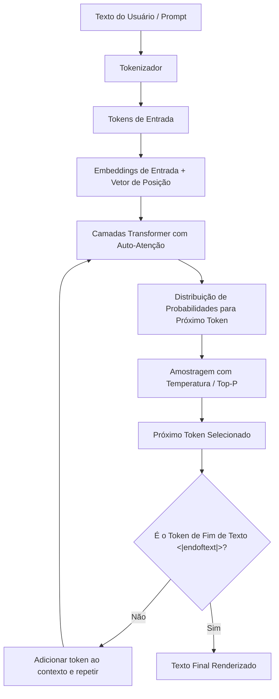

# O que são LLMs?

## Objetivo
Ao final deste tópico, o estudante será capaz de explicar o funcionamento conceitual de um Large Language Model (LLM), compreender o impacto dos parâmetros de configuração (como Temperatura e Top-P) e calcular a estimativa de custos e consumo baseada em tokens.

## Pré-requisitos
Nenhum. Este é o ponto de partida da trilha.

## Conceitos Fundamentais

Um **Large Language Model (LLM)** é um tipo de modelo de Inteligência Artificial treinado em volumes massivos de dados textuais. O objetivo principal de um LLM é extremamente simples: **prever a palavra (ou parte de palavra) mais provável que deve vir a seguir** dado um determinado texto de entrada (contexto).

### Da Tokenização aos Parâmetros

1. **Tokens**: LLMs não leem palavras inteiras da mesma forma que humanos. O texto de entrada é dividido em pequenas unidades chamadas *tokens*. Um token pode ser uma palavra inteira, parte de uma palavra (sílabas/subpalavras) ou até mesmo um único caractere (como pontuações).
   - *Regra geral*: 100 tokens equivalem a aproximadamente 75 palavras em inglês. Em português, a taxa costuma ser menor (mais tokens por palavra devido à tokenização de acentuações e morfologia).
2. **Context Window (Janela de Contexto)**: É o limite máximo de tokens que o modelo consegue "lembrar" e processar em uma única chamada. Isso inclui o prompt enviado pelo usuário e a resposta gerada pelo modelo.
3. **Parâmetros de Geração (Hiperparâmetros)**:
   - **Temperature (Temperatura)**: Controla a aleatoriedade da previsão. Valores próximos a `0` tornam a resposta extremamente determinística (o modelo escolhe sempre a palavra de maior probabilidade). Valores próximos a `1` tornam a resposta mais diversa, criativa ou imprevisível.
   - **Top-P (Nucleus Sampling)**: Define que o modelo deve considerar apenas o conjunto de tokens cuja soma das probabilidades seja igual ou menor a `P`. Por exemplo, com `Top-P = 0.9`, o modelo ignora os 10% de tokens menos prováveis.
   - **Max Tokens**: Limita o número máximo de tokens na resposta gerada.

---

## Funcionamento Interno

Conceitualmente, os LLMs modernos utilizam a arquitetura **Transformer** (introduzida no paper *Attention Is All You Need*, em 2017). O coração do Transformer é o mecanismo de **Auto-atenção (Self-Attention)**.

### O Mecanismo de Auto-atenção
O mecanismo de auto-atenção permite que o modelo calcule a relação de importância entre todas as palavras de uma frase ao mesmo tempo. Por exemplo, na frase *"O banco de dados apresentou um problema e ele foi reiniciado"*, o mecanismo de atenção ajuda o modelo a associar diretamente o pronome *"ele"* ao substantivo *"banco de dados"*, em vez de *"problema"*.

O fluxo de funcionamento de um LLM do tipo "Decoder-Only" (como a família GPT ou Llama) é representado abaixo:



---

## Casos de Uso
- **Geração de Conteúdo**: Escrita de artigos, emails, código de software e documentação.
- **Resumos de Texto**: Condensação de relatórios extensos em tópicos acionáveis.
- **Tradução de Idiomas**: Tradução altamente contextualizada entre linguagens naturais e de programação.
- **Interfaces Conversacionais**: Chatbots de atendimento e assistentes virtuais de desenvolvimento.

---

## Erros Comuns

1. **Achar que o modelo "pensa" ou "sabe" fatos**: LLMs são preditores estatísticos. Eles não possuem um banco de dados interno estruturado de verdades; eles geram a continuação de texto estatisticamente mais coerente baseada no que viram durante o treino. Isso causa as chamadas *alucinações*.
2. **Confundir contagem de palavras com contagem de tokens**: Desenvolvedores frequentemente estimam custos de chamadas de API baseados no número de caracteres ou palavras, estourando limites de orçamento.
3. **Usar temperatura alta para tarefas determinísticas**: Configurar `temperature = 0.8` para gerar JSONs estruturados ou fazer extração de dados pode fazer com que o modelo invente chaves ou altere o formato esperado do schema.

---

## Exemplos

### Exemplo 1: O Impacto da Temperatura
Imagine que o modelo recebeu o prompt: `"A capital do Brasil é..."`

- **Com Temperatura = 0.0**: O modelo escolherá sempre `"Brasília"`, com 100% de consistência.
- **Com Temperatura = 1.0**: O modelo ainda tem altíssima chance de escolher `"Brasília"`, mas pode escolher variações menos comuns como `"a cidade planejada de Brasília"`, ou dar respostas mais informais ou contextualizadas, dependendo da amostragem das probabilidades menores.

### Exemplo 2: Tokenização na Prática
O texto `"IA"` pode ser apenas um token. A palavra `"Paralelepípedo"` pode ser dividida em múltiplos tokens pelo tokenizador do modelo (ex: `["para", "le", "le", "pí", "pe", "do"]`).

Em Python, utilizando a biblioteca `tiktoken` (utilizada pelos modelos da OpenAI), podemos ver isso programaticamente:

```python
import tiktoken

# Carrega o tokenizador do modelo cl100k_base (usado pelo gpt-4)
enc = tiktoken.get_encoding("cl100k_base")

texto = "Desenvolvimento de IA no Brasil."
tokens = enc.encode(texto)

print(f"Texto: '{texto}'")
print(f"Lista de IDs de Tokens: {tokens}")
print(f"Quantidade de Tokens: {len(tokens)}")

# Decodifica token por token para ver a divisão
for token_id in tokens:
    print(f"ID {token_id} -> '{enc.decode([token_id])}'")
```

---

## Exercícios

1. **[Teórico]** Explique a diferença prática entre `Temperature` e `Top-P`. Em que cenário você usaria temperatura 0.0?
2. **[Cálculo]** Se uma chamada de API cobra US$ 5.00 por 1 milhão de tokens de entrada (input) e US$ 15.00 por 1 milhão de tokens de saída (output), qual o custo total estimado para um sistema que realiza 10.000 requisições diárias, onde cada requisição envia em média 1.500 tokens de prompt e gera 500 tokens de resposta?
3. **[Prático]** Acesse um playground de LLM (como o Google AI Studio ou OpenAI Playground) e envie o prompt: `"Escreva uma lista de 5 palavras aleatórias."`
   - Execute 3 vezes com `Temperature = 0.0`.
   - Execute 3 vezes com `Temperature = 1.0`.
   - Anote e comente as diferenças observadas nos resultados.

---

## Referências
- [Attention Is All You Need (Paper Original)](https://arxiv.org/abs/1706.03762)
- [OpenAI Tokenizer Tool](https://platform.openai.com/tokenizer) — Ferramenta interativa para visualizar a divisão de tokens.
- [Google AI Studio Playground](https://aistudio.google.com/) — Ambiente gratuito para testes de parâmetros de LLMs da família Gemini.
