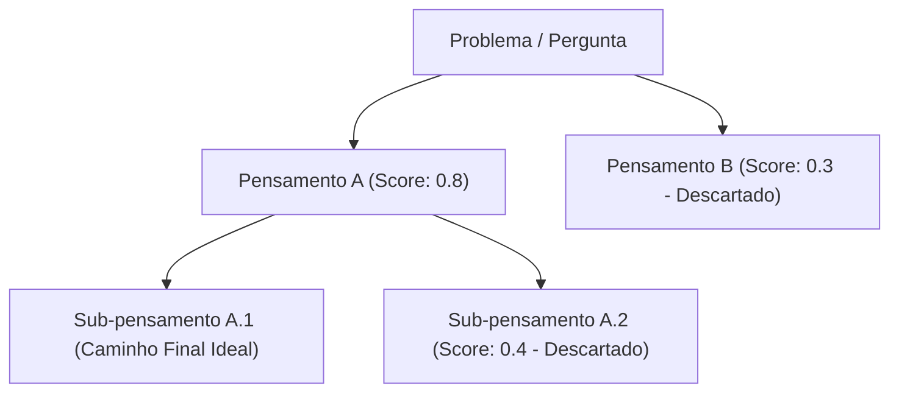

# Engenharia de Prompts e Técnicas Avançadas

## Objetivo
Ao final deste tópico, o estudante será capaz de projetar instruções estruturadas e de alta precisão para LLMs, aplicando técnicas de engenharia de prompts avançadas (Prompt Chaining, ToT, ReAct), implementando decodificação restrita (*Constrained Decoding*) para garantir saídas JSON válidas e estruturando fluxos complexos de raciocínio.

## Pré-requisitos
- [O que são LLMs?](01-what-are-llms.md)

---

## Conceitos Fundamentais

A **Engenharia de Prompts (Prompt Engineering)** evoluiu de simples tentativas empíricas (*vibe prompting*) para uma disciplina de engenharia de software focada em gerenciar o contexto e maximizar a precisão determinística de modelos generativos não-determinísticos.

### Elementos de um Prompt de Produção
Um prompt de nível empresarial deve conter seções separadas por delimitadores claros (como XML tags `<instrucoes>`, `[DADOS]`, `---`) estruturado em:
1. **Persona / Papel**: Define o escopo de atuação e as restrições comportamentais do modelo.
2. **Instruções Rígidas**: A tarefa lógica a ser executada.
3. **Contexto de Suporte**: Dados adicionais (ex: chunks de RAG, bases legais, manuais).
4. **Few-Shot Examples**: Exemplos concretos de entrada e saída.
5. **Esquema de Saída**: O contrato ou formato exato exigido para a resposta.

---

## Técnicas Avançadas de Prompting

À medida que os problemas se tornam complexos, técnicas lineares de prompting falham. As seguintes metodologias são utilizadas para estruturar raciocínios sofisticados:

### 1. Prompt Chaining (Encadeamento de Prompts)
Em vez de pedir para o LLM executar uma tarefa gigantesca de uma só vez (ex: ler um relatório, encontrar bugs, propor correção e formatar em email), quebramos o pipeline em chamadas de API **sequenciais menores**. A saída do Prompt $N$ torna-se a entrada do Prompt $N+1$.
- *Vantagem*: Menor consumo de tokens de saída simultâneos, depuração facilitada de falhas em etapas individuais e maior precisão de cada tarefa atômica.

### 2. Tree of Thoughts (ToT - Árvore de Pensamentos)
Evolução do Chain of Thought (CoT). O modelo gera múltiplos caminhos de raciocínio intermediários (ramos) em formato de árvore. Um avaliador avalia o progresso de cada ramo e decide se o modelo deve continuar por esse caminho ou realizar um retrocesso (*backtracking*) para testar outra ramificação.



### 3. ReAct (Reasoning and Acting)
Combina raciocínio e execução de ferramentas de forma alternada e dinâmica. O modelo gera um bloco de pensamento (*Thought*), toma uma decisão de ação (*Action*) chamando uma ferramenta, lê o resultado (*Observation*) e repete o loop de auto-avaliação até solucionar o problema.

### 4. Metaprompting e Otimização
- **Metaprompting**: Técnica que utiliza um LLM sênior (como GPT-4) para redigir e estruturar os prompts finais que serão consumidos por modelos menores de produção (como o Llama-3-8B).
- **DSPy (Declarative Self-improving Language Programs)**: Paradigma que substitui o ajuste manual de strings textuais em prompts por código de programação declarativo. O framework DSPy compila e otimiza automaticamente as instruções de prompt e exemplos few-shot com base em um conjunto de dados de treino, agindo de forma semelhante aos pesos em redes neurais.

---

## Geração Estrita de Saídas Estruturadas (Constrained Decoding)

Garantir que um LLM retorne um formato JSON válido e parseável é um dos maiores desafios de desenvolvimento de software integrados com IA. Existem dois métodos principais:

### 1. JSON Mode (Nativo das APIs)
Instrui o modelo a gerar textos estruturados em formato JSON válido, ativando uma máscara simples no decodificador.
- *Limitação*: O modelo garante que a saída seja um JSON válido, mas **não garante** a presença de chaves obrigatórias ou tipos de dados corretos (ex: pode retornar uma string onde você exigiu um inteiro).

### 2. Structured Outputs (Decodificação Restrita - Constrained Decoding)
Mecanismo suportado nativamente por provedores modernos (OpenAI, Gemini) e bibliotecas open-source (como *Instructor* ou *Outlines*).
- *Como funciona*: O desenvolvedor envia um esquema de validação formal (geralmente uma classe **Pydantic** em Python ou **JSON Schema**). Durante a geração token por token, o motor de inferência aplica uma gramática formal que **bloqueia fisicamente a seleção de tokens que violem o esquema**.
- *Garantia*: Aderência de 100% ao schema especificado (garante chaves, tipos, regex e chaves enumeradas).

---

## Erros Comuns

1. **Confundir Modo JSON com Structured Outputs**: Usar JSON Mode genérico achando que as chaves do schema nunca serão omitidas ou alucinadas em produção.
   - *Mitigação*: Prefira sempre o uso de *Structured Outputs* com validação Pydantic.
2. **Prompts Longos Demais (Context Stuffing)**: Colocar dezenas de regras de negócio contraditórias em um único prompt gigante. O LLM sofrerá de degradação de atenção.
   - *Mitigação*: Aplique *Prompt Chaining* para dividir as responsabilidades em etapas atômicas.
3. **Não Tratar Falhas de Parsing de JSON**: Assumir que a conversão da string do LLM para dicionário Python nunca falhará e não colocar blocos `try/except`.

---

## Exemplos

### Implementação de Structured Outputs com Validação Estrita (Python + Pydantic)
Este exemplo conceitual demonstra como estruturar classes de validação e simular um parser rigoroso de saídas estruturadas com detecção de erros.

```python
from pydantic import BaseModel, Field, ValidationError
from typing import List, Literal
import json

# 1. Definição do Schema de Saída usando Pydantic
class AvaliacaoProduto(BaseModel):
    id_produto: int = Field(description="O identificador numérico único do produto.")
    sentimento: Literal["Positivo", "Negativo", "Neutro"] = Field(description="Classificação de sentimento da análise.")
    resumo: str = Field(description="Resumo da crítica em uma frase curta de até 15 palavras.")
    tags: List[str] = Field(default=[], description="Lista contendo palavras chaves associadas (ex: entrega, qualidade, preco).")

# 2. Simulação do Pipeline de Processamento e Chamada
def processar_critica_cliente(texto_critica: str) -> AvaliacaoProduto:
    # prompt que instrui o LLM a seguir o esquema estrito
    prompt_sistema = """Você é um analista de dados automatizado. Extraia informações textuais e retorne estritamente um objeto JSON.
Siga exatamente o schema do Pydantic fornecido. Não adicione textos extras antes ou depois do JSON."""
    
    # Simulação da String de retorno que o LLM geraria (JSON estruturado válido)
    resposta_simulada_llm = """{
        "id_produto": 10842,
        "sentimento": "Positivo",
        "resumo": "O produto chegou no prazo e superou as expectativas de qualidade.",
        "tags": ["entrega", "qualidade", "satisfacao"]
    }"""
    
    try:
        # Tenta realizar o parsing e a validação do schema
        dados_json = json.loads(resposta_simulada_llm)
        avaliacao = AvaliacaoProduto(**dados_json)
        return avaliacao
    except json.JSONDecodeError:
        print("Erro: O LLM não retornou um JSON válido.")
        raise
    except ValidationError as e:
        print(f"Erro de Validação de Schema: Os tipos ou campos estão incorretos.\n{e}")
        raise

# Execução do Teste
if __name__ == "__main__":
    print("=== Processando Crítica de Exemplo ===")
    critica = "A entrega do celular 10842 foi rápida e a tela é espetacular!"
    resultado = processar_critica_cliente(critica)
    
    print("\nObjeto Validado Pydantic com Sucesso:")
    print(resultado.model_dump_json(indent=2))
    print(f"Produto ID: {resultado.id_produto}")
    print(f"Sentimento: {resultado.sentimento}")

```
---

## Perguntas de Entrevista

1. **O que é a decodificação restrita (Constrained Decoding) e como ela difere do modo JSON padrão das APIs?**
   *Resposta*: No modo JSON padrão, a API do LLM apenas garante que a saída final será um JSON sintaticamente correto (com chaves e colchetes fechados corretamente). No entanto, o modelo ainda pode alucinar ou omitir campos obrigatórios, ou gerar tipos de dados errados. Na decodificação restrita (Structured Outputs), a validação ocorre na própria inferência (geração de tokens): a gramática formal do schema (ex. Pydantic) força a probabilidade de tokens que violam a estrutura para zero. Isso garante 100% de aderência ao schema de dados de forma determinística.

2. **Como a técnica Tree of Thoughts (ToT) aprimora a tomada de decisões de LLMs em relação ao Chain of Thought (CoT) tradicional?**
   *Resposta*: O Chain of Thought (CoT) conduz o LLM por uma única linha de raciocínio passo a passo de forma estritamente linear. Se o modelo cometer um erro lógico no início da cadeia, a resposta final será comprometida. O Tree of Thoughts (ToT) permite que o modelo crie bifurcações de raciocínio (ramos) e avalie a qualidade de cada ramo antes de prosseguir. Se o modelo detectar que uma ramificação está se distanciando da resposta correta, ele realiza um retrocesso (*backtracking*) e explora outros ramos da árvore de decisão.

3. **Quando você escolheria aplicar Prompt Chaining em vez de colocar todas as instruções em um único prompt de contexto longo?**
   *Resposta*: Escolhe-se o Prompt Chaining quando a tarefa a ser executada pelo sistema possui múltiplos passos lógicos complexos e interdependentes. Colocar todas as instruções juntas aumenta a latência de geração, confunde o modelo (que perde regras no meio do contexto) e dificulta a depuração em caso de erros. O encadeamento divide o problema em chamadas atômicas simples, onde a saída estruturada de um modelo serve de entrada isolada para o próximo, facilitando testes e diminuindo custos unitários de processamento.

---

## Exercícios

1. **[Teórico]** Analise a diferença conceitual entre o desenvolvimento manual de prompts textuais e o paradigma declarativo trazido pelo framework DSPy (compilação e otimização automatizada baseada em exemplos).
2. **[Prático]** Crie um script Python usando Pydantic para modelar uma classe `FaturaCartao` contendo os campos `numero_cartao` (string de 16 caracteres), `valor_total` (float positivo) e `itens` (lista de strings). Simule a recepção de um JSON incompleto simulado do LLM e capture o erro de validação gerado pelo Pydantic, exibindo-o amigavelmente.
3. **[Design]** Desenhe a arquitetura de processamento de reclamações de clientes de um grande e-commerce utilizando Prompt Chaining. O fluxo deve conter 3 etapas consecutivas: (1) classificação de urgência e categoria (ex. entrega, fraude, reembolso), (2) extração de metadados críticos (ID da compra, CPF do cliente, nomes de produtos) e (3) geração automática de uma resposta pré-aprovada personalizada baseada nos dados anteriores.

---

## Referências
- [Google AI Studio Prompting Guide](https://ai.google.dev/gemini-api/docs/prompting) — Melhores práticas oficiais para engenharia de prompts nos modelos Gemini.
- [Tree of Thoughts: Deliberate Problem Solving with Large Language Models (Paper, 2023)](https://arxiv.org/abs/2305.10601) — Artigo original que propõe a técnica de busca em árvore de pensamentos.
- [Instructor Library GitHub](https://github.com/jxnl/instructor) — Biblioteca oficial e guia prático para extração e geração de Structured Outputs usando Pydantic.

