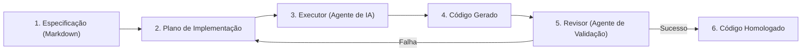

# Spec-Driven Development (SDD) e SPDD

## Objetivo
Ao final deste tópico, o estudante será capaz de descrever e aplicar a metodologia de Spec-Driven Development (SDD) para guiar o desenvolvimento auxiliado por IA, aplicar os princípios de Structured Prompt-Driven Development (SPDD) para versionar e governar prompts, e implementar testes unitários de prompts (TDD de prompts) utilizando validações lógicas e semânticas.

## Pré-requisitos
- [Engenharia de Prompts e Técnicas Avançadas](02-prompt-engineering.md)

---

## Conceitos Fundamentais

### 1. O Fim do "Vibe Coding"
O termo **vibe coding** descreve o desenvolvimento de software informal onde o programador escreve prompts improvisados e casuais em ferramentas de chat de IA, aceitando e inserindo códigos gerados de forma iterativa sem planejar a arquitetura ou documentar as decisões.
*Problemas do Vibe Coding*:
- **Deriva Arquitetural (Architectural Drift)**: O código perde a coesão de design, criando classes redundantes ou misturando padrões de projeto.
- **Dívida Técnica Exponencial**: Código instável gerado rapidamente que ninguém da equipe compreende inteiramente.
- **Inconsistência**: Falta de testes e de alinhamento com os requisitos de negócio reais do sistema.

Para introduzir disciplina, previsibilidade e rigor técnico ao desenvolvimento com IA, surgiram as metodologias **SDD** e **SPDD**.

---

### 2. Spec-Driven Development (SDD)
O **SDD (Desenvolvimento Orientado por Especificações)** determina que a **especificação detalhada é a fonte única da verdade** e o contrato de software primário, enquanto o código de programação é tratado como um artefato secundário gerado de forma autônoma baseando-se nessa especificação.



#### Princípios Centrais do SDD:
- **Documentation-First**: O desenvolvedor humano atua como um arquiteto ou planejador (*Planner*). Antes de escrever qualquer linha de código, ele redige a especificação de requisitos funcionais, não-funcionais, regras de negócio e contratos de API em arquivos Markdown (ex: `specification.md`).
- **O Loop de Agentes (Planner-Executor-Reviewer)**:
  1. *Planner (Humano)*: Escreve a especificação estruturada.
  2. *Executor (Agente)*: Recebe a especificação e gera a implementação do código.
  3. *Reviewer (Agente ou Testes)*: Valida se o código atende 100% aos critérios da especificação.
- **Níveis de Maturidade de SDD**:
  - *Spec-first*: A especificação serve apenas de guia de ponto de partida do desenvolvimento.
  - *Spec-anchored*: O código e a especificação coexistem e são mantidos rigorosamente atualizados de forma sincronizada na base.
  - *Spec-as-source*: O ápice da metodologia. A especificação em Markdown é a única coisa mantida e versionada; o código em si é gerado e regenerado de forma efêmera em tempo de build por agentes de IA.

---

### 3. SPDD (Structured Prompt-Driven Development)
O **SPDD** defende que prompts em produção não devem ser tratados como meras strings de texto ocultas no código ou ajustadas em painéis web sem governança. **Prompts são ativos de código fundamentais**.
- **Princípios**:
  - *Versionamento*: Todos os prompts do sistema devem ser armazenados em arquivos separados sob controle de versão (Git).
  - *Parâmetros estruturados*: Prompts devem aceitar argumentos de entrada bem definidos (ex: usando templates Jinja2 ou variáveis estruturadas).
  - *Monitoramento e Rastreabilidade*: Registros de logs devem associar qual versão do prompt gerou determinada resposta em produção.

---

### 4. TDD de Prompts (Test-Driven Prompt Development)
Semelhante ao TDD clássico de software, no **TDD de Prompts**, escrevemos a suíte de testes de avaliação para o prompt **antes** de refinar ou reescrever a instrução textual do prompt.
- *Tipos de Asserções de Testes*:
  - **Validação de Formato (Sintática)**: Testar se a saída é parseada corretamente (JSON válido, markdown renderizável, tamanho máximo de caracteres).
  - **Validação de Negócios (Semântica)**: Testar se a resposta contém ou não palavras proibidas, se o tom de voz está correto e se o embedding da resposta possui similaridade semântica mínima com uma resposta de referência padrão (*Ground Truth*).

---

### 5. Context Engineering (Engenharia de Contexto)
Diferente da engenharia de prompts que foca em *como* perguntar, a engenharia de contexto foca em **quais dados e configurações cercam a chamada de IA**.
- **Rules e Skills**: Configurações de workspace (como arquivos `.cursorrules` ou arquivos lógicos como `AGENTS.md`) fornecem instruções determinísticas constantes de estilo de código, arquitetura de arquivos e boas práticas para as IAs que operam no repositório.
- **Gerenciamento de Tokens**: Estruturação eficiente da janela de contexto para evitar o envio de dados ruidosos ou redundantes, economizando custos e reduzindo a perda de atenção do modelo.

---

## Erros Comuns

1. **Alterar Prompts Diretamente em Produção (Vibe Patching)**: Mudar a instrução de um prompt em um painel web ou arquivo de servidor sem rodar a suíte de testes de regressão. Um ajuste para corrigir o caso de uso A pode quebrar as respostas dos casos de uso B, C e D.
   - *Mitigação*: Utilize versionamento Git e rode testes automáticos de prompts antes de qualquer deploy.
2. **Especificações Ambíguas no SDD**: Fornecer documentos Markdown com linguagem confusa. Agentes de IA são executores literais; especificações vagas resultarão em códigos disfuncionais.
3. **Falta de Sandbox nos Testes de Código do SDD**: Permitir que o executor do SDD rode códigos e scripts de testes automatizados diretamente na sua máquina local sem sandboxing de containers Docker.

---

## Exemplos

### Exemplo de TDD de Prompts com Testes Semânticos em Python
Este exemplo prático implementa uma suíte conceitual de testes de TDD para validar se a resposta simulada gerada por um prompt de IA atende aos requisitos sintáticos e de negócios (comportamento e dados).

```python
import json
from typing import Tuple

# 1. Definição do Prompt de Geração Simulada
# Em produção, essa função faria a chamada real de API utilizando a versão estável do prompt
def executar_prompt_classificacao_lead(nome_empresa: str, faturamento: float) -> str:
    # Simula a saída gerada pela versão atual do prompt sob teste
    # Requisito: Retornar JSON com chave "classificacao" (Alta/Media/Baixa) e chave "justificativa"
    # Requisito de Negócio: Se faturamento > 1.000.000, classificação DEVE ser "Alta"
    
    # Simulação da resposta do LLM
    resposta_llm = {
        "classificacao": "Alta",
        "justificativa": f"A empresa {nome_empresa} possui faturamento anual de {faturamento:.2f}, enquadrando-se em grandes contas."
    }
    return json.dumps(resposta_llm)

# 2. Suíte de Testes TDD (Asserções)
def testar_prompt_classificacao_lead() -> Tuple[bool, str]:
    # Massa de dados de teste
    empresa_teste = "TechCorp Inc."
    faturamento_teste = 1500000.00 # Faturamento alto (> 1M)
    
    # Executa a geração do prompt
    saida_bruta = executar_prompt_classificacao_lead(empresa_teste, faturamento_teste)
    
    # Teste 1: Validação Sintática (É um JSON válido?)
    try:
        dados = json.loads(saida_bruta)
    except json.JSONDecodeError:
        return False, "Falha no Teste Sintático: A saída do prompt não é um JSON válido."
        
    # Teste 2: Validação de Estrutura (Possui as chaves obrigatórias?)
    chaves_esperadas = ["classificacao", "justificativa"]
    for chave in chaves_esperadas:
        if chave not in dados:
            return False, f"Falha na Estrutura: Chave obrigatória '{chave}' ausente da resposta."
            
    # Teste 3: Validação de Negócio (A classificação foi correta de acordo com as regras?)
    if dados["classificacao"] != "Alta":
        return False, f"Falha de Negócio: Faturamento alto classificado incorretamente como '{dados['classificacao']}'."
        
    # Teste 4: Validação Semântica de Conteúdo (Evitar respostas curtas demais)
    if len(dados["justificativa"].split()) < 5:
        return False, "Falha de Conteúdo: A justificativa fornecida está curta demais (menos de 5 palavras)."
        
    return True, "Sucesso: Todas as asserções de TDD de prompts passaram!"

if __name__ == "__main__":
    print("=== Executando Testes Unitários de Prompts (TDD) ===")
    sucesso, mensagem = testar_prompt_classificacao_lead()
    print(f"Status: {mensagem}")

---

## Perguntas de Entrevista

1. **O que é a metodologia Spec-Driven Development (SDD) aplicada ao desenvolvimento com Inteligência Artificial?**
   *Resposta*: O SDD (Desenvolvimento Orientado por Especificações) é uma abordagem de engenharia de software onde a especificação técnica detalhada (requisitos, escopo, regras de negócio e contratos descritos em Markdown) atua como a única fonte da verdade e o contrato a ser seguido. Em vez de realizar interações informais e fragmentadas com a IA (*vibe coding*), o desenvolvedor projeta e documenta a especificação primeiro (*Documentation-First*). Agentes autônomos recebem essa especificação estruturada para gerar, testar e homologar o código de forma alinhada e previsível.

2. **Como funciona o TDD (Test-Driven Development) aplicado à Engenharia de Prompts e qual a sua importância?**
   *Resposta*: No TDD de Prompts, a suíte de testes de asserções sintáticas (validar formato de saídas JSON, campos e chaves obrigatórias) e de validações semânticas (verificar limites, tom de voz, similaridade de embeddings ou exclusão de palavras banidas) é escrita e configurada antes da otimização final das instruções do prompt. Isso é de extrema importância para sistemas de produção porque previne regressões lógicas (*vibe patching*): alterações pontuais em prompts para corrigir uma falha específica podem degradar o comportamento do modelo em outros casos de uso anteriormente consolidados.

3. **Explique o conceito de Engenharia de Contexto (Context Engineering) e cite um exemplo prático de aplicação em ambientes de desenvolvimento modernos.**
   *Resposta*: A engenharia de contexto foca na curadoria, filtragem, estruturação e economia de todas as informações que circundam o prompt em uma chamada à API de inferência (como configurações de temperatura, parâmetros de sistema, histórico de chamadas e metadados RAG). Um exemplo prático e comum em IDEs modernas é o uso de arquivos de regras globais de repositório (como `.cursorrules`, `.windsurfrules` ou documentações de comportamento de agentes como o `AGENTS.md`), que injetam de forma constante diretrizes arquiteturais, restrições e padrões de projeto em todas as consultas feitas pela IA.

---

## Exercícios

1. **[Teórico]** Analise e disserte sobre as diferenças práticas de acoplamento do código e da especificação nos três níveis de maturidade de SDD (*Spec-first*, *Spec-anchored* e *Spec-as-source*), destacando as vantagens de manutenção de longo prazo de cada um.
2. **[Prático]** Expanda a suíte de testes de TDD para prompts em Python fornecida neste arquivo para adicionar um quinto validador de negócio: certifique-se de que a string de justificativa retornada pelo modelo de classificação cite explicitamente o nome da empresa analisada (parâmetro `nome_empresa`).
3. **[Design]** Elabore o arquivo de especificação técnica Markdown (`SPECIFICATION.md`) completo e detalhado para orientar uma IA de codificação a construir um serviço de encurtamento de links (URL Shortener). O arquivo deve descrever os endpoints HTTP de entrada, as regras de expiração de links, as validações de input e o formato da persistência de dados.

---

## Referências
- [Martin Fowler - Specification-Driven Development with AI (Blog)](https://martinfowler.com/) — Discussão teórica abrangente sobre o papel de especificações técnicas em engenharia com IA.
- [Thoughtworks - Structured Prompt-Driven Development (SPDD)](https://www.thoughtworks.com/insights/blog/generative-ai/structured-prompt-driven-development) — Guia sobre a governança de prompts como ativos de código reais e rastreáveis.
- [GitHub Spec Kit Tooling](https://github.com/) — Kit de ferramentas e CLI para guiar equipes em fases estruturadas de especificação, planejamento e implementação com IAs.

