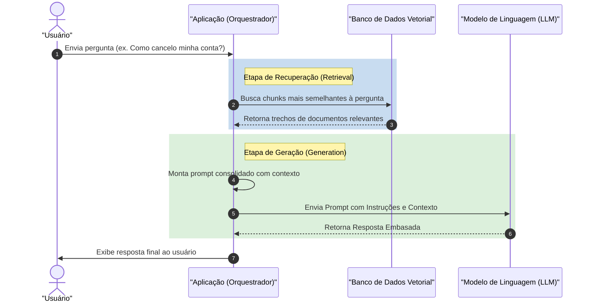

# Fundamentos de RAG (Retrieval-Augmented Generation)

## Objetivo
Ao final deste tópico, o estudante será capaz de explicar a arquitetura de um sistema RAG básico, descrever suas três etapas principais (Ingestão, Recuperação e Geração) e avaliar quando utilizar RAG em comparação com o ajuste fino (Fine-Tuning) de modelos.

## Pré-requisitos
- [Engenharia de Prompts](../01-introduction-to-llms/02-prompt-engineering.md)

## Conceitos Fundamentais

Os LLMs possuem um limite de conhecimento estático definido pela data de corte do seu treinamento (*knowledge cutoff*). Eles também sofrem de alucinação e não conhecem dados privados de empresas (ex. relatórios internos, contratos, históricos de clientes).

Para resolver isso de forma eficiente, utiliza-se a arquitetura **RAG (Retrieval-Augmented Generation)**. RAG é um padrão de design em engenharia de software onde nós **recuperamos informações relevantes de uma fonte externa** de dados e as injetamos no prompt do LLM como contexto de suporte antes de enviar a pergunta final.

O ciclo de vida de uma aplicação baseada em RAG é dividido em três fases:

1. **Ingestão (Ingestion / Indexação)**: Preparação offline dos dados. Consiste em carregar documentos (PDFs, Markdown, bancos SQL), dividi-los em partes menores (*chunking*), convertê-los em representações matemáticas (*embeddings*) e guardá-los em um indexador (geralmente um banco vetorial).
2. **Recuperação (Retrieval)**: Quando o usuário faz uma pergunta, o sistema realiza uma busca rápida na base indexada para localizar quais trechos (*chunks*) contêm a informação mais relevante relacionada à pergunta.
3. **Geração (Generation)**: O sistema anexa esses trechos recuperados a um template de prompt estruturado e envia tudo ao LLM. O modelo lê a pergunta e o contexto para gerar uma resposta precisa e fundamentada naqueles dados.

---

## Funcionamento Interno

O fluxo dinâmico em tempo de execução de um sistema RAG é ilustrado a seguir:



---

## Comparações

### RAG vs. Fine-Tuning
Uma dúvida comum no desenvolvimento com IA é se devemos aplicar RAG ou Fine-Tuning. A tabela abaixo resume as diferenças fundamentais:

| Critério | RAG (Recuperação Aumentada) | Fine-Tuning (Ajuste Fino) |
|---|---|---|
| **Objetivo Primário** | Fornecer contexto específico e dados dinâmicos/privados. | Adaptar o comportamento, tom, estilo ou formato de saída do modelo. |
| **Custo de Infraestrutura** | Baixo (apenas custos de API e banco de dados). | Alto (requer GPUs para re-treinamento e armazenamento de pesos). |
| **Atualização de Dados** | Tempo Real (basta inserir um novo documento no banco). | Lento (requer rodar um novo ciclo de treinamento/finetuning). |
| **Redução de Alucinações** | Altíssima (o modelo responde apontando para o contexto). | Moderada (o modelo ainda pode alucinar dados não memorizados perfeitamente). |
| **Habilidade do Modelo** | Mantém a habilidade original do modelo base. | Melhora significativamente o desempenho em tarefas de domínio nichado. |

---

## Erros Comuns

1. **Lost in the Middle (Perdido no Meio)**: LLMs tendem a prestar mais atenção nas informações localizadas no início e no final da janela de contexto de um prompt. Se você recuperar 20 documentos longos e colocá-los todos no prompt, o LLM provavelmente ignorará os dados contidos no meio dos trechos.
2. **Ignorar Segurança e Controle de Acesso**: Se um sistema RAG corporativo busca em toda a base da empresa sem aplicar filtros de autorização de usuário, um funcionário de nível júnior pode perguntar ao chatbot de suporte *"qual o salário do CEO?"* e receber o dado caso a planilha de salários tenha sido ingerida.
3. **Falta de Validação do Contexto Vazio**: Quando o banco de dados vetorial não encontra nenhuma informação relevante para a pergunta do usuário, a aplicação envia um prompt sem contexto ao LLM. Sem o devido tratamento de segurança, o modelo alucinará uma resposta. É necessário instruir o LLM no System Prompt: *"Se o contexto fornecido estiver vazio ou não contiver a resposta, diga explicitamente que não possui essa informação."*

---

## Exemplos

### Exemplo de Fluxo RAG em Pseudo-código (Python)

```python
# Exemplo conceitual simplificado do fluxo de execução RAG
def responder_pergunta_usuario(pergunta_usuario):
    # 1. Recuperação (Retrieval)
    # Busca na base de dados os 3 trechos de documentos mais relevantes
    chunks_recuperados = banco_vetorial.busca_similaridade(
        query=pergunta_usuario, 
        limite=3
    )
    
    # 2. Junção dos contextos em uma string única
    contexto_consolidado = "\n---\n".join([doc.texto for doc in chunks_recuperados])
    
    # 3. Montagem do Prompt de Geração
    prompt_sistema = """Você é um assistente virtual de suporte. 
Responda à pergunta do usuário baseando-se EXCLUSIVAMENTE nos fatos fornecidos no contexto abaixo.
Se a resposta não puder ser encontrada no contexto, diga apenas: 'Desculpe, não encontrei essa informação em nossa documentação.'
Não invente fatos.

Contexto de suporte:
{contexto}
"""
    
    prompt_usuario = f"Pergunta: {pergunta_usuario}"
    
    # 4. Geração (Generation)
    resposta_llm = chamar_api_llm(
        system_instruction=prompt_sistema.format(contexto=contexto_consolidado),
        user_message=prompt_usuario,
        temperature=0.0 # Temperatura baixa para manter fidelidade ao contexto
    )
    
    return resposta_llm
```

---

## Exercícios

1. **[Arquitetura]** Explique com suas próprias palavras as 3 etapas essenciais de um pipeline RAG.
2. **[Cenário Real]** Uma startup de advocacia quer criar uma IA que analise contratos e responda se existem cláusulas de rescisão abusivas. A base de dados de contratos deles muda diariamente com novas assinaturas. Eles devem usar RAG ou Fine-Tuning para esse projeto? Justifique a sua escolha baseando-se em custo, dinamismo dos dados e alucinação.
3. **[Design de Prompt]** Escreva o System Prompt ideal para mitigar alucinações em um sistema RAG onde os documentos recuperados podem ser incompletos. O que o modelo deve responder caso não encontre as respostas no contexto?

---

## Referências
- [Retrieval-Augmented Generation for Knowledge-Intensive NLP Tasks (Paper Original de 2020)](https://arxiv.org/abs/2005.11401)
- [What is RAG? (IBM Guide)](https://www.ibm.com/topics/retrieval-augmented-generation) — Visão geral conceitual de negócios e engenharia.
- [Lost in the Middle: How Language Models Use Long Contexts (Paper)](https://arxiv.org/abs/2307.03172) — Estudo sobre a degradação de atenção no meio do contexto.
