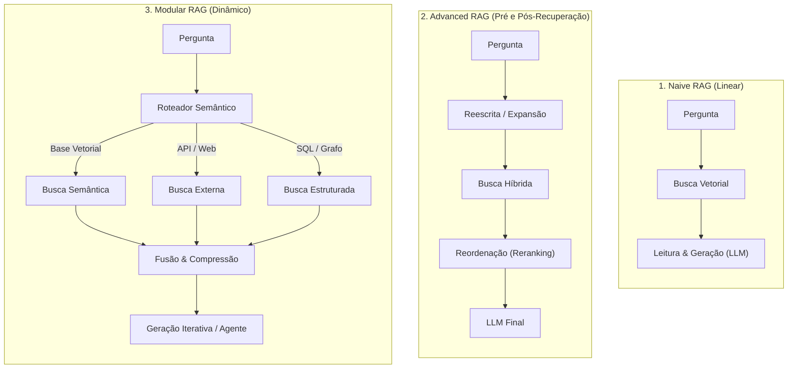
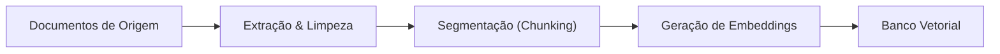
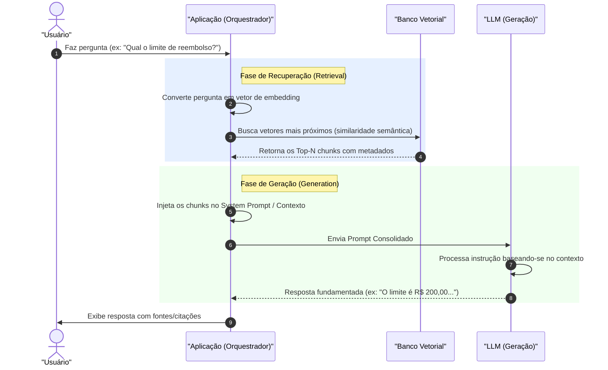

# Fundamentos de RAG (Retrieval-Augmented Generation)

## Objetivo
Ao final deste tópico, o estudante será capaz de explicar a arquitetura de um sistema RAG básico e suas evoluções, descrever com profundidade suas três etapas principais (Ingestão, Recuperação e Geração), analisar os trade-offs entre RAG e Fine-Tuning e projetar soluções que mitiguem problemas comuns de latência, custo e alucinação.

## Pré-requisitos
- [Engenharia de Prompts](../01-introduction-to-llms/02-prompt-engineering.md)

## Conceitos Fundamentais

### O Desafio dos Modelos Estáticos
Os Grandes Modelos de Linguagem (LLMs) revolucionaram o processamento de linguagem natural, porém sofrem de limitações severas em cenários corporativos:
1. **Data de Corte (Knowledge Cutoff)**: O conhecimento do modelo é congelado no momento do término de seu treinamento.
2. **Falta de Acesso a Dados Privados**: O modelo não conhece documentos internos de empresas, históricos de clientes ou APIs privadas.
3. **Alucinações**: Quando questionados sobre fatos que desconhecem, LLMs tendem a gerar respostas falsas com alto grau de confiança gramatical.
4. **Custo de Atualização**: Treinar continuamente um modelo para atualizá-lo com novas informações é inviável financeiramente e tecnicamente.

Para resolver essas limitações sem modificar os pesos internos do modelo, foi desenvolvida a arquitetura **RAG (Retrieval-Augmented Generation)**, proposta originalmente pela equipe da Meta AI em 2020. Em termos simples, o RAG funciona como uma prova de "consulta livre": em vez de forçar o LLM a memorizar tudo, fornecemos a ele um livro de referência (contexto) correspondente à pergunta do usuário.

---

### A Evolução das Arquiteturas RAG

À medida que os sistemas baseados em RAG amadureceram, a arquitetura evoluiu de pipelines lineares simples para estruturas modulares e agênticas complexas.



#### 1. Naive RAG (RAG Básico)
Consiste em um fluxo puramente linear e unidirecional:
- **Indexação (Ingestão)**: O documento é fatiado, os vetores são gerados e salvos.
- **Recuperação**: A busca retorna os $N$ chunks mais semelhantes.
- **Geração**: Os chunks são enviados ao LLM junto com a pergunta.
*Limitações*: Sofre muito com ruído no contexto (chunks irrelevantes), perda de informações importantes localizadas no meio do prompt (*Lost in the Middle*) e falhas quando a pergunta do usuário é mal formulada.

#### 2. Advanced RAG (RAG Avançado)
Introduz etapas de processamento antes e depois da recuperação para contornar os problemas do Naive RAG:
- **Pré-Recuperação (Pre-Retrieval)**: Técnicas para expandir ou reescrever a pergunta do usuário e alinhar o vocabulário ao banco vetorial.
- **Pós-Recuperação (Post-Retrieval)**: Filtros de relevância, compressão de prompt e algoritmos de reordenação (*Reranking*) para garantir que apenas as informações mais críticas cheguem ao LLM final.

#### 3. Modular RAG (RAG Modular)
Oferece maior flexibilidade através de componentes intercambiáveis:
- **Roteamento Semântico**: Decide se consulta uma base vetorial, um banco SQL relacional ou faz uma busca na internet.
- **Pesquisa Iterativa**: O sistema pode buscar dados, gerar uma resposta parcial e decidir que precisa pesquisar novamente para completar a informação.

---

## Funcionamento Interno

O pipeline RAG divide-se em dois momentos distintos: o processo **Offline (Ingestão)** e o processo **Online (Recuperação e Geração)**.

### 1. Ingestão (Offline)

- **Extração & Limpeza**: Arquivos PDF, HTML, Markdown ou JSON são extraídos, removendo cabeçalhos inúteis, scripts ou rodapés.
- **Segmentação (Chunking)**: O texto limpo é dividido em blocos contíguos de tamanho gerenciável.
- **Geração de Embeddings**: Cada bloco é processado por um modelo de embedding, que calcula um vetor matemático representando a semântica daquele bloco.
- **Indexação**: Os vetores e seus textos originais (metadados) são inseridos no banco de dados vetorial.

### 2. Recuperação e Geração (Online / Tempo de Execução)


---

## Casos de Uso
1. **Assistentes de Suporte ao Cliente**: Resposta automatizada baseada em FAQs dinâmicas, manuais de produtos e políticas internas sem vazamento de dados.
2. **Pesquisa Acadêmica e Jurídica**: Varredura rápida de jurisprudências, artigos ou leis para fundamentar decisões judiciais ou petições.
3. **Análise de Relatórios Financeiros**: Comparação rápida de balanços trimestrais e anuais com extração de insights numéricos complexos.
4. **Q&A sobre Código Fonte**: Assistentes técnicos corporativos capazes de buscar em toda a base de código interna (ex: repositórios de microsserviços) para identificar bugs ou sugerir refatorações.

---

## Comparações

### RAG vs. Fine-Tuning
A tabela abaixo fornece um guia de decisão prático para ajudar a escolher entre RAG e Fine-Tuning de acordo com os requisitos do projeto:

| Critério | RAG (Recuperação Aumentada) | Fine-Tuning (Ajuste Fino) |
| :--- | :--- | :--- |
| **Acesso a Dados Dinâmicos** | **Excelente**. Os dados podem ser atualizados em tempo real inserindo novos registros no banco vetorial. | **Ruim**. Requer um novo ciclo de treinamento para absorver novos dados. |
| **Mitigação de Alucinação** | **Altíssima**. Como o modelo baseia a resposta em um contexto explícito fornecido, as alucinações caem drasticamente. | **Baixa/Média**. Melhora a precisão, mas o modelo ainda pode alucinar quando tenta recordar dados memorizados. |
| **Aprendizado de Estilo e Formato** | **Médio**. Controlado estritamente via engenharia de prompts e Few-Shot. | **Excelente**. Ensina o modelo a responder em formatos complexos (ex: JSON específicos) ou tom de voz próprio. |
| **Requisitos Computacionais** | **Baixos**. Apenas infraestrutura para o banco vetorial e chamadas normais de API. | **Altos**. Exige clusters de GPU dedicados para treinamento e armazenamento de novos pesos de modelo. |
| **Rastreabilidade (Fontes)** | **Total**. É possível apontar exatamente de qual arquivo, página ou parágrafo a resposta foi retirada. | **Nula**. A informação está distribuída de forma estatística pelos pesos ocultos da rede neural. |

#### Matriz de Decisão RAG vs. Fine-Tuning
```
                      Ajustar Comportamento / Formato / Tom
                                       ▲
                                       │
                                       │       FUSION (RAG + FT)
                      Fine-Tuning apenas│      (Sistemas de saúde,
                      (Ex: gerar SQL,  │       terminologia médica)
                      estilo de marca) │
                                       │
  ─────────────────────────────────────┼─────────────────────────────────────► Acessar Conhecimento
                                       │                                       Externo / Dinâmico
                                       │
                      Apenas Prompt /  │       RAG apenas
                      Few-shot         │       (Ex: FAQs, manuais,
                                       │        análise contratual)
                                       │
```

---

## Erros Comuns

1. **Lost in the Middle (Perdido no Meio)**: LLMs tendem a prestar mais atenção nos tokens do início e do final da janela de contexto. Enviar 20 documentos em que a resposta crucial está no 10º chunk faz com que o modelo a ignore. 
   - *Mitigação*: Usar reordenação (*Reranking*) para manter no máximo de 3 a 5 documentos altamente relevantes.
2. **Não Tratar o Contexto Vazio**: Se a busca no banco vetorial não encontrar nenhuma correspondência, a aplicação envia o prompt sem dados adicionais. Sem instruções de segurança, o LLM tentará responder usando seu conhecimento geral pré-treinado e alucinará.
   - *Mitigação*: Definir cláusulas de escape rígidas no System Prompt (ex: *"Se as informações fornecidas não forem suficientes para responder à pergunta, responda estritamente: 'Informação não encontrada no manual.'"*).
3. **Ignorar Latência e Custo de Token**: Colocar contextos gigantescos aumenta exponencialmente a latência de geração e a fatura mensal de tokens de contexto de entrada.
   - *Mitigação*: Aplicar filtros de metadados antes de buscar similaridade para diminuir o espaço de busca.

---

## Exemplos

### Implementação Conceitual de Pipeline RAG (Python)
Este exemplo em Python puro ilustra todas as etapas lógicas de um fluxo RAG básico, incluindo a preparação de um prompt seguro para mitigar alucinações e tratamento de contexto irrelevante.

```python
import numpy as np

# Banco de dados conceitual em memória contendo nossos documentos cadastrados
DATABASE = [
    {"id": 1, "titulo": "Politica de Reembolso de Viagens", "conteudo": "Despesas com passagens aéreas e hotéis são reembolsadas integralmente se solicitadas em até 30 dias após a viagem. Gastos com bebida alcoólica não são elegíveis."},
    {"id": 2, "titulo": "Manual de TI - Credenciais", "conteudo": "Para resetar sua senha corporativa, acesse o portal autogerenciável de identidade ou envie uma mensagem no Slack para @suporte-ti."},
    {"id": 3, "titulo": "Politica de Trabalho Remoto", "conteudo": "A empresa oferece uma ajuda de custo mensal de R$ 150,00 para despesas de internet e energia de colaboradores em regime formal de Home Office."},
]

# Simulação básica de modelo de embeddings (apenas para fins de demonstração conceitual)
# Em produção, você chamaria APIs como OpenAI's text-embedding-3-small ou usaria Sentence-Transformers
def simular_embedding_texto(texto: str) -> np.ndarray:
    # Cria uma assinatura vetorial simplificada baseada na ocorrência de palavras-chave críticas
    palavras_chave = ["reembolso", "viagem", "senha", "suporte", "internet", "home office", "custo", "ti"]
    vetor = [1.0 if palavra in texto.lower() else 0.0 for palavra in palavras_chave]
    # Normaliza o vetor para magnitude 1.0 (facilita cálculo de similaridade)
    arr = np.array(vetor)
    norma = np.linalg.norm(arr)
    return arr / norma if norma > 0 else arr

# Popula o banco vetorial offline com os embeddings calculados
for doc in DATABASE:
    doc["embedding"] = simular_embedding_texto(doc["conteudo"])

def buscar_contexto_relevante(pergunta: str, limite: int = 1, threshold: float = 0.3) -> list:
    embedding_pergunta = simular_embedding_texto(pergunta)
    resultados = []
    
    for doc in DATABASE:
        # Produto escalar em vetores normalizados é idêntico à similaridade de cosseno
        score = float(np.dot(embedding_pergunta, doc["embedding"]))
        if score >= threshold:
            resultados.append((score, doc))
            
    # Ordena pelo score decrescente
    resultados.sort(key=lambda x: x[0], reverse=True)
    return [doc for score, doc in resultados[:limite]]

def simular_chamada_llm(instrucao_sistema: str, prompt_usuario: str) -> str:
    # Simula a geração do LLM mostrando como ele lê o contexto
    print(f"\n--- [SYSTEM PROMPT] ---\n{instrucao_sistema}")
    print(f"\n--- [USER MESSAGE] ---\n{prompt_usuario}")
    print("\n--- [LLM GENERATION] ---")
    
    # Simulação do comportamento de resposta guiado estritamente pelas regras de contexto
    if "reembolso" in prompt_usuario.lower() and "30 dias" in instrucao_sistema:
        return "De acordo com as diretrizes de Viagens, você é elegível ao reembolso de passagens aéreas e hotéis, desde que a solicitação seja aberta em até 30 dias após o encerramento da viagem. Bebidas alcoólicas não são reembolsáveis."
    elif "senha" in prompt_usuario.lower() and "suporte-ti" in instrucao_sistema:
        return "Para resetar sua senha corporativa, você deve utilizar o portal autogerenciável de identidade ou abrir um chamado via mensagem direta para o perfil @suporte-ti no Slack."
    else:
        return "Desculpe, a informação solicitada não está presente nos documentos fornecidos como contexto de suporte."

def pipeline_rag(pergunta_usuario: str) -> str:
    # 1. Recuperação (Retrieval)
    chunks_recuperados = buscar_contexto_relevante(pergunta_usuario, limite=1)
    
    # 2. Junção dos metadados recuperados
    if chunks_recuperados:
        contexto_consolidado = "\n".join([f"Documento: {doc['titulo']}\nConteúdo: {doc['conteudo']}" for doc in chunks_recuperados])
    else:
        contexto_consolidado = "Nenhum documento relevante encontrado."
        
    # 3. Engenharia de prompt para mitigação de alucinações
    prompt_sistema = f"""Você é um assistente virtual de suporte de TI e RH. 
Responda à pergunta do usuário utilizando UNICAMENTE os fatos contidos na base de dados de contexto fornecida abaixo.
Se a informação necessária para responder à pergunta não estiver presente no contexto, diga exatamente: 'Desculpe, não localizei essa informação em nossa base de conhecimento interna.'
Não utilize seu conhecimento externo sob nenhuma circunstância.

Base de Dados de Contexto:
{contexto_consolidado}
"""
    
    prompt_usuario = f"Pergunta: {pergunta_usuario}"
    
    # 4. Geração (Generation)
    resposta = simular_chamada_llm(prompt_sistema, prompt_usuario)
    return resposta

# Execução de Testes
if __name__ == "__main__":
    print("=== TESTE 1: Pergunta Existente ===")
    print(pipeline_rag("Como faço para trocar minha senha de rede?"))
    
    print("\n=== TESTE 2: Pergunta Fora do Escopo ===")
    print(pipeline_rag("Qual é a política de licença maternidade?"))

```
---

## Perguntas de Entrevista

1. **O que é a arquitetura RAG e quais problemas ela resolve que os LLMs puramente pré-treinados não conseguem?**
   *Resposta*: RAG (Retrieval-Augmented Generation) resolve a limitação de conhecimento estático (knowledge cutoff) e a falta de acesso a dados privados ou corporativos de suporte. Ela ancora as respostas dos modelos a fontes de dados externas explícitas, reduzindo drasticamente a ocorrência de alucinações sem a necessidade de re-treinamento e fornecendo rastreabilidade completa por meio de citações de fontes.

2. **Explique a diferença conceitual e de fluxo entre Naive RAG, Advanced RAG e Modular RAG.**
   *Resposta*: O *Naive RAG* é um fluxo estático linear clássico de Ingestão -> Recuperação -> Geração. O *Advanced RAG* insere pipelines de pré-recuperação (como reescrita e expansão de perguntas para alinhamento semântico) e pós-recuperação (reordenação por Cross-Encoders/Rerankers e compressão de prompt para mitigar o efeito "Lost in the Middle"). O *Modular RAG* quebra o fluxo linear introduzindo roteamento semântico dinâmico entre diferentes tipos de fontes de dados e loops iterativos/agênticos de raciocínio.

3. **Quando você escolheria aplicar Fine-Tuning em vez de RAG em um projeto corporativo de IA?**
   *Resposta*: Escolhe-se Fine-Tuning para ensinar um comportamento especializado, formato estrito de saída (como gerar instruções de código específicas ou saídas JSON complexas) ou adotar um tom de voz e estilo institucional. O RAG é escolhido quando os dados de conhecimento de suporte mudam constantemente, quando as alucinações precisam ser minimizadas a quase zero e quando precisamos citar as fontes de onde as informações foram extraídas.

---

## Exercícios

1. **[Teórico]** Descreva detalhadamente o fluxo de dados que ocorre desde o momento em que um arquivo PDF de políticas corporativas é ingerido no sistema até o momento em que ele é utilizado para responder à pergunta de um funcionário.
2. **[Design de Prompt]** Escreva o prompt de sistema para um chatbot corporativo de suporte técnico que utiliza RAG. O prompt deve instruir o LLM a responder somente se houver dados correspondentes na base de dados injetada, a recusar de forma polida perguntas fora do tema de suporte e a referenciar a chave `Documento` no final de sua resposta.
3. **[Prático]** Altere o código Python em memória contido no exemplo deste arquivo para incluir suporte a um metadado de filtro. Adicione um campo `modulo` (ex: "RH" ou "TI") aos dicionários da lista `DATABASE` e modifique a função `buscar_contexto_relevante` para receber um argumento opcional `filtro_modulo` que restrinja a busca a apenas esse módulo de negócio.

---

## Referências
- [Retrieval-Augmented Generation for Knowledge-Intensive NLP Tasks (Lewis et al., 2020)](https://arxiv.org/abs/2005.11401) — Paper seminal sobre o conceito de RAG.
- [Lost in the Middle: How Language Models Use Long Contexts (Liu et al., 2023)](https://arxiv.org/abs/2307.03172) — Estudo detalhado sobre a degradação de atenção de modelos no meio do prompt.
- [LlamaIndex Guide on Production RAG](https://docs.llamaindex.ai/en/stable/optimizing/production_rag/) — Melhores práticas para mitigar latência e qualidade de dados em RAG.

