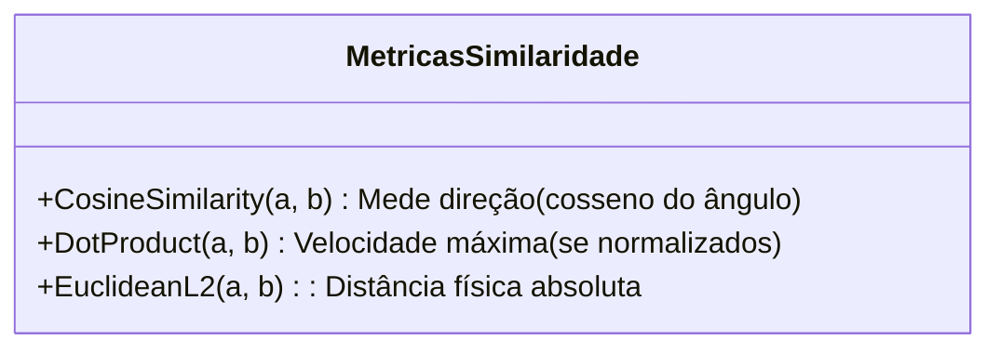
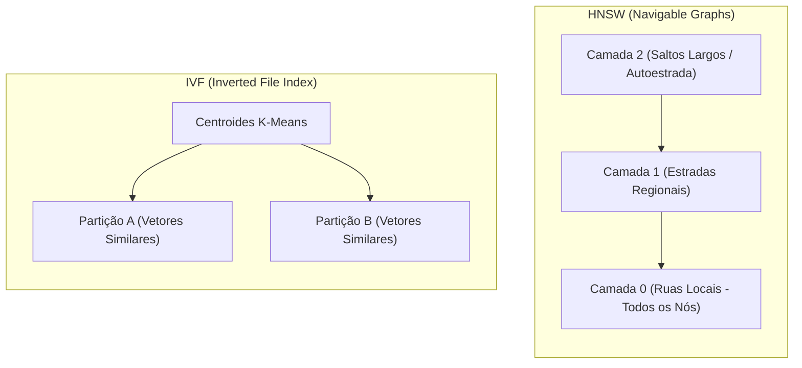
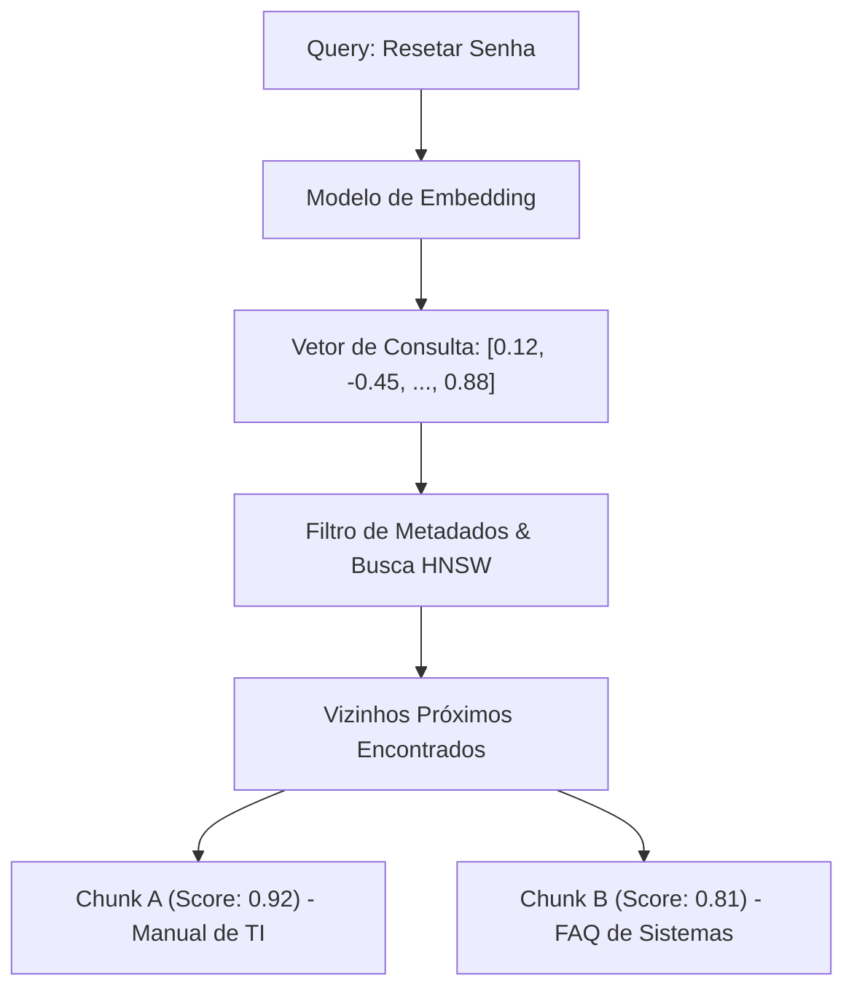

# Embeddings e Bancos Vetoriais

## Objetivo
Ao final deste tópico, o estudante será capaz de descrever o conceito matemático por trás de embeddings, contrastar as principais métricas de distância geométrica, formular estratégias avançadas de segmentação (*Chunking*) de dados estruturados e não estruturados, e projetar a indexação vetorial ideal (comparando algoritmos HNSW, IVF e quantizações) para diferentes cenários de infraestrutura e escala.

## Pré-requisitos
- [Fundamentos de RAG](01-rag-fundamentals.md)

---

## Conceitos Fundamentais

### 1. Representação Vetorial de Textos (Embeddings)
Um **embedding** é uma representação vetorial densa de dados (textos, imagens ou áudios) em um espaço vetorial contínuo de alta dimensionalidade (variando geralmente de 384 a 1536 dimensões).
Diferente das abordagens clássicas de processamento de linguagem baseadas em correspondência léxica literal (ex: TF-IDF ou BM25), os embeddings capturam a **semântica profunda e o relacionamento contextual** das palavras.

*Como são gerados?*
1. Um modelo de linguagem baseado na arquitetura Transformer (especificamente modelos bidirecionais de estilo Encoder, como BERT ou RoBERTa) recebe o texto de entrada.
2. O texto é tokenizado e passa por múltiplas camadas de atenção, gerando um vetor de representação para cada token individual.
3. Para obter um único vetor para o texto inteiro, aplica-se uma operação de **Pooling** (normalmente *Mean Pooling*, que tira a média dos vetores de todos os tokens, ou *CLS Pooling*, que aproveita o token especial de classificação do modelo).
4. O resultado é um vetor de números reais que posiciona o texto em um espaço geométrico. Textos semanticamente semelhantes (ex: *"Como conserto meu pneu furado?"* e *"Passo a passo para trocar uma roda avariada"*) terminam próximos espacialmente, mesmo não compartilhando palavras idênticas.

---

### 2. Métricas de Similaridade Vetorial
Para realizar a busca em bancos de dados vetoriais, precisamos calcular a proximidade entre o vetor da consulta ($q$) e os vetores dos documentos salvos ($d$). As três principais funções matemáticas utilizadas são:



#### Similaridade de Cosseno (Cosine Similarity)
Mede o cosseno do ângulo entre os dois vetores. Foca apenas na **direção**, ignorando o comprimento (magnitude) dos vetores.
$$\text{Sim}_{\text{cosseno}}(q, d) = \frac{q \cdot d}{\|q\| \|d\|} = \frac{\sum_{i=1}^n q_i d_i}{\sqrt{\sum_{i=1}^n q_i^2} \sqrt{\sum_{i=1}^n d_i^2}}$$
- *Intervalo*: -1 (direções opostas) a 1 (mesma direção).
- *Uso*: Ideal para textos de comprimentos variáveis onde o significado semântico deve ser priorizado independente da quantidade de palavras.

#### Distância Euclidiana (L2)
Calcula o comprimento geométrico da linha reta entre os pontos finais de dois vetores em um espaço cartesiano.
$$\text{Distancia}_{L2}(q, d) = \sqrt{\sum_{i=1}^n (q_i - d_i)^2}$$
- *Intervalo*: 0 (idênticos) a infinito.
- *Uso*: Excelente para modelagem física ou quando a magnitude dos dados possui valor preditivo explícito. Menos recomendada para textos puros de tamanhos inconsistentes.

#### Produto Escalar (Dot Product)
Multiplica os componentes equivalentes de dois vetores e soma os resultados.
$$\text{Produto Escalar}(q, d) = q \cdot d = \sum_{i=1}^n q_i d_i$$
- *Uso*: Extremamente performático em termos de CPU/GPU. Se os embeddings forem **normalizados para magnitude unitária** ($\|v\| = 1$), o Produto Escalar se torna matematicamente equivalente à Similaridade de Cosseno, rodando com velocidade muito maior.

---

### 3. Estratégias Avançadas de Chunking
Fatiar um documento de forma incorreta destruirá o pipeline do RAG. Se cortamos uma frase no meio, perdemos o contexto semântico. Existem cinco abordagens principais de segmentação:

1. **Chunking de Tamanho Fixo (Character/Token Chunking)**: Divide o texto estritamente a cada $N$ caracteres ou tokens, geralmente mantendo um percentual de sobreposição (*Overlap*).
   - *Prós*: Simples de implementar.
   - *Contras*: Quebra palavras e sentenças importantes ao meio, misturando assuntos diferentes ou destruindo cláusulas textuais.
2. **Chunking Recursivo (Recursive Character Chunking)**: Divide o texto analisando uma lista de delimitadores de forma prioritária (geralmente parágrafos `\n\n`, linhas `\n`, espaços ` ` e, por fim, caracteres `""`). Ele tenta manter os chunks no tamanho configurado sem quebrar sentenças lógicas.
   - *Uso*: Padrão de indústria para textos corridos (manuais, livros).
3. **Chunking Semântico (Semantic Chunking)**: Divide o texto em sentenças. Em seguida, gera os embeddings de cada sentença e calcula a distância entre sentenças vizinhas. Um novo chunk é criado sempre que a distância semântica excede um limite pré-determinado, separando textos que mudam drasticamente de assunto.
   - *Uso*: Excelente para notas de reuniões de tópicos variados ou e-mails longos.
4. **Chunking Estrutural (Layout-Aware Chunking)**: Utiliza ferramentas de análise sintática para segmentar o documento com base em elementos do layout (Markdown, tags HTML ou elementos XML). Tabelas inteiras, seções de títulos (`#`, `##`) e listas são tratadas como unidades indissociáveis.
   - *Uso*: Ideal para APIs de documentação técnica ou relatórios financeiros estruturados.
5. **Chunking Agêntico (Agentic Chunking)**: Utiliza um LLM para ler o documento sequencialmente e determinar, baseando-se no contexto lógico, onde um assunto termina e outro começa.
   - *Contras*: Custo e latência extremamente elevados para grandes bases de dados.

---

### 4. Funcionamento de Índices Vetoriais (HNSW vs. IVF)
Buscar o vetor mais próximo varrendo linearmente bilhões de vetores é impraticável em produção (complexidade $O(N)$). Bancos vetoriais usam algoritmos de **Busca Aproximada de Vizinhos Mais Próximos (ANN)**.



#### HNSW (Hierarchical Navigable Small World)
Cria grafos probabilísticos de múltiplas camadas. A camada superior tem poucos nós e conexões longas. As camadas inferiores ganham densidade e conexões curtas. A busca começa no topo pulando distâncias longas e desce para refinamento fino.
- *Vantagem*: Tempo de busca ultrarrápido ($O(\log N)$) e altíssima precisão de recuperação.
- *Desvantagem*: Consome muita memória RAM para armazenar a estrutura de grafos e a indexação inicial é computacionalmente lenta.

#### IVF (Inverted File Index)
Usa agrupamento (geralmente K-Means) para dividir o espaço vetorial em $K$ regiões demarcadas por centroides. A busca primeiro descobre quais centroides são próximos ao vetor de consulta e analisa apenas os elementos associados a essas partições específicas.
- *Vantagem*: Consumo de memória RAM muito reduzido em comparação ao HNSW.
- *Desvantagem*: Menor precisão de busca (pode perder vizinhos reais que caíram em partições adjacentes).

#### Quantização (PQ e SQ)
Técnicas de compressão de vetores para otimizar espaço de armazenamento:
- **Quantização Escalar (SQ)**: Converte valores flutuantes de 32 bits (`float32`) para inteiros de 8 bits (`int8`), reduzindo o consumo de memória em 4x com perda mínima de precisão.
- **Quantização de Produto (PQ)**: Divide o vetor de alta dimensionalidade em subvetores menores, quantiza cada parte em um conjunto de códigos de centroides (*codebook*). Reduz drasticamente a memória em até 95%, mas impacta de forma moderada a latência e precisão.

---

### 5. Comparativo de Bancos de Dados Vetoriais

| Banco Vetorial | Tipo / Arquitetura | Hospedagem | Principais Vantagens | Desvantagens |
| :--- | :--- | :--- | :--- | :--- |
| **Pinecone** | Proprietário / SaaS | Nuvem Gerenciada | Totalmente gerenciável, escalabilidade nativa, excelente para produção rápida. | Custo elevado, sem opção open-source / local. |
| **Qdrant** | Open-source (Rust) | Híbrido (Local / Cloud) | Alta velocidade de busca, suporte excelente a filtragem de metadados rígida. | Curva de aprendizado moderada em clusters grandes. |
| **Milvus** | Open-source (Distributed) | Híbrido (K8s / Cloud) | Feito para escalar horizontalmente a nível de bilhões de vetores. | Extremamente complexo para instalar e operar (muitas dependências). |
| **Chroma** | Open-source (Python/JS) | Local incorporado | Simplicidade absurda para testes locais e desenvolvimento rápido. | Não escala bem para cenários distribuídos de larga escala. |
| **pgvector** | Extensão PostgreSQL | Híbrido | Mantém todos os dados estruturados e vetoriais em um banco de dados SQL confiável. | Indexação HNSW em tabelas gigantescas exige configuração de hardware complexa. |
| **LanceDB** | Serverless / Embedded | Local / S3 | Formato de arquivo otimizado para buscas locais ultrarrápidas, integrado ao Pandas/PyArrow. | Menos ferramentas integradas de monitoramento em nuvem. |

---

## Funcionamento Interno

Para entender como a similaridade é calculada, veja um esquema lógico de como um banco vetorial resolve buscas semânticas:



---

## Exemplos

### Implementação de um Localizador Vetorial e Chunking Semântico (Python + NumPy)
O exemplo a seguir ilustra a criação de uma rotina de segmentação textual semântica simulada e cálculo comparativo de similaridade vetorial utilizando apenas Python e `numpy`.

```python
import numpy as np
import re

# 1. Simulação de um Chunking Baseado em Sentenças
def segmentar_sentencas(texto: str) -> list:
    # Divide o texto utilizando pontos finais, exclamações ou interrogações
    sentencas = re.split(r'(?<=[.!?]) +', texto)
    return [s.strip() for s in sentencas if s.strip()]

# 2. Embeddings conceituais simulados para frases de TI vs. RH
# Cria assinaturas vetoriais baseadas em dicionário de tópicos
VOCABULARIO_TI = ["senha", "sistema", "suporte", "servidor", "resetar", "acesso"]
VOCABULARIO_RH = ["contratação", "benefícios", "férias", "reembolso", "plano", "saúde"]
DIMENSOES = VOCABULARIO_TI + VOCABULARIO_RH

def gerar_embedding_simulado(texto: str) -> np.ndarray:
    vetor = []
    texto_normalizado = texto.lower()
    for termo in DIMENSOES:
        # Conta a frequência ou presença do termo semântico no texto
        vetor.append(float(texto_normalizado.count(termo)))
    
    arr = np.array(vetor)
    # Adiciona um pequeno ruído de fundo para simular a densidade de embeddings reais
    arr += np.random.uniform(0.01, 0.05, size=arr.shape)
    
    # Normaliza para norma L2 unitária para simplificar cálculos
    norma = np.linalg.norm(arr)
    return arr / norma if norma > 0 else arr

# 3. Mecanismo de Busca Vetorial Semântica Local
class MiniBancoVetorial:
    def __init__(self):
        self.armazenamento = []

    def adicionar_documento(self, texto: str, metadado: dict):
        embedding = gerar_embedding_simulado(texto)
        self.armazenamento.append({
            "texto": texto,
            "metadado": metadado,
            "embedding": embedding
        })

    def buscar_vizinhos(self, query: str, limite: int = 2, metrica: str = "cosine") -> list:
        vetor_query = gerar_embedding_simulado(query)
        resultados = []

        for doc in self.armazenamento:
            vetor_doc = doc["embedding"]
            
            if metrica == "cosine":
                # Como os vetores estão pré-normalizados, dot product = cosine similarity
                score = float(np.dot(vetor_query, vetor_doc))
            elif metrica == "l2":
                # Distância Euclidiana (menor é melhor, convertemos para score onde maior é melhor)
                distancia = float(np.linalg.norm(vetor_query - vetor_doc))
                score = 1.0 / (1.0 + distancia) # Mapeia para intervalo (0, 1]
            else:
                raise ValueError("Métrica não suportada.")
                
            resultados.append((score, doc))

        # Ordena pelo score decrescente
        resultados.sort(key=lambda x: x[0], reverse=True)
        return resultados[:limite]

# Execução Prática
if __name__ == "__main__":
    # Texto longo de exemplo contendo múltiplos tópicos misturados
    documento_original = (
        "Para resetar sua senha corporativa acesse o portal de TI. "
        "Nosso suporte de sistemas atende no Slack @suporte-ti. "
        "Sobre as regras de férias do RH, a solicitação deve ser feita com 30 dias de antecedência. "
        "O plano de saúde empresarial cobre consultas e exames básicos de rotina."
    )
    
    print("=== Fase 1: Segmentação de Sentenças ===")
    sentencas = segmentar_sentencas(documento_original)
    for i, sent in enumerate(sentencas):
        print(f"Sentença {i+1}: '{sent}'")

    # Inicializa nosso banco vetorial local
    db = MiniBancoVetorial()
    
    # Indexa as sentenças separadamente
    for i, sent in enumerate(sentencas):
        categoria = "TI" if any(w in sent.lower() for w in VOCABULARIO_TI) else "RH"
        db.adicionar_documento(sent, metadado={"id_chunk": i, "categoria": categoria})

    print("\n=== Fase 2: Busca Vetorial sem Correspondência Exata ===")
    consulta_usuario = "Preciso de ajuda com meu acesso e senhas bloqueadas"
    print(f"Consulta: '{consulta_usuario}'")
    
    print("\n[Resultados via Similaridade de Cosseno]:")
    busca_cosseno = db.buscar_vizinhos(consulta_usuario, limite=2, metrica="cosine")
    for score, doc in busca_cosseno:
        print(f"- Score Cosseno: {score:.4f} | Cat: {doc['metadado']['categoria']} | Texto: {doc['texto']}")

    print("\n[Resultados via Distância Euclidiana L2 Reversa]:")
    busca_l2 = db.buscar_vizinhos(consulta_usuario, limite=2, metrica="l2")
    for score, doc in busca_l2:
        print(f"- Score L2 Relativo: {score:.4f} | Cat: {doc['metadado']['categoria']} | Texto: {doc['texto']}")

```
---

## Perguntas de Entrevista

1. **O que é o índice HNSW e como ele resolve o problema de latência em buscas vetoriais de larga escala em comparação a buscas lineares (Flat)?**
   *Resposta*: O HNSW (Hierarchical Navigable Small World) cria grafos probabilísticos de múltiplas camadas baseados em redes de "mundos pequenos". A busca funciona como uma navegação rápida de rodovia (camadas superiores com poucos nós e saltos longos) até estradas locais (camadas inferiores densas), reduzindo a complexidade de tempo de busca de linear $O(N)$ para logarítmica $O(\log N)$. Isso permite buscas em milissegundos sobre milhões de vetores, sacrificando uma quantidade desprezível de exatidão matemática.

2. **Como funciona a quantização de vetores (Scalar Quantization vs. Product Quantization) e quais são seus trade-offs?**
   *Resposta*: A quantização de vetores é uma técnica de compressão de embeddings. A Quantização Escalar (SQ) converte valores de 32-bit float (`float32`) para inteiros de 8-bit (`int8`), poupando até 75% da RAM necessária para carregar os embeddings com perdas mínimas de precisão. A Quantização de Produto (PQ) é mais agressiva: ela divide o vetor em subvetores menores e mapeia cada pedaço para um código de centroides de um dicionário (*codebook*). A PQ reduz em até 95% o uso de RAM, porém reduz moderadamente a acurácia global e pode aumentar levemente a latência em decorrência do custo de descompressão/decodificação na CPU.

3. **Qual a diferença de Chunking Semântico para Chunking de tamanho fixo com overlap, e quando você usaria cada uma dessas estratégias?**
   *Resposta*: O Chunking de tamanho fixo corta o documento rigidamente a cada número fixo de caracteres ou tokens com uma margem de sobreposição contínua. É ideal para arquivos muito homogêneos e rápidos de processar. O Chunking Semântico analisa a transição temática calculando os embeddings de cada sentença e encontrando saltos de distância estatísticos entre sentenças vizinhas; a divisão é feita quando a mudança de tema ultrapassa um patamar limite (*threshold*). É ideal para transcrições de áudios, atas de reuniões corporativas e documentos longos com múltiplos subtemas misturados.

---

## Exercícios

1. **[Teórico]** Analise e descreva os trade-offs de infraestrutura (RAM, latência de busca, tempo de construção do índice e precisão de recuperação) ao optar entre o índice HNSW e o índice IVF em bases de dados acima de 10 milhões de embeddings.
2. **[Prático]** Utilizando bibliotecas comuns em Python (ou cálculo puramente matemático em loops), crie uma função que receba dois vetores e calcule tanto o Produto Escalar quanto a Similaridade de Cosseno. Demonstre numericamente com dados de exemplo que ambos os cálculos geram o mesmo resultado caso os vetores sejam normalizados para magnitude de tamanho igual a 1.0.
3. **[Design]** Projete uma estratégia de chunking e metadados estruturados para indexar uma base de conhecimento jurídica composta por milhares de PDFs contendo artigos, leis, decretos federais e tabelas de multas anexas. Descreva o tamanho do chunk, overlap e de quais elementos de layout você extrairá metadados para acelerar a busca posterior.

---

## Referências
- [Pinecone Learning Center: What is a Vector Database?](https://www.pinecone.io/learn/vector-database/) — Guia detalhado sobre indexação e busca semântica em produção.
- [HNSW: Efficient and Robust Approximate Nearest Neighbor Search (Paper, 2016)](https://arxiv.org/abs/1603.09320) — O artigo acadêmico original detalhando grafos navegáveis multicamadas.
- [Qdrant Documentation - Vector Search Indexing Concepts](https://qdrant.tech/documentation/concepts/indexing/) — Visão prática sobre configurações de quantização (SQ/PQ) e índices HNSW.

