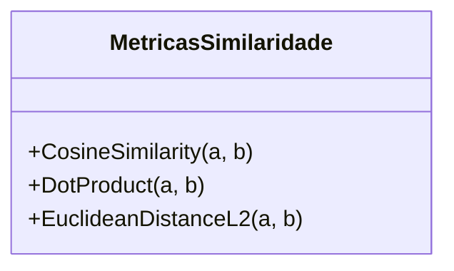

# Embeddings e Bancos Vetoriais

## Objetivo
Ao final deste tópico, o estudante será capaz de explicar como modelos de embeddings representam textos matematicamente, diferenciar as principais métricas de similaridade vetorial (Cosseno, L2, Produto Escalar) e projetar estratégias eficientes de segmentação de texto (Chunking) para indexação em bancos de dados vetoriais.

## Pré-requisitos
- [Fundamentos de RAG](01-rag-fundamentals.md)

## Conceitos Fundamentais

### O que são Embeddings?
Um **embedding** é uma representação numérica estruturada de um dado (texto, imagem, áudio) em um espaço vetorial de alta dimensionalidade (geralmente entre 384 e 1536 dimensões).
Diferente da busca clássica por palavra-chave (onde buscamos correspondência exata de caracteres), os embeddings capturam o **significado semântico** do texto. Frases com palavras totalmente diferentes, mas com significados similares (ex: *"Como está o clima hoje?"* e *"Está chovendo lá fora?"*), serão mapeadas para vetores espacialmente muito próximos.

### Métricas de Similaridade
Para saber quão semelhantes são dois textos em um banco vetorial, calculamos a distância ou similaridade entre seus respectivos vetores de embeddings. As três métricas mais comuns são:

1. **Similaridade de Cosseno (Cosine Similarity)**: Mede o cosseno do ângulo entre dois vetores. Não se importa com o comprimento (magnitude) dos vetores, apenas com a direção para onde apontam. Varia de -1 (opostos) a 1 (idênticos). É a mais utilizada em buscas semânticas de texto.
2. **Distância Euclidiana (L2)**: Mede a distância física em linha reta entre os dois pontos extremos dos vetores. Quanto menor a distância, mais semelhantes são os vetores. Muito sensível à magnitude dos vetores.
3. **Produto Escalar (Dot Product)**: Multiplica os elementos correspondentes de dois vetores e soma os resultados. Se os vetores forem normalizados para magnitude 1, o Produto Escalar é igual à Similaridade de Cosseno. É extremamente rápido de computar em hardware de produção.



### Bancos de Dados Vetoriais
Bancos SQL ou NoSQL tradicionais não foram projetados para rodar buscas de vizinhos mais próximos em espaços de 1536 dimensões sobre milhões de linhas. Eles exigiriam uma varredura linear de tabela completa ($O(N)$), o que é inviável em termos de latência.

Os **Bancos de Dados Vetoriais** (ex: Pinecone, Milvus, Qdrant, Chroma, ou extensões como `pgvector` no PostgreSQL) utilizam índices especializados baseados em **ANN (Approximate Nearest Neighbors)** para realizar buscas de similaridade sublineares de forma extremamente rápida.

---

## Funcionamento Interno

Os algoritmos de ANN sacrificam uma precisão matemática infinitesimal para obter ganhos massivos de velocidade. Os dois tipos de índices mais importantes são:

### 1. HNSW (Hierarchical Navigable Small World)
Cria um grafo multi-camada semelhante a redes de rodovias e estradas locais. As camadas superiores possuem poucos nós e conexões de longo alcance para "saltos rápidos". As camadas inferiores contêm caminhos densos de curtas distâncias para localização precisa de vizinhos próximos. É o índice mais rápido de buscar, mas consome muita memória RAM para carregar o grafo estruturado.

### 2. IVF (Inverted File Index)
Agrupa o espaço vetorial em partições (clusters) usando algoritmos como K-Means. Durante a busca, o algoritmo localiza quais partições são mais próximas do vetor de pesquisa e faz a busca detalhada apenas dentro dessas partições específicas, ignorando as demais. Consome muito menos memória que o HNSW, mas pode ter um tempo de resposta ligeiramente superior.

---

## Erros Comuns

1. **Comparar Embeddings de Modelos Distintos**: Cada modelo de embedding (ex. `text-embedding-3-small` da OpenAI e `all-MiniLM-L6-v2` do Hugging Face) projeta o texto em espaços geométricos proprietários totalmente diferentes. Comparar vetores gerados por modelos diferentes gerará resultados completamente aleatórios.
2. **Ignorar Estratégia de Chunking com Overlap**: Dividir documentos simplesmente de 500 em 500 caracteres corta palavras e sentenças ao meio. Sempre use uma margem de sobreposição (*overlap*) — por exemplo, blocos de 1000 caracteres com 200 de sobreposição — para garantir que o contexto do final de um bloco continue no início do próximo.
3. **Incompatibilidade de Dimensionalidade**: Configurar o indexador do banco vetorial para aceitar vetores de tamanho 768 e tentar inserir embeddings de tamanho 1536. Isso causará erros de validação imediatos na API do banco.

---

## Exemplos

### Exemplo 1: Cálculo de Similaridade de Cosseno em Python
Como fazer o cálculo matemático básico de similaridade entre dois vetores simples de forma conceitual usando a biblioteca `numpy`:

```python
import numpy as np

def similaridade_cosseno(vetor_a, vetor_b):
    # Converte para arrays numpy
    a = np.array(vetor_a)
    b = np.array(vetor_b)
    
    # Fórmula: (A . B) / (||A|| * ||B||)
    produto_escalar = np.dot(a, b)
    norma_a = np.linalg.norm(a)
    norma_b = np.linalg.norm(b)
    
    return produto_escalar / (norma_a * norma_b)

# Vetores de teste em um espaço de 3 dimensões
vetor_1 = [0.9, 0.1, 0.0]
vetor_2 = [0.8, 0.2, 0.0] # Próximo ao vetor 1
vetor_3 = [0.0, 0.1, 0.9] # Longe do vetor 1

print(f"Similaridade V1 e V2: {similaridade_cosseno(vetor_1, vetor_2):.4f}")
print(f"Similaridade V1 e V3: {similaridade_cosseno(vetor_1, vetor_3):.4f}")
```

### Exemplo 2: Estratégias de Chunking Semântico
Ilustração gráfica de como dividir um texto longo aplicando sobreposição:

```text
Texto: "O desenvolvimento moderno de IA requer bancos vetoriais. Eles facilitam a busca semântica em tempo de execução."

Sem Overlap:
Chunk 1: "O desenvolvimento moderno de IA requer bancos"
Chunk 2: "vetoriais. Eles facilitam a busca semântica em tempo de execução."
(Note que a palavra "bancos vetoriais" ficou partida em dois chunks, prejudicando a indexação semântica).

Com Overlap de 3 palavras:
Chunk 1: "O desenvolvimento moderno de IA requer bancos"
Chunk 2: "de IA requer bancos vetoriais. Eles facilitam a"
Chunk 3: "bancos vetoriais. Eles facilitam a busca semântica em tempo de execução."
```

---

## Exercícios

1. **[Teórico]** Imagine que você está projetando o RAG para um sistema de buscas de jurisprudências em tribunais. Qual métrica de similaridade você usaria caso os embeddings fossem normalizados pelo modelo? Explique a diferença teórica entre similaridade de cosseno e produto escalar.
2. **[Prático]** Escreva um script simples em Python (usando bibliotecas como `numpy` ou apenas loops puros) que receba um vetor de consulta (query) e encontre o vizinho mais próximo dentro de uma lista com outros 4 vetores de teste. Use a distância Euclidiana (L2) como métrica.
3. **[Design]** Monte uma estratégia de chunking para indexar manuais técnicos em formato PDF que contêm tabelas explicativas de manutenção. Qual tamanho de chunk e de overlap você escolheria para garantir que as instruções que referenciam as tabelas não fiquem isoladas semanticamente?

---

## Referências
- [Pinecone Learning Center: What is a Vector Database?](https://www.pinecone.io/learn/vector-database/) — Excelente guia sobre indexação vetorial.
- [HNSW: Hierarchical Navigable Small World (Paper)](https://arxiv.org/abs/1603.09320) — Paper científico que originou os grafos HNSW.
- [Hugging Face sentence-transformers models](https://huggingface.co/models?library=sentence-transformers) — Catálogo de modelos de embedding de código aberto.
