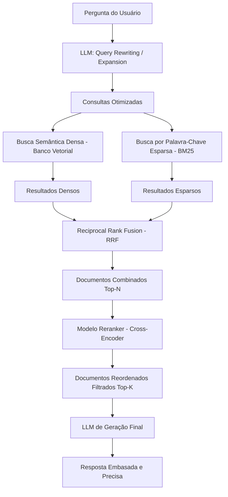

# Técnicas de RAG Avançado

## Objetivo
Ao final deste tópico, o estudante será capaz de diagnosticar gargalos em sistemas RAG simples (*Naive RAG*) e implementar técnicas avançadas como Busca Híbrida (Hybrid Search), Reordenação (Reranking), Expansão de Consulta (Query Expansion) e Recuperação de Documento Pai (Parent Document Retrieval) para melhorar a precisão da recuperação de contexto.

## Pré-requisitos
- [Embeddings e Bancos Vetoriais](02-embeddings-and-vector-databases.md)

## Conceitos Fundamentais

O RAG tradicional ou básico (*Naive RAG*) sofre com várias limitações práticas em produção:
- **Busca inadequada**: A pergunta do usuário pode conter erros de digitação ou termos ruins que não batem com os embeddings dos documentos indexados.
- **Lost in the Middle**: Dificuldade do LLM em focar nas informações importantes no meio do contexto enviado.
- **Falha de Escopo**: O banco vetorial traz textos semanticamente parecidos, mas que não respondem à pergunta lógica de fato.

Para solucionar essas fraquezas, aplica-se o **RAG Avançado**, que atua nas fases de pré-recuperação, recuperação e pós-recuperação.

### Técnicas Avançadas de Destaque

#### 1. Query Expansion & Rewriting (Expansão e Reescrita de Consulta)
Utiliza um LLM leve para reescrever a pergunta do usuário antes de realizar a busca no banco. A pergunta original *"Qual o preço do plano pro?"* pode ser reescrita e expandida para *"Quais são os custos, taxas e valores associados à assinatura do plano Professional?"*, melhorando a busca semântica.

#### 2. Hybrid Search (Busca Híbrida)
Combina a busca por palavra-chave tradicional baseada em frequência (como algoritmos esparsos BM25) com a busca por similaridade semântica densa (embeddings). A busca híbrida é ideal para bases que contêm códigos identificadores, SKUs, nomes de produtos ou jargões técnicos específicos, onde a similaridade semântica falha em encontrar termos exatos.

#### 3. Reranking (Reordenação)
A busca em bancos vetoriais prioriza a velocidade sobre a acurácia fina. Para refinar o resultado, a aplicação busca um número maior de documentos (ex: Top 25) e utiliza um modelo especializado menor chamado **Cross-Encoder (Reranker)** para reavaliar e reordenar esses documentos comparando a frase de busca e cada documento lado a lado. Apenas os Top 3 reordenados de altíssima relevância são enviados para o LLM.

#### 4. Parent Document Retrieval (Recuperação de Documento Pai)
Em vez de fatiar e buscar blocos idênticos de texto, o sistema armazena chunks bem pequenos (ex: frases ou sentenças de 100 caracteres) para busca de embeddings de alta precisão. No entanto, quando um desses chunks pequenos é selecionado, o sistema recupera e envia para o LLM o parágrafo ou documento maior em que ele estava originalmente contido (o "pai"), garantindo que o modelo tenha contexto completo para responder.

---

## Funcionamento Interno

O pipeline de um fluxo RAG Avançado com pré-processamento, recuperação combinada e pós-processamento é esquematizado abaixo:



---

## Casos de Uso
- **Buscadores de Documentação Técnica**: Onde usuários pesquisam por comandos exatos de código (necessita de busca híbrida para buscar nomes de funções).
- **Atendimento de Suporte**: Onde perguntas informais e confusas dos clientes precisam de reescrita automatizada antes de consultar os manuais de ajuda da empresa.
- **Sistemas de Auditoria de Contratos**: Onde cláusulas específicas precisam ser trazidas com seu parágrafo ou seção completa (Parent Document) para avaliação legal adequada.

---

## Erros Comuns

1. **Ignorar Latência do Reranker**: Modelos Cross-Encoder fazem uma computação pesada comparando palavra por palavra. Rodar Reranking sobre 100 documentos adicionará segundos de latência à chamada de API, frustrando a experiência do usuário. O ideal é reranquear no máximo de 15 a 25 documentos.
2. **Não Normalizar as Notas na Busca Híbrida**: O BM25 dá pontuações que variam de 0 a infinito (ex. score = 15.4), enquanto a similaridade de cosseno varia de -1 a 1. Tentar somar diretamente esses valores gera resultados bizarros. É obrigatório utilizar algoritmos de fusão de rankings como o **RRF (Reciprocal Rank Fusion)** ou normalizar os scores para a mesma escala.
3. **Mapeamento Genérico de Parent-Child**: Criar documentos pai gigantescos (ex. livros inteiros) faz com que a recuperação envie texto em excesso para o LLM, gerando o erro de estourar a janela de contexto.

---

## Exemplos

### Exemplo 1: Fusão de Rankings Híbridos com RRF (Reciprocal Rank Fusion)
A fórmula do RRF classifica os itens de acordo com sua posição nos rankings das buscas individuais:

$$RRF(d) = \sum_{m \in M} \frac{1}{k + r_m(d)}$$

Onde $r_m(d)$ é a posição do documento $d$ no ranking do modelo $m$, e $k$ é uma constante padrão (geralmente 60).

Se um documento ficou em 1º lugar na busca por palavras-chave (BM25) e em 5º lugar na busca por embeddings (Vetorial):

$$RRF = \frac{1}{60 + 1} + \frac{1}{60 + 5} = 0.01639 + 0.01538 = 0.03177$$

Documentos com maiores valores de RRF serão reordenados para o topo do ranking final combinado.

### Exemplo 2: Pseudo-código de Integração com Reranker

```python
import cohere

# Inicializa o cliente Cohere (um dos provedores de Reranking mais populares)
co = cohere.Client("API_KEY")

pergunta = "Qual o prazo de devolução de produtos eletrônicos?"

# 1. Recuperação primária no banco vetorial (Traz Top 15 resultados rápidos)
resultados_vetoriais = banco_vetorial.busca_similaridade(pergunta, limite=15)
documentos_para_rerank = [res.texto for res in resultados_vetoriais]

# 2. Reranking de Alta Precisão
resposta_reranker = co.rerank(
    model="rerank-multilingual-v2.0",
    query=pergunta,
    documents=documentos_para_rerank,
    top_n=3 # Filtra apenas os 3 melhores após reordenação
)

# 3. Extração dos documentos mais relevantes
documentos_finais = []
for item in resposta_reranker.results:
    doc_index = item.index
    print(f"Relevância Score: {item.relevance_score:.4f} | Texto: {documentos_para_rerank[doc_index][:50]}...")
    documentos_finais.append(documentos_para_rerank[doc_index])

# 4. Envio dos Top 3 para o LLM
# ...
```

---

## Exercícios

1. **[Arquitetura]** Desenhe um diagrama explicativo mostrando a diferença de fluxo entre o *Naive RAG* e o *RAG Avançado* contendo Reranking.
2. **[Cenário de Negócio]** Você foi contratado por um grande e-commerce para construir o assistente de recomendação de produtos. Um usuário digita: *"Quero aquele tênis vermelho da corrida de ontem, tamanho 42"*. 
   - Explique por que a busca semântica clássica de embeddings pode falhar nesse caso.
   - Proponha como você combinaria Busca Híbrida e Query Expansion para solucionar essa requisição.
3. **[Latência]** Explique a diferença de custo computacional entre modelos de embeddings tradicionais (Bi-Encoders) e modelos de reordenação (Cross-Encoders). Por que não usamos Cross-encoders diretamente para varrer todo o banco vetorial?

---

## Referências
- [Cohere Rerank Documentation](https://docs.cohere.com/docs/reranking) — Guia de uso prático de modelos de Reranker.
- [Reciprocal Rank Fusion (RRF) Paper](https://dl.acm.org/doi/10.1145/1571941.1572114) — Paper acadêmico descrevendo o algoritmo clássico de fusão híbrida.
- [LlamaIndex Guide on Advanced RAG](https://docs.llamaindex.ai/en/stable/optimizing/production_rag/) — Boas práticas de arquitetura RAG para produção.
