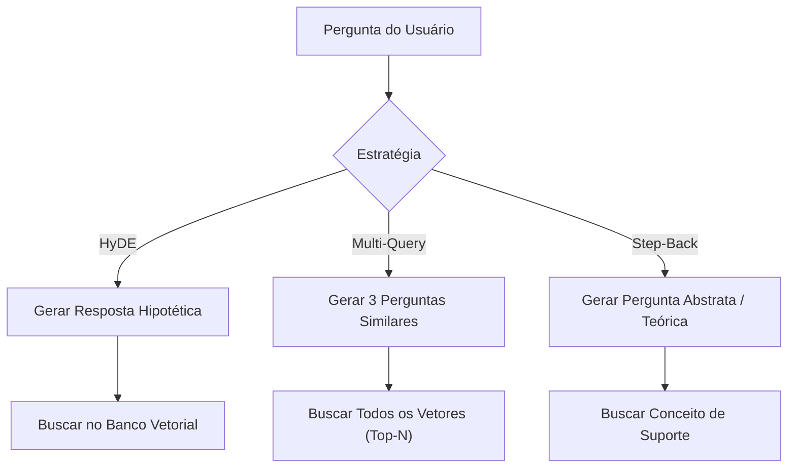
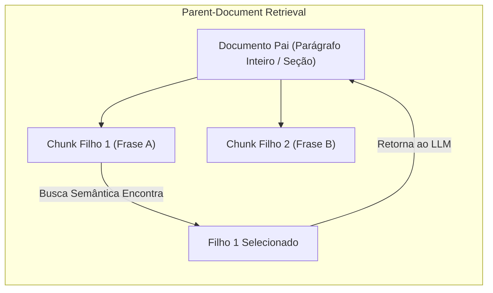

# Técnicas de RAG Avançado

## Objetivo
Ao final deste tópico, o estudante será capaz de analisar e diagnosticar falhas de recuperação em sistemas RAG lineares (*Naive*), e projetar e implementar pipelines avançados contendo reescrita e expansão de consultas (HyDE, Multi-query), Busca Híbrida consolidada por RRF, indexação hierárquica (Parent-Document e Sentence-Window) e algoritmos de reordenação (*Reranking*).

## Pré-requisitos
- [Embeddings e Bancos Vetoriais](02-embeddings-and-vector-databases.md)

---

## Conceitos Fundamentais

O RAG básico (*Naive RAG*) é frágil em ambientes corporativos devido a três problemas principais de recuperação:
1. **Incompatibilidade Semântica (Vocab Gap)**: A pergunta do usuário e a resposta no documento usam palavras-chave diferentes (ex: o usuário pergunta *"Como cancelo o contrato?"* mas o documento diz *"Cláusula de rescisão voluntária"*).
2. **Resultados Ruidosos**: O banco vetorial traz trechos que contêm termos parecidos, mas que não respondem à pergunta central.
3. **Perda de Contexto Fino**: O chunk de texto recuperado é muito curto para que o LLM entenda o contexto amplo, ou muito longo, estourando custos e diluindo a atenção do modelo.

Para contornar essas limitações, o **RAG Avançado** atua em três etapas fundamentais do fluxo de busca.

---

### 1. Pré-Recuperação: Query Transformations (Otimização da Consulta)
Antes de converter a pergunta do usuário em um vetor de busca, nós a otimizamos utilizando um LLM mais leve e rápido:



- **HyDE (Hypothetical Document Embeddings)**: O LLM gera uma resposta fictícia e ideal para a pergunta do usuário. O embedding dessa resposta hipotética (e não da pergunta original) é usado para pesquisar no banco. Como as respostas hipotéticas se assemelham na estrutura gramatical e vocabulário aos documentos reais da base de dados, a busca é consideravelmente mais precisa do que buscar usando a pergunta direta.
- **Multi-Query Expansion**: O LLM gera de 3 a 5 variações da pergunta original com sinônimos diferentes. O sistema executa a busca vetorial para cada uma delas e consolida os resultados. Isso aumenta a taxa de recall, cobrindo diferentes termos de pesquisa.
- **Step-Back Prompting**: O LLM gera uma pergunta de "passo atrás", mais genérica e abstrata, buscando conceitos ou princípios gerais. O sistema busca tanto o conceito amplo quanto o detalhe específico, ajudando o LLM a raciocinar sobre as premissas antes de decidir a resposta final.

---

### 2. Recuperação: Busca Híbrida e Fusão de Rankings (RRF)
A melhor recuperação combina o poder semântico dos embeddings (vetores densos) com a exatidão léxica de correspondência de palavras (vetores esparsos baseados em BM25).

#### Algoritmo RRF (Reciprocal Rank Fusion)
Como o score do BM25 (esparso) e da similaridade vetorial (denso) estão em escalas totalmente diferentes, não podemos simplesmente somá-los. O **RRF** resolve isso classificando os documentos com base em suas **posições relativas nos rankings individuais** de cada busca.
$$\text{Score}_{RRF}(d) = \sum_{m \in M} \frac{1}{k + r_m(d)}$$
- Onde $r_m(d)$ é a posição do documento $d$ na busca do modelo $m$ (1º lugar = 1, 2º lugar = 2).
- $k$ é uma constante suavizadora (geralmente fixada em 60).
Documentos com maiores valores de RRF são levados para o topo do ranking final unificado.

---

### 3. Recuperação Hierárquica: Parent-Document e Sentence-Window



- **Parent-Document Retrieval (Recuperação de Documento Pai)**: Armazena pedaços de textos pequenos (ex: 100 caracteres) para a busca vetorial (onde embeddings curtos possuem maior precisão). No entanto, o banco vetorial armazena no metadado um ID de referência a um bloco maior (o "pai", ex: 1000 caracteres). Se o chunk pequeno for selecionado, a aplicação recupera o documento pai completo e o envia ao LLM, fornecendo contexto suficiente.
- **Sentence-Window Retrieval**: Semelhante ao documento pai, o sistema indexa sentenças individuais isoladas. Porém, quando uma sentença é selecionada, o sistema expande o contexto trazendo a sentença anterior e posterior (a "janela de sentenças"), garantindo clareza gramatical sem poluir a janela de contexto.

---

### 4. Pós-Recuperação: Rerankers (Bi-Encoders vs. Cross-Encoders)
A busca em bancos vetoriais usa modelos **Bi-Encoder**, que calculam os embeddings dos documentos e da pergunta de forma isolada. Isso permite buscas rápidas ($O(1)$ usando índices ANN), mas ignora o relacionamento direto palavra por palavra entre a pergunta e o documento.

Para refinar o resultado final, aplica-se um **Cross-Encoder (Reranker)**:
- O Cross-Encoder recebe a pergunta e o documento **juntos** na entrada, alimentando-os lado a lado no mecanismo de atenção de um Transformer.
- Ele calcula a probabilidade direta de relevância com altíssima acurácia.
*Trade-off*: Cross-encoders são computacionalmente muito pesados e lentos para buscar em todo o banco de dados. Portanto, o pipeline ideal realiza uma primeira busca rápida com Bi-Encoder para trazer o Top-25 e, em seguida, aplica o Cross-Encoder para reordenar e filtrar apenas o Top-3 que será enviado ao LLM de geração.

---

## Casos de Uso
- **Buscadores de E-commerce**: Onde o usuário digita *"tênis nike de corrida azul marinho"*. O sistema precisa de busca por palavra-chave (BM25 para "nike" e "tênis") combinada com semântica (cosseno para "corrida" e tons de "azul marinho").
- **Auditoria Jurídica de Contratos**: Onde cláusulas específicas de rescisão não podem ser recortadas sozinhas (Parent-document traz o parágrafo ou artigo completo associado).
- **Q&A Técnico de Engenharia**: Onde nomes de funções de código exatos (ex: `pd.concat()`) devem ser buscados exatamente (BM25) mas a intenção ("juntar tabelas") deve ser resolvida semanticamente.

---

## Erros Comuns

1. **Rerankear Documentos em Excesso**: Enviar 100 documentos para um modelo Reranker de Cross-Encoder em tempo de execução adicionará múltiplos segundos de latência, destruindo a experiência do usuário. 
   - *Mitigação*: Execute o Reranking em no máximo 15 a 25 documentos selecionados na busca primária.
2. **Roteamento Estático**: Assumir que todas as perguntas devem ir para o banco vetorial de RAG. Perguntas puramente lógicas (ex: *"Quantos usuários cadastrados temos?"*) devem ser roteadas semanticamente para uma chamada de banco de dados estruturado (SQL) em vez de RAG vetorial.
3. **Estouro de Contexto por Parent Gigante**: Definir documentos pais excessivamente longos (ex: PDFs de 50 páginas como pai de pequenos chunks). Ao encontrar um chunk, o sistema estoura a memória do LLM ao carregar o pai correspondente.

---

## Exemplos

### Pipeline RAG Avançado: Busca Híbrida (Cosseno + BM25), Fusão RRF e Reranking (Python)
Este exemplo prático implementa o fluxo completo de pós-processamento de RAG Avançado de ponta a ponta sem dependências externas complexas.

```python
import numpy as np

# Base de dados simulando documentos técnicos
DOCUMENTOS = [
    {"id": 1, "texto": "Para concatenar dataframes no pandas use a função pd.concat(objs). Ela une tabelas horizontalmente ou verticalmente."},
    {"id": 2, "texto": "A instrução merge do pandas une tabelas usando chaves ou colunas comuns, similar a um JOIN do SQL tradicional."},
    {"id": 3, "texto": "A biblioteca NumPy fornece arrays eficientes de alta performance para computação matemática e matricial rápida."},
]

# 1. Busca Esparsa Simplificada (Simulação de BM25 de Termos Exatos)
def busca_bm25_simulada(query: str) -> list:
    termos_query = set(query.lower().split())
    scores = []
    for doc in DOCUMENTOS:
        palavras_doc = doc["texto"].lower().split()
        # Calcula um score rudimentar baseado no percentual de palavras coincidentes
        coincidencias = len(termos_query.intersection(palavras_doc))
        score = coincidencias / (len(termos_query) + 1.0)
        scores.append((score, doc))
    scores.sort(key=lambda x: x[0], reverse=True)
    return [doc for score, doc in scores]

# 2. Busca Densa (Simulação de Embeddings Semânticos)
def gerar_embedding_simulado(texto: str) -> np.ndarray:
    termos_chave = ["concatena", "pandas", "numpy", "join", "unir", "matemática"]
    vetor = [1.0 if t in texto.lower() else 0.0 for t in termos_chave]
    arr = np.array(vetor)
    norm = np.linalg.norm(arr)
    return arr / norm if norm > 0 else arr

for doc in DOCUMENTOS:
    doc["embedding"] = gerar_embedding_simulado(doc["texto"])

def busca_densa_simulada(query: str) -> list:
    vetor_query = gerar_embedding_simulado(query)
    scores = []
    for doc in DOCUMENTOS:
        # Cosseno
        score = float(np.dot(vetor_query, doc["embedding"]))
        scores.append((score, doc))
    scores.sort(key=lambda x: x[0], reverse=True)
    return [doc for score, doc in scores]

# 3. Fusão Híbrida: Reciprocal Rank Fusion (RRF)
def reciprocal_rank_fusion(ranking_denso: list, ranking_esparso: list, k: int = 60) -> list:
    rrf_scores = {}
    
    # Processa os rankings obtendo as posições relativas dos IDs
    for rank, doc in enumerate(ranking_denso):
        doc_id = doc["id"]
        rrf_scores[doc_id] = rrf_scores.get(doc_id, 0.0) + (1.0 / (k + (rank + 1)))
        
    for rank, doc in enumerate(ranking_esparso):
        doc_id = doc["id"]
        rrf_scores[doc_id] = rrf_scores.get(doc_id, 0.0) + (1.0 / (k + (rank + 1)))
        
    # Classifica os IDs com base nos scores RRF calculados
    ids_ordenados = sorted(rrf_scores.items(), key=lambda x: x[1], reverse=True)
    
    # Reconstrói a lista ordenada de documentos associada
    mapa_docs = {doc["id"]: doc for doc in DOCUMENTOS}
    return [(score, mapa_docs[doc_id]) for doc_id, score in ids_ordenados]

# 4. Pós-Recuperação: Rerank Baseado em Modelo Cross-Encoder (Simulado)
def rerank_cross_encoder_simulado(query: str, documentos_com_score: list) -> list:
    # Simula um Cross-Encoder que analisa se palavras chave complexas da query aparecem semanticamente
    # no documento para recalcular um score refinado de relevância fina
    query_normalizada = query.lower()
    reranked = []
    
    for score_rrf, doc in documentos_com_score:
        texto = doc["texto"].lower()
        score_refinado = score_rrf
        
        # Cross-Encoder avalia com maior peso dependências contextuais diretas
        if "pandas" in query_normalizada and "pd.concat" in texto:
            score_refinado += 0.5
        if "unir" in query_normalizada and "merge" in texto:
            score_refinado += 0.3
            
        reranked.append((score_refinado, doc))
        
    reranked.sort(key=lambda x: x[0], reverse=True)
    return reranked

# Execução Prática do Pipeline RAG Avançado
if __name__ == "__main__":
    query_usuario = "como unir tabelas usando pandas pd.concat"
    print(f"Consulta do Usuário: '{query_usuario}'\n")
    
    # 1. Recuperações individuais nas duas frentes de busca
    res_esparso = busca_bm25_simulada(query_usuario)
    res_denso = busca_densa_simulada(query_usuario)
    
    print("Ranking Esparso (BM25):", [doc["id"] for doc in res_esparso])
    print("Ranking Denso (Embeddings):", [doc["id"] for doc in res_denso])
    
    # 2. Fusão dos Rankings usando RRF
    hybrid_ranking = reciprocal_rank_fusion(res_denso, res_esparso, k=20)
    print("\nRanking Híbrido Unificado (RRF):")
    for score, doc in hybrid_ranking:
        print(f"- RRF Score: {score:.5f} | ID: {doc['id']} | {doc['texto'][:45]}...")
        
    # 3. Refinamento de Pós-Recuperação com Cross-Encoder Reranker
    final_ranking = rerank_cross_encoder_simulado(query_usuario, hybrid_ranking)
    print("\nRanking Final após Reranking de Alta Precisão:")
    for score, doc in final_ranking:
        print(f"- Reranked Score: {score:.5f} | ID: {doc['id']} | {doc['texto']}")

```
---

## Perguntas de Entrevista

1. **Qual a diferença técnica e de custo computacional entre modelos Bi-Encoder (usados em bancos vetoriais) e modelos Cross-Encoder (usados como Reranker)?**
   *Resposta*: Modelos Bi-Encoder processam o texto da consulta e do documento de forma isolada, gerando embeddings independentes. Isso permite computar os vetores da base de antemão e executar buscas ultrarrápidas ($O(1)$) calculando o cosseno em tempo real. Já os Cross-Encoders processam a consulta e o documento de forma conjunta dentro da mesma camada de atenção do Transformer. Isso aumenta drasticamente a acurácia (captura interações finas palavra por palavra), mas exige computação pesada em tempo de execução, tornando inviável varrer a base de dados inteira. Por isso, são restritos à reordenação (*Rerank*) dos primeiros resultados recuperados pelo Bi-Encoder.

2. **Como funciona a técnica HyDE (Hypothetical Document Embeddings) e em que cenários ela é mais útil?**
   *Resposta*: O HyDE (Hypothetical Document Embeddings) utiliza um LLM para gerar uma resposta hipotética fictícia a partir da pergunta do usuário. O embedding dessa resposta hipotética é gerado e utilizado para pesquisar no banco vetorial. Essa técnica é útil para mitigar a "incompatibilidade semântica" (quando a pergunta usa vocabulário muito diferente da resposta real na base), pois dois documentos de resposta tendem a possuir maior similaridade semântica no espaço de embeddings do que um par pergunta-resposta direto.

3. **Explique o algoritmo RRF (Reciprocal Rank Fusion) e a razão de não somarmos diretamente os scores de buscas densas (embeddings) e esparsas (BM25).**
   *Resposta*: Os scores do BM25 baseiam-se na frequência de ocorrência de palavras e podem variar de zero a infinito positivo, enquanto os scores de embeddings vetoriais (similaridade de cosseno) variam tipicamente entre 0 e 1 (ou -1 e 1). Somar diretamente esses valores sem normalização distorcerá completamente o ranking, dando peso excessivo ao algoritmo com maior valor bruto. O RRF contorna essa barreira desconsiderando o score original e somando o inverso da posição de colocação do documento em cada ranking (1º lugar, 2º lugar, etc.), estabilizando e normalizando a pontuação final de fusão híbrida.

---

## Exercícios

1. **[Teórico]** Explique com clareza a diferença técnica de comportamento entre o fluxo de recuperação Parent-Document (hierárquico) e o Sentence-Window, destacando qual tipo de chunk é guardado no índice vetorial e o que é repassado ao LLM final de geração.
2. **[Prático]** Expanda o código em Python contido neste arquivo para criar a fórmula exata do RRF com o parâmetro de suavização padrão $k = 60$ e faça o cálculo manual de RRF de um documento que ficou em 1º lugar na busca semântica densa e em 10º lugar na busca por palavras-chave esparsa.
3. **[Design]** Esboce a arquitetura de um sistema RAG Avançado para atuar como assistente de documentação de APIs internas em uma grande fintech. O design deve contemplar busca híbrida (BM25 + vetorial), expansão de consultas com HyDE, reordenação de resultados com Reranker e uma estratégia de cache semântico de respostas para economizar tokens repetidos nas APIs.

---

## Referências
- [Precise Zero-Shot Dense Retrieval with Hypothetical Document Embeddings (HyDE Paper, 2022)](https://arxiv.org/abs/2212.10496) — Estudo detalhado sobre a geração de respostas hipotéticas para buscas densas.
- [Reciprocal Rank Fusion (RRF Paper, 2009)](https://dl.acm.org/doi/10.1145/1571941.1572114) — O paper acadêmico original que detalha o algoritmo de consolidação híbrida.
- [Cohere Rerank Documentation](https://docs.cohere.com/docs/reranking) — Guia de uso prático para otimização de latência e ganho de precisão de busca em pipelines corporativos.

