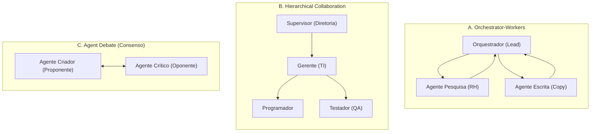
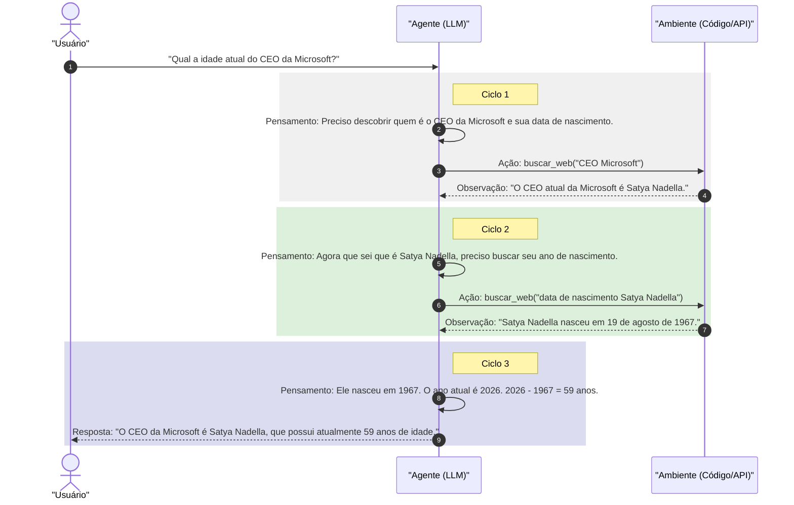

# Padrões e Fluxos Agênticos

## Objetivo
Ao final deste tópico, o estudante será capaz de explicar o conceito de sistemas agênticos de IA, descrever os 4 padrões fundamentais de design de agentes de Andrew Ng, distinguir topologias de colaboração multiagentes (Orchestrator-Workers, Hierarchical e Debate) e projetar algoritmos de loop de planejamento iterativo com replanejamento dinâmico.

## Pré-requisitos
- [Engenharia de Prompts e Técnicas Avançadas](../01-introduction-to-llms/02-prompt-engineering.md)
- [Spec-Driven Development (SDD) e SPDD](../01-introduction-to-llms/03-spec-driven-development-and-spdd.md)

---

## Conceitos Fundamentais

Um **Agente de IA** representa um paradigma onde o Modelo de Linguagem (LLM) deixa de ser um mero processador estático de textos de uma única chamada (*Zero-shot*) e passa a atuar como o **motor de decisão autônomo** de um loop iterativo. O agente é capaz de perceber o estado do ambiente, planejar tarefas, executar ações chamando ferramentas externas e refletir sobre seus erros para auto-correção.

---

### Os 4 Padrões de Design de Agentes (Andrew Ng)

O pesquisador Andrew Ng consolidou a engenharia agêntica em quatro padrões fundamentais que mostram como o uso de loops de raciocínio melhora drasticamente o desempenho de modelos, permitindo que LLMs menores superem modelos muito maiores rodados em modo direto.

#### 1. Reflection (Reflexão e Auto-correção)
Consiste em rodar um ciclo de refinamento iterativo. O modelo gera uma saída, o sistema a submete a um processo de avaliação (que pode ser outro LLM atuando como revisor ou uma ferramenta automatizada de teste), e o modelo original recebe o relatório de críticas para regenerar a resposta corrigida.
- *Aplicação*: Correção automática de código fonte com base em mensagens do compilador.

#### 2. Tool Use (Uso de Ferramentas)
Habilita o LLM a decidir quais APIs externas, funções locais, calculadoras ou interpretadores de código devem ser chamados para buscar informações atuais ou alterar estados do mundo físico.
- *Aplicação*: Acessar APIs financeiras de cotação de ativos em tempo real para responder dúvidas de mercado.

#### 3. Planning (Planejamento)
O agente recebe um objetivo abstrato complexo e o quebra em uma sequência de sub-tarefas atômicas (**Decomposição de Tarefas**). Adicionalmente, o planejamento agêntico avançado inclui a habilidade de analisar o resultado de cada sub-etapa e **reorganizar ou alterar o plano dinamicamente** caso ocorra um erro ou barreira imprevista.
- *Técnicas*: *Plan-and-Solve* (planejar e executar), *LLM Compiler* (paralelização lógica de tarefas).

#### 4. Multi-Agent Collaboration (Colaboração Multiagente)
Dividir a complexidade de um sistema entre agentes especializados, cada um com papéis, personas, memórias e ferramentas distintas. Em vez de um único prompt tentar resolver tudo, múltiplos agentes cooperam trocando mensagens entre si.

---

### Topologias de Colaboração Multiagente

Em sistemas multiagentes complexos, a forma como os agentes se comunicam define a estabilidade do fluxo de trabalho. Existem três topologias fundamentais:



#### A. Orchestrator-Workers (Orquestrador e Operários)
Um agente centralizado lidera o planejamento e delega tarefas específicas para agentes de propósito único (Workers). Os operários não se comunicam entre si; eles executam a tarefa e devolvem o resultado ao orquestrador, que consolida a resposta final.
- *Uso*: Análise de currículos e geração de relatórios departamentais.

#### B. Hierarchical Collaboration (Estrutura Hierárquica)
Organiza os agentes em níveis de gerência. Supervisores controlam sub-equipes e têm a autoridade de aprovar ou rejeitar a entrega de um agente inferior antes de repassá-la para o nível de cima.
- *Uso*: Pipelines de desenvolvimento de software onde o "Gerente" coordena a escrita do código pelo "Programador" e a validação pelo "QA".

#### C. Agent Debate (Debate de Agentes)
Dois ou mais agentes com posições ou personas opostas (ex: um proponente criativo e um crítico de segurança) debatem sobre a mesma questão durante $N$ rodadas de mensagens mútuas para chegar a um consenso refinado e livre de vieses.
- *Uso*: Auditoria de segurança de contratos inteligentes (*smart contracts*) ou análise de viabilidade financeira de investimentos.

---

## Funcionamento Interno

### O Loop de Planejamento e Ação (ReAct)
O fluxo interno clássico de tomada de decisões de um agente ReAct alterna raciocínio analítico (*Reasoning*) e ações práticas (*Acting*) em ciclos repetitivos:



---

## Erros Comuns

1. **Loops Infinitos de Auto-correção (Infinite Recursion)**: Um agente de reflexão pode ficar preso em um loop tentando corrigir um bug sem sucesso, gerando custos catastróficos de API.
   - *Mitigação*: Definir um limite estrito de iterações (`max_iterations = 5`) e implementar um fallback que retorne o último estado válido com um aviso de erro.
2. **Topologias Multiagentes Ineficientes (Chatter Boxes)**: Criar múltiplos agentes conversando entre si sem uma ordem hierárquica clara ou critério de encerramento, gerando dezenas de mensagens redundantes irrelevantes.
   - *Mitigação*: Prefira estruturas direcionadas com orquestradores ou processos sequenciais rígidos em vez de debates abertos sem limites.
3. **Não Isolar o Ambiente de Execução**: Dar permissão para o agente rodar comandos de terminal de sistema ou scripts de código diretamente na máquina host de produção.
   - *Mitigação*: Execute interpretadores de código e tarefas de shell em sandboxes seguras isoladas (ex: containers Docker efêmeros).

---

## Exemplos

### Implementação de um Agente de Planejamento Dinâmico com Reavaliação (Python)
Este exemplo em Python conceitual demonstra o fluxo de um agente que recebe um objetivo, quebra-o em um plano de tarefas, executa-o sequencialmente e **adapta o plano dinamicamente** ao detectar uma falha no meio do processo.

```python
from typing import List, Dict

# Simulação de ferramentas do sistema
def buscar_inventario(produto: str) -> Dict:
    # Simula que o produto A está disponível e o produto B está em falta
    if produto.lower() == "teclado":
        return {"status": "disponivel", "estoque": 15}
    elif produto.lower() == "mouse":
        return {"status": "indisponivel", "estoque": 0}
    return {"status": "erro", "estoque": 0}

def acionar_fornecedor_urgente(produto: str) -> str:
    return f"Pedido de suprimento urgente enviado ao fornecedor para o item: {produto}."

# Mecanismo do Agente de Planejamento
class AgentePlanejador:
    def __init__(self, objetivo: str):
        self.objetivo = objetivo
        self.plano: List[str] = []
        self.historico_execucao: List[str] = []

    def gerar_plano_inicial(self):
        print(f"[Planejador] Objetivo recebido: '{self.objetivo}'")
        # Quebra o objetivo inicial em duas etapas lógicas
        self.plano = ["verificar_estoque_teclado", "verificar_estoque_mouse", "confirmar_pedido_final"]
        print(f"[Planejador] Plano inicial gerado: {self.plano}")

    def replanejar(self, tarefa_falha: str, motivo: str):
        print(f"\n[!] ALERTA: A tarefa '{tarefa_falha}' falhou pelo motivo: '{motivo}'. Iniciando replanejamento...")
        # Insere uma tarefa corretiva urgente antes de prosseguir com o pedido final
        item = tarefa_falha.split("_")[-1]
        self.plano.insert(0, f"solicitar_fornecedor_{item}")
        print(f"[Planejador] Novo plano ajustado: {self.plano}")

    def executar_plano(self):
        self.gerar_plano_inicial()
        
        while self.plano:
            tarefa_atual = self.plano.pop(0)
            print(f"\n-> Executando: {tarefa_atual}")
            
            # Simulação lógicas de execução de tarefas
            if tarefa_atual == "verificar_estoque_teclado":
                resultado = buscar_inventario("teclado")
                print(f"   [Tool Output] Estoque Teclado: {resultado}")
                self.historico_execucao.append(f"{tarefa_atual}: Sucesso")
                
            elif tarefa_atual == "verificar_estoque_mouse":
                resultado = buscar_inventario("mouse")
                print(f"   [Tool Output] Estoque Mouse: {resultado}")
                
                if resultado["status"] == "indisponivel":
                    # Detecta falha e aciona replanejamento dinâmico
                    self.historico_execucao.append(f"{tarefa_atual}: Falhou (Sem estoque)")
                    self.replanejar(tarefa_atual, "Produto esgotado no inventário principal")
                else:
                    self.historico_execucao.append(f"{tarefa_atual}: Sucesso")
                    
            elif tarefa_atual == "solicitar_fornecedor_mouse":
                resultado = acionar_fornecedor_urgente("mouse")
                print(f"   [Tool Output] {resultado}")
                self.historico_execucao.append(f"{tarefa_atual}: Sucesso (Ação Corretiva)")
                
            elif tarefa_atual == "confirmar_pedido_final":
                print("   [Sucesso] Pedido processado e finalizado.")
                self.historico_execucao.append(f"{tarefa_atual}: Sucesso")
                
        print("\n=== Execução Concluída com Sucesso ===")
        print("Histórico final de ações:", self.historico_execucao)

if __name__ == "__main__":
    agente = AgentePlanejador("Processar venda de kit teclado e mouse")
    agente.executar_plano()

```
---

## Perguntas de Entrevista

1. **Quais são os 4 padrões de design de fluxos agênticos propostos por Andrew Ng e como eles melhoram o desempenho dos modelos?**
   *Resposta*: Os 4 padrões são: (1) *Reflection*: o modelo avalia de forma crítica a sua própria resposta ou código e gera correções iterativas; (2) *Tool Use*: o modelo invoca funções e APIs externas para buscar dados reais e atualizar estados; (3) *Planning*: o modelo quebra metas complexas em sub-tarefas e replaneja a execução sob erros; (4) *Multi-Agent Collaboration*: múltiplos agentes operam dividindo o trabalho em papéis especializados. Ao invés do LLM tentar responder tudo em uma chamada direta (*Zero-shot*), esses padrões dão "espaço para raciocínio" por meio de iterações em loop, reduzindo erros de sintaxe e alucinações de forma drástica.

2. **Explique a diferença técnica e organizacional entre as topologias Orchestrator-Workers e Agent Debate.**
   *Resposta*: Na topologia *Orchestrator-Workers*, um agente centralizado (orquestrador) coordena o plano, distribui sub-tarefas isoladas para agentes menores (workers) e consolida os resultados. Os workers não têm comunicação lateral direta entre si. No *Agent Debate*, os agentes interagem de forma lateral e bidirecional em rodadas de debate mútuo desafiando as afirmações uns dos outros (ex: proponente e oponente). Enquanto a primeira topologia é focada em divisão sistemática e estruturada do trabalho, a segunda é voltada para refinamento conceitual, redução de vieses e auditoria de segurança.

3. **Como mitigar os riscos de loops infinitos e estouro de custos de tokens em pipelines recursivos de agentes?**
   *Resposta*: Para conter esses problemas em produção, deve-se: (1) configurar limites estritos de iteração nos loops de execução (ex: `max_iterations = 5`); (2) monitorar continuamente o uso cumulativo de tokens ou chamadas de API feitas na sessão; (3) implementar cláusulas de saída determinísticas (*backstops*), onde o sistema para e retorna o último estado válido com um alerta de erro caso a meta principal não seja atingida dentro do limite configurado.

---

## Exercícios

1. **[Teórico]** Desenhe um diagrama de fluxo detalhado que represente o funcionamento de um agente baseado no padrão *ReAct* (Thought, Action, Observation), mostrando como ele decide interromper o loop de chamadas a ferramentas e gerar a resposta final do usuário.
2. **[Prático]** Expanda o código em Python contido no exemplo deste arquivo para incluir um monitor de custos. Adicione um contador que registre a quantidade de chamadas feitas à ferramenta `buscar_inventario`. Interrompa o loop e lance uma exceção de segurança caso o sistema realize mais do que 3 buscas consecutivas.
3. **[Design]** Projete a arquitetura de uma equipe de agentes (*Crew*) com 3 papéis distintos para realizar a análise automática de patentes em uma multinacional de tecnologia. Defina as personas dos agentes (ex: Pesquisador, Avaliador de Viabilidade, Redator de Resumos), suas ferramentas e como eles se comunicam.

---

## Referências
- [Andrew Ng: What's next for AI agentic workflows](https://www.deeplearning.ai/the-batch/how-agentic-workflows-could-improve-ai-performance/) — O artigo fundamental que organizou a discussão dos 4 padrões de design de agentes.
- [Anthropic Research - Building Effective Agents](https://www.anthropic.com/research/building-effective-agents) — Guia prático da Anthropic sobre padrões agênticos eficientes e como simplificar pipelines em produção.
- [Auto-GPT Repository](https://github.com/Significant-Gravitas/AutoGPT) — Um dos primeiros experimentos comunitários open-source sobre agentes de planejamento e execução iterativa autônoma.

