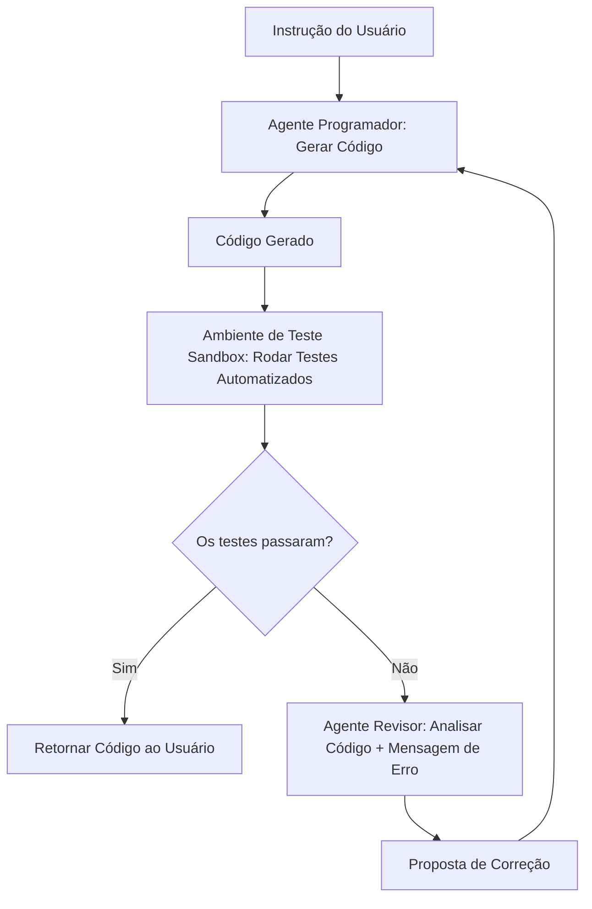

# Padrões e Fluxos Agênticos

## Objetivo
Ao final deste tópico, o estudante será capaz de descrever o que é um sistema agêntico de IA, diferenciar a execução linear tradicional da execução iterativa agêntica e identificar e aplicar os 4 padrões principais de design de agentes (Reflexão, Uso de Ferramentas, Planejamento e Sistemas Multiagentes).

## Pré-requisitos
- [Engenharia de Prompts](../01-introduction-to-llms/02-prompt-engineering.md)

## Conceitos Fundamentais

Um **Agente de IA** é uma arquitetura de sistema onde o LLM atua como o "motor de decisão" para interagir com o ambiente de forma dinâmica. Em vez de receber um prompt e retornar uma resposta final de uma só vez (execução sequencial estática), o agente roda em loops interativos de percepção, raciocínio, planejamento e ação.

Andrew Ng, renomado cientista de dados e educador, popularizou os **Agentic Workflows (Fluxos Agênticos)** dividindo-os em 4 padrões fundamentais de design:

### Os 4 Padrões de Design de Agentes

#### 1. Reflection (Reflexão / Auto-correção)
O modelo gera uma primeira versão da resposta. Em seguida, um prompt revisor (ou uma ferramenta de teste automatizado) avalia o resultado em busca de erros, imprecisões ou bugs. O modelo recebe essa crítica como feedback e gera uma nova versão corrigida. Este ciclo se repete até atingir uma condição de parada aceitável.

#### 2. Tool Use (Uso de Ferramentas)
Capacidade do LLM de solicitar a execução de funções externas (APIs de clima, buscas na internet, calculadoras, consultas SQL) para obter dados ou realizar alterações no mundo real. O modelo analisa a pergunta, escolhe a ferramenta apropriada da sua lista de opções, recebe o resultado e continua seu raciocínio.

#### 3. Planning (Planejamento)
O modelo decompõe um objetivo abstrato e complexo (ex: *"Crie um relatório completo do mercado de ações brasileiras de 2025"*) em uma lista detalhada de sub-tarefas executáveis. Durante a execução, o agente pode reavaliar o progresso e alterar o plano dinamicamente caso encontre barreiras.

#### 4. Multi-Agent Collaboration (Colaboração Multiagente)
Dividir um problema complexo entre diferentes "agentes especializados" que possuem personas, instruções e ferramentas distintas. Por exemplo, um agente atua como "Analista de Negócios" (pesquisa requisitos), outro como "Programador" (escreve o código) e um terceiro como "QA" (valida o código). Eles interagem trocando mensagens até entregarem o resultado final consolidado.

---

## Funcionamento Interno

O fluxo do padrão **Reflection** aplicado à geração e validação automática de código ilustra perfeitamente um fluxo agêntico:



---

## Comparações

### Abordagem Tradicional (Zero-shot) vs. Fluxo Agêntico

| Característica | Abordagem Tradicional | Fluxo Agêntico (Iterativo) |
|---|---|---|
| **Padrão de Execução** | Única chamada (`Prompt -> Resposta`). | Múltiplas chamadas interativas em loop. |
| **Custo e Tempo** | Baixo e imediato. | Alto e demorado (múltiplas chamadas acumuladas). |
| **Lidar com Erros** | O usuário deve manualmente corrigir o prompt. | O próprio sistema se auto-corrige e tenta novamente. |
| **Complexidade da Tarefa** | Adequada para tarefas simples ou curtas. | Adequada para metas amplas, pesquisa aberta ou desenvolvimento de ponta a ponta. |

---

## Erros Comuns

1. **Loops Infinitos (Infinite Loops)**: Um agente de reflexão pode ficar travado indefinidamente tentando corrigir um bug sem sucesso, gerando milhares de tokens extras e custos gigantescos de API. **Sempre defina um limite máximo de iterações** (ex: máximo 5 tentativas de correção) e finalize com um fallback caso o limite seja estourado.
2. **Super-engenharia de Agentes**: Criar um sistema multiagente complexo com 5 robôs conversando entre si para classificar o sentimento de uma frase. Isso é ineficiente e caro. Use agentes apenas quando a tarefa requerer caminhos de decisão altamente dinâmicos e heterogêneos.
3. **Falta de Sandbox Seguro**: Dar ferramentas de escrita ao agente (ex: criar arquivos, deletar diretórios, rodar comandos shell) diretamente na máquina local sem isolamento. Um agente com erro de lógica ou instrução de usuário maliciosa pode deletar arquivos críticos do sistema operacional. **Sempre isole ferramentas de execução em containers Docker ou sandboxes seguras**.

---

## Exemplos

### Exemplo de Loop de Reflexão em Pseudo-código (Python)

```python
def gerar_codigo_seguro(requisito, max_tentativas=3):
    codigo_atual = chamar_llm_programador(requisito)
    tentativa = 1
    
    while tentativa <= max_tentativas:
        # Roda o linter/interpretador em uma sandbox isolada
        sucesso, erros_teste = executar_testes_sandbox(codigo_atual)
        
        if sucesso:
            print(f"Sucesso na tentativa {tentativa}!")
            return codigo_atual
            
        print(f"Tentativa {tentativa} falhou. Iniciando reflexão...")
        # Envia o código ruim e as mensagens de erro para o LLM propor correções
        codigo_atual = chamar_llm_revisor(
            codigo_antigo=codigo_atual, 
            erros=erros_teste
        )
        tentativa += 1
        
    raise RuntimeError("O agente não conseguiu resolver o problema dentro do limite de iterações.")
```

---

## Exercícios

1. **[Design de Fluxo]** Desenhe um fluxo multiagente para um sistema que escreve newsletters semanais automáticas. Defina os papéis (personas) dos agentes envolvidos, quais ferramentas cada um tem acesso e como eles se comunicam.
2. **[Cenário de Risco]** Descreva como você mitigaria o risco de um agente de e-commerce que tem acesso à ferramenta `enviar_email_para_cliente(id_cliente, mensagem)` de enviar spam ou mensagens ofensivas após sofrer uma tentativa de injeção de prompt por parte do usuário.
3. **[Pesquisa e Reflexão]** Por que o uso de fluxos agênticos e loops iterativos melhora a performance de modelos de linguagem menores (como o Llama de 8 bilhões de parâmetros), permitindo-lhes aproximar-se de resultados de modelos muito maiores?

---

## Referências
- [Andrew Ng: What's next for AI agentic workflows (Palestra / Artigo)](https://www.deeplearning.ai/the-batch/how-agentic-workflows-could-improve-ai-performance/) — O texto base que popularizou a discussão sobre os 4 padrões.
- [Anthropic: Building Effective Agents](https://www.anthropic.com/research/building-effective-agents) — Excelente guia sobre como projetar padrões agênticos simples que funcionam bem.
- [Microsoft AutoGen Framework](https://microsoft.github.io/autogen/) — Um exemplo prático de plataforma de desenvolvimento multiagente.
