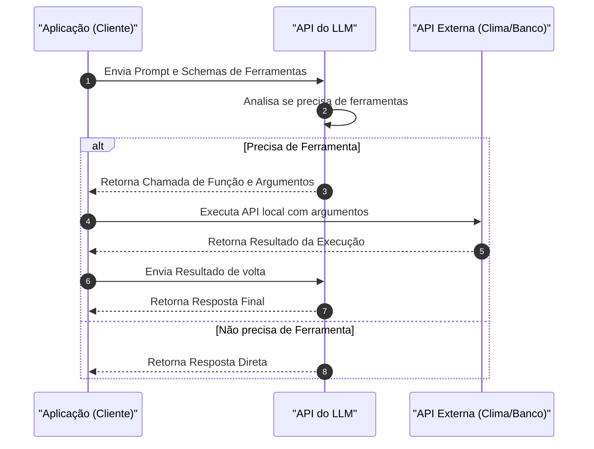

# Function Calling e Ferramentas

## Objetivo
Ao final deste tópico, o estudante será capaz de modelar schemas JSON válidos para ferramentas, descrever o fluxo de troca de mensagens em sistemas de *Function Calling* e implementar a integração de LLMs com APIs externas de forma segura e determinística.

## Pré-requisitos
- [Padrões e Fluxos Agênticos](01-agentic-workflows-and-patterns.md)

## Conceitos Fundamentais

Muitas tarefas exigem ações que um modelo puramente de texto não pode executar sozinho: ler dados atualizados do mercado, enviar uma mensagem no Slack, rodar cálculos numéricos precisos ou alterar registros no banco de dados.

Para resolver isso, os provedores modernos de IA introduziram o **Function Calling (Chamada de Função)**. Em vez de pedir para o LLM tentar responder diretamente ou gerar comandos em formato texto de forma aleatória, nós fornecemos ao modelo uma **lista de ferramentas disponíveis descritas em formato JSON Schema**.

O LLM atua puramente como o decisor de qual ferramenta chamar e quais parâmetros passar, mas **o modelo em si não executa nenhuma chamada de rede**. Quem executa a função localmente é a sua aplicação de backend.

O fluxo de mensagens e estados do Function Calling é executado da seguinte forma:



---

## Regras e Exceções

### Como Declarar um Schema de Ferramenta
As ferramentas devem ser declaradas com nomes autoexplicativos, descrições ricas em detalhes (onde você explica para o LLM exatamente em que cenário usar aquela ferramenta e o que significam seus parâmetros) e tipos de dados estritos no formato **JSON Schema**.

Exemplo de schema para declarar uma ferramenta de envio de email:

```json
{
  "name": "enviar_email_marketing",
  "description": "Envia um email de marketing ou suporte para um cliente específico.",
  "parameters": {
    "type": "object",
    "properties": {
      "destinatario": {
        "type": "string",
        "description": "O endereço de email do destinatário (ex: usuario@email.com)."
      },
      "assunto": {
        "type": "string",
        "description": "O título ou assunto do email."
      },
      "corpo_mensagem": {
        "type": "string",
        "description": "O conteúdo de texto do email, suportando quebras de linha."
      }
    },
    "required": ["destinatario", "assunto", "corpo_mensagem"]
  }
}
```

---

## Erros Comuns

1. **Alucinar Ferramentas ou Parâmetros**: O LLM pode tentar chamar uma função com o nome ligeiramente diferente (ex: `send_email` em vez de `enviar_email_marketing`) ou inventar parâmetros não descritos no schema. Sua aplicação de backend deve validar o nome da função e o schema dos argumentos de forma rígida antes da execução.
2. **Ignorar Tratamento de Erros da Ferramenta**: Se a API externa que o agente chamou retornar um erro (ex: `HTTP 401 Unauthorized`), você deve enviar esse erro formatado de volta para o LLM. Isso permite que o modelo entenda que a ação falhou e explique o erro ao usuário, em vez de assumir que a ação teve sucesso.
3. **Falta de Validação de Segurança (SQL/Command Injection)**: Se você fornecer uma ferramenta como `executar_query_sql(query_string)`, o LLM sob uma instrução maliciosa de usuário pode executar um comando destrutivo (ex: `DROP TABLE Usuarios;`). **Nunca dê acesso direto de escrita livre a bancos de dados**. Crie ferramentas com parâmetros restritos (ex: `atualizar_status_pedido(pedido_id, novo_status)`).

---

## Exemplos

### Exemplo Prático em Python com SDK Oficial da OpenAI
Como integrar de ponta a ponta uma ferramenta matemática e simular a interceptação da chamada local:

```python
import json
from openai import OpenAI

client = OpenAI(api_key="SUA_API_KEY")

# 1. Definição da Função Local que será executada no nosso servidor
def calcular_imposto(valor: float, estado: str) -> float:
    aliquotas = {"SP": 0.18, "RJ": 0.20, "MG": 0.12}
    taxa = aliquotas.get(estado.upper(), 0.15)
    return valor * taxa

# 2. Declaração da Ferramenta para o LLM
ferramentas = [
    {
      "type": "function",
      "function": {
        "name": "calcular_imposto",
        "description": "Calcula a taxa de imposto estadual sobre um valor monetário.",
        "parameters": {
          "type": "object",
          "properties": {
            "valor": {"type": "number", "description": "O valor base da mercadoria."},
            "estado": {"type": "string", "description": "A sigla de duas letras do estado brasileiro (ex: SP, RJ, MG)."}
          },
          "required": ["valor", "estado"]
        }
      }
    }
]

# 3. Primeira Chamada ao LLM enviando a pergunta e a lista de ferramentas
mensagens = [{"role": "user", "content": "Preciso calcular o imposto de um produto de R$ 500 em São Paulo."}]

resposta = client.chat.completions.create(
    model="gpt-4o-mini",
    messages=mensagens,
    tools=ferramentas,
    tool_choice="auto" # Deixa o modelo decidir se quer usar ferramenta ou não
)

escolha_mensagem = resposta.choices[0].message

# 4. Interceptação da chamada de ferramenta
if escolha_mensagem.tool_calls:
    for tool_call in escolha_mensagem.tool_calls:
        nome_funcao = tool_call.function.name
        argumentos = json.loads(tool_call.function.arguments)
        
        if nome_funcao == "calcular_imposto":
            # Executa a função localmente
            resultado = calcular_imposto(valor=argumentos["valor"], estado=argumentos["estado"])
            
            # Adiciona a requisição de ferramenta e o resultado no histórico de mensagens
            mensagens.append(escolha_mensagem) # Adiciona a chamada
            mensagens.append({
                "role": "tool",
                "tool_call_id": tool_call.id,
                "name": nome_funcao,
                "content": str(resultado)
            })
            
            # 5. Segunda chamada enviando o histórico completo contendo o resultado
            resposta_final = client.chat.completions.create(
                model="gpt-4o-mini",
                messages=mensagens
            )
            print("Resposta do Assistente:", resposta_final.choices[0].message.content)
```

---

## Exercícios

1. **[Modelagem de Schema]** Projete o arquivo JSON Schema completo para uma ferramenta de gerenciamento de tarefas chamada `criar_tarefa`. Ela deve aceitar chaves de `titulo` (obrigatório), `descricao` (opcional), `data_limite` (formato string de data) e `prioridade` (com valores aceitos limitados apenas a: "baixa", "media", "alta").
2. **[Fluxo de Erro]** Escreva o pseudo-código que simula uma chamada à ferramenta `consultar_saldo_bancario(id_conta)`. Caso a conta não exista, simule o retorno de um erro HTTP 404 e explique como você passaria esse erro de volta na lista de mensagens do LLM.
3. **[Segurança]** Quais são os riscos e quais mecanismos de contenção você adotaria ao disponibilizar para um LLM ferramentas de alteração de dados sensíveis do cliente (ex. mudar email de cadastro ou alterar limite do cartão de crédito)?

---

## Referências
- [OpenAI Guide on Function Calling](https://platform.openai.com/docs/guides/function-calling) — Guia de referência técnica da OpenAI.
- [Google Gemini API: Function Calling](https://ai.google.dev/gemini-api/docs/function-calling) — Como usar chamadas de função com os modelos Gemini.
- [JSON Schema Specification](https://json-schema.org/) — O padrão oficial usado para descrever as estruturas das ferramentas.
