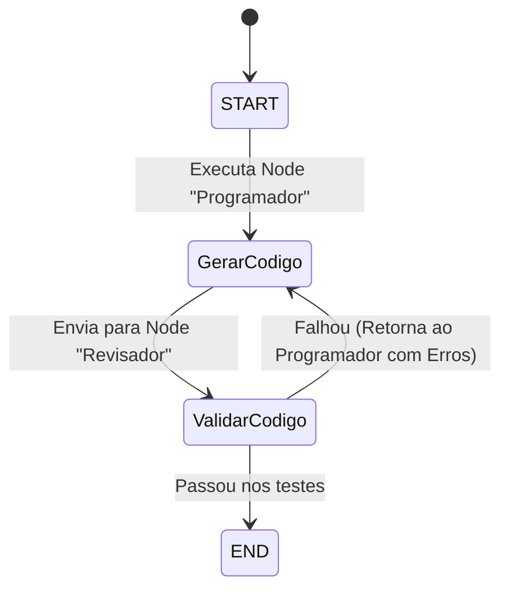

# Frameworks Agênticos e Arquitetura de Estados

## Objetivo
Ao final deste tópico, o estudante será capaz de analisar a arquitetura dos principais frameworks de desenvolvimento de IA (LangChain, LangGraph, CrewAI, AutoGen), projetar fluxos cíclicos baseados em máquinas de estado usando a arquitetura do LangGraph, contrastar os paradigmas *Code-first* e *Library-first* e selecionar a ferramenta ideal para produção corporativa.

## Pré-requisitos
- [Function Calling e Integração de Ferramentas](02-function-calling-and-tools.md)
- [Fundamentos de RAG](../02-retrieval-augmented-generation/01-rag-fundamentals.md)

---

## Conceitos Fundamentais

À medida que os agentes saem de protótipos simples e passam a operar com memória persistente, loops complexos de decisão e dezenas de ferramentas, gerenciar o estado da conversa e os desvios de fluxo programáticos em Python puro torna-se complexo. Os frameworks agênticos organizam e estruturam essas arquiteturas de software.

---

### 1. A Transição para Grafos Cíclicos de Estado (LangGraph)
Os frameworks de IA tradicionais (como as primeiras versões do LangChain) foram projetados para construir cadeias lineares de execução unidirecionais (**DAGs - Directed Acyclic Graphs**), representados pelo padrão clássico `Input -> Prompt -> LLM -> Output`.

No entanto, agentes reais exigem loops repetitivos: *tente executar a ferramenta -> falhou -> tente corrigir -> execute novamente -> pare se passou nos testes*. O **LangGraph** foi criado especificamente para modelar **grafos cíclicos de estado (Stateful Cyclic Graphs)** baseados no padrão de Máquinas de Estado.



#### Componentes de um Grafo no LangGraph:
1. **State (Estado)**: Um dicionário ou classe Pydantic que serve de memória compartilhada global entre todas as etapas do grafo. Qualquer alteração ou nova geração é registrada e persistida no estado.
2. **Nodes (Nós)**: Funções Python que executam processamentos (chamar LLM, rodar ferramenta). Cada nó recebe o estado atual, realiza uma computação e retorna um estado atualizado.
3. **Edges (Arestas)**: Conexões direcionadas que definem o fluxo entre os nós. Podem ser *normais* (fluxo estático do Nó A para o Nó B) ou *condicionais* (funções decisoras lógicas que roteiam o fluxo dinamicamente baseando-se no conteúdo atual do estado).

---

### 2. CrewAI: Sistemas Multiagentes Declarativos de Role-Playing
O **CrewAI** opera em um nível de abstração superior, voltado a simplificar a colaboração multiagente baseada em representação de papéis (*Role-Playing*). Em vez de programar grafos detalhados de baixo nível, você declara a equipe em formato declarativo:
- **Agents**: Possuem `role` (papel), `goal` (objetivo), `backstory` (persona), `tools` (ferramentas) e chaves como `allow_delegation`.
- **Tasks**: Descrevem a instrução, a saída esperada e qual agente é responsável por ela.
- **Process**: Define a execução da equipe, podendo ser `sequential` (uma tarefa alimenta a próxima) ou `hierarchical` (um agente supervisor coordena o fluxo de entregas).

---

### 3. Paradigmas de Desenvolvimento: Code-first vs. Library-first
Engenheiros de IA seniores dividem a arquitetura de agentes em dois paradigmas principais:

| Característica | Code-first (Desenvolvimento Customizado / LangGraph) | Library-first (Abstrações Prontas / CrewAI / AutoGen) |
| :--- | :--- | :--- |
| **Controle de Fluxo** | **Total**. O desenvolvedor dita exatamente qual linha de código roda em cada nó e quando o loop termina. | **Parcial**. O framework gerencia o loop sob o capô, decidindo quando chamar ferramentas e quando responder. |
| **Depuração (Debugging)** | **Simples**. Erros geram stack traces padrão de Python que apontam exatamente qual função falhou. | **Complexa**. Erros ocorrem dentro de abstrações internas aninhadas do framework, dificultando o rastreamento. |
| **Latência** | **Mínima**. Apenas o atraso nativo do LLM e das ferramentas. | **Média/Alta**. O framework roda prompts sistêmicos internos ocultos para gerenciar o loop do agente, gastando mais tokens. |
| **Curva de Aprendizado** | Moderada (requer codificação lógica detalhada). | Suave (configuração puramente declarativa de classes). |
| **Uso em Produção** | **Altamente Recomendado** para sistemas empresariais críticos e auditáveis. | Recomendado para prototipação rápida e provas de conceito (*PoCs*). |

---

## Erros Comuns

1. **Abstrações Aninhadas Excessivas**: Tentar construir um assistente simples usando CrewAI apenas porque ele suporta múltiplos agentes, quando um único script Python puro com 2 chamadas de API resolveria de forma mais rápida, estável e barata.
2. **Ignorar Persistência de Estado (Checkpointers)**: Em sistemas web de produção, conexões caem. No LangGraph, esquecer de configurar um `checkpointer` (como um banco SQLite ou Redis para persistir as sessões) faz com que o agente perca todo o histórico de reflexões lógicas caso a chamada seja interrompida no meio do loop.
3. **Delegação Descontrolada de Agentes no CrewAI**: Habilitar `allow_delegation = True` em todos os agentes. Eles podem entrar em loops infinitos delegando tarefas indefinidamente entre si sem chegar a uma resposta final.

---

## Exemplos

### Comparativo Prático: CrewAI vs. LangGraph (Python)
Este exemplo simula conceitualmente o desenvolvimento de um mesmo pipeline de **Escrita -> Revisão** utilizando os estilos declarativo (CrewAI) e de máquina de estado (LangGraph).

```python
from typing import Dict, TypedDict

# -------------------------------------------------------------------------
# ABORDAGEM A: ESTILO DECLARATIVO (Simulação da lógica do CrewAI)
# -------------------------------------------------------------------------
class CrewAISimulator:
    def __init__(self, agente_programador, agente_revisor, tarefa):
        self.programador = agente_programador
        self.revisor = agente_revisor
        self.tarefa = tarefa

    def kick_off(self) -> str:
        print("[CrewAI] Iniciando tarefa sequencial...")
        # 1. Agente Programador executa a primeira fase
        codigo = f"print('Hello World') # Gerado por {self.programador['role']}"
        print(f"   - {self.programador['role']} concluiu: '{codigo}'")
        
        # 2. Agente Revisor recebe a saída do programador e valida
        feedback = f"Código Aprovado! # Validado por {self.revisor['role']}"
        print(f"   - {self.revisor['role']} concluiu: '{feedback}'")
        return f"Entrega final consolidada: {codigo} | Feedback: {feedback}"

# -------------------------------------------------------------------------
# ABORDAGEM B: ESTILO MÁQUINA DE ESTADO (Simulação da lógica do LangGraph)
# -------------------------------------------------------------------------
# Define o Estado compartilhado entre os nós
class GraphState(TypedDict):
    codigo: str
    status_revisao: str
    erros: str
    tentativas: int

# Nós do Grafo (Funções de processamento puras)
def node_programador(state: GraphState) -> GraphState:
    print(f"\n[Node Programador] Gerando código. Tentativa {state['tentativas'] + 1}...")
    state["codigo"] = "def soma(a, b): return a - b" # Código propositalmente com erro lógico
    state["tentativas"] += 1
    return state

def node_revisor(state: GraphState) -> GraphState:
    print("[Node Revisor] Avaliando qualidade do código...")
    # Verifica se a função de soma está subtraindo
    if "a - b" in state["codigo"]:
        state["status_revisao"] = "reprovado"
        state["erros"] = "A função de soma está usando o sinal de subtração (-)."
    else:
        state["status_revisao"] = "aprovado"
        state["erros"] = ""
    return state

# Aresta Condicional (Roteamento lógico)
def decidir_proximo_passo(state: GraphState) -> str:
    if state["status_revisao"] == "aprovado":
        return "end"
    elif state["tentativas"] >= 2:
        print("[Router] Limite de tentativas alcançado. Forçando encerramento.")
        return "end"
    else:
        print(f"[Router] Reprovado! Roteando de volta para o programador. Erro: {state['erros']}")
        return "programador"

# Execução do simulador de Grafos do LangGraph
def rodar_grafo_langgraph():
    # Inicializa o estado
    state: GraphState = {"codigo": "", "status_revisao": "", "erros": "", "tentativas": 0}
    
    # Executa o loop lúdico do grafo
    passo = "programador"
    while passo != "end":
        if passo == "programador":
            state = node_programador(state)
            state = node_revisor(state)
            # Avalia a aresta condicional para definir o próximo passo
            passo = decidir_proximo_passo(state)
            
            # Corrige o erro lógico na segunda iteração simulando correção de reflexão
            if state["tentativas"] == 1:
                state["codigo"] = "def soma(a, b): return a + b"
    
    print("\n[LangGraph] Grafo concluído.")
    print("Estado Final:", state)

if __name__ == "__main__":
    # 1. Execução do estilo CrewAI
    produtor = {"role": "Programador Senior"}
    auditor = {"role": "Revisor de QA"}
    crew = CrewAISimulator(produtor, auditor, "Escrever um hello world")
    resultado_crew = crew.kick_off()
    print(resultado_crew)
    
    print("\n" + "="*50)
    
    # 2. Execução do estilo LangGraph
    rodar_grafo_langgraph()

```
---

## Perguntas de Entrevista

1. **Por que a arquitetura do LangGraph é preferida em relação ao LangChain clássico para a construção de agentes de produção cíclicos?**
   *Resposta*: O LangChain tradicional foi projetado para cadeias de execução lineares unidirecionais (DAGs), dificultando a representação de ciclos interativos (loops) que são fundamentais para agentes (ex: loops de reflexão e ferramentas). O LangGraph redefiniu esse fluxo ao utilizar uma arquitetura baseada em Máquinas de Estado. Ele organiza a execução em nós (processamentos), arestas normais e arestas condicionais (roteamentos dinâmicos), utilizando um estado global compartilhado e persistente como memória central, o que facilita o desenvolvimento de agentes cíclicos.

2. **Diferencie o paradigma Code-first (LangGraph) do paradigma Library-first (CrewAI/AutoGen) no desenvolvimento corporativo de agentes.**
   *Resposta*: O paradigma *Code-first* (LangGraph) foca em dar controle e visibilidade total sobre o fluxo de execução. Ele exige mais código para configurar nós e arestas lógicas, mas permite depuração tradicional de stack traces e diminui os custos (tokens). O *Library-first* (CrewAI) abstrai a lógica em classes de alto nível declarativas de papéis (*Role-Playing*). É ideal para prototipagem rápida e equipes de IAs, porém adiciona mais latência, consome mais tokens rodando prompts ocultos de sistema para gerenciar os agentes sob o capô, e dificulta a depuração detalhada em caso de falhas internas de lógica.

3. **O que é o Estado (State) no LangGraph e qual a relevância de registrar checkpointers de persistência em sistemas agênticos?**
   *Resposta*: O Estado é uma estrutura de memória compartilhada (geralmente dicionários ou classes Pydantic) que armazena os dados cumulativos de todas as etapas de execução do grafo. Os checkpointers salvam snapshots periódicos deste estado no banco de dados. Isso é fundamental para produção, pois garante tolerância a falhas (resiliência contra quedas de conexões HTTP), suporta fluxos assíncronos de longa duração (ex: loops de agentes que aguardam aprovação humana do tipo *Human-in-the-loop*) e permite retroceder sessões para auditoria de decisões históricas do sistema.

---

## Exercícios

1. **[Teórico]** Analise e elabore um comparativo analítico entre CrewAI, LangGraph e AutoGen, destacando qual modelo de orquestração de comportamento (Baseado em Grafos de Estado, Conversações Multiagente Livres ou Hierarquias Declarativas) cada um prioriza.
2. **[Prático]** Expanda a simulação de máquina de estado do LangGraph em Python contida neste arquivo para registrar um log descritivo. Adicione uma chave `historico_fluxo` (lista de strings) no dicionário `GraphState` e atualize os nós do programador e revisor para salvar uma mensagem em cada etapa do processamento (ex: "Programador gerou versão N"). Ao final do loop, imprima a lista completa de logs gerados.
3. **[Design]** Esboce a arquitetura lúdica de um grafo do LangGraph projetado para automatizar a correção de erros de bancos de dados. Defina os estados iniciais, os nós envolvidos (Nó Gerador de Query, Nó Validador de Query e Nó Corretor de Query), as arestas normais e a aresta condicional de decisão de sucesso.

---

## Referências
- [LangGraph Official Documentation](https://langchain-ai.github.io/langgraph/) — O portal de referência principal para desenvolvimento de grafos de estado.
- [CrewAI Framework Guides](https://docs.crewai.com/) — Documentação técnica oficial detalhando a organização de Crews, Agents e Tasks.
- [Microsoft AutoGen Framework](https://microsoft.github.io/autogen/) — O ecossistema focado no paradigma de agentes conversacionais de múltiplos atores.

