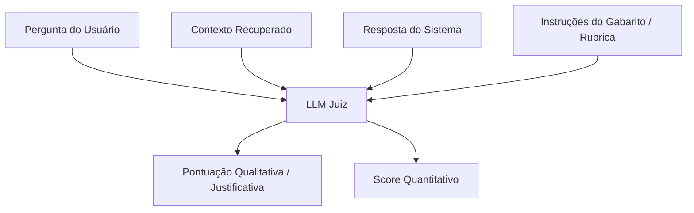

# Avaliação e Testes de LLMs

## Objetivo
Ao final deste tópico, o estudante será capaz de diagnosticar por que asserções de código clássicas falham ao validar respostas de linguagem natural, aplicar o padrão *LLM-as-a-Judge* usando rubricas estruturadas e descrever as três métricas essenciais para avaliação de RAG (Fidelidade, Relevância e Revocação).

## Pré-requisitos
- [Técnicas de RAG Avançado](../02-retrieval-augmented-generation/03-advanced-rag-techniques.md)
- [Frameworks Agênticos](../03-agentic-systems/03-agentic-frameworks.md)

## Conceitos Fundamentais

Testar software tradicional é determinístico: enviamos uma entrada $X$ e validamos se a saída $Y$ é exatamente idêntica ao esperado (`assert response == "sucesso"`).
Em sistemas de IA generativa, as saídas são não-determinísticas e em formato de linguagem natural livre. A resposta correta pode ser escrita de centenas de formas diferentes, tornando os testes unitários tradicionais inúteis.

Para resolver isso, a disciplina de **LLM Evaluation (Avaliação de LLMs)** define novas metodologias de teste:

### 1. Métricas de Avaliação RAG (A Tríade Ragas)
Ao avaliar um sistema RAG, precisamos isolar o desempenho da etapa de *Recuperação* do desempenho da etapa de *Geração*. O framework `Ragas` formalizou isso em três métricas principais:

- **Faithfulness (Fidelidade)**: Mede se a resposta gerada pelo LLM baseia-se **exclusivamente** no contexto recuperado. Avalia se o modelo alucinou ou extrapolou dados externos. (Nota de 0 a 1).
- **Answer Relevance (Relevância da Resposta)**: Mede se a resposta gerada de fato atende e responde à pergunta do usuário, independentemente de estar correta. (Nota de 0 a 1).
- **Context Recall (Revocação do Contexto)**: Mede se o sistema de busca recuperou todas as informações necessárias presentes no gabarito (*Ground Truth*) para responder à pergunta. (Nota de 0 a 1).

### 2. LLM-as-a-Judge (LLM como Juiz)
Consiste em utilizar um modelo de linguagem avançado e robusto (ex. GPT-4o ou Gemini 1.5 Pro) para ler a pergunta, o contexto, a resposta gerada e pontuar a qualidade da saída com base em uma **rubrica detalhada**.



---

## Funcionamento Interno

### G-Eval
É um framework de avaliação que utiliza um LLM estruturado guiado por cadeia de pensamento (*Chain of Thought*) para avaliar saídas de texto de 1 a 5 estrelas. Ele funciona instruindo o modelo a detalhar as razões da nota antes de emitir a pontuação final, o que aumenta a correlação matemática do julgamento da IA com avaliações feitas por humanos.

---

## Erros Comuns

1. **Vibe Checking (Teste de Intuição)**: Testar a aplicação fazendo 5 ou 10 perguntas manuais no terminal, achar que ficou bom e mandar para produção. Sem um conjunto de teste fixo de validação (*evaluation dataset* de 100 a 500 perguntas representativas com gabaritos), qualquer mudança no prompt do sistema pode quebrar comportamentos antigos sem que você perceba (*regressão*).
2. **Verbosity Bias (Viés de Prolixidade)**: LLMs juízes têm a tendência sistemática de dar notas maiores para respostas mais longas e formatadas, mesmo que elas contenham redundâncias ou informações incorretas. Desenhe rubricas que punam explicitamente respostas prolixas ou fora do ponto.
3. **Ignorar Custo de Avaliação**: Roda testes de avaliação automatizados chamando modelos gigantescos a cada commit de código na pipeline de CI/CD. Avaliar 1.000 cenários de testes complexos usando GPT-4o como juiz pode custar dezenas de dólares por execução. O ideal é usar modelos locais menores especializados ou realizar avaliações por amostragem.

---

## Exemplos

### Exemplo de Prompt LLM-as-a-Judge para Avaliação de Fidelidade (Faithfulness)

Abaixo está o exemplo de um prompt de sistema para configurar um LLM Juiz especializado em detectar alucinações:

```text
Você é um auditor de qualidade de IA especialista e imparcial. 
Sua tarefa é avaliar se a Resposta fornecida é estritamente baseada no Contexto fornecido.

Contexto:
"A garantia padrão de todos os computadores da marca X é de 12 meses. Danos por contato com líquidos não estão cobertos por esta política."

Resposta a ser avaliada:
"Os computadores da marca X vêm com garantia de um ano, mas se você derramar água no teclado perderá a cobertura da garantia padrão."

Siga o seguinte procedimento passo a passo:
1. Extraia cada afirmação factual feita na Resposta.
2. Para cada afirmação, verifique se ela é diretamente suportada por alguma sentença do Contexto.
3. Se todas as afirmações forem suportadas, dê uma nota 'SIM'. Se alguma afirmação inventar fatos ou extrapolar o contexto, dê a nota 'NÃO'.

Justificativa:
[Escreva o passo a passo da sua avaliação aqui]

Resultado Final (SIM/NÃO):
[Retorne apenas SIM ou NÃO]
```

---

## Exercícios

1. **[Modelagem de Testes]** Você está desenvolvendo um assistente de suporte médico. 
   - Explique por que a métrica de **Fidelidade (Faithfulness)** é crítica para este cenário.
   - O que aconteceria se a métrica de Fidelidade estivesse em 1.0, mas a de **Revocação do Contexto (Context Recall)** estivesse em 0.1?
2. **[Estruturação de Rubrica]** Desenhe uma rubrica completa no formato G-Eval (instruções passo a passo para o LLM Juiz) para avaliar o tom de voz de um chatbot financeiro, pontuando de 1 (muito informal/gírias/inadequado) a 5 (extremamente profissional/didático/seguro).
3. **[Fórmula Ragas]** Se em um teste o sistema RAG recuperou todas as informações do gabarito nos chunks enviados ao prompt (Context Recall = 1.0), mas o modelo gerou uma resposta alucinando dados não presentes nos chunks (Fidelidade = 0.2), como você avaliaria o sucesso do pipeline? Onde está o gargalo que precisa ser corrigido (Busca ou Geração)?

---

## Referências
- [Ragas Documentation](https://docs.ragas.io/en/stable/) — Framework open-source líder em avaliação de pipelines RAG.
- [G-Eval: NLG Evaluation using GPT-4 (Paper)](https://arxiv.org/abs/2303.16634) — O paper original detalhando o funcionamento do G-Eval.
- [DeepLearning.AI: Evaluating and Debugging Generative AI](https://www.deeplearning.ai/short-courses/evaluating-debugging-generative-ai/) — Curso curto gratuito sobre monitoramento e testes.
