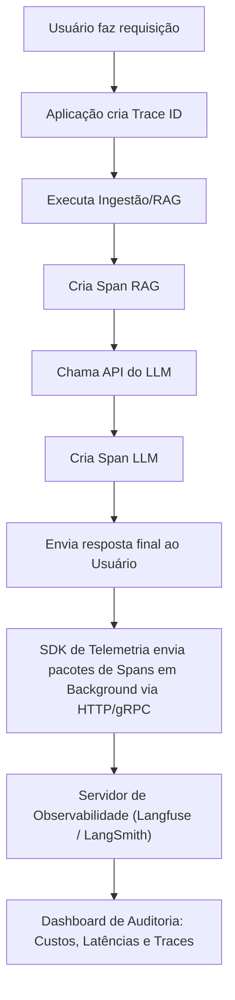

# Observabilidade e Monitoramento

## Objetivo
Ao final deste tópico, o estudante será capaz de projetar sistemas de telemetria para rastrear chamadas de LLMs em produção, analisar traces complexos de múltiplos passos e monitorar métricas operacionais cruciais como latência TTFT (*Time to First Token*), consumo de tokens e erros de APIs.

## Pré-requisitos
- [Avaliação e Testes de LLMs](01-evaluation-and-testing.md)

## Conceitos Fundamentais

Colocar aplicações baseadas em IA generativa em produção exige ferramentas além das tradicionais ferramentas de APM (Application Performance Monitoring) como Datadog ou New Relic. Em IA, precisamos rastrear **o fluxo interno de raciocínio da aplicação**, o que chamamos de **Tracing**.

As principais frentes de monitoramento em LLMOps dividem-se em:

### 1. Traces e Spans (Rastreabilidade)
Quando um usuário faz uma pergunta a um agente, ocorrem múltiplos passos internos invisíveis para o usuário final: a pergunta é reescrita, busca-se vetores no banco, o contexto é montado, o LLM decide chamar uma ferramenta, a ferramenta roda e o LLM gera a resposta.
Uma ferramenta de observabilidade (como LangSmith, Langfuse ou Arize Phoenix) agrupa essas sub-tarefas em uma estrutura de árvore de **Spans** sob um único **Trace ID**. Isso permite rastrear exatamente em qual etapa ocorreu uma falha ou gargalo de latência.

### 2. Métricas Operacionais Críticas

- **TTFT (Time to First Token / Tempo até o Primeiro Token)**: Em interfaces conversacionais com streaming de texto habilitado, o TTFT mede o tempo que o usuário aguarda até ver o primeiro caractere aparecer na tela. É a métrica mais importante para a percepção de performance de velocidade.
- **Tokens por Segundo (Tokens/s)**: A taxa de geração contínua do modelo.
- **Token Usage & Cost (Consumo e Custo de Tokens)**: Rastreamento em tempo real do volume de tokens de entrada e saída consumidos por usuário ou feature, prevenindo abusos financeiros.
- **Métricas de Segurança (Guardrails)**: Detecção em tempo real de tentativas de injeção de prompt ou geração de saídas ofensivas/tóxicas.

---

## Funcionamento Interno

O fluxo de telemetria assíncrona executado pela aplicação para coletar dados operacionais é representado a seguir:



---

## Erros Comuns

1. **Gravar Dados Sensíveis de Usuários (PII)**: Salvar relatórios médicos, CPFs ou dados bancários de usuários nos logs de traces sem nenhuma sanitização ou anonimização. Se o seu servidor de observabilidade for invadido ou residir em servidores terceiros, haverá vazamento de dados críticos. Use bibliotecas de anonimização (ex. Microsoft Presidio) antes de enviar a telemetria.
2. **Telemetria Síncrona / Bloqueante**: Fazer com que a aplicação envie a telemetria e aguarde o OK do servidor de observabilidade antes de devolver a resposta de chat para o usuário. Isso adiciona uma latência de rede extra e desnecessária em todas as requisições. O envio de telemetria deve ser sempre assíncrono e em segundo plano (*background worker*).
3. **Não Configurar Alertas de Rate Limit e Quotas**: Se a sua aplicação sofrer um ataque de negação de serviço (DoS) direcionado à API do LLM, as requisições podem consumir milhares de dólares de chamadas de modelos em poucos minutos. Configure limites estritos nas contas dos provedores de nuvem de IA.

---

## Exemplos

### Exemplo Conceitual de Integração de Telemetria com SDK (Python/Langfuse)
As ferramentas modernas utilizam decorators simples para capturar automaticamente os inputs, outputs e metadados de execução sem alterar a lógica de negócios original:

```python
# Exemplo conceitual usando Langfuse SDK
from langfuse import Langfuse
from langfuse.decorators import observe

# Inicializa o cliente de observabilidade
langfuse = Langfuse(
    public_key="pk-lf-...",
    secret_key="sk-lf-...",
    host="https://cloud.langfuse.com"
)

# O decorator @observe captura automaticamente dados de input, output e tempo de execução da função
@observe()
def executar_fluxo_rag(pergunta):
    # O SDK entende sub-chamadas automaticamente e cria Spans filhos
    dados_banco = buscar_documentos_vetoriais(pergunta)
    
    prompt = f"Responda à pergunta com base no contexto: {dados_banco}\nPergunta: {pergunta}"
    
    resposta = chamar_llm_externa(prompt)
    
    # Podemos anexar tags ou ids de usuários para rastrear custos por cliente
    langfuse.set_user_id("usuario_123")
    langfuse.set_tags(["producao", "modulo_suporte"])
    
    return resposta

def buscar_documentos_vetoriais(query):
    # Simula busca de vetor
    return "Regra 42: O limite diário de saques é de R$ 5.000."

def chamar_llm_externa(prompt):
    # Simula chamada
    return "O limite diário de saques é de R$ 5.000 de acordo com a Regra 42."

# Execução da função principal
resultado = executar_fluxo_rag("Qual meu limite de saque?")
print(resultado)
```

---

## Exercícios

1. **[Arquitetura de Métricas]** Explique a diferença de utilidade entre monitorar TTFT (*Time to First Token*) e o tempo de geração final do modelo. Em quais aplicações do mundo real o TTFT é mais crítico?
2. **[Cenário de Segurança]** Você é o Tech Lead de uma grande rede de hospitais que está lançando uma IA para guiar o trabalho de recepcionistas. Os pacientes descrevem seus sintomas em texto livre na triagem.
   - Proponha uma estratégia técnica para garantir a conformidade com a LGPD (Lei Geral de Proteção de Dados) ao monitorar os traces das conversas do sistema.
3. **[Design de Dashboards]** Liste 4 métricas essenciais que você colocaria em um dashboard de produção para a diretoria financeira de uma empresa monitorar o retorno sobre investimento (ROI) de um agente de IA.

---

## Referências
- [Langfuse Documentation](https://langfuse.com/docs) — Plataforma aberta de engenharia e observabilidade para LLMs.
- [LangSmith Guide by LangChain](https://docs.smith.langchain.com/) — Ferramenta nativa de testes e monitoramento da LangChain.
- [OpenTelemetry Specification for LLMs](https://opentelemetry.io/docs/specs/semconv/gen-ai/) — Padrão universal emergente de semântica e telemetria para IA Generativa.
