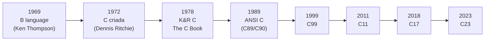
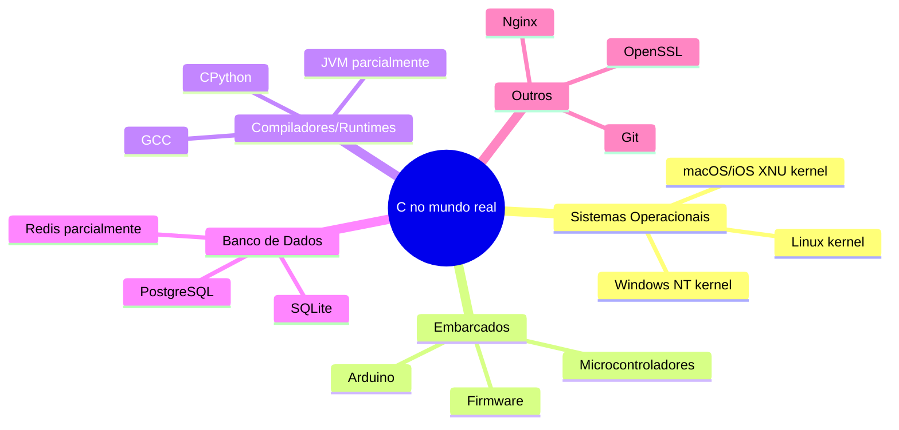
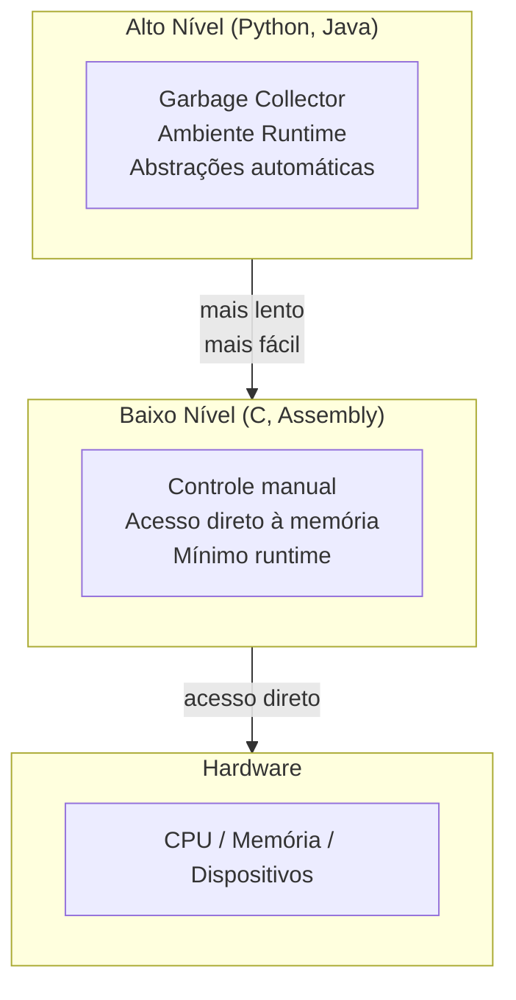
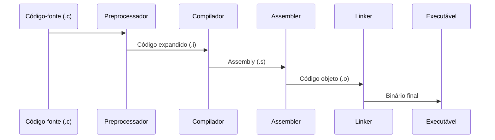

# Introdução à Linguagem C

## Objetivo

Compreender o contexto histórico da linguagem C, suas características fundamentais, por que ela ainda é relevante e onde é aplicada no mundo real.

## Pré-requisitos

- Nenhum pré-requisito técnico em C.
- Conhecimento básico de lógica de programação é útil.

## Conceitos Fundamentais

### O que é C?

C é uma linguagem de programação imperativa, de propósito geral, com tipagem estática e acesso direto à memória. Foi criada por **Dennis Ritchie** nos Laboratórios Bell (Bell Labs) entre **1969 e 1973**, originalmente para reescrever o sistema operacional Unix.

### Linha do Tempo



### Por que C ainda é relevante?

| Característica | Impacto |
|---|---|
| **Desempenho** | Código próximo ao hardware, mínimo overhead |
| **Portabilidade** | Compiladores para praticamente toda arquitetura existente |
| **Controle** | Gerenciamento manual de memória e acesso a hardware |
| **Influência** | C++, Java, Go, Rust, Python têm raízes ou influências diretas de C |
| **Legado** | Enormes bases de código em C existem e precisam de manutenção |

### Onde C é utilizado



### C vs Linguagens de Alto Nível



### Padrões da Linguagem

| Padrão | Ano | Principais adições |
|--------|-----|--------------------|
| K&R C | 1978 | Definição original |
| C89/C90 | 1989/1990 | Primeiro padrão ANSI/ISO |
| C99 | 1999 | `//` comentários, `bool`, VLAs, `stdint.h` |
| C11 | 2011 | Threads, atomics, `_Generic` |
| C17 | 2018 | Correções de bugs do C11 |
| C23 | 2023 | `nullptr`, `typeof`, `_BitInt` |

### O Modelo de Compilação



## Casos de Uso

- **Sistemas operacionais**: O kernel do Linux tem ~30 milhões de linhas de C.
- **Dispositivos embarcados**: Pacemakers, ECUs de automóveis, roteadores.
- **Jogos**: Motores de física e renderização frequentemente têm núcleo em C/C++.
- **Criptografia**: OpenSSL, libsodium.
- **Intérpretes de outras linguagens**: CPython (Python), mruby (Ruby).

## Vantagens

- Desempenho próximo ao Assembly sem complexidade de Assembly.
- Portabilidade: compila em praticamente qualquer hardware.
- Controle total sobre alocação e layout de memória.
- Biblioteca padrão mínima e previsível.
- Excelente para entender como computadores realmente funcionam.

## Desvantagens

- Sem garbage collector: gerenciamento manual de memória é propenso a erros.
- Sem verificação de bounds em arrays por padrão.
- Sem tipos genéricos nativos (sem templates como C++).
- Código mais verboso para tarefas comuns comparado a Python, Java, etc.
- Undefined behavior: erros sutis podem ser silenciosos e catastróficos.

## Erros Comuns

1. **Confundir C com C++**: São linguagens distintas. C++ é um superconjunto de C com recursos adicionais, mas não são intercambiáveis.
2. **Assumir que C é inseguro por natureza**: C é *difícil de usar com segurança*, mas é possível escrever código C seguro e correto.
3. **Ignorar o padrão**: Código que funciona em um compilador pode falhar em outro se depender de comportamento não especificado.

## Exemplos

### Primeiro programa em C

```c
#include <stdio.h>   /* inclui a biblioteca de I/O padrão */

int main(void) {
    printf("Hello, World!\n");
    return 0;        /* 0 indica execução bem-sucedida */
}
```

**Compilar e executar:**
```bash
gcc -Wall -std=c11 -o hello hello.c
./hello
```

### Programa que mostra o padrão do compilador

```c
#include <stdio.h>

int main(void) {
#if defined(__STDC_VERSION__)
    printf("Padrão C: %ld\n", __STDC_VERSION__);
#else
    printf("Padrão antigo (antes de C89)\n");
#endif
    return 0;
}
```

## Contexto Histórico

- **1969**: Ken Thompson cria a linguagem B para o PDP-7 da Bell Labs.
- **1972**: Dennis Ritchie evolui B para C, com tipos de dados.
- **1973**: O kernel Unix é reescrito em C, tornando-o portável.
- **1978**: Kernighan e Ritchie publicam *The C Programming Language* (K&R C).
- **1983**: O comitê ANSI começa a padronizar C.
- **1989**: C89 (ANSI C) — o padrão mais universalmente suportado.
- **1999**: C99 traz melhorias significativas de ergonomia.
- **2011**: C11 adiciona suporte nativo a threads e operações atômicas.

## Exercícios

1. **(Iniciante)** Instale GCC em sua máquina e compile o programa "Hello, World!". Verifique a versão do compilador com `gcc --version`.
2. **(Iniciante)** Modifique o programa para imprimir seu nome e a data atual.
3. **(Intermediário)** Pesquise as diferenças entre C89, C99 e C11. Liste pelo menos 3 funcionalidades adicionadas em cada versão.
4. **(Avançado)** Compile o mesmo código com `-std=c89`, `-std=c99` e `-std=c11`. Observe quais warnings/erros aparecem em cada modo.

## Referências

- [The C Programming Language — Kernighan & Ritchie](https://en.wikipedia.org/wiki/The_C_Programming_Language)
- [ISO/IEC 9899 — Padrão C](https://www.iso.org/standard/74528.html)
- [História do Unix e da linguagem C — Bell Labs](https://www.bell-labs.com/usr/dmr/www/chist.html)
- [cppreference — C Language Reference](https://en.cppreference.com/w/c/language)
