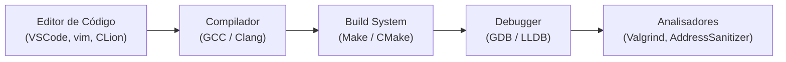
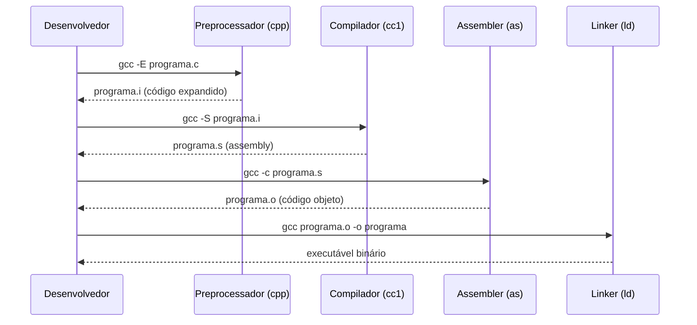

# Ambiente de Desenvolvimento

## Objetivo

Configurar um ambiente completo para programar em C: instalar compilador, editor de código e ferramentas auxiliares, e entender o fluxo básico de compilação.

## Pré-requisitos

- [Introdução à linguagem C](./01-introduction.md)
- Acesso ao terminal/linha de comando

## Conceitos Fundamentais

### Componentes do Ambiente



### Compiladores mais comuns

| Compilador | Descrição | Plataforma |
|---|---|---|
| **GCC** (GNU Compiler Collection) | Mais utilizado, referência em Linux | Linux, macOS, Windows (MinGW) |
| **Clang** (LLVM) | Mensagens de erro melhores, base do Xcode | macOS, Linux, Windows |
| **MSVC** | Compilador da Microsoft | Windows |
| **TCC** (Tiny C Compiler) | Extremamente rápido, leve | Linux, Windows |

---

### Instalação por Sistema Operacional

#### macOS

```bash
# Instalar Xcode Command Line Tools (inclui Clang e make)
xcode-select --install

# Verificar instalação
clang --version
gcc --version   # no macOS, gcc pode ser alias para clang

# Instalar GCC "real" via Homebrew (opcional)
brew install gcc
gcc-14 --version
```

#### Linux (Ubuntu/Debian)

```bash
# Instalar GCC e ferramentas essenciais
sudo apt update
sudo apt install build-essential gdb valgrind

# Verificar
gcc --version
gdb --version
```

#### Windows

```bash
# Opção 1: WSL2 (Windows Subsystem for Linux) — RECOMENDADO
# Instalar WSL2 e Ubuntu, depois seguir instruções do Linux

# Opção 2: MinGW-w64 via MSYS2
# Baixar e instalar MSYS2 de https://www.msys2.org/
pacman -S mingw-w64-x86_64-gcc

# Opção 3: Usar o compilador do Visual Studio
```

---

### Editores e IDEs

| Ferramenta | Tipo | Recomendado para |
|---|---|---|
| **VSCode** + extensão C/C++ | Editor leve | Iniciantes e intermediários |
| **CLion** (JetBrains) | IDE completa | Projetos maiores |
| **vim/neovim** + clangd | Editor avançado | Desenvolvedores experientes |
| **Emacs** + ccls | Editor avançado | Desenvolvedores experientes |

**Configuração mínima do VSCode:**
1. Instale a extensão `C/C++` (Microsoft).
2. Instale a extensão `clangd` para completar código avançado (opcional).
3. Crie um arquivo `tasks.json` para compilação integrada.

---

### O Fluxo de Compilação Detalhado



**Atalho**: `gcc programa.c -o programa` faz tudo de uma vez.

---

### Flags Essenciais do GCC

```bash
# Compilação básica
gcc programa.c -o programa

# Ativar todos os warnings importantes
gcc -Wall -Wextra programa.c -o programa

# Tratar warnings como erros
gcc -Wall -Werror programa.c -o programa

# Usar padrão C11 com todos os warnings
gcc -std=c11 -Wall -Wextra -Wpedantic programa.c -o programa

# Compilar com símbolos de debug (para GDB)
gcc -g programa.c -o programa

# Compilar com otimização
gcc -O2 programa.c -o programa
```

---

### Estrutura de um Projeto Simples

```
meu-projeto/
├── src/
│   ├── main.c
│   └── utils.c
├── include/
│   └── utils.h
├── Makefile
└── README.md
```

**Makefile mínimo:**
```makefile
CC = gcc
CFLAGS = -std=c11 -Wall -Wextra -g

programa: src/main.c src/utils.c
	$(CC) $(CFLAGS) -Iinclude src/main.c src/utils.c -o programa

clean:
	rm -f programa
```

## Erros Comuns

1. **`gcc: command not found`**: Compilador não instalado ou não está no PATH.
2. **Esquecer de recompilar**: Após editar o código, é necessário recompilar antes de executar.
3. **Confundir arquivo fonte com executável**: `./programa.c` não funciona; execute `./programa`.
4. **Não usar `-Wall`**: Sem essa flag, o compilador suprime muitos avisos úteis.

## Exemplos

### Verificar o ambiente completo

```bash
# Verificar versões
gcc --version
make --version
gdb --version

# Compilar e executar o Hello World
echo '#include <stdio.h>
int main(void) {
    printf("Ambiente funcionando!\n");
    return 0;
}' > teste.c

gcc -std=c11 -Wall -o teste teste.c
./teste

# Limpar
rm teste teste.c
```

### Ver as etapas de compilação individualmente

```bash
# 1. Preprocessamento
gcc -E hello.c -o hello.i

# 2. Compilação para assembly
gcc -S hello.i -o hello.s

# 3. Montagem (assembly -> objeto)
gcc -c hello.s -o hello.o

# 4. Linkagem
gcc hello.o -o hello

# Verificar tamanho de cada arquivo gerado
ls -lh hello.i hello.s hello.o hello
```

## Exercícios

1. **(Iniciante)** Instale GCC/Clang em sua máquina. Compile e execute o programa "Hello, World!".
2. **(Iniciante)** Compile com `-Wall -Wextra` e observe os warnings gerados para o código:
   ```c
   int main() { int x; printf("%d", x); }
   ```
3. **(Intermediário)** Configure o VSCode com a extensão C/C++ e configure um `tasks.json` para compilar com `Ctrl+Shift+B`.
4. **(Intermediário)** Execute as 4 etapas de compilação separadamente e examine o arquivo `.s` (assembly) gerado.
5. **(Avançado)** Crie um Makefile para um projeto com dois arquivos `.c` e um `.h`. Configure alvos `all`, `clean` e `debug`.

## Referências

- [GCC Manual](https://gcc.gnu.org/onlinedocs/)
- [Clang Documentation](https://clang.llvm.org/docs/)
- [VSCode C/C++ Extension](https://marketplace.visualstudio.com/items?itemName=ms-vscode.cpptools)
- [MSYS2 (GCC no Windows)](https://www.msys2.org/)
