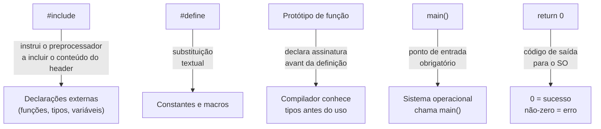
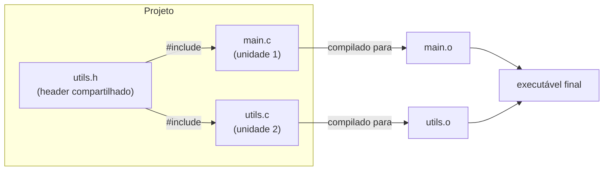
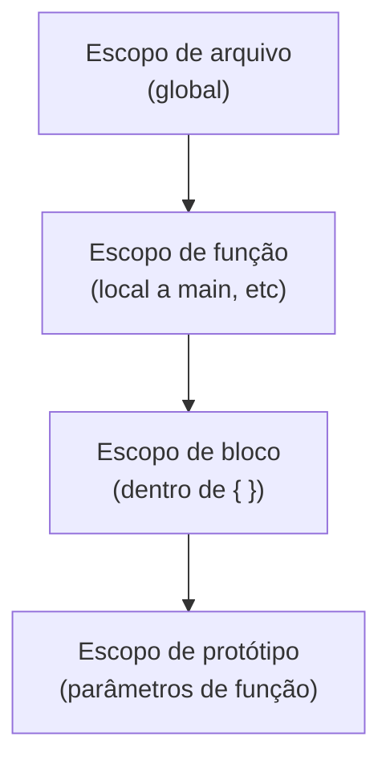

# Estrutura de um Programa C

## Objetivo

Entender todos os elementos que compõem um programa C: diretivas de preprocessador, declarações, definições, funções, e como o compilador os organiza.

## Pré-requisitos

- [Introdução à linguagem C](./01-introduction.md)
- [Ambiente de desenvolvimento](./02-setup.md)

## Conceitos Fundamentais

### Anatomia de um programa C

```c
/* 1. Comentário de bloco — ignorado pelo compilador */

// 2. Diretivas de preprocessador
#include <stdio.h>    /* biblioteca padrão de I/O */
#include <stdlib.h>   /* malloc, free, exit */

// 3. Constante global com macro
#define MAX_TAMANHO 100

// 4. Declaração de função (protótipo)
int somar(int a, int b);

// 5. Ponto de entrada do programa
int main(void) {
    // 6. Variáveis locais
    int resultado;

    // 7. Chamada de função
    resultado = somar(3, 4);

    // 8. I/O padrão
    printf("Resultado: %d\n", resultado);

    // 9. Valor de retorno
    return 0;
}

// 10. Definição da função
int somar(int a, int b) {
    return a + b;
}
```

### O que cada parte faz



---

### A função `main`

A função `main` é o ponto de entrada de qualquer programa C. Existem duas formas válidas pelo padrão:

```c
// Forma 1: sem argumentos
int main(void) {
    return 0;
}

// Forma 2: com argumentos de linha de comando
int main(int argc, char *argv[]) {
    // argc: número de argumentos
    // argv: array de strings com os argumentos
    // argv[0] é sempre o nome do programa
    return 0;
}
```

**Valor de retorno de `main`:**
| Valor | Significado |
|-------|-------------|
| `0` | Sucesso (`EXIT_SUCCESS`) |
| `1` (ou qualquer não-zero) | Falha (`EXIT_FAILURE`) |

---

### Unidades de Tradução

Um programa C é composto por **unidades de tradução** (translation units). Cada arquivo `.c` é uma unidade de tradução.



**Headers (`.h`)** contêm declarações compartilhadas entre unidades de tradução.
**Arquivos fonte (`.c`)** contêm as definições (implementações).

---

### Headers: declaração vs definição

```c
/* utils.h — DECLARAÇÕES */
#ifndef UTILS_H   /* include guard */
#define UTILS_H

int multiplicar(int a, int b);   /* declaração: só a assinatura */

#endif /* UTILS_H */
```

```c
/* utils.c — DEFINIÇÕES */
#include "utils.h"

int multiplicar(int a, int b) {  /* definição: o corpo da função */
    return a * b;
}
```

```c
/* main.c — USO */
#include <stdio.h>
#include "utils.h"   /* aspas = header local; <> = header do sistema */

int main(void) {
    printf("%d\n", multiplicar(6, 7));
    return 0;
}
```

---

### Comentários

```c
/* Comentário de bloco: pode ocupar múltiplas linhas.
   Disponível desde K&R C. */

// Comentário de linha: vai até o fim da linha.
// Disponível a partir de C99.
```

---

### Tipos de escopo



## Funcionamento Interno

### O que o preprocessador faz com `#include`

O preprocessador substitui `#include <stdio.h>` pelo conteúdo textual completo do arquivo `stdio.h`. Por isso, o arquivo `.i` (após preprocessamento) pode ter milhares de linhas, mesmo para um programa simples.

```bash
# Ver o resultado do preprocessamento
gcc -E main.c | wc -l   # conta as linhas expandidas
```

## Erros Comuns

1. **Esquecer o ponto e vírgula**: Em C, toda instrução termina com `;`.
2. **Definir função após o uso sem protótipo**: O compilador precisa conhecer a assinatura antes do primeiro uso.
3. **`#include` sem include guard**: Incluir o mesmo header múltiplas vezes causa erros de redefinição.
4. **Confundir `main` sem retorno**: Mesmo que funcione em alguns compiladores, `main` deve retornar `int`.
5. **Usar `void main()`**: Não é padrão C. Use sempre `int main(void)` ou `int main(int argc, char *argv[])`.

## Exemplos

### Programa com múltiplos arquivos

**`calculo.h`:**
```c
#ifndef CALCULO_H
#define CALCULO_H

double potencia(double base, int expoente);

#endif
```

**`calculo.c`:**
```c
#include "calculo.h"

double potencia(double base, int expoente) {
    double resultado = 1.0;
    for (int i = 0; i < expoente; i++) {
        resultado *= base;
    }
    return resultado;
}
```

**`main.c`:**
```c
#include <stdio.h>
#include "calculo.h"

int main(void) {
    printf("2^10 = %.0f\n", potencia(2.0, 10));
    return 0;
}
```

**Compilar:**
```bash
gcc -std=c11 -Wall main.c calculo.c -o calculadora
./calculadora
# Output: 2^10 = 1024
```

### Usando argumentos de linha de comando

```c
#include <stdio.h>
#include <stdlib.h>

int main(int argc, char *argv[]) {
    if (argc < 3) {
        fprintf(stderr, "Uso: %s <num1> <num2>\n", argv[0]);
        return EXIT_FAILURE;
    }

    int a = atoi(argv[1]);
    int b = atoi(argv[2]);
    printf("%d + %d = %d\n", a, b, a + b);

    return EXIT_SUCCESS;
}
```

```bash
gcc -o soma soma.c
./soma 10 32
# Output: 10 + 32 = 42
```

## Exercícios

1. **(Iniciante)** Crie um programa com dois arquivos: `main.c` e `saudacao.c`. Em `saudacao.c`, defina uma função `void saudar(char *nome)` que imprime "Olá, [nome]!". Crie o header correspondente e chame a função em `main.c`.
2. **(Intermediário)** Crie um programa que recebe o nome do usuário como argumento de linha de comando e o saúda. Se nenhum argumento for passado, exiba uma mensagem de uso.
3. **(Intermediário)** Adicione include guards ao header do exercício 1 e verifique o que acontece se você incluir o header duas vezes sem eles.
4. **(Avançado)** Examine o arquivo `.i` gerado por `gcc -E main.c` e identifique onde os conteúdos de `stdio.h` foram inseridos.

## Referências

- [cppreference — Translation unit](https://en.cppreference.com/w/c/language/translation_phases)
- [GCC — Preprocessor](https://gcc.gnu.org/onlinedocs/cpp/)
- [K&R — Chapter 1: A Tutorial Introduction](https://en.wikipedia.org/wiki/The_C_Programming_Language)
