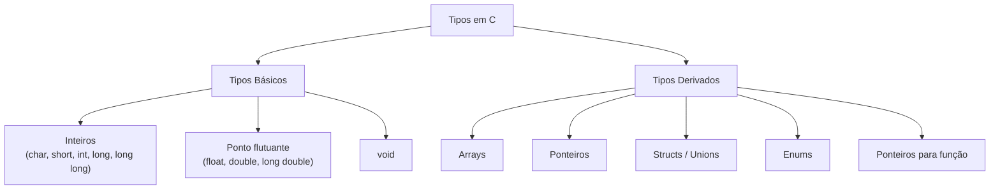

# Tipos de Dados, Variáveis e Constantes

## Objetivo

Dominar o sistema de tipos da linguagem C: tipos primitivos, suas representações em memória, variáveis, qualificadores e constantes. Compreender como a escolha de tipos afeta o comportamento e o desempenho do programa.

## Pré-requisitos

- [Estrutura de um programa C](./03-program-structure.md)

## Conceitos Fundamentais

### Sistema de Tipos de C

C é uma linguagem **estaticamente tipada**: o tipo de toda variável deve ser conhecido em tempo de compilação.



---

### Tipos Inteiros

| Tipo | Tamanho mínimo | Faixa (tipicamente em 64-bit) |
|------|---------------|-------------------------------|
| `char` | 1 byte | -128 a 127 (ou 0 a 255) |
| `unsigned char` | 1 byte | 0 a 255 |
| `short` | 2 bytes | -32.768 a 32.767 |
| `unsigned short` | 2 bytes | 0 a 65.535 |
| `int` | 2 bytes (mín.) | -2.147.483.648 a 2.147.483.647 (4 bytes) |
| `unsigned int` | 2 bytes (mín.) | 0 a 4.294.967.295 (4 bytes) |
| `long` | 4 bytes | -2³¹ a 2³¹−1 (32-bit) ou -2⁶³ a 2⁶³−1 (64-bit) |
| `long long` | 8 bytes | -2⁶³ a 2⁶³−1 |
| `size_t` | plataforma | Sem sinal, tamanho suficiente para qualquer objeto |

> ⚠️ Os tamanhos **não são fixos** em C — dependem da plataforma e do compilador. Use `<stdint.h>` para tipos de tamanho garantido.

### Tipos de tamanho fixo (`<stdint.h>`)

```c
#include <stdint.h>

int8_t   x = 127;         /* exatamente 8 bits com sinal */
uint8_t  y = 255;         /* exatamente 8 bits sem sinal */
int16_t  a = -32768;      /* exatamente 16 bits com sinal */
uint32_t b = 4294967295U; /* exatamente 32 bits sem sinal */
int64_t  c = -1LL;        /* exatamente 64 bits com sinal */
```

---

### Tipos de Ponto Flutuante

| Tipo | Tamanho | Precisão |
|------|---------|----------|
| `float` | 4 bytes | ~7 dígitos decimais |
| `double` | 8 bytes | ~15 dígitos decimais |
| `long double` | 10–16 bytes | Depende da plataforma |

```c
float  pi_f = 3.14159f;       /* sufixo 'f' para float */
double pi_d = 3.14159265358979;
long double pi_ld = 3.14159265358979L; /* sufixo 'L' */
```

---

### Tipo `char` e Caracteres

`char` representa um único byte. Em C, strings são arrays de `char`:

```c
char letra = 'A';          /* literal de caractere: aspas simples */
char codigo = 65;          /* mesmo que 'A' (código ASCII) */
unsigned char byte = 0xFF; /* byte sem sinal */
```

---

### Declaração e Inicialização de Variáveis

```c
/* Declaração sem inicialização (valor indeterminado!) */
int x;

/* Declaração com inicialização */
int y = 10;
double pi = 3.14159;
char inicial = 'G';

/* Múltiplas variáveis do mesmo tipo */
int a = 1, b = 2, c = 3;

/* Variável não inicializada é UNDEFINED BEHAVIOR se lida */
int z;
printf("%d\n", z); /* ERRADO! valor indeterminado */
```

---

### Qualificadores de Tipo

#### `const` — imutabilidade

```c
const int MAX = 100;      /* não pode ser modificado */
const double PI = 3.14159;

/* Ponteiro para const: não pode modificar o valor apontado */
const int *p = &x;
*p = 5; /* ERRO de compilação */

/* Ponteiro const: não pode mudar para onde aponta */
int * const q = &x;
q = &y; /* ERRO de compilação */
```

#### `volatile` — sem otimização

```c
/* Usado para variáveis que podem mudar externamente:
   hardware, interrupções, outra thread */
volatile int sensor_valor;
```

#### `restrict` (C99) — sem aliasing

```c
/* Informa ao compilador que este ponteiro é o único
   caminho de acesso àquela região de memória */
void copiar(int * restrict dest, const int * restrict src, size_t n);
```

---

### Constantes

#### Constantes literais

```c
42          /* int */
42U         /* unsigned int */
42L         /* long */
42LL        /* long long */
3.14        /* double */
3.14f       /* float */
'A'         /* char (valor 65) */
"texto"     /* string literal (const char[]) */
0x1F        /* hexadecimal (31 em decimal) */
017         /* octal (15 em decimal) */
0b0001111   /* binário — extensão GCC, C23 padrão */
```

#### Macros com `#define`

```c
#define PI 3.14159        /* substituição textual — sem tipo */
#define MAX(a, b) ((a) > (b) ? (a) : (b))  /* macro com argumento */
```

#### `enum` como constantes inteiras

```c
enum Cor { VERMELHO, VERDE, AZUL }; /* VERMELHO=0, VERDE=1, AZUL=2 */
enum Status { OK = 200, NOT_FOUND = 404, ERROR = 500 };
```

#### `const` vs `#define`

| Aspecto | `const` | `#define` |
|---------|---------|-----------|
| Tem tipo | Sim | Não |
| Visível no debugger | Sim | Não |
| Pode ter escopo | Sim | Não (global) |
| Pode ser ponteiro | Sim | Não trivialmente |

---

### Conversão de Tipos

#### Conversão implícita (coerção)

```c
int i = 3;
double d = i;     /* int promovido para double: 3.0 */
int j = 3.9;      /* double truncado para int: 3 (não arredondado!) */
```

#### Conversão explícita (cast)

```c
double resultado = (double)5 / 2;  /* 2.5, não 2 */
int truncado = (int)3.99;          /* 3 */
unsigned char byte = (unsigned char)300; /* 44 — overflow! */
```

---

### Verificando tamanhos com `sizeof`

```c
#include <stdio.h>

int main(void) {
    printf("char:        %zu bytes\n", sizeof(char));
    printf("short:       %zu bytes\n", sizeof(short));
    printf("int:         %zu bytes\n", sizeof(int));
    printf("long:        %zu bytes\n", sizeof(long));
    printf("long long:   %zu bytes\n", sizeof(long long));
    printf("float:       %zu bytes\n", sizeof(float));
    printf("double:      %zu bytes\n", sizeof(double));
    printf("pointer:     %zu bytes\n", sizeof(void *));
    return 0;
}
```

## Funcionamento Interno

### Representação em Memória

Um `int` de 32 bits com valor `42` (decimal = `0x0000002A` em hex):

```
Endereço:  0x1000  0x1001  0x1002  0x1003
           ┌──────┬──────┬──────┬──────┐
           │ 0x2A │ 0x00 │ 0x00 │ 0x00 │  (little-endian)
           └──────┴──────┴──────┴──────┘
```

### Integer Overflow

Tipos com sinal têm **undefined behavior** em overflow. Tipos sem sinal têm overflow "bem definido" (módulo 2ⁿ):

```c
int max = INT_MAX;      /* 2147483647 */
int overflow = max + 1; /* UB! pode ser negativo, pode travar */

unsigned int umax = UINT_MAX;      /* 4294967295 */
unsigned int wrap = umax + 1;      /* 0 — bem definido */
```

## Erros Comuns

1. **Ler variável não inicializada**: Undefined behavior. Sempre inicialize.
2. **Usar `int` onde `size_t` é esperado**: Comparar `int` com resultado de `sizeof` ou `strlen` pode causar surpresas.
3. **Overflow silencioso**: Especialmente em tipos `char` e `short` com operações.
4. **Confundir `char` com `int`**: Em expressões, `char` é promovido para `int` automaticamente.
5. **Truncamento de `double` para `int`**: O valor é truncado, não arredondado.

## Exemplos

### Demonstração completa de tipos

```c
#include <stdio.h>
#include <stdint.h>
#include <limits.h>   /* INT_MAX, CHAR_MIN, etc. */
#include <float.h>    /* FLT_MAX, DBL_MAX, etc. */

int main(void) {
    printf("=== Inteiros ===\n");
    printf("char:      %d a %d\n", CHAR_MIN, CHAR_MAX);
    printf("int:       %d a %d\n", INT_MIN, INT_MAX);
    printf("long long: %lld a %lld\n", LLONG_MIN, LLONG_MAX);

    printf("\n=== Ponto Flutuante ===\n");
    printf("float:  %.7g\n", FLT_MAX);
    printf("double: %.15g\n", DBL_MAX);

    printf("\n=== Tipos fixos (stdint.h) ===\n");
    uint8_t  u8 = 255;
    int32_t  i32 = -2147483648;
    printf("uint8_t:  %u\n", u8);
    printf("int32_t: %d\n", i32);

    return 0;
}
```

### Cuidado com divisão inteira

```c
#include <stdio.h>

int main(void) {
    int a = 7, b = 2;

    printf("int/int:      %d\n",   a / b);       /* 3 (truncado) */
    printf("double/int:   %.1f\n", (double)a / b); /* 3.5 */
    printf("int/double:   %.1f\n", a / (double)b); /* 3.5 */

    return 0;
}
```

## Exercícios

1. **(Iniciante)** Declare variáveis de cada tipo básico, inicialize-as e imprima seus valores com `printf`. Use o especificador correto para cada tipo (`%d`, `%u`, `%f`, `%lf`, `%c`, etc.).
2. **(Iniciante)** Use `sizeof` para imprimir o tamanho de cada tipo na sua máquina. Compare com os valores esperados.
3. **(Intermediário)** Demonstre o efeito de overflow: some 1 ao maior valor de `int` e imprima. Faça o mesmo com `unsigned int`. Explique a diferença.
4. **(Intermediário)** Escreva uma função que recebe dois inteiros e retorna a divisão como `double`. Teste com valores como 7/2 e 1/3.
5. **(Avançado)** Use `<limits.h>` e `<float.h>` para imprimir os valores mínimos e máximos de todos os tipos numéricos. Compare os resultados entre uma máquina 32-bit e 64-bit (use uma VM ou compilador cruzado).

## Referências

- [cppreference — Fundamental types](https://en.cppreference.com/w/c/language/arithmetic_types)
- [cppreference — stdint.h](https://en.cppreference.com/w/c/types/integer)
- [cppreference — limits.h](https://en.cppreference.com/w/c/types/limits)
- [SEI CERT C — INT32-C. Ensure integer operations do not result in overflow](https://wiki.sei.cmu.edu/confluence/display/c/INT32-C)
