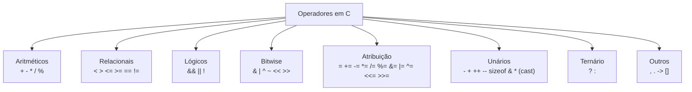

# Operadores

## Objetivo

Conhecer todos os operadores da linguagem C, sua precedência, associatividade e comportamento, incluindo os operadores bitwise e os menos conhecidos.

## Pré-requisitos

- [Tipos de dados, variáveis e constantes](./04-types-and-variables.md)

## Conceitos Fundamentais

### Categorias de Operadores



---

### Operadores Aritméticos

```c
int a = 17, b = 5;

int soma     = a + b;   /* 22 */
int sub      = a - b;   /* 12 */
int prod     = a * b;   /* 85 */
int quocient = a / b;   /* 3  (divisão inteira, trunca) */
int resto    = a % b;   /* 2  (módulo) */
```

> ⚠️ Divisão inteira **trunca** em direção ao zero: `-7 / 2 == -3` (não `-4`).

---

### Operadores Relacionais e Lógicos

```c
int x = 5, y = 10;

/* Relacionais — retornam 0 (falso) ou 1 (verdadeiro) */
x < y     /* 1 */
x > y     /* 0 */
x <= 5    /* 1 */
x >= 5    /* 1 */
x == 5    /* 1 */
x != y    /* 1 */

/* Lógicos — curto-circuito */
x > 0 && y > 0   /* 1 (AND: ambos devem ser verdadeiros) */
x > 0 || y < 0   /* 1 (OR: pelo menos um verdadeiro) */
!(x == 5)        /* 0 (NOT) */
```

**Curto-circuito (short-circuit):**
- `A && B`: se A for falso, B não é avaliado.
- `A || B`: se A for verdadeiro, B não é avaliado.

```c
int *p = NULL;
if (p != NULL && *p > 0) {   /* seguro: *p não é avaliado se p == NULL */
    /* ... */
}
```

---

### Operadores Bitwise

Operam diretamente sobre os bits de inteiros:

| Operador | Nome | Exemplo (`a=0b1010`, `b=0b1100`) |
|---|---|---|
| `&` | AND bit a bit | `a & b = 0b1000` |
| `\|` | OR bit a bit | `a \| b = 0b1110` |
| `^` | XOR bit a bit | `a ^ b = 0b0110` |
| `~` | NOT (complemento) | `~a = 0b...11110101` |
| `<<` | Shift left | `a << 1 = 0b10100` (multiplica por 2) |
| `>>` | Shift right | `a >> 1 = 0b0101` (divide por 2) |

```c
#include <stdio.h>

int main(void) {
    unsigned int flags = 0;          /* 0000 0000 */
    unsigned int BIT_A = 1 << 0;    /* 0000 0001 */
    unsigned int BIT_B = 1 << 1;    /* 0000 0010 */
    unsigned int BIT_C = 1 << 2;    /* 0000 0100 */

    flags |= BIT_A;                  /* setar bit A: 0000 0001 */
    flags |= BIT_C;                  /* setar bit C: 0000 0101 */
    flags &= ~BIT_A;                 /* limpar bit A: 0000 0100 */

    printf("BIT_B ativo? %s\n", (flags & BIT_B) ? "sim" : "não"); /* não */
    printf("BIT_C ativo? %s\n", (flags & BIT_C) ? "sim" : "não"); /* sim */
    return 0;
}
```

---

### Operadores de Atribuição Compostos

```c
int x = 10;
x += 5;   /* x = x + 5  → 15 */
x -= 3;   /* x = x - 3  → 12 */
x *= 2;   /* x = x * 2  → 24 */
x /= 4;   /* x = x / 4  → 6  */
x %= 4;   /* x = x % 4  → 2  */
x <<= 1;  /* x = x << 1 → 4  */
x >>= 1;  /* x = x >> 1 → 2  */
x &= 3;   /* x = x & 3  → 2  */
x |= 1;   /* x = x | 1  → 3  */
x ^= 1;   /* x = x ^ 1  → 2  */
```

---

### Incremento e Decremento

```c
int a = 5;

/* Pré-fixo: incrementa ANTES de usar */
int b = ++a;   /* a=6, b=6 */

/* Pós-fixo: incrementa DEPOIS de usar */
int c = a++;   /* c=6, a=7 */

int d = --a;   /* a=6, d=6 */
int e = a--;   /* e=6, a=5 */
```

---

### Operador Ternário

```c
/* condição ? valor_se_verdadeiro : valor_se_falso */
int max = (a > b) ? a : b;

/* Equivalente a: */
int max2;
if (a > b) max2 = a;
else max2 = b;
```

---

### Operador `sizeof`

```c
size_t tam_int = sizeof(int);         /* tamanho do tipo */
size_t tam_var = sizeof(a);           /* tamanho da variável */
size_t tam_arr = sizeof(array);       /* tamanho total do array */

int arr[10];
size_t n_elementos = sizeof(arr) / sizeof(arr[0]);  /* 10 */
```

> `sizeof` é avaliado em **tempo de compilação** (exceto para VLAs).

---

### Operadores de Ponteiro

```c
int x = 42;
int *p = &x;    /* & = endereço de */
int val = *p;   /* * = dereferência (valor no endereço) */
```

---

### Precedência e Associatividade

Da maior para a menor precedência (simplificado):

| Nível | Operadores | Associatividade |
|-------|-----------|-----------------|
| 1 (mais alto) | `()` `[]` `->` `.` `++` `--` (pós-fixo) | Esquerda → Direita |
| 2 | `++` `--` (pré-fixo) `+` `-` (unário) `!` `~` `*` `&` `sizeof` `(cast)` | Direita → Esquerda |
| 3 | `*` `/` `%` | Esquerda → Direita |
| 4 | `+` `-` | Esquerda → Direita |
| 5 | `<<` `>>` | Esquerda → Direita |
| 6 | `<` `<=` `>` `>=` | Esquerda → Direita |
| 7 | `==` `!=` | Esquerda → Direita |
| 8 | `&` | Esquerda → Direita |
| 9 | `^` | Esquerda → Direita |
| 10 | `\|` | Esquerda → Direita |
| 11 | `&&` | Esquerda → Direita |
| 12 | `\|\|` | Esquerda → Direita |
| 13 | `?:` | Direita → Esquerda |
| 14 (mais baixo) | `=` `+=` `-=` etc. `,` | Direita → Esquerda |

## Erros Comuns

1. **`=` vs `==`**: `if (x = 5)` **atribui** 5 a x e sempre é verdadeiro. Use `if (x == 5)`.
2. **Overflow em shift**: `1 << 31` em `int` de 32 bits é undefined behavior com sinal. Use `1U << 31`.
3. **Shift em número negativo**: `>> ` em valor negativo com sinal é implementation-defined. Use `unsigned`.
4. **Confiar em precedência**: Sempre use parênteses quando a precedência não for óbvia.
5. **Efeitos colaterais indefinidos**: `a[i] = i++` é undefined behavior.

## Exemplos

### Manipulação de bits com flags

```c
#include <stdio.h>

typedef unsigned int Permissoes;

#define LEITURA   (1U << 0)   /* bit 0 */
#define ESCRITA   (1U << 1)   /* bit 1 */
#define EXECUCAO  (1U << 2)   /* bit 2 */

void mostrar_permissoes(Permissoes p) {
    printf("Leitura:  %s\n", (p & LEITURA)  ? "sim" : "não");
    printf("Escrita:  %s\n", (p & ESCRITA)  ? "sim" : "não");
    printf("Execução: %s\n", (p & EXECUCAO) ? "sim" : "não");
}

int main(void) {
    Permissoes arquivo = LEITURA | ESCRITA;   /* 0b011 */
    mostrar_permissoes(arquivo);

    arquivo |= EXECUCAO;                       /* adiciona execução */
    arquivo &= ~ESCRITA;                       /* remove escrita */

    printf("\nApós modificação:\n");
    mostrar_permissoes(arquivo);
    return 0;
}
```

### Troca de valores sem variável auxiliar (XOR swap)

```c
int a = 5, b = 10;

a ^= b;   /* a = a XOR b */
b ^= a;   /* b = b XOR (a XOR b) = a */
a ^= b;   /* a = (a XOR b) XOR a = b */

printf("a=%d, b=%d\n", a, b);   /* a=10, b=5 */
```

## Exercícios

1. **(Iniciante)** Escreva um programa que lê dois inteiros e imprime os resultados de todos os operadores aritméticos.
2. **(Iniciante)** Use o operador ternário para determinar se um número é par ou ímpar e imprimir a mensagem correspondente.
3. **(Intermediário)** Implemente uma máscara de bits para representar os dias da semana em que uma tarefa recorrente acontece. Use os operadores bitwise para adicionar, remover e verificar dias.
4. **(Intermediário)** Demonstre o efeito da diferença entre `&&` e `&` em uma expressão curto-circuitada onde o segundo operando causa efeito colateral.
5. **(Avançado)** Escreva uma função que conta o número de bits `1` em um inteiro sem sinal (popcount) usando apenas operadores bitwise.

## Referências

- [cppreference — Expressions and operators](https://en.cppreference.com/w/c/language/expressions)
- [cppreference — Operator precedence](https://en.cppreference.com/w/c/language/operator_precedence)
- [Bit Twiddling Hacks](https://graphics.stanford.edu/~seander/bithacks.html)
