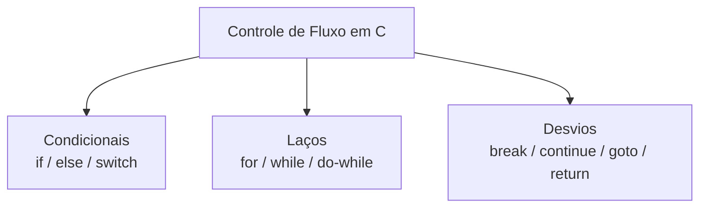
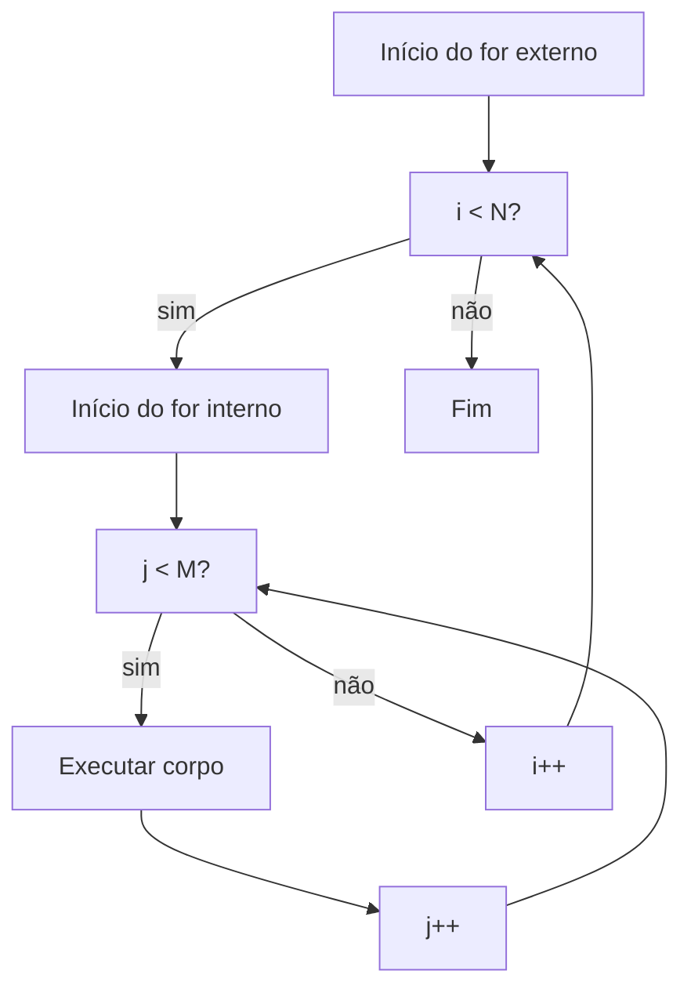

# Controle de Fluxo

## Objetivo

Dominar todas as estruturas de controle de fluxo em C: condicionais, laços, desvios e como usá-las de forma eficiente e legível.

## Pré-requisitos

- [Operadores](./05-operators.md)

## Conceitos Fundamentais

### Estruturas de Controle



---

### Condicional `if / else`

```c
int x = 42;

if (x > 0) {
    printf("positivo\n");
} else if (x < 0) {
    printf("negativo\n");
} else {
    printf("zero\n");
}
```

**Expressão condicional em C:** qualquer valor diferente de `0` é **verdadeiro**; `0` é **falso**.

```c
int p = NULL; /* 0 é falso */
if (p) { /* nunca entra aqui — p é NULL (0) */ }

int n = -5;
if (n) { /* entra aqui — n é não-zero */ }
```

#### `if` sem chaves — armadilha clássica

```c
/* ERRADO — a indentação engana, mas else pertence ao if interno */
if (a > 0)
    if (b > 0)
        printf("ambos positivos\n");
else
    printf("a <= 0\n");   /* else do if (b > 0), não do if (a > 0)! */

/* CORRETO — sempre use chaves */
if (a > 0) {
    if (b > 0) {
        printf("ambos positivos\n");
    }
} else {
    printf("a <= 0\n");
}
```

---

### `switch`

```c
int opcao = 2;

switch (opcao) {
    case 1:
        printf("opção um\n");
        break;   /* sem break: cai para o próximo case! */
    case 2:
        printf("opção dois\n");
        break;
    case 3:
    case 4:
        printf("opção três ou quatro\n");  /* fallthrough intencional */
        break;
    default:
        printf("opção inválida\n");
}
```

> `switch` funciona apenas com tipos inteiros (`int`, `char`, `enum`). Não funciona com `float`, `string` ou `struct`.

**Fallthrough intencional (C17+):** use o atributo `[[fallthrough]]` (C23) ou comentário `/* fallthrough */` para indicar que o fallthrough é intencional.

---

### Laço `for`

```c
/* for (inicialização; condição; incremento) */
for (int i = 0; i < 10; i++) {
    printf("%d\n", i);
}

/* Múltiplas variáveis (C99+) */
for (int i = 0, j = 9; i < j; i++, j--) {
    printf("i=%d j=%d\n", i, j);
}

/* Loop infinito */
for (;;) {
    /* sair com break */
}
```

---

### Laço `while`

```c
int i = 0;
while (i < 10) {
    printf("%d\n", i);
    i++;
}

/* Condição verificada ANTES de executar o corpo */
while (0) {
    /* nunca executado */
}
```

---

### Laço `do-while`

```c
int i = 0;
do {
    printf("%d\n", i);
    i++;
} while (i < 10);

/* Condição verificada DEPOIS — garante ao menos uma execução */
do {
    printf("executado pelo menos uma vez\n");
} while (0);
```

#### Quando usar cada laço

| Laço | Use quando |
|------|-----------|
| `for` | Número de iterações é conhecido |
| `while` | Número de iterações é desconhecido, verifica antes |
| `do-while` | Corpo deve executar pelo menos uma vez |

---

### `break` e `continue`

```c
for (int i = 0; i < 10; i++) {
    if (i == 3) continue;  /* pula para a próxima iteração */
    if (i == 7) break;     /* sai do laço completamente */
    printf("%d ", i);      /* imprime: 0 1 2 4 5 6 */
}
```

`break` e `continue` afetam apenas o laço/switch **mais interno**.

---

### `goto` — desvio incondicional

```c
/* goto é raramente justificado. Usos legítimos:
   - Saída de múltiplos loops aninhados
   - Limpeza de recursos em caso de erro */

int resultado = processar();
if (resultado < 0) goto erro;

/* ... código normal ... */
goto fim;

erro:
    fprintf(stderr, "Erro ao processar\n");
    limpar_recursos();

fim:
    return resultado;
```

> Use `goto` com extrema parcimônia. Prefira refatorar o código para eliminar a necessidade.

---

### Fluxo de controle em laços aninhados



Para sair de múltiplos loops, pode-se usar:
1. Uma variável de controle (`int saiu = 0`)
2. `goto` (caso justificado)
3. Extrair os loops para uma função e usar `return`

## Erros Comuns

1. **Esquecer o `break` no `switch`**: Causa fallthrough silencioso para o próximo case.
2. **`=` em vez de `==` na condição**: `if (x = 0)` sempre é falso e atribui 0 a x.
3. **Loop infinito acidental**: Esquecer de incrementar a variável de controle no `while`.
4. **`continue` em `do-while`**: Vai para a verificação da condição, não para o início do corpo — pode ser contra-intuitivo.
5. **Off-by-one**: `for (i = 0; i <= 10; i++)` itera 11 vezes, não 10.

## Exemplos

### Tabela de multiplicação

```c
#include <stdio.h>

int main(void) {
    for (int i = 1; i <= 10; i++) {
        for (int j = 1; j <= 10; j++) {
            printf("%4d", i * j);
        }
        printf("\n");
    }
    return 0;
}
```

### Menu interativo com `do-while`

```c
#include <stdio.h>

int main(void) {
    int opcao;

    do {
        printf("\n=== Menu ===\n");
        printf("1. Opção A\n");
        printf("2. Opção B\n");
        printf("0. Sair\n");
        printf("Escolha: ");
        scanf("%d", &opcao);

        switch (opcao) {
            case 1: printf("Você escolheu A\n"); break;
            case 2: printf("Você escolheu B\n"); break;
            case 0: printf("Saindo...\n"); break;
            default: printf("Opção inválida!\n");
        }
    } while (opcao != 0);

    return 0;
}
```

### Saída de múltiplos loops com `goto`

```c
#include <stdio.h>

int main(void) {
    int encontrado = 0;

    for (int i = 0; i < 5 && !encontrado; i++) {
        for (int j = 0; j < 5; j++) {
            if (i * j == 6) {
                printf("Encontrado: i=%d, j=%d\n", i, j);
                goto fim_busca;   /* sai de ambos os loops */
            }
        }
    }

fim_busca:
    printf("Busca concluída.\n");
    return 0;
}
```

## Exercícios

1. **(Iniciante)** Escreva um programa que lê um número e imprime se ele é positivo, negativo ou zero usando `if/else if/else`.
2. **(Iniciante)** Crie um programa que imprime os números de 1 a 100, mas substitui múltiplos de 3 por "Fizz", múltiplos de 5 por "Buzz" e múltiplos de ambos por "FizzBuzz".
3. **(Intermediário)** Implemente o algoritmo de busca de um elemento em uma matriz 5×5. Se encontrar, imprima a posição e saia dos dois loops eficientemente.
4. **(Intermediário)** Escreva um conversor de notas: lê uma nota (0-100) e usa `switch` com divisão inteira para classificar (A: 90-100, B: 80-89, etc.).
5. **(Avançado)** Implemente o Jogo da Vida de Conway em um tabuleiro 20×20, usando laços aninhados e condicionais para calcular a próxima geração.

## Referências

- [cppreference — Statements](https://en.cppreference.com/w/c/language/statements)
- [cppreference — if statement](https://en.cppreference.com/w/c/language/if)
- [cppreference — switch statement](https://en.cppreference.com/w/c/language/switch)
- [cppreference — for loop](https://en.cppreference.com/w/c/language/for)
