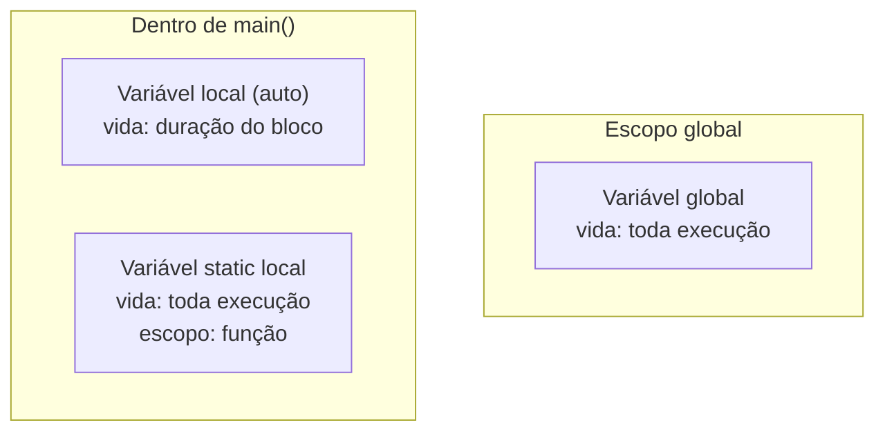
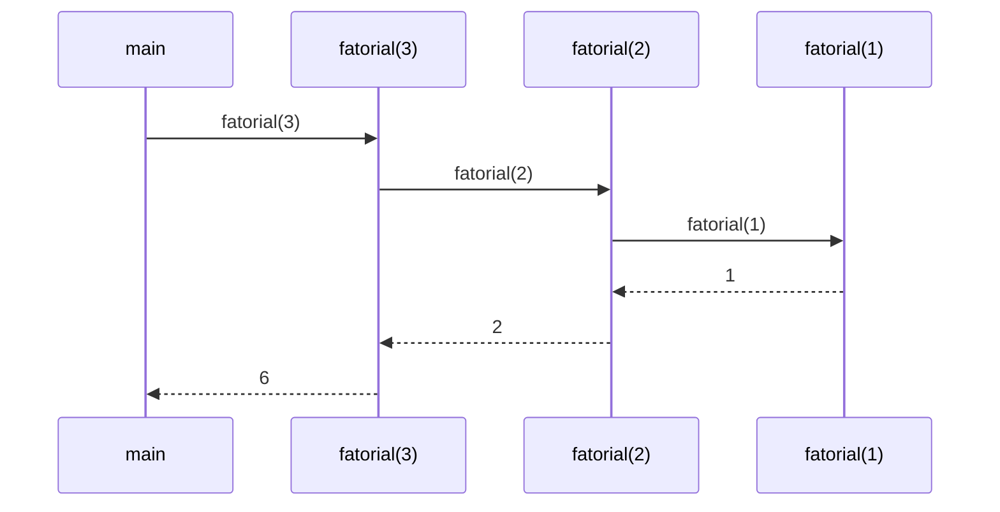

# Funções

## Objetivo

Dominar a declaração, definição, chamada e design de funções em C. Compreender o modelo de passagem de argumentos, escopo, recursão e como funções se relacionam com a memória.

## Pré-requisitos

- [Controle de fluxo](./06-control-flow.md)

## Conceitos Fundamentais

### Anatomia de uma Função

```c
/*
 * tipo_de_retorno nome_da_funcao(tipo param1, tipo param2) {
 *     corpo
 *     return valor;
 * }
 */

double calcular_media(double a, double b) {
    return (a + b) / 2.0;
}
```

### Declaração vs Definição

```c
/* DECLARAÇÃO (protótipo) — só a assinatura */
double calcular_media(double a, double b);

/* DEFINIÇÃO — inclui o corpo */
double calcular_media(double a, double b) {
    return (a + b) / 2.0;
}
```

O compilador precisa conhecer a declaração antes do primeiro uso.

---

### Passagem de Argumentos — Por Valor

Em C, **todos os argumentos são passados por valor** — uma cópia é feita:

```c
void dobrar_errado(int x) {
    x *= 2;   /* modifica a CÓPIA, não o original */
}

int main(void) {
    int n = 5;
    dobrar_errado(n);
    printf("%d\n", n);   /* ainda 5! */
    return 0;
}
```

Para modificar o original, passe um **ponteiro**:

```c
void dobrar_correto(int *x) {
    *x *= 2;   /* modifica o valor no endereço original */
}

int main(void) {
    int n = 5;
    dobrar_correto(&n);  /* passa o endereço de n */
    printf("%d\n", n);   /* agora 10 */
    return 0;
}
```

---

### Funções com Retorno `void`

```c
void imprimir_linha(const char *texto) {
    printf("%s\n", texto);
    /* sem return necessário — ou use 'return;' para sair cedo */
}
```

---

### Funções com Múltiplos Retornos via Ponteiros

C não suporta retornar múltiplos valores diretamente. Soluções:

```c
/* Opção 1: ponteiros de saída */
void dividir(int a, int b, int *quociente, int *resto) {
    *quociente = a / b;
    *resto     = a % b;
}

/* Opção 2: retornar struct */
typedef struct { int quociente; int resto; } DivResult;

DivResult dividir_v2(int a, int b) {
    return (DivResult){ .quociente = a / b, .resto = a % b };
}
```

---

### Escopo e Tempo de Vida de Variáveis



```c
int global = 0;          /* escopo global, vida: toda execução */

void contador(void) {
    static int contagem = 0;   /* inicializada só uma vez, persiste */
    contagem++;
    printf("Chamada #%d\n", contagem);
}

void exemplo(void) {
    int local = 10;            /* escopo de bloco, vida: duração da função */
    {
        int interno = 20;      /* escopo de bloco mais interno */
        /* local e interno visíveis aqui */
    }
    /* interno não é mais acessível aqui */
}
```

---

### Funções Inline

```c
/* Sugestão ao compilador para substituir chamadas pelo corpo */
static inline int max(int a, int b) {
    return (a > b) ? a : b;
}
```

---

### Recursão

Função que chama a si mesma. Cada chamada cria um novo frame na stack.

```c
/* Fatorial recursivo */
long long fatorial(int n) {
    if (n <= 1) return 1;           /* caso base */
    return n * fatorial(n - 1);     /* chamada recursiva */
}

/* Fibonacci recursivo (ineficiente — O(2^n)) */
int fibonacci(int n) {
    if (n <= 1) return n;
    return fibonacci(n - 1) + fibonacci(n - 2);
}
```



**Recursão de cauda (tail recursion):** quando a chamada recursiva é a última operação. Alguns compiladores otimizam para evitar crescimento da stack:

```c
long long fatorial_tail(int n, long long acumulador) {
    if (n <= 1) return acumulador;
    return fatorial_tail(n - 1, n * acumulador);  /* tail call */
}
```

---

### Funções Variádicas

Funções que aceitam número variável de argumentos, como `printf`:

```c
#include <stdio.h>
#include <stdarg.h>

double media(int count, ...) {
    va_list args;
    va_start(args, count);

    double soma = 0;
    for (int i = 0; i < count; i++) {
        soma += va_arg(args, double);
    }

    va_end(args);
    return soma / count;
}

int main(void) {
    printf("%.2f\n", media(3, 10.0, 20.0, 30.0));  /* 20.00 */
    return 0;
}
```

## Funcionamento Interno

### A Stack de Chamadas (Call Stack)

Cada chamada de função cria um **frame** na stack, contendo:
- Parâmetros
- Variáveis locais
- Endereço de retorno

```
Stack (cresce para baixo):
┌─────────────────────┐
│    Frame: main      │  ← stack frame de main
├─────────────────────┤
│  Frame: calcular()  │  ← frame da função chamada
├─────────────────────┤
│  Frame: auxiliar()  │  ← frame aninhado
└─────────────────────┘
            ↓ (cresce aqui)
```

Quando a função retorna, o frame é destruído e as variáveis locais deixam de existir.

## Erros Comuns

1. **Retornar ponteiro para variável local**: A variável é destruída quando a função retorna — *dangling pointer*.
   ```c
   int *errado(void) {
       int x = 42;
       return &x;  /* ERRADO: x não existe mais após return */
   }
   ```
2. **Esquecer o protótipo**: Sem protótipo, o compilador assume que a função retorna `int` (comportamento antigo, erro em C99+).
3. **Recursão sem caso base**: Causa stack overflow.
4. **Modificar argumento esperando alterar o original**: Lembre-se que C passa por valor.

## Exemplos

### Função de busca binária

```c
#include <stdio.h>

/* Busca binária em array ordenado */
int busca_binaria(const int *arr, int tamanho, int alvo) {
    int esquerda = 0, direita = tamanho - 1;

    while (esquerda <= direita) {
        int meio = esquerda + (direita - esquerda) / 2;

        if (arr[meio] == alvo)  return meio;
        if (arr[meio] < alvo)   esquerda = meio + 1;
        else                    direita = meio - 1;
    }

    return -1;  /* não encontrado */
}

int main(void) {
    int numeros[] = {1, 3, 5, 7, 9, 11, 13, 15};
    int tamanho = sizeof(numeros) / sizeof(numeros[0]);

    int pos = busca_binaria(numeros, tamanho, 7);
    printf("7 encontrado na posição: %d\n", pos);   /* 3 */

    pos = busca_binaria(numeros, tamanho, 6);
    printf("6 encontrado na posição: %d\n", pos);   /* -1 */

    return 0;
}
```

### Torres de Hanói (recursão clássica)

```c
#include <stdio.h>

void hanoi(int discos, char origem, char destino, char auxiliar) {
    if (discos == 1) {
        printf("Mover disco 1 de %c para %c\n", origem, destino);
        return;
    }
    hanoi(discos - 1, origem, auxiliar, destino);
    printf("Mover disco %d de %c para %c\n", discos, origem, destino);
    hanoi(discos - 1, auxiliar, destino, origem);
}

int main(void) {
    hanoi(3, 'A', 'C', 'B');
    return 0;
}
```

## Exercícios

1. **(Iniciante)** Escreva funções para calcular o máximo e o mínimo de dois números. Combine-as em uma função `intervalo(a, b, *min, *max)` que retorna ambos via ponteiros.
2. **(Intermediário)** Implemente `meu_strlen(const char *s)` que calcula o comprimento de uma string sem usar funções da biblioteca padrão.
3. **(Intermediário)** Implemente `meu_memcpy(void *dest, const void *src, size_t n)` que copia `n` bytes de `src` para `dest`.
4. **(Intermediário)** Escreva uma versão recursiva e uma iterativa do algoritmo de busca binária. Compare-as em clareza e eficiência.
5. **(Avançado)** Implemente uma função variádica `meu_printf` que suporta os especificadores `%d`, `%s` e `%c`.

## Referências

- [cppreference — Function declarations](https://en.cppreference.com/w/c/language/function_declaration)
- [cppreference — Variadic functions](https://en.cppreference.com/w/c/variadic)
- [cppreference — Inline functions](https://en.cppreference.com/w/c/language/inline)
- [K&R — Chapter 4: Functions and Program Structure](https://en.wikipedia.org/wiki/The_C_Programming_Language)
