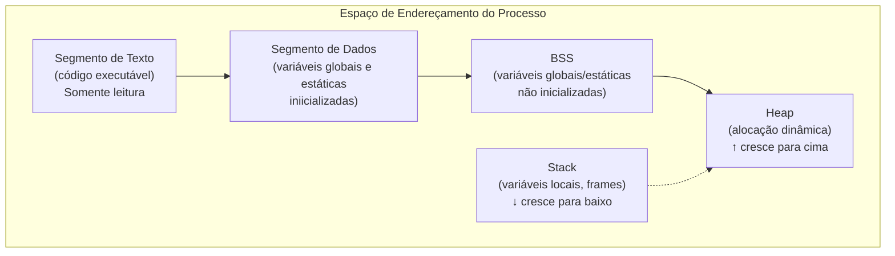
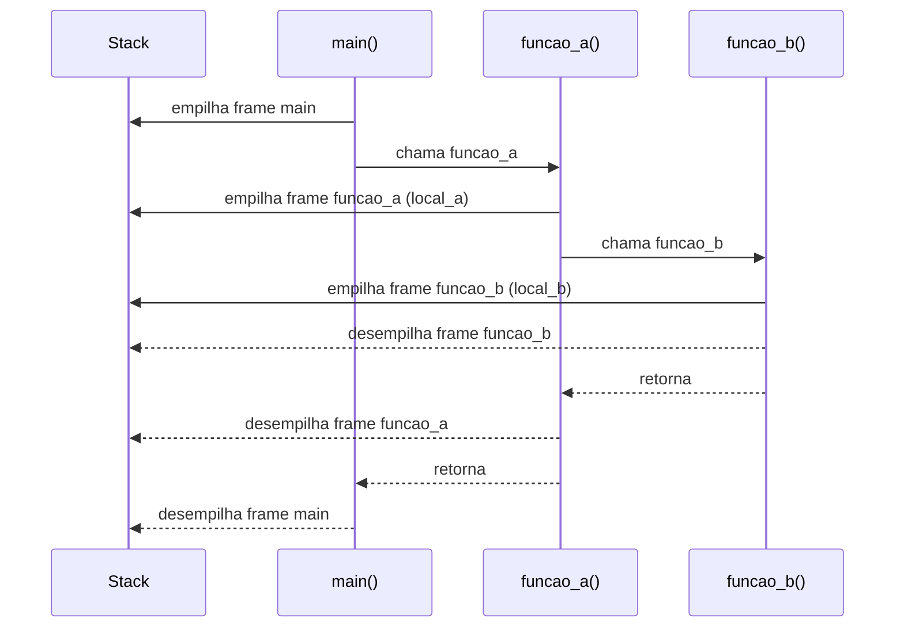
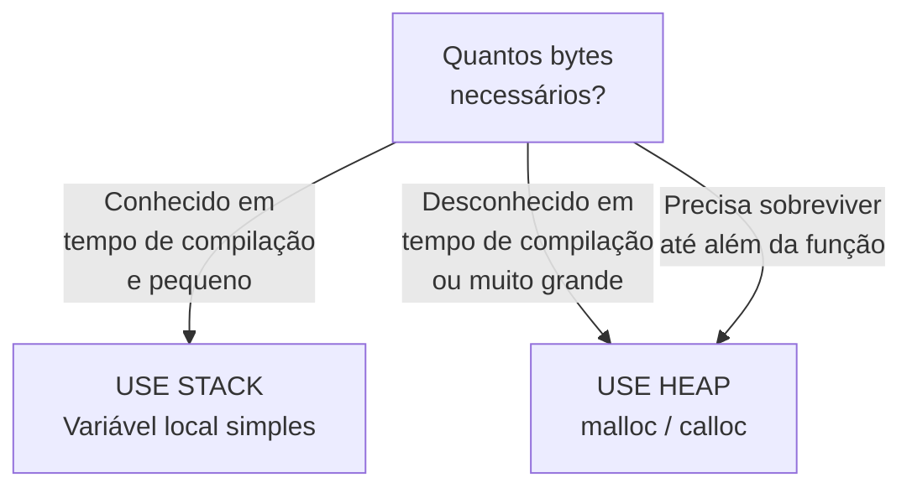

# Stack e Heap

## Objetivo

Compreender as duas principais regiões de memória usadas em programas C — stack e heap —, suas características, limitações e quando usar cada uma.

## Pré-requisitos

- [Funções](../01-foundations/07-functions.md)

## Conceitos Fundamentais

### Mapa de Memória de um Processo



| Região | Gerenciada por | Velocidade | Tamanho |
|--------|---------------|------------|---------|
| **Stack** | Compilador/SO (automático) | Muito rápida | Pequena (~1–8 MB típico) |
| **Heap** | Programador (manual) | Mais lenta | Grande (limitada pela RAM) |
| **Dados estáticos** | Compilador | Rápida | Fixo em tempo de compilação |

---

### Stack (Pilha)

A stack é gerenciada **automaticamente** pelo compilador. Funciona como uma pilha LIFO:

```c
void funcao_b(void) {
    int local_b = 20;
    /* frame de funcao_b criado aqui */
}   /* frame de funcao_b destruído — local_b não existe mais */

void funcao_a(void) {
    int local_a = 10;
    funcao_b();   /* empilha frame de funcao_b */
    /* local_a ainda existe aqui */
}

int main(void) {
    funcao_a();
    return 0;
}
```



**Características da Stack:**
- Alocação/liberação em O(1) (simples ajuste do ponteiro de stack).
- Variáveis locais são destruídas automaticamente.
- Stack overflow se exceder o limite (recursão muito profunda, arrays muito grandes).

---

### Heap

O heap é gerenciado **manualmente** pelo programador:

```c
#include <stdlib.h>

int *p = malloc(sizeof(int));   /* aloca no heap */
if (p == NULL) {
    /* malloc pode falhar! sempre verificar */
    perror("malloc");
    exit(EXIT_FAILURE);
}

*p = 42;
printf("%d\n", *p);

free(p);   /* OBRIGATÓRIO: liberar quando não precisar mais */
p = NULL;  /* boa prática: anular o ponteiro após free */
```

**Características do Heap:**
- Sobrevive além do escopo da função que alocou.
- Requer `free()` explícito — sem isso, há memory leak.
- Pode alocar quantidades grandes de memória.
- Fragmentação pode degradar performance ao longo do tempo.

---

### Comparação: quando usar cada um



| Situação | Stack | Heap |
|----------|-------|------|
| Array pequeno de tamanho fixo | ✅ | |
| Array de tamanho determinado em runtime | | ✅ |
| Dados que sobrevivem à função criadora | | ✅ |
| Estrutura de dados dinâmica (lista, árvore) | | ✅ |
| Variável temporária de cálculo | ✅ | |
| Buffer de poucos KB | ✅ | |
| Buffer de MB ou GB | | ✅ |

---

### Variáveis Globais e Estáticas

```c
int global = 10;           /* segmento de dados inicializado */
int global_zero;           /* segmento BSS — inicializado com 0 */

void funcao(void) {
    static int contador = 0;   /* segmento de dados — persiste entre chamadas */
    contador++;
    printf("Chamada #%d\n", contador);
}
```

## Funcionamento Interno

### Stack Frame em Detalhe

Quando `funcao_a(int x, int y)` é chamada:

```
Stack antes:               Stack depois:
┌──────────────┐          ┌──────────────┐
│ frame: main  │          │ frame: main  │
└──────────────┘          ├──────────────┤
                          │ endereço ret │  ← onde voltar após return
                          │ x = arg1     │
                          │ y = arg2     │
                          │ var_local    │
                          └──────────────┘ ← stack pointer (SP)
```

### Stack Overflow

```c
void recursao_infinita(void) {
    char buffer[1024];   /* 1 KB por frame */
    recursao_infinita(); /* cada chamada empilha um novo frame */
}
/* Após ~8000 chamadas: Segmentation fault (stack overflow) */
```

## Erros Comuns

1. **Retornar ponteiro para variável local** (dangling pointer):
   ```c
   int *perigo(void) {
       int x = 42;
       return &x;   /* x é destruído ao retornar! */
   }
   ```
2. **Memory leak**: Alocar no heap e nunca liberar.
3. **Double free**: Chamar `free` duas vezes no mesmo ponteiro.
4. **Usar ponteiro após `free`** (use-after-free): Comportamento indefinido.
5. **Stack overflow**: Arrays muito grandes como variáveis locais.

## Exemplos

### Demonstração de stack vs heap

```c
#include <stdio.h>
#include <stdlib.h>

int *criar_array_heap(int tamanho) {
    int *arr = malloc(tamanho * sizeof(int));
    if (!arr) return NULL;

    for (int i = 0; i < tamanho; i++) {
        arr[i] = i * i;
    }
    return arr;   /* ponteiro válido! dados estão no heap */
}

void exemplo_stack(void) {
    int arr_stack[5] = {1, 2, 3, 4, 5};
    /* arr_stack é destruído ao retornar desta função */
    printf("Stack: %d\n", arr_stack[0]);
}

int main(void) {
    exemplo_stack();

    /* Array alocado no heap — sobrevive além da função criadora */
    int *arr = criar_array_heap(10);
    if (arr) {
        printf("Heap[5] = %d\n", arr[5]);   /* 25 */
        free(arr);
        arr = NULL;
    }
    return 0;
}
```

## Exercícios

1. **(Iniciante)** Escreva uma função que cria um array de `n` inteiros na stack (use VLA — Variable Length Array) e uma que cria no heap. O que acontece quando `n` é muito grande?
2. **(Intermediário)** Implemente uma função `int *duplicar_array(const int *src, int n)` que retorna uma cópia do array alocada no heap. Quem deve liberar a memória retornada?
3. **(Intermediário)** Escreva um programa que demonstra um memory leak usando Valgrind: aloque memória e não libere. Depois corrija o programa.
4. **(Avançado)** Use `ulimit -s` para ver o limite de stack no seu sistema. Escreva um programa que determina experimentalmente o tamanho máximo de array na stack sem causar segfault.

## Referências

- [cppreference — Memory management](https://en.cppreference.com/w/c/memory)
- [Linux — Process memory layout](https://linux-mm.org/process_address_space)
- [Computer Systems: A Programmer's Perspective — Cap. 9](https://csapp.cs.cmu.edu/)
