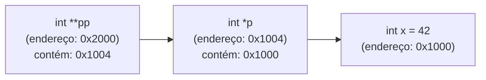

# Ponteiros: Fundamentos

## Objetivo

Compreender o que são ponteiros, como declarar, inicializar e usar ponteiros de forma segura. Os ponteiros são o coração da linguagem C e essenciais para entender alocação dinâmica, arrays e strings.

## Pré-requisitos

- [Stack e Heap](./01-stack-and-heap.md)

## Conceitos Fundamentais

### O que é um ponteiro?

Um **ponteiro** é uma variável que armazena um **endereço de memória**.

```
Memória RAM (exemplo simplificado):

Endereço │ Valor
─────────┼────────
0x1000   │  42      ← variável 'x'
0x1004   │  0x1000  ← ponteiro 'p' (contém o endereço de x)
0x1008   │  ...
```

```c
int x = 42;     /* variável inteira no endereço 0x1000 */
int *p = &x;    /* ponteiro para int, armazena 0x1000 */

printf("Endereço de x: %p\n",  (void*)&x);  /* 0x1000 */
printf("Valor de p:    %p\n",  (void*)p);   /* 0x1000 */
printf("Valor de x:    %d\n",  x);          /* 42 */
printf("*p (via p):    %d\n",  *p);         /* 42 */
```

---

### Declaração de Ponteiros

```c
int    *pi;    /* ponteiro para int */
double *pd;    /* ponteiro para double */
char   *pc;    /* ponteiro para char */
void   *pv;    /* ponteiro genérico (sem tipo) */
int   **ppi;   /* ponteiro para ponteiro para int */
```

> ⚠️ O `*` faz parte do **nome** da variável, não do tipo. `int *a, b` declara `a` como ponteiro para int e `b` como int simples.

---

### Operadores de Ponteiro

| Operador | Nome | Significado |
|----------|------|-------------|
| `&` | Endereço de | Retorna o endereço da variável |
| `*` | Dereferência | Acessa o valor no endereço apontado |

```c
int x = 10;
int *p = &x;    /* & = "endereço de x" */

*p = 20;        /* * = "valor em p" — modifica x indiretamente */
printf("%d\n", x);   /* 20 */
```

---

### Ponteiro Nulo (`NULL`)

Um ponteiro que não aponta para nada válido deve ser inicializado como `NULL`:

```c
int *p = NULL;   /* ponteiro nulo — não aponta para memória válida */

if (p != NULL) {
    *p = 5;   /* só dereferenciar se não for NULL */
}

/* Dereferência de NULL = Segmentation Fault */
*p = 5;   /* ERRADO se p == NULL */
```

---

### `void *` — Ponteiro Genérico

`void *` pode apontar para qualquer tipo, mas precisa de cast para ser dereferenciado:

```c
int x = 42;
void *generico = &x;   /* aceita qualquer tipo */

int *especifico = (int *)generico;   /* cast necessário */
printf("%d\n", *especifico);         /* 42 */
```

`malloc` retorna `void *` justamente por isso — pode ser atribuído a qualquer ponteiro.

---

### Ponteiros e Constantes

```c
int x = 10, y = 20;

/* 1. Ponteiro para const: não pode modificar o valor */
const int *p1 = &x;
*p1 = 5;   /* ERRO: não pode modificar através de p1 */
p1 = &y;   /* OK: pode mudar para onde aponta */

/* 2. Ponteiro const: não pode mudar para onde aponta */
int * const p2 = &x;
*p2 = 5;   /* OK: pode modificar o valor */
p2 = &y;   /* ERRO: não pode redirecionar */

/* 3. Const ponteiro para const: imutável em ambos os sentidos */
const int * const p3 = &x;
*p3 = 5;   /* ERRO */
p3 = &y;   /* ERRO */
```

**Mnemônica**: leia da direita para a esquerda:
- `const int *p` → "p é ponteiro para int const"
- `int * const p` → "p é const ponteiro para int"

---

### Ponteiros para Structs

```c
typedef struct {
    int x;
    int y;
} Ponto;

Ponto p = {3, 4};
Ponto *ptr = &p;

/* Duas formas de acessar membros via ponteiro: */
(*ptr).x = 10;   /* dereferência explícita + operador ponto */
ptr->x   = 10;   /* operador seta — forma preferida */
```

---

### Passagem de Ponteiros para Funções

```c
/* Swap correto usando ponteiros */
void swap(int *a, int *b) {
    int temp = *a;
    *a = *b;
    *b = temp;
}

int main(void) {
    int x = 5, y = 10;
    swap(&x, &y);
    printf("x=%d, y=%d\n", x, y);   /* x=10, y=5 */
    return 0;
}
```

---

### Diagrama: Ponteiro para Ponteiro



```c
int x = 42;
int *p = &x;
int **pp = &p;

printf("%d\n", **pp);   /* 42 — duas dereferências */
**pp = 100;             /* modifica x indiretamente */
```

## Funcionamento Interno

### Tamanho de um Ponteiro

O tamanho de um ponteiro depende da arquitetura:
- **32-bit**: 4 bytes (endereçamento de 4 GB)
- **64-bit**: 8 bytes (endereçamento de 16 EB teoricamente)

```c
printf("sizeof(int*):    %zu\n", sizeof(int*));    /* 8 em 64-bit */
printf("sizeof(char*):   %zu\n", sizeof(char*));   /* 8 em 64-bit */
printf("sizeof(double*): %zu\n", sizeof(double*)); /* 8 em 64-bit */
/* Todos os ponteiros têm o mesmo tamanho na mesma plataforma */
```

## Erros Comuns

1. **Ponteiro não inicializado (wild pointer)**:
   ```c
   int *p;    /* valor indeterminado — aponta para lugar desconhecido */
   *p = 5;    /* UNDEFINED BEHAVIOR */
   ```
2. **Dangling pointer**: ponteiro que aponta para memória liberada.
3. **Confundir `*` na declaração com `*` na dereferência**: São operadores diferentes com grafias iguais.
4. **Esquecer `&` ao passar para função**:
   ```c
   scanf("%d", n);   /* ERRADO — scanf precisa do endereço */
   scanf("%d", &n);  /* CORRETO */
   ```

## Exemplos

### Ponteiros em ação — inspeção de memória

```c
#include <stdio.h>

int main(void) {
    int a = 100, b = 200;
    int *p = &a;

    printf("Valor de a:       %d\n",    a);
    printf("Endereço de a:    %p\n",    (void*)&a);
    printf("Valor de p:       %p\n",    (void*)p);
    printf("*p (valor em p):  %d\n",    *p);

    p = &b;   /* redireciona para b */
    printf("\nApós p = &b:\n");
    printf("*p (agora b):     %d\n",    *p);
    *p = 999;
    printf("b após *p = 999:  %d\n",    b);

    return 0;
}
```

### Ponteiro para struct com alocação dinâmica

```c
#include <stdio.h>
#include <stdlib.h>

typedef struct {
    char nome[50];
    int  idade;
} Pessoa;

Pessoa *criar_pessoa(const char *nome, int idade) {
    Pessoa *p = malloc(sizeof(Pessoa));
    if (!p) return NULL;

    snprintf(p->nome, sizeof(p->nome), "%s", nome);
    p->idade = idade;
    return p;
}

int main(void) {
    Pessoa *joao = criar_pessoa("João", 30);
    if (joao) {
        printf("%s tem %d anos\n", joao->nome, joao->idade);
        free(joao);
        joao = NULL;
    }
    return 0;
}
```

## Exercícios

1. **(Iniciante)** Escreva um programa que declare uma variável `int`, um ponteiro para ela, e mostre: o valor da variável, seu endereço, o valor do ponteiro e o resultado da dereferência.
2. **(Iniciante)** Implemente a função `swap(int *a, int *b)` e teste com dois valores.
3. **(Intermediário)** Escreva uma função `incrementar(int *p, int n)` que incrementa o valor apontado por `n` unidades. Chame-a múltiplas vezes e observe os resultados.
4. **(Intermediário)** Crie uma função que recebe dois ponteiros `int *a` e `int *b` e verifica se apontam para a mesma variável (aliasing).
5. **(Avançado)** Implemente uma função `trocar_ponteiros(int **a, int **b)` que troca dois ponteiros (não os valores apontados).

## Referências

- [cppreference — Pointer declaration](https://en.cppreference.com/w/c/language/pointer)
- [cppreference — Address-of operator](https://en.cppreference.com/w/c/language/operator_member_access#Address-of_operator)
- [K&R — Chapter 5: Pointers and Arrays](https://en.wikipedia.org/wiki/The_C_Programming_Language)
