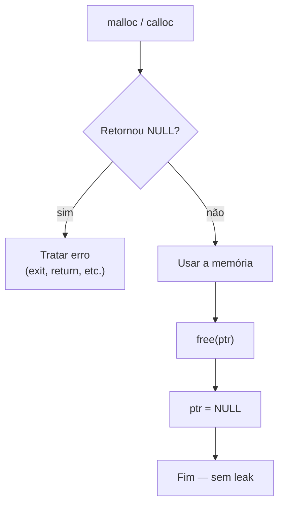
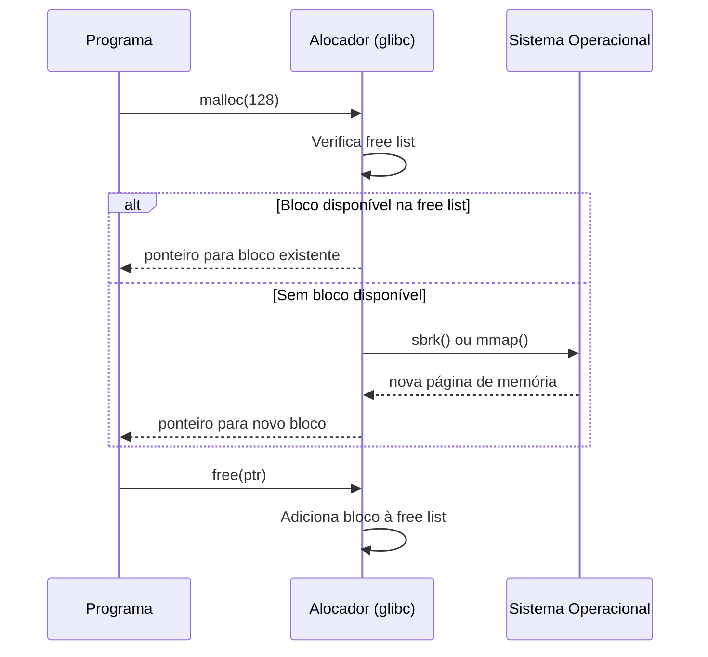

# Alocação Dinâmica de Memória

## Objetivo

Dominar as funções de alocação dinâmica de memória em C (`malloc`, `calloc`, `realloc`, `free`), compreender os padrões de uso correto e as armadilhas que causam memory leaks, double frees e corrupção de memória.

## Pré-requisitos

- [Aritmética de ponteiros](./03-pointer-arithmetic.md)

## Conceitos Fundamentais

### As Quatro Funções de Gerenciamento de Heap

```c
#include <stdlib.h>

void *malloc (size_t tamanho);
void *calloc (size_t n, size_t tamanho_elem);
void *realloc(void *ptr, size_t novo_tamanho);
void  free   (void *ptr);
```

---

### `malloc` — Alocar Bloco de Memória

Aloca um bloco de `tamanho` bytes no heap. O conteúdo é **indeterminado** (lixo de memória).

```c
/* Padrão correto de uso */
int *arr = malloc(10 * sizeof(int));
if (arr == NULL) {
    perror("malloc falhou");
    exit(EXIT_FAILURE);
}

/* Usar o array... */
for (int i = 0; i < 10; i++) {
    arr[i] = i * 2;
}

free(arr);
arr = NULL;   /* boa prática: anular após free */
```

**Por que `sizeof(int)` e não `4`?** Porque o tamanho de `int` pode variar por plataforma.

---

### `calloc` — Alocar e Inicializar com Zero

Aloca memória para `n` elementos de `tamanho_elem` bytes cada, e **inicializa tudo com zeros**:

```c
int *zeros = calloc(10, sizeof(int));
if (!zeros) { /* tratar erro */ }

/* arr[0..9] são todos 0 — garantido */
for (int i = 0; i < 10; i++) {
    printf("%d ", zeros[i]);   /* 0 0 0 0 0 0 0 0 0 0 */
}

free(zeros);
zeros = NULL;
```

| | `malloc(n * size)` | `calloc(n, size)` |
|---|---|---|
| Conteúdo inicial | Lixo (indeterminado) | Zero |
| Verificação de overflow | Não | Sim (internamente) |
| Velocidade | Ligeiramente mais rápido | Ligeiramente mais lento |

---

### `realloc` — Redimensionar Bloco

Redimensiona um bloco de memória existente. Pode mover os dados para um novo endereço:

```c
int *arr = malloc(5 * sizeof(int));
if (!arr) { exit(1); }

/* ... preencher arr[0..4] ... */

/* Expandir para 10 elementos */
int *novo = realloc(arr, 10 * sizeof(int));
if (novo == NULL) {
    /* realloc falhou — arr ainda é válido! não liberar aqui ainda */
    free(arr);
    exit(EXIT_FAILURE);
}
arr = novo;   /* atualizar o ponteiro — o antigo pode ter sido movido */

/* arr[5..9] têm conteúdo indeterminado */
```

> ⚠️ **Armadilha**: `arr = realloc(arr, ...)` — se `realloc` retorna `NULL`, perde-se o ponteiro original, causando memory leak. Sempre use uma variável temporária.

---

### `free` — Liberar Memória

Libera o bloco de memória de volta ao heap:

```c
int *p = malloc(sizeof(int));
*p = 42;
free(p);    /* libera a memória */
p = NULL;   /* impede uso após free */
```

**Regras do `free`:**
- Só liberar memória alocada com `malloc`/`calloc`/`realloc`.
- Não chamar `free` duas vezes (double free = UB).
- Não usar o ponteiro após `free` (use-after-free = UB).
- `free(NULL)` é seguro (não faz nada).

---

### Fluxo de Alocação e Liberação



---

### Padrões de Liberação em Funções

```c
/* Padrão com goto para limpeza — comum em C */
int processar(void) {
    int *buf1 = malloc(100 * sizeof(int));
    if (!buf1) return -1;

    int *buf2 = malloc(200 * sizeof(int));
    if (!buf2) goto erro_buf2;

    char *str = malloc(256);
    if (!str) goto erro_str;

    /* ... processamento ... */
    int resultado = 0;

    free(str);
erro_str:
    free(buf2);
erro_buf2:
    free(buf1);
    return resultado;
}
```

---

### Alocando Structs Dinamicamente

```c
typedef struct {
    char  *nome;
    int    idade;
    double salario;
} Funcionario;

Funcionario *criar_funcionario(const char *nome, int idade, double salario) {
    Funcionario *f = malloc(sizeof(Funcionario));
    if (!f) return NULL;

    f->nome = malloc(strlen(nome) + 1);  /* +1 para '\0' */
    if (!f->nome) {
        free(f);
        return NULL;
    }

    strcpy(f->nome, nome);
    f->idade   = idade;
    f->salario = salario;
    return f;
}

void destruir_funcionario(Funcionario **f) {
    if (!f || !*f) return;
    free((*f)->nome);
    free(*f);
    *f = NULL;   /* anula o ponteiro do chamador */
}

int main(void) {
    Funcionario *joao = criar_funcionario("João Silva", 30, 5000.0);
    if (!joao) { /* erro */ }
    printf("%s, %d anos\n", joao->nome, joao->idade);
    destruir_funcionario(&joao);
    /* joao agora é NULL */
    return 0;
}
```

## Funcionamento Interno

### O Alocador de Memória



O alocador mantém metadados (tamanho do bloco, flags) **antes** de cada bloco alocado. Escrever além dos limites corrompeum esses metadados, causando crashes difíceis de depurar.

## Erros Comuns

1. **Memory leak** — esquecer de liberar:
   ```c
   void leak(void) {
       int *p = malloc(100);
       /* ... sem free(p) ... */
   }   /* 100 bytes perdidos para sempre */
   ```

2. **Double free** — liberar duas vezes:
   ```c
   free(p);
   free(p);   /* UNDEFINED BEHAVIOR — corrompe o heap */
   ```

3. **Use-after-free**:
   ```c
   free(p);
   printf("%d\n", *p);   /* UB — memória pode ter sido reutilizada */
   ```

4. **Buffer overflow na heap**:
   ```c
   char *s = malloc(5);
   strcpy(s, "hello world");   /* escreve além do bloco! */
   ```

5. **realloc sem variável temporária**:
   ```c
   p = realloc(p, novo_tam);   /* se retornar NULL, perde-se p */
   ```

## Exemplos

### Array dinâmico com crescimento

```c
#include <stdio.h>
#include <stdlib.h>

typedef struct {
    int    *dados;
    size_t  tamanho;
    size_t  capacidade;
} VetorInt;

VetorInt *vetor_criar(void) {
    VetorInt *v = malloc(sizeof(VetorInt));
    if (!v) return NULL;
    v->dados      = malloc(4 * sizeof(int));
    v->tamanho    = 0;
    v->capacidade = 4;
    return v;
}

int vetor_adicionar(VetorInt *v, int valor) {
    if (v->tamanho == v->capacidade) {
        size_t nova_cap = v->capacidade * 2;
        int *novo = realloc(v->dados, nova_cap * sizeof(int));
        if (!novo) return -1;
        v->dados      = novo;
        v->capacidade = nova_cap;
    }
    v->dados[v->tamanho++] = valor;
    return 0;
}

void vetor_destruir(VetorInt **v) {
    if (!v || !*v) return;
    free((*v)->dados);
    free(*v);
    *v = NULL;
}

int main(void) {
    VetorInt *v = vetor_criar();
    for (int i = 0; i < 20; i++) {
        vetor_adicionar(v, i * i);
    }
    for (size_t i = 0; i < v->tamanho; i++) {
        printf("%d ", v->dados[i]);
    }
    printf("\n");
    vetor_destruir(&v);
    return 0;
}
```

## Exercícios

1. **(Iniciante)** Aloque dinamicamente um array de `n` inteiros (onde `n` é lido do usuário), preencha com valores de 1 a n, imprima e libere.
2. **(Intermediário)** Implemente uma função `char *duplicar_string(const char *s)` que retorna uma cópia alocada dinamicamente de `s`. Quem deve liberar?
3. **(Intermediário)** Use Valgrind para detectar memory leaks em um programa propositalmente com erros. Corrija-os e verifique que o Valgrind não reporta mais problemas.
4. **(Avançado)** Implemente um `VetorString` (array dinâmico de strings): structs com `char **dados`, `size_t tamanho`, `size_t capacidade`. Implemente `adicionar(string)` e `destruir()` que liberam toda a memória corretamente.
5. **(Avançado)** Implemente um alocador de memória simples com pool fixo de 1 KB usando um array de chars. Implemente `pool_malloc(size_t n)` e `pool_free(void *ptr)`.

## Referências

- [cppreference — malloc](https://en.cppreference.com/w/c/memory/malloc)
- [cppreference — calloc](https://en.cppreference.com/w/c/memory/calloc)
- [cppreference — realloc](https://en.cppreference.com/w/c/memory/realloc)
- [cppreference — free](https://en.cppreference.com/w/c/memory/free)
- [Valgrind — Detecting memory errors](https://valgrind.org/docs/manual/mc-manual.html)
