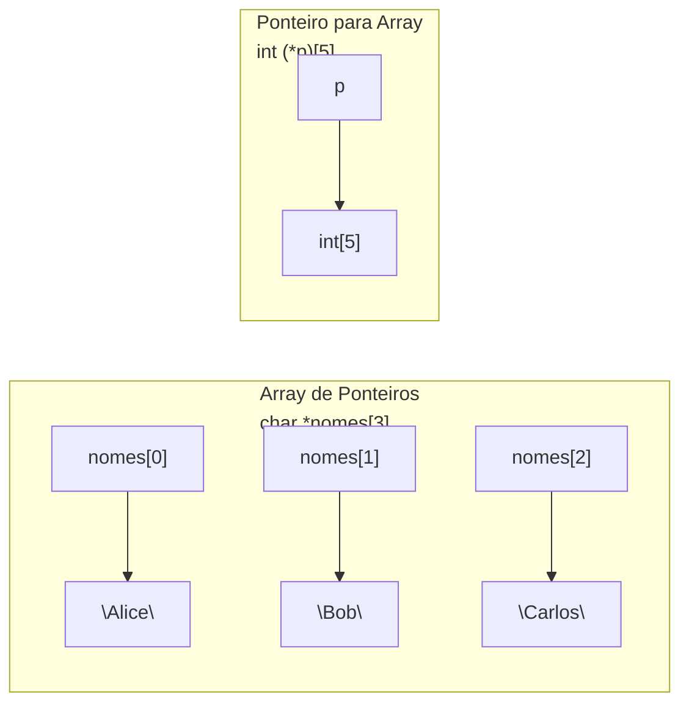

# Ponteiros e Arrays

## Objetivo

Compreender a relação profunda entre ponteiros e arrays em C, entender o decaimento de arrays para ponteiros, arrays multidimensionais e como passá-los para funções corretamente.

## Pré-requisitos

- [Alocação dinâmica de memória](./04-dynamic-allocation.md)

## Conceitos Fundamentais

### Arrays são ponteiros (quase)

Em C, o nome de um array **decai** para um ponteiro para seu primeiro elemento na maioria dos contextos:

```c
int arr[] = {10, 20, 30, 40, 50};

int *p = arr;         /* OK: arr decai para &arr[0] */
int *q = &arr[0];     /* equivalente */

/* arr e &arr[0] têm o mesmo valor (mesmo endereço),
   mas tipos diferentes: arr tem tipo int[5], &arr[0] tem tipo int* */
```

**Quando `arr` NÃO decai para ponteiro:**
- `sizeof(arr)` → retorna tamanho total do array (20 bytes para `int[5]`)
- `&arr` → retorna ponteiro para o array inteiro (`int(*)[5]`), não para o primeiro elemento

---

### Diferença crucial: array vs ponteiro

```c
int arr[5] = {1, 2, 3, 4, 5};
int *p = arr;

sizeof(arr)   /* 20 — tamanho total do array */
sizeof(p)     /* 8  — tamanho do ponteiro */

arr = p;      /* ERRO: não pode reatribuir array */
p = arr;      /* OK: pode redirecionar ponteiro */
```

---

### Arrays como parâmetros de funções

Ao passar um array para uma função, **ele decai para ponteiro** — o tamanho é perdido:

```c
/* Estas três declarações são equivalentes: */
void processar(int arr[], int n);
void processar(int *arr,  int n);
void processar(int arr[5], int n);   /* o 5 é ignorado! */

/* Por isso, sempre passe o tamanho separadamente */
void imprimir(const int *arr, int n) {
    for (int i = 0; i < n; i++) {
        printf("%d ", arr[i]);
    }
}

int main(void) {
    int nums[] = {1, 2, 3, 4, 5};
    int n = sizeof(nums) / sizeof(nums[0]);
    imprimir(nums, n);
    return 0;
}
```

---

### Arrays Multidimensionais

```c
int matriz[3][4];   /* 3 linhas, 4 colunas — armazenamento linha a linha (row-major) */

/* Layout na memória (contíguo): */
/* [0][0] [0][1] [0][2] [0][3] [1][0] [1][1] ... [2][3] */

/* Acesso: */
matriz[1][2] = 42;
*(*(matriz + 1) + 2) = 42;   /* equivalente */
```

```
Memória (row-major order):
┌──────┬──────┬──────┬──────┬──────┬──────┬──────┬──────┬──────┬──────┬──────┬──────┐
│[0][0]│[0][1]│[0][2]│[0][3]│[1][0]│[1][1]│[1][2]│[1][3]│[2][0]│[2][1]│[2][2]│[2][3]│
└──────┴──────┴──────┴──────┴──────┴──────┴──────┴──────┴──────┴──────┴──────┴──────┘
```

**Passando matriz para função:**

```c
/* Número de colunas DEVE ser especificado */
void imprimir_matriz(int m[][4], int linhas) {
    for (int i = 0; i < linhas; i++) {
        for (int j = 0; j < 4; j++) {
            printf("%4d", m[i][j]);
        }
        printf("\n");
    }
}

/* Com ponteiro explícito para array (C99+) */
void imprimir_v2(int linhas, int colunas, int m[linhas][colunas]) {
    for (int i = 0; i < linhas; i++)
        for (int j = 0; j < colunas; j++)
            printf("%d ", m[i][j]);
}
```

---

### Arrays de Ponteiros vs Ponteiro para Array



```c
/* Array de ponteiros — strings de tamanhos variados */
const char *nomes[] = {"Alice", "Bob", "Carlos"};
/* nomes[0] aponta para "Alice", nomes[1] para "Bob", etc. */

/* Ponteiro para array de 5 ints */
int arr[5] = {1, 2, 3, 4, 5};
int (*p)[5] = &arr;   /* p aponta para o array inteiro */
(*p)[2] = 99;         /* modifica arr[2] */
```

---

### Arrays Dinâmicos Multidimensionais

```c
/* Matriz 3x4 alocada dinamicamente */

/* Opção 1: Array de ponteiros (não contíguo) */
int **m = malloc(3 * sizeof(int *));
for (int i = 0; i < 3; i++) {
    m[i] = malloc(4 * sizeof(int));
}
m[1][2] = 42;

/* Liberação */
for (int i = 0; i < 3; i++) free(m[i]);
free(m);

/* Opção 2: Array único contíguo (mais eficiente) */
int *mat = malloc(3 * 4 * sizeof(int));
/* Acesso: mat[linha * colunas + coluna] */
mat[1 * 4 + 2] = 42;   /* equivalente a mat[1][2] */
free(mat);

/* Opção 3: Ponteiro para VLA (C99+) */
int linhas = 3, cols = 4;
int (*vla)[cols] = malloc(linhas * sizeof(*vla));
vla[1][2] = 42;
free(vla);
```

## Erros Comuns

1. **Calcular tamanho de array passado como parâmetro**:
   ```c
   void funcao(int arr[]) {
       int n = sizeof(arr) / sizeof(arr[0]);   /* ERRADO: sizeof(arr) = sizeof(int*) */
   }
   ```

2. **Acesso fora dos limites (out-of-bounds)**:
   ```c
   int arr[5];
   arr[5] = 10;   /* UB: índice válido é 0..4 */
   ```

3. **Confundir `int *arr[5]` com `int (*arr)[5]`**:
   - `int *arr[5]` → array de 5 ponteiros para int
   - `int (*arr)[5]` → ponteiro para array de 5 ints

4. **Liberar array estático**:
   ```c
   int arr[5];
   free(arr);   /* ERRADO: arr está na stack, não no heap */
   ```

## Exemplos

### Ordenação de array com ponteiro para função (qsort)

```c
#include <stdio.h>
#include <stdlib.h>

int comparar(const void *a, const void *b) {
    return (*(int*)a - *(int*)b);
}

int main(void) {
    int nums[] = {5, 2, 8, 1, 9, 3};
    int n = sizeof(nums) / sizeof(nums[0]);

    qsort(nums, n, sizeof(int), comparar);

    for (int i = 0; i < n; i++) printf("%d ", nums[i]);
    printf("\n");   /* 1 2 3 5 8 9 */
    return 0;
}
```

### Matriz dinâmica com acesso conveniente

```c
#include <stdio.h>
#include <stdlib.h>

int **criar_matriz(int linhas, int cols) {
    int **m = malloc(linhas * sizeof(int *));
    if (!m) return NULL;

    for (int i = 0; i < linhas; i++) {
        m[i] = calloc(cols, sizeof(int));
        if (!m[i]) {
            for (int j = 0; j < i; j++) free(m[j]);
            free(m);
            return NULL;
        }
    }
    return m;
}

void destruir_matriz(int **m, int linhas) {
    for (int i = 0; i < linhas; i++) free(m[i]);
    free(m);
}

int main(void) {
    int **m = criar_matriz(4, 4);
    for (int i = 0; i < 4; i++)
        for (int j = 0; j < 4; j++)
            m[i][j] = i == j ? 1 : 0;   /* matriz identidade */

    for (int i = 0; i < 4; i++) {
        for (int j = 0; j < 4; j++) printf("%2d ", m[i][j]);
        printf("\n");
    }
    destruir_matriz(m, 4);
    return 0;
}
```

## Exercícios

1. **(Iniciante)** Escreva uma função que soma todos os elementos de um array usando aritmética de ponteiros (sem índices).
2. **(Intermediário)** Implemente uma função `transpor(int **m, int linhas, int cols)` que transpõe uma matriz quadrada in-place.
3. **(Intermediário)** Escreva uma função que encontra a linha com a maior soma em uma matriz 2D alocada dinamicamente.
4. **(Avançado)** Implemente multiplicação de matrizes (`C = A × B`) com matrizes alocadas dinamicamente. Libere toda a memória ao final.
5. **(Avançado)** Compare a performance de acesso a uma matriz implementada como array de ponteiros (não contíguo) vs. array contíguo com indexação manual. Meça com `clock()`.

## Referências

- [cppreference — Array declaration](https://en.cppreference.com/w/c/language/array)
- [cppreference — Multidimensional arrays](https://en.cppreference.com/w/c/language/array#Multidimensional_arrays)
- [K&R — Chapter 5: Pointers and Arrays](https://en.wikipedia.org/wiki/The_C_Programming_Language)
