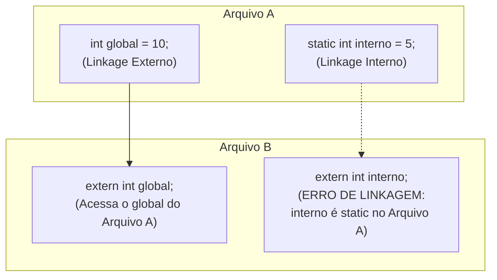

# Escopo, Linkage e Storage Classes

## Objetivo
Compreender como a visibilidade e o tempo de vida de variáveis e funções em C são controlados pelas palavras-chave `static`, `extern`, `register` e `auto`, dominando os conceitos de escopo e vinculação (linkage).

## Pré-requisitos
- [Estrutura de um Programa C (Módulo 1)](../01-foundations/03-program-structure.md)
- [Funções (Módulo 1)](../01-foundations/07-functions.md)

## Conceitos Fundamentais

### Tipos de Escopo (Scope)
O escopo define a visibilidade de um identificador (variável ou função) no código-fonte.
- **Escopo de Bloco:** Visível apenas dentro das chaves `{}` onde foi declarado (ex: variáveis locais).
- **Escopo de Função:** Apenas rótulos (labels) de `goto` têm este escopo.
- **Escopo de Protótipo de Função:** Nomes de parâmetros na declaração de uma função.
- **Escopo de Arquivo:** Variáveis e funções declaradas fora de qualquer bloco. Visíveis de sua declaração até o fim do arquivo.

---

### Vinculação (Linkage)
O linkage define se um identificador em uma unidade de tradução (arquivo `.c` compilado) pode ser visto pelo linker em outros arquivos.

- **Sem Linkage (No Linkage):** Variáveis locais de escopo de bloco.
- **Linkage Interno (Internal Linkage):** Identificadores visíveis apenas dentro da própria unidade de tradução. Declarados com `static` no escopo global.
- **Linkage Externo (External Linkage):** Identificadores globais visíveis para todo o projeto. Compartilhados através de `extern`.

---

### Classes de Armazenamento (Storage Classes)

#### 1. `auto`
Classe padrão para variáveis locais (geradas automaticamente na stack). Quase nunca escrito de forma explícita.
```c
auto int x = 10; // Equivalente a 'int x = 10;'
```

#### 2. `register`
Sugere ao compilador que guarde a variável em um registrador da CPU em vez da memória RAM, para acesso extremamente rápido.
```c
register int contador = 0;
```
> [!WARNING]
> O compilador pode ignorar a sugestão de `register`. É proibido por padrão utilizar o operador de endereço `&` em variáveis declaradas como `register`, pois registradores não possuem endereços de memória RAM.

#### 3. `static`
Modifica o tempo de vida ou o linkage dependendo de onde é usado:

- **Static local (no escopo de bloco):** Estende o tempo de vida da variável local para a duração inteira do programa. A variável retém seu valor entre chamadas de função consecutivas.
- **Static global (no escopo de arquivo):** Restringe o linkage a interno. Impede que a variável ou função seja acessada de fora desse arquivo.

```c
void contar(void) {
    static int chamadas = 0; // Inicializada apenas uma vez
    chamadas++;
    printf("Chamadas: %d\n", chamadas);
}
```

#### 4. `extern`
Informa ao compilador que a variável ou função está declarada em outro arquivo (unidade de tradução) do projeto e será resolvida na etapa de ligação (linkage).

```c
/* arquivo1.c */
int total_pontos = 100; // Declaração e definição global

/* arquivo2.c */
extern int total_pontos; // Declaração de referência
void mostrar(void) {
    printf("Pontos: %d\n", total_pontos);
}
```

## Funcionamento Interno

### Visão Geral de Vinculação


## Erros Comuns
1. **Poluição do Escopo Global:** Declarar variáveis globais sem `static` por padrão. Isso causa colisões de nomes (linkage conflicts) em projetos médios ou grandes.
2. **Definir variáveis globais em arquivos headers (`.h`):** Se o header for incluído por múltiplos arquivos `.c`, o linker falhará com erro de "múltiplas definições".
   *Solução:* Declare com `extern` no `.h` e defina apenas em **um** arquivo `.c`.

## Exemplos

### Encapsulamento em C usando `static`
Técnica semelhante ao conceito de propriedades/métodos privados em OOP.

```c
/* arquivo: banco_dados.c */
#include <stdio.h>

// Variável global com linkage interno (privada para este arquivo)
static int conexoes_ativas = 0;

// Função privada para o arquivo
static void log_interno(const char *msg) {
    printf("[BD LOG] %s\n", msg);
}

// Funções públicas (linkage externo implícito)
void bd_conectar(void) {
    conexoes_ativas++;
    log_interno("Nova conexão estabelecida.");
}

int bd_obter_conexoes(void) {
    return conexoes_ativas;
}
```

## Exercícios
1. **(Iniciante)** Crie uma função que use uma variável local `static` para calcular a média móvel de valores inteiros passados um a um como parâmetro.
2. **(Iniciante)** Declare uma função como `static` em um arquivo auxiliar e tente chamá-la no `main.c`. Observe o erro gerado pelo compilador/linker.
3. **(Intermediário)** Escreva um programa distribuído em 3 arquivos: `main.c`, `dados.c` e `dados.h`. Compartilhe um contador global entre eles de forma limpa usando a palavra-chave `extern`.
4. **(Intermediário)** Experimente declarar variáveis com a classe `register`. Tente imprimir seu endereço com `printf("%p", &var)` e analise a mensagem de erro do compilador.
5. **(Avançado)** Crie um padrão Singleton em C: use uma struct estática em arquivo local e forneça funções públicas globais para obter a instância única do recurso.

## Referências
- [cppreference — Storage duration and linkage](https://en.cppreference.com/w/c/language/storage_duration)
- [Understand "extern" keyword in C (GeeksforGeeks)](https://www.geeksforgeeks.org/understanding-extern-keyword-in-c/)
