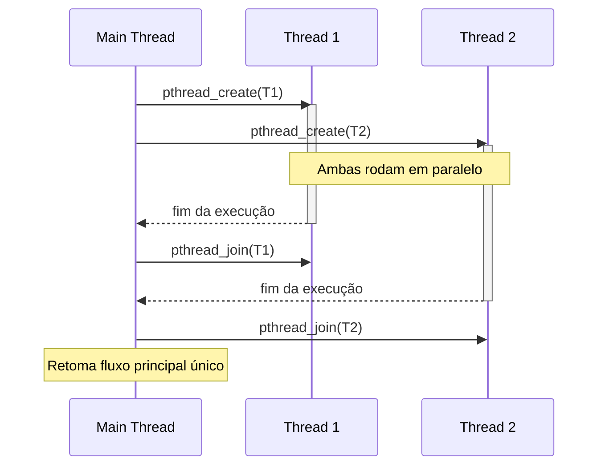

# Concorrência com POSIX Threads (pthreads)

## Objetivo
Compreender os fundamentos da programação concorrente em C utilizando a biblioteca POSIX Threads (`pthreads`), dominando a criação, sincronização de threads, controle de condições de corrida (race conditions) usando mutexes e junção (joining) de fluxos de execução.

## Pré-requisitos
- [Ponteiros para Funções (Módulo 4)](./01-function-pointers.md)

## Conceitos Fundamentais

### O que são Threads?
Uma thread é uma linha de execução independente dentro de um processo. Threads de um mesmo processo compartilham os mesmos recursos: espaço de endereçamento (memória global e heap), descritores de arquivos e código, porém possuem sua própria stack de chamadas (call stack) e registradores.

```
Processo na Memória:
┌───────────────────────────────────────────┐
│ Memória Global / Heap (COMPARTILHADO)      │
├─────────────┬─────────────┬───────────────┤
│ Stack Thr1  │ Stack Thr2  │ Stack Thr3    │
└─────────────┴─────────────┴───────────────┘
```

---

### A Biblioteca `<pthread.h>`
No padrão UNIX, a manipulação de threads é feita através da API POSIX Threads. Requer inclusão do cabeçalho `<pthread.h>` e a vinculação da biblioteca de threads no momento da compilação:

```bash
gcc -pthread programa.c -o programa
```

---

### Ciclo de Vida do Thread

#### 1. Criação (`pthread_create`)
```c
int pthread_create(pthread_t *thread, 
                   const pthread_attr_t *attr,
                   void *(*start_routine) (void *), 
                   void *arg);
```
- A função executora do thread deve obrigatoriamente ter a assinatura `void* func(void*)`.

#### 2. Junção/Espera (`pthread_join`)
Bloqueia o thread chamador (geralmente a main thread) até que o thread especificado termine sua execução (semelhante ao `wait` de processos).
```c
int pthread_join(pthread_t thread, void **retval);
```

---

### Condição de Corrida (Race Condition)
Ocorre quando múltiplas threads acessam e modificam um dado compartilhado simultaneamente de forma não sincronizada, deixando o resultado dependente da ordem de escalonamento das threads.

```c
// Se duas threads executarem isso ao mesmo tempo na mesma variável,
// o incremento pode ser perdido devido ao comportamento não atômico:
// 1. Ler valor | 2. Somar | 3. Escrever valor
contador++; 
```

---

### Sincronização com Mutex (Exclusão Mútua)
Um mutex é um mecanismo de sincronização usado para bloquear o acesso a seções críticas de código, garantindo que apenas uma thread o execute por vez.

```c
pthread_mutex_t trava = PTHREAD_MUTEX_INITIALIZER;

// Região Crítica Sincronizada
pthread_mutex_lock(&trava);
contador++; // Garantido que apenas uma thread acessará por vez
pthread_mutex_unlock(&trava);
```

## Funcionamento Interno

### Execução Sequencial vs Concorrente


## Erros Comuns
1. **Passar variáveis locais temporárias como argumento de thread:**
   ```c
   for (int i = 0; i < 5; i++) {
       // Perigo: todas as threads podem ler a mesma referência de 'i'
       // antes de incrementar, gerando IDs duplicados nas threads.
       pthread_create(&t, NULL, func, &i); 
   }
   ```
   *Solução:* Aloque memória dinamicamente no heap para cada argumento ou passe o inteiro diretamente via conversão (cast) para `void*`.

2. **Esquecer de liberar o Mutex (Deadlock):** Bloquear um mutex com `lock` e sair prematuramente da função (ex: com um `return`) sem executar o `unlock`. Todas as outras threads ficarão suspensas para sempre.
3. **Não compilar com `-pthread`:** Gerará erros indefinidos de linkagem no linker.

## Exemplos

### Criação e Junção Básica de Threads
```c
#include <stdio.h>
#include <pthread.h>

void* saudar(void *arg) {
    char *nome = (char*)arg;
    printf("Olá da Thread rodando para %s!\n", nome);
    return NULL;
}

int main(void) {
    pthread_t t1, t2;

    pthread_create(&t1, NULL, saudar, "Alice");
    pthread_create(&t2, NULL, saudar, "Bob");

    // Aguarda o término das threads
    pthread_join(t1, NULL);
    pthread_join(t2, NULL);

    printf("Fim do programa principal.\n");
    return 0;
}
```

### Exclusão Mútua com Mutex
```c
#include <stdio.h>
#include <pthread.h>

#define NUM_THREADS 5
#define ITERACOES 100000

int contador = 0;
pthread_mutex_t mutex_contador = PTHREAD_MUTEX_INITIALIZER;

void* incrementar(void *arg) {
    for (int i = 0; i < ITERACOES; i++) {
        pthread_mutex_lock(&mutex_contador);
        contador++; // Região Crítica
        pthread_mutex_unlock(&mutex_contador);
    }
    return NULL;
}

int main(void) {
    pthread_t threads[NUM_THREADS];

    for (int i = 0; i < NUM_THREADS; i++) {
        pthread_create(&threads[i], NULL, incrementar, NULL);
    }

    for (int i = 0; i < NUM_THREADS; i++) {
        pthread_join(threads[i], NULL);
    }

    // Sem mutex, o contador dificilmente atingiria 500.000
    printf("Valor final do contador: %d\n", contador); 
    
    pthread_mutex_destroy(&mutex_contador);
    return 0;
}
```

## Exercícios
1. **(Iniciante)** Crie um programa que crie duas threads. Uma thread deve imprimir números pares de 1 a 20, e a outra deve imprimir os ímpares.
2. **(Iniciante)** Escreva uma função executora de thread que retorne um número inteiro alocado no heap. Capture esse retorno na main thread usando `pthread_join`.
3. **(Intermediário)** Escreva um programa que calcule a soma dos elementos de um array grande dividindo o trabalho igualmente entre 4 threads (Paralelismo de dados).
4. **(Intermediário)** Crie uma situação de impasse (deadlock) proposital com dois mutexes e duas threads, e analise o congelamento do programa.
5. **(Avançado)** Implemente o problema clássico do Produtor-Consumidor usando um buffer circular compartilhado, Mutexes e Variáveis de Condição (`pthread_cond_t`) para notificação de novos itens.

## Referências
- [POSIX Threads Programming (LLNL)](https://lists.gnu.org/archive/html/gprofng-patches/2024-03/pdfp_d5X8Cg2.pdf)
- [pthread.h — Specification](https://pubs.opengroup.org/onlinepubs/7908799/xsh/pthread.h.html)
