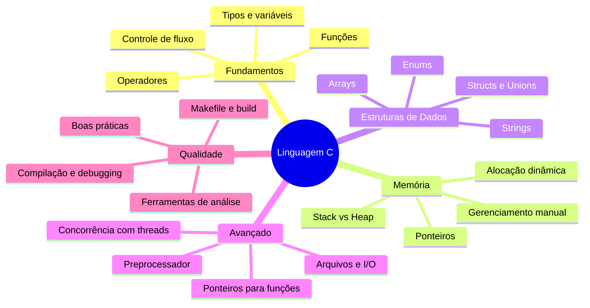

# Linguagem C

## Introdução

A linguagem C é uma das linguagens de programação mais influentes e duradouras da história da computação. Criada por Dennis Ritchie nos Laboratórios Bell entre 1969 e 1973, C foi projetada para ser uma linguagem de propósito geral com acesso de baixo nível à memória e excelente desempenho.

Hoje, C é amplamente utilizada em:
- Sistemas operacionais (Linux, Windows, macOS têm partes em C)
- Sistemas embarcados e microcontroladores
- Drivers de dispositivos e firmware
- Compiladores e interpretadores de outras linguagens
- Bibliotecas de alto desempenho
- Jogos e simulações científicas

Compreender C é compreender os fundamentos sobre os quais grande parte da computação moderna é construída.

---

## Mapa do Conhecimento

---

## Roadmap de Estudo

### Módulo 1 — Fundamentos
| # | Tópico | Arquivo |
|---|--------|---------|
| 1.1 | Introdução e história da linguagem C | [01-introduction.md](./01-foundations/01-introduction.md) |
| 1.2 | Ambiente de desenvolvimento (compilador, IDE) | [02-setup.md](./01-foundations/02-setup.md) |
| 1.3 | Estrutura de um programa C | [03-program-structure.md](./01-foundations/03-program-structure.md) |
| 1.4 | Tipos de dados, variáveis e constantes | [04-types-and-variables.md](./01-foundations/04-types-and-variables.md) |
| 1.5 | Operadores | [05-operators.md](./01-foundations/05-operators.md) |
| 1.6 | Controle de fluxo | [06-control-flow.md](./01-foundations/06-control-flow.md) |
| 1.7 | Funções | [07-functions.md](./01-foundations/07-functions.md) |

### Módulo 2 — Memória e Ponteiros
| # | Tópico | Arquivo |
|---|--------|---------|
| 2.1 | Stack e Heap | [01-stack-and-heap.md](./02-memory/01-stack-and-heap.md) |
| 2.2 | Ponteiros: fundamentos | [02-pointers-basics.md](./02-memory/02-pointers-basics.md) |
| 2.3 | Aritmética de ponteiros | [03-pointer-arithmetic.md](./02-memory/03-pointer-arithmetic.md) |
| 2.4 | Alocação dinâmica de memória | [04-dynamic-allocation.md](./02-memory/04-dynamic-allocation.md) |
| 2.5 | Ponteiros e arrays | [05-pointers-and-arrays.md](./02-memory/05-pointers-and-arrays.md) |

### Módulo 3 — Estruturas de Dados
| # | Tópico | Arquivo |
|---|--------|---------|
| 3.1 | Arrays unidimensionais e multidimensionais | [01-arrays.md](./03-data-structures/01-arrays.md) |
| 3.2 | Strings em C | [02-strings.md](./03-data-structures/02-strings.md) |
| 3.3 | Structs | [03-structs.md](./03-data-structures/03-structs.md) |
| 3.4 | Unions e Enums | [04-unions-and-enums.md](./03-data-structures/04-unions-and-enums.md) |
| 3.5 | Listas encadeadas | [05-linked-lists.md](./03-data-structures/05-linked-lists.md) |

### Módulo 4 — Recursos Avançados
| # | Tópico | Arquivo |
|---|--------|---------|
| 4.1 | Ponteiros para funções | [01-function-pointers.md](./04-advanced/01-function-pointers.md) |
| 4.2 | Preprocessador e macros | [02-preprocessor.md](./04-advanced/02-preprocessor.md) |
| 4.3 | Arquivos e I/O | [03-file-io.md](./04-advanced/03-file-io.md) |
| 4.4 | Escopo, linkage e storage classes | [04-scope-and-linkage.md](./04-advanced/04-scope-and-linkage.md) |
| 4.5 | Concorrência com POSIX Threads | [05-posix-threads.md](./04-advanced/05-posix-threads.md) |

### Módulo 5 — Qualidade e Ferramentas
| # | Tópico | Arquivo |
|---|--------|---------|
| 5.1 | Compilação, flags e avisos | [01-compilation.md](./05-tooling/01-compilation.md) |
| 5.2 | Debugging com GDB | [02-debugging.md](./05-tooling/02-debugging.md) |
| 5.3 | Makefile e build systems | [03-makefile.md](./05-tooling/03-makefile.md) |
| 5.4 | Valgrind e detecção de memory leaks | [04-valgrind.md](./05-tooling/04-valgrind.md) |
| 5.5 | Boas práticas e padrões de código | [05-best-practices.md](./05-tooling/05-best-practices.md) |

---

## Como Estudar

1. Siga a ordem numérica dos módulos — os conceitos são cumulativos.
2. Execute cada exemplo de código na sua máquina.
3. Faça os exercícios antes de avançar para o próximo tópico.
4. Consulte o [glossário](./glossary.md) para termos desconhecidos.
5. Acompanhe seu progresso em [progress.md](./progress.md).

---

## Pré-requisitos

- Lógica de programação básica (variáveis, condicionais, loops)
- Noções de como um computador funciona (memória, CPU)
- Terminal/linha de comando básico

## Referências Gerais

- [The C Programming Language (K&R)](https://en.wikipedia.org/wiki/The_C_Programming_Language) — Kernighan & Ritchie
- [cppreference.com — C](https://en.cppreference.com/w/c)
- [GNU C Library (glibc) Manual](https://www.gnu.org/software/libc/manual/)
- [SEI CERT C Coding Standard](https://wiki.sei.cmu.edu/confluence/display/c/SEI+CERT+C+Coding+Standard)
