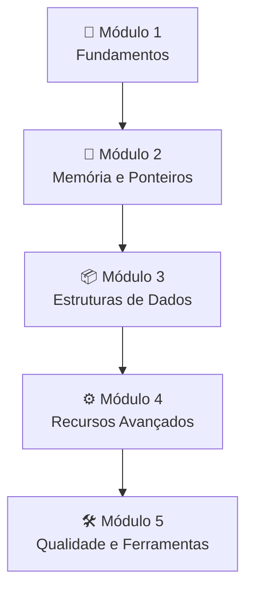

# Roadmap — Linguagem C

## Visão Geral

---

## Módulo 1 — Fundamentos

| Tópico | Link | Dependências |
|--------|------|--------------|
| 1.1 Introdução e história | [01-introduction.md](./01-foundations/01-introduction.md) | — |
| 1.2 Ambiente de desenvolvimento | [02-setup.md](./01-foundations/02-setup.md) | 1.1 |
| 1.3 Estrutura de um programa C | [03-program-structure.md](./01-foundations/03-program-structure.md) | 1.2 |
| 1.4 Tipos, variáveis e constantes | [04-types-and-variables.md](./01-foundations/04-types-and-variables.md) | 1.3 |
| 1.5 Operadores | [05-operators.md](./01-foundations/05-operators.md) | 1.4 |
| 1.6 Controle de fluxo | [06-control-flow.md](./01-foundations/06-control-flow.md) | 1.5 |
| 1.7 Funções | [07-functions.md](./01-foundations/07-functions.md) | 1.6 |

---

## Módulo 2 — Memória e Ponteiros

| Tópico | Link | Dependências |
|--------|------|--------------|
| 2.1 Stack e Heap | [01-stack-and-heap.md](./02-memory/01-stack-and-heap.md) | Módulo 1 |
| 2.2 Ponteiros: fundamentos | [02-pointers-basics.md](./02-memory/02-pointers-basics.md) | 2.1 |
| 2.3 Aritmética de ponteiros | [03-pointer-arithmetic.md](./02-memory/03-pointer-arithmetic.md) | 2.2 |
| 2.4 Alocação dinâmica | [04-dynamic-allocation.md](./02-memory/04-dynamic-allocation.md) | 2.3 |
| 2.5 Ponteiros e arrays | [05-pointers-and-arrays.md](./02-memory/05-pointers-and-arrays.md) | 2.4 |

---

## Módulo 3 — Estruturas de Dados

| Tópico | Link | Dependências |
|--------|------|--------------|
| 3.1 Arrays | [01-arrays.md](./03-data-structures/01-arrays.md) | Módulo 2 |
| 3.2 Strings em C | [02-strings.md](./03-data-structures/02-strings.md) | 3.1 |
| 3.3 Structs | [03-structs.md](./03-data-structures/03-structs.md) | 3.2 |
| 3.4 Unions e Enums | [04-unions-and-enums.md](./03-data-structures/04-unions-and-enums.md) | 3.3 |
| 3.5 Listas encadeadas | [05-linked-lists.md](./03-data-structures/05-linked-lists.md) | 3.4 |

---

## Módulo 4 — Recursos Avançados

| Tópico | Link | Dependências |
|--------|------|--------------|
| 4.1 Ponteiros para funções | [01-function-pointers.md](./04-advanced/01-function-pointers.md) | Módulo 3 |
| 4.2 Preprocessador e macros | [02-preprocessor.md](./04-advanced/02-preprocessor.md) | 4.1 |
| 4.3 Arquivos e I/O | [03-file-io.md](./04-advanced/03-file-io.md) | 4.2 |
| 4.4 Escopo, linkage e storage classes | [04-scope-and-linkage.md](./04-advanced/04-scope-and-linkage.md) | 4.3 |
| 4.5 Concorrência com POSIX Threads | [05-posix-threads.md](./04-advanced/05-posix-threads.md) | 4.4 |

---

## Módulo 5 — Qualidade e Ferramentas

| Tópico | Link | Dependências |
|--------|------|--------------|
| 5.1 Compilação e flags | [01-compilation.md](./05-tooling/01-compilation.md) | Módulo 1 |
| 5.2 Debugging com GDB | [02-debugging.md](./05-tooling/02-debugging.md) | 5.1 |
| 5.3 Makefile e build systems | [03-makefile.md](./05-tooling/03-makefile.md) | 5.2 |
| 5.4 Valgrind e memory leaks | [04-valgrind.md](./05-tooling/04-valgrind.md) | 5.3 |
| 5.5 Boas práticas | [05-best-practices.md](./05-tooling/05-best-practices.md) | 5.4 |
