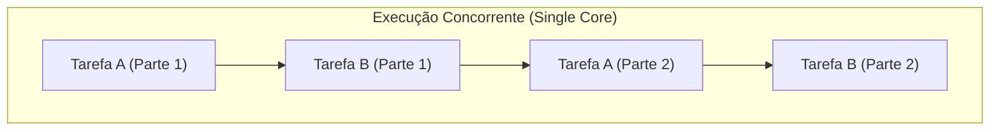
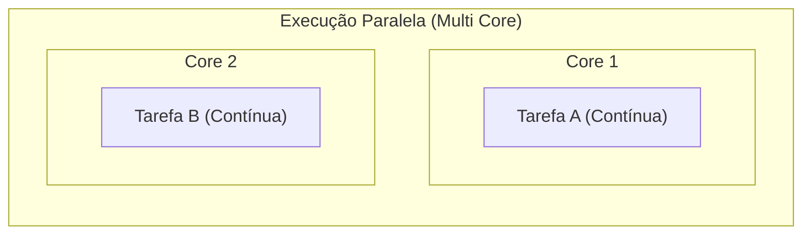

# Concorrência vs Paralelismo

## Objetivo
Ao final deste tópico, você será capaz de diferenciar conceitualmente concorrência de paralelismo, identificar como o hardware (single-core vs multi-core) afeta a execução física das tarefas e classificar problemas reais entre soluções concorrentes ou paralelas.

## Pré-requisitos
Nenhum. Este é o tópico introdutório de todo o assunto.

## Conceitos Fundamentais

Muitas vezes os termos "concorrência" e "paralelismo" são usados como sinônimos no dia a dia, mas eles representam conceitos fundamentalmente diferentes na computação. A melhor definição resumida pertence a **Rob Pike** (um dos criadores da linguagem Go):

> **"Concorrência é sobre estruturação. Paralelismo é sobre execução."**

### 1. Concorrência (Concurrency)
Concorrência é a capacidade de um sistema gerenciar e executar **múltiplas tarefas que fazem progresso de forma intercalada no tempo**. Trata-se de uma propriedade do *design* do software.
- Um sistema concorrente é aquele que lida com várias tarefas ao mesmo tempo, mas não necessariamente as executa no mesmo milionésimo de segundo.
- Em um processador com apenas **um único núcleo (single-core)**, a concorrência é alcançada dividindo o tempo de CPU entre as tarefas. Esse mecanismo é chamado de **Time Slicing** (fatiamento de tempo). O sistema operacional alterna as tarefas tão rapidamente que o usuário tem a ilusão de simultaneidade.

### 2. Paralelismo (Parallelism)
Paralelismo é a capacidade de executar **múltiplas tarefas de forma simultânea física no mesmo instante de tempo**. Trata-se de uma propriedade física do *hardware*.
- O paralelismo exige obrigatoriamente **múltiplos núcleos de processamento (multi-core)** ou múltiplos processadores físicos.
- Diferentes partes do programa rodam simultaneamente nos núcleos dedicados, sem necessidade de intercalação temporal para simular concorrência.

---

## Comparações

| Critério | Concorrência | Paralelismo |
| :--- | :--- | :--- |
| **Definição Básica** | Lidar com muitas coisas ao mesmo tempo. | Fazer muitas coisas ao mesmo tempo. |
| **Foco** | Estruturação e composição do software. | Velocidade de processamento físico. |
| **Hardware Necessário** | Roda em Core Único (via intercalação) ou Multi-core. | Exige obrigatoriamente Multi-core ou múltiplas CPUs. |
| **Problema que resolve** | Bloqueios e latência (ex: esperar resposta de rede sem travar a tela). | Alto processamento computacional (ex: renderização de vídeo, machine learning). |
| **Exemplo de Analogia** | Um único garçom atendendo várias mesas alternadamente. | Dois garçons, cada um atendendo uma mesa exclusiva. |

---

## Erros Comuns

1. **Achar que concorrência sempre torna o código mais rápido**: Adicionar concorrência introduz custos de coordenação (overhead) para alternar o contexto das tarefas. Em tarefas estritamente CPU-bound rodando em core único, a concorrência fará com que o tempo total seja maior do que executar uma tarefa depois da outra.
2. **Confundir concorrência com paralelismo físico**: A concorrência é um modelo lógico. Um código estruturado concorrentemente pode rodar em paralelo em um processador multi-core, ou concorrentemente de forma estritamente sequencial intercalada em um core único, sem alterar seu design de código.

---

## Exemplos

### Analogia do Mundo Real: A Cafeteira e a Torradeira

Imagine que seu café da manhã exige preparar um café na cafeteira e assar uma fatia de pão na torradeira.

- **Execução Sequencial (Sem Concorrência/Paralelismo)**:
  Você liga a cafeteira e fica parado esperando o café passar. Quando termina, você coloca o pão na torradeira e fica parado esperando o pão torrar.
  
- **Execução Concorrente (Core Único)**:
  Você coloca o café para passar. Enquanto a água esquenta, você aproveita o tempo morto para colocar o pão na torradeira. Enquanto o pão esquenta, você volta a organizar a xícara do café. Você está intercalando as tarefas. Como há apenas *você* (uma única CPU/Core), a execução física é feita em alternância rápida de foco.
  
- **Execução Paralela (Multi-core)**:
  Você coloca o café para passar e o seu parceiro/parceira coloca o pão na torradeira. Ambos estão ativamente trabalhando no mesmo instante físico de tempo. Havia duas entidades executoras (duas CPUs/Cores).

---

## Exercícios

### Exercício 1: Classificação de Cenários
Classifique as situações abaixo entre **Sequencial (S)**, **Concorrente mas não paralelo (C)** ou **Paralelo (P)**:

1. Um processador de texto que salva o arquivo em background enquanto permite que você continue digitando no teclado, rodando em um computador antigo de núcleo único.
2. Uma fazenda de renderização 3D composta por 16 servidores independentes calculando os frames de uma animação de cinema.
3. Um jogo de videogame antigo (como Super Mario World de Super Nintendo) onde o console processa a lógica de física, depois a IA dos inimigos, depois o desenho na tela, um passo estritamente após o outro.
4. Um servidor web moderno rodando em uma CPU de 8 núcleos que processa 8 conexões HTTP de clientes ao mesmo tempo no mesmo milionésimo de segundo.

### Exercício 2: Reflexão Teórica
Se você possui uma tarefa intensiva de CPU (CPU-bound) que leva 10 segundos para rodar sequencialmente, o que acontece com o tempo total de execução se você dividi-la em duas sub-tarefas e executá-las em um processador com apenas **um núcleo físico** usando time-slicing? Por quê?

---

## Referências
- [Rob Pike: Concurrency is not Parallelism (Palestra clássica do YouTube)](https://www.youtube.com/watch?v=oV9rvDllKEg)
- [Operating Systems: Three Easy Pieces (Livro gratuito) - Capítulo Concurrency Overview](https://pages.cs.wisc.edu/~remzi/OSTEP/)
- [Modern Operating Systems (Andrew Tanenbaum) - Fundamentos de escalonamento](https://www.amazon.com.br/Sistemas-Operacionais-Modernos-Andrew-Tanenbaum/dp/8543005677)
