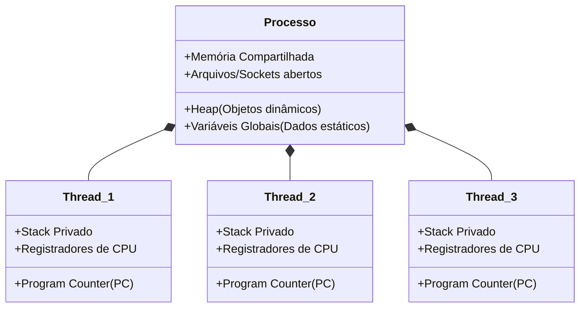

# Processos vs Threads

## Objetivo
Ao final deste tópico, você será capaz de explicar a diferença estrutural entre um Processo e uma Thread no nível do sistema operacional, descrever como o isolamento de memória funciona para processos e como o compartilhamento ocorre para threads, e avaliar os trade-offs de custo de criação e troca de contexto de ambos.

## Pré-requisitos
- [01-concurrency-vs-parallelism.md](01-concurrency-vs-parallelism.md)

## Conceitos Fundamentais

Para compreender a concorrência em nível de código, é obrigatório entender as duas unidades básicas de execução fornecidas pelos Sistemas Operacionais modernos: **Processos** e **Threads**.

### 1. O que é um Processo?
Um Processo é uma instância de um programa de computador em execução. Ele é uma unidade isolada que possui seu próprio espaço de memória privado garantido pelo hardware e pelo SO.
- **Isolamento de Memória**: Um processo não pode acessar a memória de outro processo diretamente. Se o Processo A tentar ler a memória do Processo B, o SO gerará uma falha de proteção de memória (Segmentation Fault).
- **Recursos**: Cada processo possui seu próprio identificador (PID - Process ID), descritores de arquivos abertos, conexões de rede e contexto de segurança.

### 2. O que é uma Thread?
Uma Thread (ou "linha de execução") é a menor unidade de processamento que o SO consegue agendar para rodar no processador.
- **Compartilhamento**: Threads existem **dentro** de um processo. Todas as threads de um mesmo processo compartilham os mesmos recursos do processo pai: a memória **Heap**, o código compilado, as variáveis globais e os arquivos abertos.
- **Exclusividade**: Cada thread possui sua própria pilha de chamadas (**Stack**) para armazenar variáveis locais e o histórico de funções chamadas, além de seu próprio conjunto de registradores de CPU (incluindo o Program Counter).

---

## Funcionamento Interno

A imagem abaixo ilustra a anatomia de um processo contendo três threads distintas. Note como a memória Heap e as variáveis globais são compartilhadas por todas as threads, enquanto cada thread possui seu próprio Stack (Pilha).

### Troca de Contexto (Context Switch)
Quando a CPU precisa alternar a execução de uma tarefa para outra:
- **Entre Processos**: O SO deve invalidar os caches de tradução de memória (TLB - Translation Lookaside Buffer), salvar todos os registradores, mudar as tabelas de páginas de memória física e carregar os dados do novo processo. É uma operação **muito lenta e custosa**.
- **Entre Threads do mesmo processo**: Como a memória mapeada é a mesma, o SO apenas salva os registradores e a pilha (Stack pointer) da thread atual e carrega os da nova thread. É uma operação **muito mais rápida**.

---

## Comparações

| Atributo | Processo | Thread (do mesmo processo) |
| :--- | :--- | :--- |
| **Memória** | Totalmente isolada por padrão. | Compartilhada (Heap e dados globais). |
| **Custo de Criação** | Alto (requer alocação de tabelas de páginas e memória). | Baixo (consome apenas uma pequena Stack e registradores). |
| **Troca de Contexto** | Lenta (overhead de gerência de memória/TLB do SO). | Rápida (apenas registradores e stack pointer). |
| **Falhas e Crash** | Seguro: se um processo cai, os outros continuam rodando. | Instável: se uma thread gera um crash (ex: null pointer, sigsegv), o processo inteiro morre. |
| **Comunicação (IPC)** | Complexa (requer Sockets, Pipes ou Memória Compartilhada). | Simples (leitura e escrita direta em variáveis na Heap). |

---

## Erros Comuns

1. **Achar que variáveis locais são compartilhadas**: Variáveis criadas dentro de funções residem no **Stack** de cada thread. Portanto, se duas threads executam a mesma função ao mesmo tempo, suas variáveis locais são totalmente independentes e seguras. O perigo reside apenas no acesso a variáveis na **Heap** (objetos instanciados de classe/estruturas passados por referência) ou variáveis globais.
2. **Subestimar o impacto de falha de uma Thread**: Em servidores HTTP baseados em threads clássicos, se uma thread tentar ler memória inválida ou estourar a memória (Stack Overflow), todo o servidor web (processo) pode cair de uma vez, afetando milhares de usuários conectados a outras threads saudáveis.

---

## Exemplos

### Caso de Uso Real: Arquitetura de Navegadores Web

- **Google Chrome (Baseado em Processos)**:
  O Chrome adota o modelo multi-processo. Cada aba aberta e cada extensão instalada roda em seu próprio **Processo** do sistema operacional.
  - *Vantagem*: Se o código JavaScript de uma aba travar ou estourar a memória, apenas aquela aba fecha com a tela triste. As outras abas continuam intactas.
  - *Desvantagem*: Consumo massivo de memória RAM, já que cada aba precisa duplicar as bibliotecas base do navegador em seu próprio espaço de endereçamento.

- **Navegadores Antigos (Baseados em Threads)**:
  Rodavam todas as abas e renderizações como **Threads** dentro de um único processo grande.
  - *Vantagem*: Extremamente leve no consumo de memória RAM.
  - *Desvantagem*: Instabilidade extrema. Se um único site contivesse um script corrompido que travasse a renderização de uma imagem, o navegador inteiro fechava abruptamente, fazendo o usuário perder todo o trabalho aberto em todas as abas.

---

## Exercícios

### Exercício 1: Identificação de Componentes de Memória
Indique se o componente de execução a seguir é **Compartilhado** entre todas as threads de um processo ou se é **Privado** a cada thread individual:

1. Variáveis locais criadas dentro de um laço de repetição de uma função executada pelas threads.
2. Variáveis globais do sistema declaradas no início do arquivo de código.
3. Conexões com banco de dados abertas pelo processo.
4. O ponteiro de instrução (Program Counter - que diz qual linha de código a CPU deve executar em seguida).
5. O objeto de usuário criado com `new Usuario()` e armazenado na memória dinâmica (Heap).

### Exercício 2: Trade-off de Arquitetura
Você está desenhando um sistema de processamento de pagamentos extremamente sensível a falhas (se uma transação corromper a memória, o sistema não pode parar as demais). Você escolheria isolar cada transação em seu próprio **Processo** ou rodar todas em **Threads** concorrentes? Justifique sua resposta com base nos conceitos aprendidos.

---

## Referências
- [Linux Man Pages - fork(2) vs clone(2) (Mecanismos de criação de processos e threads)](https://man7.org/linux/man-pages/man2/fork.2.html)
- [OS Dev Wiki - Processes and Threads](https://wiki.osdev.org/Processes_and_Threads)
- [How the Google Chrome browser works under the hood (Chrome Multi-process Architecture)](https://developer.chrome.com/blog/inside-browser-part1/)
