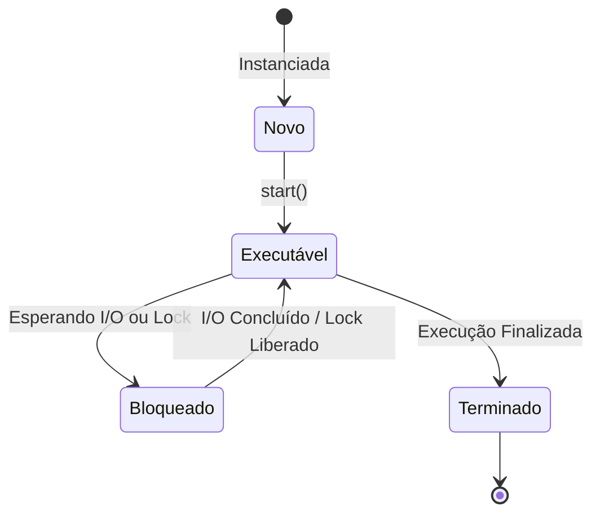
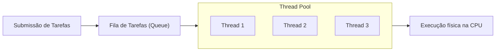

# Conceitos de Multithreading e Thread Pools

## Objetivo
Ao final deste tópico, você será capaz de explicar o ciclo de vida de uma thread, justificar por que a criação contínua de threads de sistema operacional prejudica a performance e utilizar Thread Pools para gerenciar recursos e executar tarefas concorrentes com eficiência.

## Pré-requisitos
- [02-processes-vs-threads.md](../01-foundations/02-processes-vs-threads.md)

## Conceitos Fundamentais

Gerenciar threads diretamente no nível de código exige entender como elas se comportam desde o nascimento até a morte e como os recursos de hardware limitam sua criação.

### 1. Ciclo de Vida de uma Thread
Uma thread não é apenas um bloco de código rodando; ela passa por vários estados gerenciados pelo agendador (Scheduler) do Sistema Operacional.



- **Novo (New)**: A thread foi criada na memória, mas ainda não começou a rodar (ex: instanciada na JVM).
- **Executável (Runnable/Running)**: A thread está ativa e pode ser executada pela CPU assim que o escalonador do SO lhe der uma fatia de tempo (Time Slice).
- **Bloqueado (Blocked/Waiting)**: A thread está temporariamente impedida de rodar. Isso acontece porque ela está esperando uma operação de entrada/saída (I/O) lenta (ler disco, banco de dados ou rede) ou aguardando a liberação de um Lock.
- **Terminado (Terminated)**: A execução do método principal da thread foi concluída ou interrompida por um erro. Ela não pode mais ser reiniciada.

### 2. O Custo das Threads do Sistema Operacional (OS Threads)
No modelo multithreading clássico (Java pré-21, C++, C#), cada thread criada no código é mapeada **1 para 1** para uma thread física gerenciada pelo kernel do Sistema Operacional.
Isso traz dois grandes limites físicos:
- **Consumo de Memória**: Cada thread de SO reserva, por padrão, cerca de **1 MB** de espaço de memória RAM para sua pilha de execução (Stack). Criar 1.000 threads consome imediatamente 1 GB de RAM apenas em overhead de Stack.
- **Sobrecarga de Context Switch**: Se o número de threads for muito maior que os núcleos físicos de CPU, o processador passará mais tempo salvando e carregando contextos de threads do que executando o código útil do sistema.

### 3. Thread Pools: Reutilização Eficiente de Recursos
Para evitar o custo de criar e destruir threads repetidamente, o padrão da indústria é o uso de **Thread Pools**. Em vez de instanciar threads sob demanda, nós criamos um conjunto pré-alocado de threads ativas (Workers) prontas para processar tarefas sob demanda.



---

## Funcionamento Interno

### Como dimensionar um Thread Pool?
O tamanho ideal do Thread Pool depende essencialmente da natureza das tarefas:

1. **Tarefas CPU-Bound (Cálculo intensivo, renderização, criptografia)**:
   Como o limitador é a própria capacidade de processamento física dos núcleos da CPU:
   $$\text{Tamanho Ideal} = N_{\text{cores}} + 1$$
   *Nota: O "+1" serve para lidar com eventuais falhas de página ou pequenas pausas.*

2. **Tarefas I/O-Bound (Chamadas HTTP, consultas a Banco de Dados, leitura de arquivos)**:
   Como a maior parte do tempo a thread passará bloqueada esperando respostas externas, podemos ter um pool substancialmente maior que o número de cores da CPU.
   A fórmula clássica de Brian Goetz define:
   $$\text{Tamanho Ideal} = N_{\text{cores}} \times U_{\text{cpu}} \times \left(1 + \frac{W}{C}\right)$$
   Onde:
   - $N_{\text{cores}}$ = número de cores da CPU.
   - $U_{\text{cpu}}$ = utilização alvo da CPU (entre $0$ e $1$).
   - $W$ = tempo de espera (Waiting time).
   - $C$ = tempo de computação (Compute time).
   - A razão $\frac{W}{C}$ mede o quão bloqueante é a tarefa. Se a thread espera 99ms por I/O e computa por 1ms, a razão é 99.

---

## Erros Comuns

1. **Criar Threads manuais em loops**:
   ```java
   // ERRO CRÍTICO: Se chegarem 10.000 requisições, o servidor vai quebrar com OutOfMemoryError
   for (Requisicao req : requisicoes) {
       new Thread(() -> processar(req)).start();
   }
   ```
   **Como evitar**: Utilizar abstrações de Thread Pools prontas das linguagens (como `ExecutorService` no Java ou pools internos da runtime).

2. **Tamanho fixo infinito para tarefas bloqueantes**: Utilizar pools fixos sem limite para tarefas que dependem de I/O externo lento. Se a API externa travar, todas as threads do pool ficarão bloqueadas e o sistema inteiro deixará de responder a novas requisições.

---

## Exemplos

### Código Java: Evitando criação manual de Threads

Abaixo está o exemplo clássico comparando a abordagem insegura (criação manual direta) com a abordagem profissional usando Thread Pools (`ExecutorService`).

```java
import java.util.concurrent.ExecutorService;
import java.util.concurrent.Executors;

public class GerenciamentoThreads {

    // Abordagem RUIM e Insegura
    public void processarRuim(List<Runnable> tarefas) {
        for (Runnable tarefa : tarefas) {
            // Cria uma thread de SO física nova para cada item, gerando risco de queda do sistema
            new Thread(tarefa).start();
        }
    }

    // Abordagem BOA e Segura (Thread Pool)
    public void processarBom(List<Runnable> tarefas) {
        // Cria um pool limitado a 10 threads de trabalho fixas
        ExecutorService pool = Executors.newFixedThreadPool(10);
        
        for (Runnable tarefa : tarefas) {
            // Envia a tarefa para a fila do pool. Um worker disponível irá pegá-la.
            pool.submit(tarefa);
        }
        
        // Finaliza o pool ordenadamente após a conclusão das tarefas agendadas
        pool.shutdown();
    }
}
```

---

## Exercícios

### Exercício 1: Cálculo de Dimensionamento de Pool
Você foi contratado para configurar o pool de conexões de um microserviço HTTP que roda em um servidor com **4 núcleos de CPU**. A principal tarefa desse serviço é fazer uma chamada a uma API legada remota. 
Medições mostram que cada requisição leva um total de **200 milissegundos**, dos quais apenas **10 milissegundos** são de processamento de CPU real (o restante é espera de rede - I/O).

Utilizando a fórmula clássica de Brian Goetz (e assumindo 100% de utilização alvo de CPU - $U_{\text{cpu}} = 1$), determine o tamanho ideal do Thread Pool para maximizar a eficiência desse servidor.

### Exercício 2: O Ciclo de Vida na Prática
O que acontece com os recursos físicos de CPU (tempo de processamento) quando uma Thread transiciona para o estado **Bloqueado (Blocked/Waiting)**? A CPU continua trabalhando para ela ou ela é retirada da linha de execução da CPU física? Justifique detalhadamente.

---

## Referências
- *Java Concurrency in Practice* — Brian Goetz (Seção 8.2: Sizing Thread Pools)
- [Oracle Java Documentation - Executor Interfaces](https://docs.oracle.com/javase/tutorial/essential/concurrency/executors.html)
- [Baeldung - Guide to java.util.concurrent.ExecutorService](https://www.baeldung.com/java-executor-service-tutorial)
