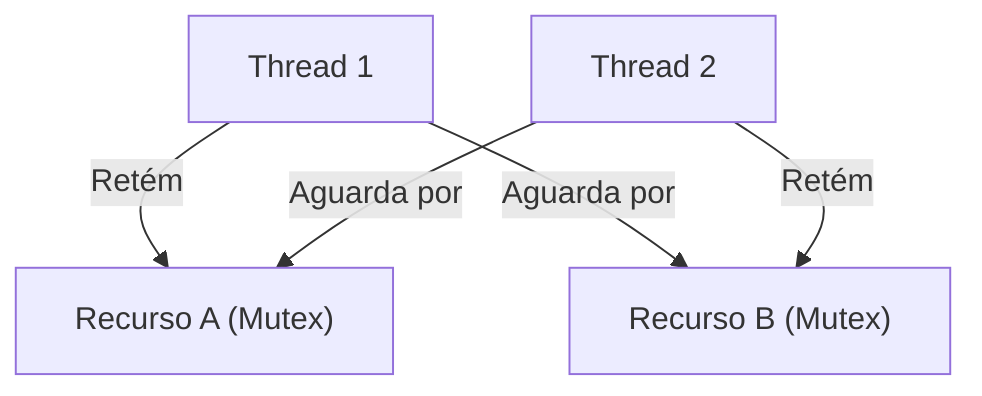

# Sincronização e Locks

## Objetivo
Ao final deste tópico, você será capaz de identificar e explicar condições de corrida (Race Conditions) em código concorrente, utilizar primitivas de sincronização (Mutex, Locks e Semáforos) para proteger seções críticas, explicar as quatro condições que geram Deadlocks e aplicar técnicas de design para preveni-los.

## Pré-requisitos
- [01-multithreading-concepts.md](01-multithreading-concepts.md)

## Conceitos Fundamentais

Quando múltiplas threads compartilham recursos em comum (como uma variável na Heap, um arquivo ou um objeto em memória) e pelo menos uma delas realiza operações de **escrita**, surge o risco de corrupção de dados. O coração do multithreading seguro é a gerência do **Estado Compartilhado Mutável (Shared Mutable State)**.

### 1. Seção Crítica e Condição de Corrida (Race Condition)
- **Seção Crítica**: Qualquer trecho de código que acessa um recurso compartilhado mutável e que não pode ser executado concorrentemente por mais de uma thread por vez sem risco de inconsistência.
- **Condição de Corrida**: Ocorre quando o resultado final da execução depende da ordem de agendamento em que as threads executam instruções na seção crítica.

#### O Problema do Contador Incremental (`count++`)
A instrução de incremento em qualquer linguagem de alto nível parece única, mas no nível do processador ela é composta por três operações distintas:
1. **Read**: A CPU lê o valor atual da variável da memória e armazena em um registrador.
2. **Modify**: A CPU incrementa o valor no registrador em 1.
3. **Write**: A CPU escreve o novo valor de volta na posição de memória.

Se duas threads realizam o incremento ao mesmo tempo, suas etapas podem se cruzar:
- Thread 1 lê `count = 10`
- Thread 2 lê `count = 10`
- Thread 1 modifica seu registrador para `11` e grava na memória.
- Thread 2 modifica seu registrador para `11` e grava na memória.
- **Resultado final**: A memória possui `11`, mas deveria conter `12`. Uma gravação foi perdida devido à condição de corrida.

### 2. Primitivas de Sincronização
Para proteger a Seção Crítica, utilizamos mecanismos que garantem a **Exclusão Mútua** (Mutual Exclusion - Mutex).

- **Mutex (Mutual Exclusion Lock)**: Um mecanismo de bloqueio binário. A thread que obtém o Mutex entra na seção crítica; qualquer outra thread que tentar entrar precisará esperar a liberação do Mutex.
- **Reentrant Lock**: Um Mutex avançado que permite que a thread que já possui o Lock o adquira novamente sem travar a si mesma (evitando self-deadlock).
- **Semáforo (Semaphore)**: Uma primitiva de controle de acesso que utiliza um contador. Ao contrário do Mutex (que é binário: 0 ou 1), o Semáforo permite gerenciar um pool de recursos limitados (ex: permitir no máximo 5 conexões simultâneas a um banco de dados).

---

## Funcionamento Interno

### Deadlock (Impasses de Sincronização)
Um Deadlock ocorre quando duas ou mais threads ficam bloqueadas para sempre, pois cada uma está esperando por um recurso retido pela outra thread.



#### As 4 Condições de Coffman para ocorrência de Deadlock:
Para que um Deadlock aconteça, as quatro condições abaixo devem ocorrer **simultaneamente**:
1. **Exclusão Mútua (Mutual Exclusion)**: Pelo menos um recurso deve ser retido em modo não compartilhável (apenas uma thread o usa por vez).
2. **Retenção e Espera (Hold and Wait)**: Uma thread retém um recurso já alocado enquanto aguarda a liberação de recursos adicionais mantidos por outras threads.
3. **Sem Preempção (No Preemption)**: Os recursos não podem ser tomados à força de uma thread; eles só podem ser liberados voluntariamente pela thread que os detém.
4. **Espera Circular (Circular Wait)**: A Thread 1 espera pelo Recurso B (retido pela Thread 2), que por sua vez espera pelo Recurso A (retido pela Thread 1).

---

## Comparações

| Critério | Mutex | Semáforo |
| :--- | :--- | :--- |
| **Tipo de Bloqueio** | Binário (Livre / Bloqueado). | Baseado em Contador (Permissões de $0$ a $N$). |
| **Propriedade** | A thread que bloqueia o Mutex **deve** desbloqueá-lo (Owner concept). | Qualquer thread pode liberar uma permissão (Signal/Release). |
| **Caso de Uso Comum** | Proteger uma variável ou seção crítica de escrita única. | Controlar limite de conexões ou taxa de chamadas (Rate Limit). |

---

## Erros Comuns

1. **Lock Nesting sem Ordem Consistente**: Adquirir Locks aninhados em ordem alternada em diferentes partes do código (ex: Thread A obtém Lock1 e depois Lock2; Thread B obtém Lock2 e depois Lock1). **Como evitar**: Sempre adquira múltiplos locks na mesma ordem em todo o sistema.
2. **Sincronização Excessiva (Over-synchronization)**: Bloquear partes inteiras do código desnecessariamente (como métodos inteiros gigantes). Isso elimina os benefícios da concorrência, transformando o programa em uma execução estritamente serial e lenta.

---

## Exemplos

### Código Java: Condição de Corrida e Correção com Lock/Sincronização

Abaixo está o exemplo clássico de um contador inseguro rodando concorrentemente e como corrigi-lo usando `synchronized` ou `ReentrantLock`.

```java
import java.util.concurrent.locks.Lock;
import java.util.concurrent.locks.ReentrantLock;

class ContadorInseguro {
    private int count = 0;

    // Risco de Race Condition se múltiplas threads chamarem ao mesmo tempo
    public void incrementar() {
        count++; 
    }

    public int getCount() { return count; }
}

class ContadorSeguroSynchronized {
    private int count = 0;

    // Solução 1: O bloco synchronized garante exclusão mútua em nível de objeto
    public synchronized void incrementar() {
        count++;
    }

    public synchronized int getCount() { return count; }
}

class ContadorSeguroReentrantLock {
    private int count = 0;
    private final Lock lock = new ReentrantLock();

    // Solução 2: Uso explícito do Lock com bloco try-finally para garantia de liberação
    public void incrementar() {
        lock.lock(); // Adquire o bloqueio
        try {
            count++;
        } finally {
            lock.unlock(); // Sempre libera no finally para evitar travamentos eternos se ocorrer exceção
        }
    }

    public int getCount() {
        lock.lock();
        try {
            return count;
        } finally {
            lock.unlock();
        }
    }
}
```

---

## Exercícios

### Exercício 1: Identificação de Potencial Deadlock
Analise o código abaixo em Java. Explique detalhadamente por que a execução de `metodoA` por uma Thread 1 e `metodoB` por uma Thread 2 concorrentemente pode causar um Deadlock e proponha uma correção estrutural de código para eliminar este perigo.

```java
public class TransacaoFinanceira {
    private final Object contaOrigem = new Object();
    private final Object contaDestino = new Object();

    public void metodoA() {
        synchronized (contaOrigem) {
            System.out.println("Thread 1: Bloqueou Origem");
            synchronized (contaDestino) {
                System.out.println("Thread 1: Transferindo...");
            }
        }
    }

    public void metodoB() {
        synchronized (contaDestino) {
            System.out.println("Thread 2: Bloqueou Destino");
            synchronized (contaOrigem) {
                System.out.println("Thread 2: Revertendo...");
            }
        }
    }
}
```

### Exercício 2: Teoria de Coffman
Qual das 4 condições de Coffman é violada quando utilizamos uma chamada de Lock com timeout (por exemplo, `lock.tryLock(5, TimeUnit.SECONDS)`) em vez de travar o fluxo indefinidamente com `lock.lock()`? Explique o porquê.

---

## Referências
- *Java Concurrency in Practice* — Brian Goetz (Capítulo 10: Avoiding Liveness Hazards)
- [Coffman Deadlock Conditions - Wikipedia](https://en.wikipedia.org/wiki/Deadlock#Necessary_conditions)
- [Baeldung - Synchronization in Java](https://www.baeldung.com/java-synchronized)
