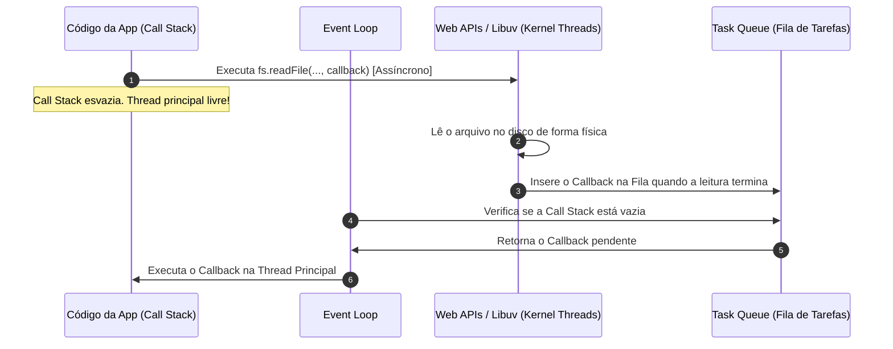

# Event Loop e Callbacks

## Objetivo
Ao final deste tópico, você será capaz de explicar o modelo de programação não-bloqueante orientada a eventos, descrever a arquitetura do Event Loop em sistemas de thread única (como Node.js/JavaScript), identificar problemas de Callback Hell e alertar sobre os riscos de bloquear a thread de eventos do sistema.

## Pré-requisitos
- [01-concurrency-vs-parallelism.md](../01-foundations/01-concurrency-vs-parallelism.md)

## Conceitos Fundamentais

Até agora, vimos a concorrência baseada na criação de múltiplas threads de sistema operacional rodando em paralelo. No entanto, existe outro modelo muito popular e altamente escalável para operações com alto volume de entrada e saída (I/O): a **Programação Assíncrona Não-Bloqueante**.

### 1. I/O Síncrono (Bloqueante) vs I/O Assíncrono (Não-Bloqueante)
- **Síncrono**: Quando uma thread solicita a leitura de um arquivo no disco ou uma chamada de rede HTTP, ela é "pausada" pelo SO (estado *Blocked*) até que os dados cheguem fisicamente. A thread fica inutilizada enquanto aguarda.
- **Assíncrono**: A thread despacha a requisição de leitura ao kernel do SO e, em vez de esperar, continua livre para rodar outras tarefas. O sistema é notificado quando a leitura terminar.

### 2. O Event Loop (Loop de Eventos)
O Event Loop é o coração de ambientes de execução assíncronos de thread única (como o motor V8 no JavaScript / Node.js). Em vez de alocar uma thread para cada conexão, ele roda continuamente em **uma única thread principal**, gerenciando uma fila de eventos (Task Queue).



### 3. Callbacks e o Callback Hell
Um **Callback** é uma função que você fornece à chamada assíncrona, dizendo: *"Quando essa tarefa lenta terminar, execute este bloco de código com o resultado"*.

Quando precisamos encadear múltiplas operações assíncronas dependentes uma da outra usando callbacks tradicionais, o código começa a crescer horizontalmente de forma desordenada. Esse fenômeno é conhecido como **Callback Hell** (ou *Pirâmide da Morte*):

```javascript
// Exemplo clássico de Callback Hell
lerUsuario(id, (err, usuario) => {
    if (err) return tratarErro(err);
    obterPedidos(usuario.id, (err, pedidos) => {
        if (err) return tratarErro(err);
        processarPagamento(pedidos[0], (err, recibo) => {
            if (err) return tratarErro(err);
            enviarEmail(usuario.email, recibo, (err) => {
                if (err) return tratarErro(err);
                console.log("Fluxo concluído!");
            });
        });
    });
});
```

---

## Erros Comuns

1. **Bloquear a Thread Principal (Event Loop)**:
   Como o Event Loop roda em uma única thread, se você executar um cálculo computacional pesado (ex: criptografar dados grandes de forma síncrona ou rodar um loop de 10 segundos), a thread principal ficará ocupada. Como consequência, **nenhum outro evento será processado** — todas as requisições HTTP de outros usuários do servidor ficarão congeladas.
   > *Regra de Ouro do Node.js: "Don't block the event loop!"*
   
2. **Achar que não existem outras threads**:
   O fato de o seu código rodar em uma única thread no Event Loop não significa que o runtime é single-threaded nos bastidores. O Node.js/Libuv utiliza um pool interno de threads (geralmente 4 por padrão) para lidar com operações de arquivos, criptografia e DNS no nível de kernel, fora da linha de visão do desenvolvedor.

---

## Exemplos

### JavaScript: A Armadilha da Ordem de Execução

Veja o código abaixo demonstrando como a pilha de execução (Call Stack) tem prioridade total e como o Event Loop apenas empurra itens da fila de tarefas quando a pilha está 100% vazia.

```javascript
console.log("1. Início do script");

// Registra um evento para rodar "imediatamente" (0 milissegundos)
setTimeout(() => {
    console.log("2. Dentro do setTimeout (Callback)");
}, 0);

console.log("3. Fim do script");

// Executa um loop síncrono que consome 2 segundos
const tempoAlvo = Date.now() + 2000;
while (Date.now() < tempoAlvo) {
    // Bloqueando a thread principal intencionalmente
}

console.log("4. Loop de bloqueio terminado");
```

**Saída no console:**
```text
1. Início do script
3. Fim do script
4. Loop de bloqueio terminado
2. Dentro do setTimeout (Callback)
```
*Explicação*: Embora o `setTimeout` tenha sido configurado com `0ms`, seu callback foi jogado na fila de tarefas (Task Queue). O Event Loop só pôde movê-lo para a pilha de chamadas após o script terminar inteiramente, incluindo o loop síncrono bloqueante de 2 segundos.

---

## Exercícios

### Exercício 1: Predição de Saída assíncrona
Dado o seguinte código em JavaScript, escreva qual será a ordem exata de saída exibida no console e justifique o porquê com base nas etapas do Event Loop:

```javascript
console.log("A");

setTimeout(() => {
    console.log("B");
}, 100);

setTimeout(() => {
    console.log("C");
}, 0);

console.log("D");
```

### Exercício 2: Análise de Cenário de Produção
Um desenvolvedor escreveu uma API web em Node.js para compressão de imagens. O código usa uma biblioteca que faz a compressão de forma síncrona na thread principal do JavaScript. Durante testes com 1 usuário, a API respondeu em 200ms. No entanto, quando 50 usuários começaram a enviar imagens simultaneamente, a latência de todos disparou para mais de 10 segundos, e novos clientes receberam erros de timeout de conexão.

Explique a raiz do problema técnico e proponha conceitualmente como resolvê-lo.

---

## Referências
- [MDN Web Docs - Concurrency model and the event loop](https://developer.mozilla.org/en-US/docs/Web/JavaScript/Event_loop)
- [Philip Roberts: What the heck is the event loop anyway? (Palestra clássica do JSConf)](https://www.youtube.com/watch?v=8aGhZQkoFbQ)
- [Node.js Official Guide - Don't Block the Event Loop](https://nodejs.org/en/docs/guides/dont-block-the-event-loop/)
