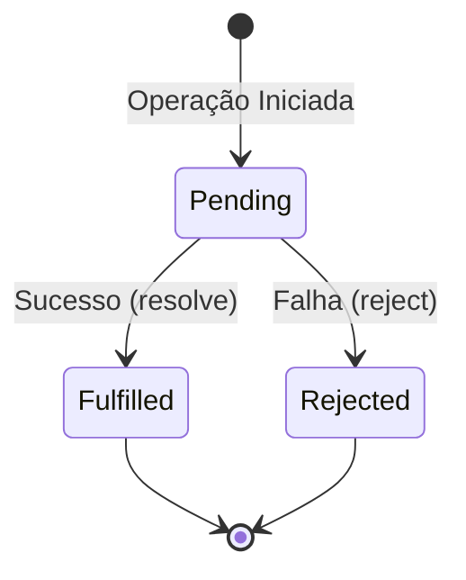

# Promises e Async/Await

## Objetivo
Ao final deste tópico, você será capaz de explicar os estados de uma Promise (ou Future), encadear operações assíncronas com tratamento de erros robusto, aplicar a sintaxe `async/await` para estruturar códigos limpos e legíveis, e utilizar mecanismos de concorrência paralela (como `Promise.all`) para otimizar chamadas assíncronas independentes.

## Pré-requisitos
- [01-event-loop-and-callbacks.md](01-event-loop-and-callbacks.md)

## Conceitos Fundamentais

Para resolver a bagunça visual e lógica dos Callbacks (Callback Hell), as linguagens modernas evoluíram para o conceito de **Promises** (ou *Futures* em linguagens como Java, Dart e Rust), seguidas do açúcar sintático **Async/Await**.

### 1. O que é uma Promise?
Uma Promise é um objeto que representa a **conclusão eventual (ou falha) de uma operação assíncrona**. Ela funciona como um recibo: você faz uma operação lenta, recebe uma Promise de volta e continua trabalhando; quando a operação termina, o recibo é preenchido com o valor final ou com o erro.

Uma Promise possui um ciclo de vida composto por três estados exclusivos:



- **Pending (Pendente)**: Estado inicial da operação. Ela ainda não terminou e o valor não está disponível.
- **Fulfilled (Realizada/Resolvida)**: A operação assíncrona foi concluída com sucesso e o valor de retorno está disponível.
- **Rejected (Rejeitada)**: A operação falhou por algum erro e o motivo da falha está disponível.

### 2. Encadeamento de Promises
Para processar os resultados e tratar erros em Promises puras, utilizamos os métodos `.then()`, `.catch()` e `.finally()`:

```javascript
obterDadosDoServidor()
    .then(dados => filtrarResultados(dados)) // Roda se der sucesso
    .then(resultadosFiltrados => salvarNoBanco(resultadosFiltrados))
    .catch(erro => console.error("Houve uma falha no fluxo:", erro)) // Captura qualquer erro do fluxo
    .finally(() => console.log("Operação terminada!")); // Roda sempre
```

### 3. O Padrão Async/Await
A sintaxe `async/await` é um **açúcar sintático (syntactic sugar)** construído sobre as Promises. Ela não muda a natureza assíncrona do JavaScript; em vez disso, ela permite estruturar o código assíncrono de maneira que ele **pareça síncrono e sequencial**, simplificando a leitura e a manutenção.

- **`async`**: Uma palavra-chave colocada antes da declaração de uma função. Ela garante que a função sempre retornará uma Promise de forma implícita.
- **`await`**: Só pode ser usado dentro de funções `async`. Ele pausa a execução daquela função específica de forma não-bloqueante até que a Promise seja resolvida, extraindo seu valor direto.

---

## Comparações

| Critério | Callbacks | Promises | Async / Await |
| :--- | :--- | :--- | :--- |
| **Legibilidade** | Ruim (crescimento horizontal). | Média (crescimento vertical via `.then()`). | Excelente (estrutura sequencial semelhante ao código síncrono). |
| **Tratamento de Erros** | Complexo (deve ser tratado em cada callback). | Centralizado (um único `.catch()` captura todo o fluxo). | Nativo (usa blocos de controle padrão `try/catch`). |
| **Composição** | Muito difícil. | Fácil (encadeamento simples). | Muito Fácil. |

---

## Erros Comuns

1. **Serializar requisições independentes (Gargalo de Await)**:
   ```javascript
   // ERRO: Fazer duas requisições que não dependem uma da outra em sequência
   const usuario = await buscarUsuario(); // Demora 1s
   const configuracoes = await buscarConfiguracoes(); // Demora 1s
   // Tempo total: 2 segundos
   ```
   **Como evitar**: Dispare as Promises em paralelo e aguarde todas usando `Promise.all` (ou equivalente na linguagem):
   ```javascript
   const [usuario, configuracoes] = await Promise.all([
       buscarUsuario(),
       buscarConfiguracoes()
   ]); // Tempo total: 1 segundo (execução paralela concorrente)
   ```

2. **Esquecer o `await`**:
   Chamar uma função assíncrona sem o `await` não dispara um erro imediato do interpretador. Em vez disso, a variável recebe o objeto `Promise { <pending> }` bruto, em vez do valor interno esperado.

3. **Omissão de `try/catch` (Unhandled Rejections)**:
   Esquecer de envelopar blocos de código com `await` em estruturas `try/catch` pode silenciar erros assíncronos críticos ou derrubar a aplicação por falta de tratamento de rejeições.

---

## Exemplos

### JavaScript: Refatorando do Callback Hell para Async/Await

Vamos refatorar o exemplo do Callback Hell abordado no arquivo anterior para a elegante estrutura moderna usando `async/await`.

#### Abordagem Refatorada com Async/Await:
```javascript
async function fluxoDeCompra(idUsuario) {
    try {
        // As operações rodam de forma sequencial limpa, mas sem bloquear a thread principal
        const usuario = await lerUsuario(idUsuario);
        const pedidos = await obterPedidos(usuario.id);
        const recibo = await processarPagamento(pedidos[0]);
        await enviarEmail(usuario.email, recibo);
        
        console.log("Fluxo concluído com sucesso!");
    } catch (erro) {
        // Qualquer erro em qualquer etapa cai diretamente aqui
        tratarErro(erro);
    }
}
```

---

## Exercícios

### Exercício 1: Otimização de Performance
Você recebeu o seguinte script responsável por carregar os dados de um painel administrativo.
Atualmente, as consultas ao banco de dados estão demorando muito. Identifique a armadilha de performance contida no código e reescreva a função `carregarPainel` de forma concorrente para reduzir o tempo total de execução para o tempo da consulta assíncrona mais lenta.

```javascript
async function carregarPainel() {
    console.time("Carregamento");
    
    // Consultas independentes
    const estatisticas = await db.obterEstatisticas(); // Leva 400ms
    const usuariosOnline = await db.obterUsuariosOnline(); // Leva 200ms
    const logsRecentes = await db.obterLogs(); // Leva 350ms
    
    console.timeEnd("Carregamento");
    return { estatisticas, usuariosOnline, logsRecentes };
}
```

### Exercício 2: O Retorno Silencioso
O que será impresso no console ao executar o código abaixo? Explique a mecânica por trás da saída observada.

```javascript
async function obterValor() {
    return 42;
}

function principal() {
    const valor = obterValor();
    console.log("O valor obtido é:", valor);
}

principal();
```

---

## Referências
- [MDN Web Docs - Using Promises](https://developer.mozilla.org/en-US/docs/Web/JavaScript/Guide/Using_promises)
- [MDN Web Docs - Async function](https://developer.mozilla.org/en-US/docs/Web/JavaScript/Reference/Statements/async_function)
- [JavaScript.info - Async/await](https://javascript.info/async-await)
