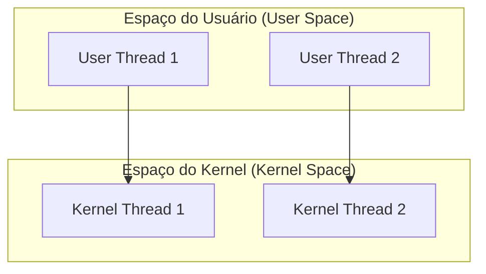
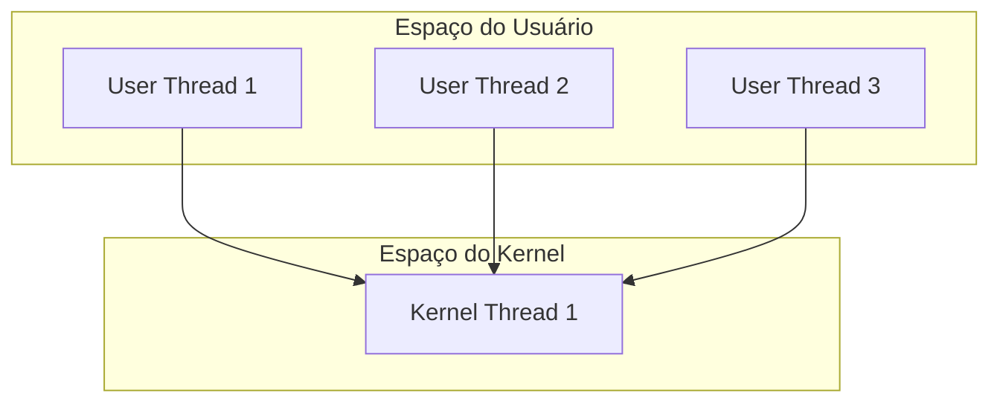
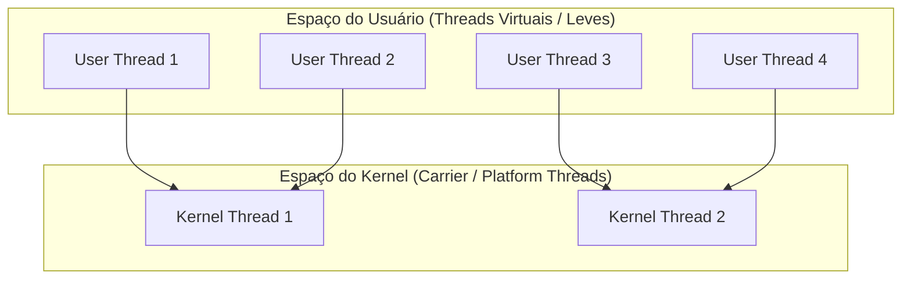

# Modelos de Mapeamento de Threads

## Objetivo
Ao final deste tópico, você será capaz de explicar as diferenças estruturais entre threads de usuário (User Threads) e threads do sistema operacional (Kernel Threads) e classificar os modelos de mapeamento 1:1, N:1 e M:N, compreendendo suas vantagens, limitações e aplicações modernas.

## Pré-requisitos
- [01-multithreading-concepts.md](../02-multithreading/01-multithreading-concepts.md)

## Conceitos Fundamentais

Para entender a revolução das Virtual Threads e Coroutines, precisamos dar um passo atrás e compreender como os sistemas operacionais e as linguagens de programação conectam o código de execução ao hardware.

Existem duas "categorias" de threads na computação:
1. **Kernel Threads (KThreads)**: Threads gerenciadas e agendadas diretamente pelo kernel do Sistema Operacional. A CPU física executa apenas estas threads.
2. **User Threads (UThreads)**: Threads criadas no código da aplicação e gerenciadas pela biblioteca/runtime da linguagem de programação (como a JVM ou o runtime do Go).

A forma como a biblioteca/runtime mapeia as **User Threads** nas **Kernel Threads** define o modelo de concorrência do sistema. Existem três modelos fundamentais de mapeamento:

---

## Os Três Modelos de Mapeamento

### 1. Modelo 1:1 (One-to-One / Threads Nativas)
Neste modelo, cada thread criada na aplicação corresponde exatamente a uma thread no kernel do sistema operacional.

- **Como funciona**: A aplicação apenas delega a criação e agendamento ao SO.
- **Vantagem**: Aproveita o paralelismo físico real de processadores multi-core de forma nativa e simples.
- **Desvantagem**: Altamente limitada em escalabilidade. Como cada thread de SO custa memória (~1MB de stack) e tempo de troca de contexto de CPU via kernel, é impossível rodar eficientemente centenas de milhares de threads concorrentes.
- **Exemplo**: Java tradicional, C++, C#/.NET tradicional, Rust.

---

### 2. Modelo N:1 (Many-to-One / Green Threads Históricas)
Neste modelo, todas as threads criadas na aplicação são executadas sob uma única thread real do kernel do SO. O agendamento é feito inteiramente pelo runtime da aplicação (no espaço do usuário).

- **Como funciona**: A biblioteca de execução intercepta as chamadas e alterna qual "user thread" roda na única thread real do kernel.
- **Vantagem**: Troca de contexto ultra-rápida (não exige transição para o kernel do SO) e baixíssimo consumo de memória por thread.
- **Desvantagem**: Não permite paralelismo real (múltiplos cores de CPU ficam ociosos). Além disso, **se uma única user thread fizer uma chamada de I/O síncrona/bloqueante**, a thread do kernel inteira bloqueia, travando todas as outras user threads da aplicação.
- **Exemplo**: Java 1.1 (Green Threads), Python clássico (com GIL), Ruby clássico.

---

### 3. Modelo M:N (Many-to-Many / Threads Híbridas ou Leves)
Neste modelo, a aplicação gerencia um grande número ($M$) de threads virtuais levemente estruturadas e as mapeia dinamicamente em um pool menor ($N$) de threads nativas do Kernel do SO.

- **Como funciona**: Se a `User Thread 1` for bloqueada esperando I/O, o runtime da linguagem detecta o bloqueio, salva o estado dela na Heap e "desmonta" essa thread da `Kernel Thread 1`, deixando-a livre para rodar a `User Thread 2`. Quando o I/O da `User Thread 1` termina, ela é "remontada" em qualquer Kernel Thread disponível.
- **Vantagem**: Altíssima escalabilidade (é possível criar milhões de threads concorrentes) combinada com paralelismo real (as $N$ threads nativas rodam nos múltiplos cores físicos).
- **Desvantagem**: O runtime/VM da linguagem precisa implementar um agendador (Scheduler) extremamente complexo em nível de espaço de usuário.
- **Exemplo**: Go (Goroutines), Java 21 (Virtual Threads), Kotlin (Coroutines).

---

## Comparações

| Critério | Modelo 1:1 (Nativo) | Modelo N:1 (Green Threads) | Modelo M:N (Leve / Híbrido) |
| :--- | :--- | :--- | :--- |
| **Paralelismo Real** | Sim. | Não (limita-se a 1 Core). | Sim. |
| **Escalabilidade** | Baixa (~milhares de threads). | Altíssima (~milhões de threads). | Altíssima (~milhões de threads). |
| **Troca de Contexto** | Lenta (gerenciada pelo Kernel). | Rápida (no espaço do usuário). | Rápida (no espaço do usuário). |
| **Bloqueio de I/O** | Bloqueia apenas a thread atual do SO. | Trava a aplicação inteira. | O agendador suspende a thread leve e libera a thread do SO. |
| **Complexidade** | Baixa (delega a lógica ao SO). | Média (exige agendador em thread única). | Altíssima (exige agendador híbrido e hooks em I/O). |

---

## Contexto Histórico: A Jornada do Java

A evolução do Java ilustra perfeitamente a importância destes modelos:
1. **Java 1.1 (N:1)**: Usava *Green Threads*. Era leve e rápido de desenvolver, mas não conseguia usar os novos computadores com dois processadores que surgiam no mercado.
2. **Java 1.3 a Java 19 (1:1)**: Mudou para *Native Threads*. Permitia paralelismo real, mas à medida que as aplicações web cresceram, os servidores sofriam para escalar porque cada thread consumia 1MB de RAM e sobrecarregava a CPU com trocas de contexto.
3. **Java 21 (M:N)**: Introduziu as *Virtual Threads* (Project Loom). O Java agora mantém o modelo 1:1 para threads de plataforma (`Platform Threads`) e permite criar milhões de `Virtual Threads` mapeadas dinamicamente sobre elas sob o modelo M:N.

---

## Exercícios

### Exercício 1: Diagnóstico de Travamento
Imagine um servidor web rodando sob o modelo **N:1** (Many-to-One). O servidor está atendendo 50 conexões de usuários ativos através de threads verdes de usuário. Uma das conexões solicita a leitura de um arquivo de configuração de 50MB no disco usando uma API clássica e bloqueante do SO.

O que acontece com os outros 49 usuários enquanto o arquivo está sendo lido? Por quê? E como esse cenário seria diferente sob o modelo **M:N**?

### Exercício 2: O Custo de CPU em Threads M:N
Se você possui uma tarefa puramente matemática (CPU-bound) como quebrar senhas usando criptografia hash, e seu servidor possui exatamente 8 núcleos físicos de CPU:
Faz sentido disparar 1.000.000 de threads virtuais (sob o modelo M:N) para realizar essa tarefa mais rapidamente do que usando 8 threads nativas (sob o modelo 1:1)? Explique o trade-off de recursos.

---

## Referências
- [Operating Systems: Three Easy Pieces - Chapter 26: Concurrency: An Introduction](https://pages.cs.wisc.edu/~remzi/OSTEP/threads-intro.pdf)
- [Project Loom: Understand JVM Virtual Threads](https://openjdk.org/jeps/444)
- [The Go Scheduler (Análise detalhada do agendador M:N de Go)](https://morsmachine.dk/go-scheduler)
