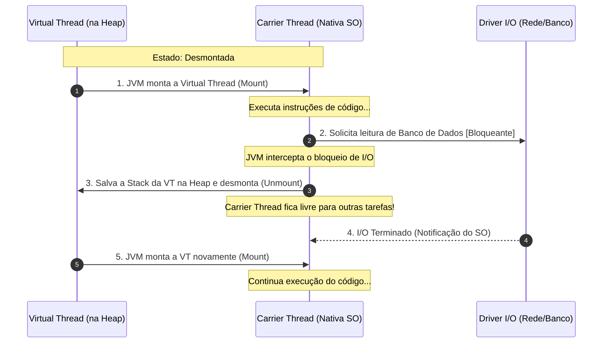

# Virtual Threads (Java 21 / Project Loom)

## Objetivo
Ao final deste tópico, você será capaz de explicar o funcionamento das Virtual Threads no ecossistema Java, diferenciar Virtual Threads de Platform Threads, descrever o mecanismo de Mount e Unmount, diagnosticar e resolver o problema de Pinning (fixação) de threads e aplicar as diretrizes corretas de design (como evitar o pooling de threads virtuais).

## Pré-requisitos
- [01-thread-mapping-models.md](01-thread-mapping-models.md)
- [02-promises-and-async-await.md](../03-asynchronous-programming/02-promises-and-async-await.md)

## Conceitos Fundamentais

Com o lançamento do Java 21 (via JEP 444), a JVM introduziu uma de suas maiores revoluções arquiteturais: as **Virtual Threads** (desenvolvidas sob o codinome *Project Loom*).

### 1. Platform Threads vs Virtual Threads
- **Platform Threads (Threads de Plataforma)**: São as threads clássicas do Java. Cada instância é encapsulada em torno de uma thread de SO física (modelo 1:1). Elas são caras, consomem 1MB de RAM por padrão e exigem troca de contexto no kernel.
- **Virtual Threads (Threads Virtuais)**: São threads leves gerenciadas inteiramente pelo runtime da JVM, e não pelo SO (modelo M:N). A pilha de chamadas (Stack) de uma Virtual Thread é armazenada na memória **Heap** do Java, em vez de memória nativa do SO. Elas custam apenas alguns bytes de memória e podem ser criadas aos milhões.

### 2. O Mecanismo de Execução: Mount e Unmount
As Virtual Threads não rodam na CPU diretamente. A JVM utiliza um pool interno de threads nativas de plataforma (chamadas **Carrier Threads** - geralmente gerenciadas por um `ForkJoinPool` com tamanho igual ao número de cores de CPU) para "carregar" e executar as threads virtuais.



1. **Mount (Montagem)**: A JVM associa a Virtual Thread a uma Carrier Thread disponível. A Carrier Thread começa a executar as instruções da Virtual Thread.
2. **Unmount (Desmontagem)**: Quando a Virtual Thread executa uma operação de I/O bloqueante (ex: `Thread.sleep()`, ler do socket, chamar banco de dados), o runtime do Java captura esse bloqueio. A JVM copia o frame de pilha (Stack Frame) da Virtual Thread de volta para a memória **Heap**, desassocia a Virtual Thread da Carrier Thread, e deixa a Carrier Thread livre para rodar qualquer outra Virtual Thread disponível.
3. **Re-mount**: Assim que a operação de I/O termina, o agendador da JVM coloca a Virtual Thread na fila de prontos e a monta novamente em qualquer Carrier Thread livre para continuar a execução.

---

## O Problema do Pinning (Fixação)

Embora as Virtual Threads sejam incríveis, existe um cenário crítico onde a desmontagem falha: o **Pinning**.
Quando uma Virtual Thread fica "fixada" (*pinned*) à sua Carrier Thread, ela **não pode ser desmontada** durante chamadas bloqueantes de I/O. Isso significa que a Carrier Thread nativa também fica totalmente bloqueada, sabotando a escalabilidade do sistema.

### Principais causas de Pinning:
1. Execução de código dentro de um bloco ou método marcado como `synchronized`.
2. Execução de métodos nativos (JNI - Java Native Interface) na pilha de chamadas.

### Como resolver o Pinning por `synchronized`:
Substituir o uso de `synchronized` pela primitiva moderna `ReentrantLock` do pacote `java.util.concurrent.locks`. O `ReentrantLock` possui suporte nativo para desmontagem de Virtual Threads.

---

## Erros Comuns e Boas Práticas

1. **Fazer Pool de Virtual Threads (Antipattern)**:
   Tradicionalmente, criamos pools de threads porque criar threads nativas é muito caro. No entanto, Virtual Threads são extremamente baratas. Fazer pool de virtual threads é como fazer pool de strings ou objetos simples em Java: um desperdício de complexidade.
   - *Boa Prática*: Sempre crie uma nova Virtual Thread dedicada para cada tarefa. Use a abstração `Executors.newVirtualThreadPerTaskExecutor()`.

2. **Abuso de `ThreadLocal`**:
   Como as Virtual Threads podem existir aos milhões ao mesmo tempo, associar estruturas de dados pesadas a variáveis `ThreadLocal` consumirá gigabytes de memória Heap, podendo gerar vazamentos de memória e erros de `OutOfMemoryError`.

---

## Exemplos

### Código Java: Criando e usando Virtual Threads corretamente

O exemplo abaixo demonstra como criar milhões de tarefas bloqueantes com Virtual Threads sem derrubar o sistema e como corrigir o problema de Pinning.

```java
import java.time.Duration;
import java.util.concurrent.ExecutorService;
import java.util.concurrent.Executors;
import java.util.concurrent.locks.Lock;
import java.util.concurrent.locks.ReentrantLock;

public class ExemploVirtualThreads {

    // 1. Criando um executor de threads virtuais (uma thread nova por tarefa)
    public void executarMultiplasTarefas() {
        try (ExecutorService executor = Executors.newVirtualThreadPerTaskExecutor()) {
            for (int i = 0; i < 100_000; i++) {
                executor.submit(() -> {
                    // Simula uma espera de I/O bloqueante (rede/banco de dados)
                    Thread.sleep(Duration.ofSeconds(1));
                    return null;
                });
            }
        } // O bloco try-with-resources faz o shutdown automático e aguarda a finalização
    }

    // 2. Corrigindo o problema de Pinning
    
    // ABORDAGEM COM PINNING (Evitar com Virtual Threads)
    private final Object lockObjeto = new Object();
    public void metodoComPinning() {
        synchronized (lockObjeto) {
            // Se bloquear em I/O aqui dentro, a thread nativa (Carrier) trava junto
            fazerIoBloqueante();
        }
    }

    // ABORDAGEM CORRETA (Sem Pinning)
    private final Lock reentrantLock = new ReentrantLock();
    public void metodoSemPinning() {
        reentrantLock.lock();
        try {
            // A JVM consegue desmontar a Virtual Thread da Carrier Thread com sucesso aqui!
            fazerIoBloqueante();
        } finally {
            reentrantLock.unlock();
        }
    }

    private void fazerIoBloqueante() {
        try { Thread.sleep(Duration.ofMillis(100)); } catch (InterruptedException e) {}
    }
}
```

---

## Exercícios

### Exercício 1: Refatoração para eliminar Pinning
Dado o trecho de código abaixo de um serviço de banco de dados legado, reescreva-o para torná-lo 100% compatível com a concorrência leve de Virtual Threads, eliminando o risco de bloqueio das Carrier Threads.

```java
public class ServicoBancoLegado {
    private final Map<String, String> cache = new HashMap<>();

    public synchronized String consultarDadoComBloqueio(String chave) {
        if (cache.containsKey(chave)) {
            return cache.get(chave);
        }
        // Chamada de rede bloqueante externa
        String valor = APIExterna.buscarChave(chave); 
        cache.put(chave, valor);
        return valor;
    }
}
```

### Exercício 2: Reflexão Arquitetural
Se a sua aplicação web realiza processamento de arquivos PDF pesados (criptografar, ler conteúdo e extrair imagens) em cada requisição HTTP recebida, migrar o servidor de threads clássicas para Virtual Threads trará melhoria significativa de performance e throughput? Justifique detalhadamente.

---

## Referências
- [JEP 444: Virtual Threads (OpenJDK)](https://openjdk.org/jeps/444)
- [Baeldung - Guide to Virtual Threads in Java](https://www.baeldung.com/java-virtual-threads)
- [Virtual Threads: New Threads in Java (Spring Framework blog)](https://spring.io/blog/2022/10/11/embracing-virtual-threads)
