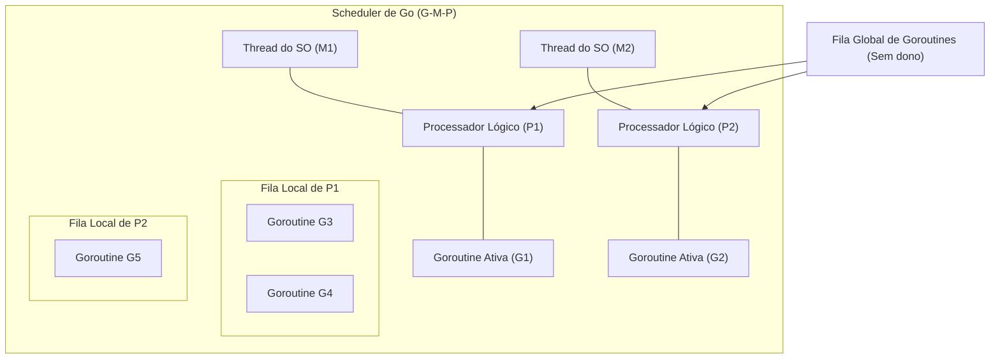

# Coroutines e Goroutines

## Objetivo
Ao final deste tópico, você será capaz de explicar os modelos de concorrência baseados em Goroutines (Go) e Coroutines (Kotlin/Python/C#), diferenciar o multitasking preemptivo do multitasking cooperativo, descrever o modelo de agendamento G-M-P de Go e evitar erros críticos como vazamentos de goroutines (Goroutine Leaks) e bloqueio físico de dispatchers de corotinas.

## Pré-requisitos
- [01-thread-mapping-models.md](01-thread-mapping-models.md)
- [02-promises-and-async-await.md](../03-asynchronous-programming/02-promises-and-async-await.md)

## Conceitos Fundamentais

Duas das implementações mais famosas de concorrência leve no mercado são as **Goroutines** da linguagem Go e as **Coroutines** (adotadas em Kotlin, Python, C# e C++). Embora ambas permitam alta concorrência com baixo consumo de memória, seus modelos de agendamento e filosofia de execução possuem diferenças cruciais.

---

### 1. Goroutines (Linguagem Go)
As Goroutines são funções que executam concorrentemente com outras funções. Elas consomem apenas **2 KB** de memória inicial de pilha (que cresce de forma dinâmica) e são gerenciadas pelo **Go Scheduler**, integrado diretamente no binário compilado do Go.

#### O Modelo de Agendamento G-M-P de Go
O runtime de Go utiliza três entidades para gerenciar a execução concorrente:
- **G (Goroutine)**: Representa a goroutine, contendo sua pilha e ponteiros de instrução.
- **M (Machine / OS Thread)**: Representa uma thread real do Kernel do SO física.
- **P (Processor / Recurso de Agendamento)**: Representa um recurso lógico necessário para executar código Go. O número de $P$ é geralmente igual ao número de cores de CPU físicos do servidor.



O Go utiliza um algoritmo de **Work Stealing (Roubo de Trabalho)**: se a Fila Local do Processador $P2$ esvaziar, ele tenta "roubar" metade das goroutines pendentes da Fila Local de $P1$ ou busca na Fila Global. Isso garante um balanceamento de carga de CPU perfeito nos múltiplos núcleos.

---

### 2. Coroutines (Kotlin / Python / C#)
Ao contrário das goroutines, que utilizam multitasking preemptivo (o runtime do Go pode pausar uma goroutine a qualquer momento para dar chance a outra), as Coroutines utilizam o modelo de **Multitasking Cooperativo**.

- **Suspensão Voluntária**: Uma corotina deve conter pontos de suspensão explícitos (ex: a palavra-chave `suspend` em Kotlin, ou o uso de `await`/`yield` em Python/C#). A corotina decide voluntariamente pausar sua execução para devolver o controle da thread física para que outra corotina possa rodar.
- **Execução Leve**: Quando uma corotina suspende, o runtime apenas salva a referência de seu estado atual na memória e a retira da pilha. Não há custo de thread nativa.

---

## Comparações

| Atributo | Goroutines (Go) | Coroutines (Kotlin) | Virtual Threads (Java 21) |
| :--- | :--- | :--- | :--- |
| **Multitasking** | **Preemptivo**: O runtime decide quando alternar (sem pontos explícitos exigidos). | **Cooperativo**: A corotina deve suspender voluntariamente (`suspend`). | **Híbrido/Preemptivo**: A JVM gerencia os pontos de montagem e desmontagem. |
| **Sintaxe no Código** | Transparente. Qualquer chamada regular parece síncrona. | Exige marcações explícitas (`suspend`, `launch`, `async`). | Transparente. APIs síncronas legadas funcionam sem alteração. |
| **Comunicação** | Canais de Mensagens (Channels) por padrão. | Canais ou compartilhamento direto de estado. | Estruturas de sincronização clássicas (`Locks`, `Queues`). |
| **Tamanho Inicial** | ~2 KB. | ~Poucos bytes (apenas o frame de estado). | ~Alguns bytes na Heap. |

---

## Erros Comuns

1. **Vazamento de Goroutine (Goroutine Leak)**:
   Ocorre quando uma goroutine é iniciada, mas fica bloqueada eternamente esperando por um canal de mensagens (channel) que nunca é escrito ou fechado, ou tentando escrever em um canal sem receptores. Ela nunca será coletada pelo Garbage Collector, vazando memória silenciosamente.
   
2. **Bloquear Threads em Corotinas Cooperativas**:
   Em Kotlin, se você rodar uma chamada de I/O bloqueante física (ex: `Thread.sleep()` ou JDBC síncrono) dentro do contexto padrão do dispatcher (`Dispatchers.Default`), você travará a thread física subjacente. Como o modelo é cooperativo, outras corotinas agendadas para rodar na mesma thread ficarão impedidas de prosseguir.
   - *Correção*: Sempre alterne para dispatchers de I/O adequados (ex: `withContext(Dispatchers.IO)` em Kotlin) para que o runtime saiba gerenciar o bloqueio físico.

---

## Exemplos

### 1. Exemplo Go: Goroutines e Comunicação via Channels
Em Go, evitamos compartilhar memória. A filosofia é: *"Não comunique compartilhando memória; em vez disso, compartilhe memória comunicando"*.

```go
package main

import (
	"fmt"
	"time"
)

func processarDados(canal chan string) {
	time.Sleep(1 * time.Second) // Simula I/O
	canal <- "Dados Processados com Sucesso!" // Envia mensagem pelo canal
}

func main() {
	canal := make(chan string)

	// Inicia a execução concorrente em background usando a palavra-chave 'go'
	go processarDados(canal)

	fmt.Println("Aguardando resultado...")
	
	// O fluxo principal bloqueia de forma segura até que chegue um dado no canal
	resultado := <-canal
	fmt.Println("Resultado:", resultado)
}
```

### 2. Exemplo Kotlin: Coroutines Cooperativas
```kotlin
import kotlinx.coroutines.*

fun main() = runBlocking { // Cria um escopo de bloqueio para a thread principal
    launch { // Dispara uma nova corotina em background
        delay(1000L) // PONTO DE SUSPENSÃO: A corotina cede a thread por 1 segundo
        println("Mundo!")
    }
    
    print("Olá, ") // A thread principal continua rodando enquanto a outra corotina está suspensa
}
// Saída: Olá, Mundo! (após 1 segundo de delay)
```

---

## Exercícios

### Exercício 1: Identificação de Vazamento de Goroutine
O código Go abaixo compila e roda, mas possui um vazamento de memória silencioso (**Goroutine Leak**). Explique detalhadamente por que a goroutine criada dentro da função `BuscarDado` fica presa na memória para sempre e como corrigir este problema utilizando canais com buffer.

```go
package main

import (
	"fmt"
	"time"
)

func BuscarDado() string {
	canal := make(chan string)

	go func() {
		time.Sleep(500 * time.Millisecond)
		canal <- "Resultado da API" // A goroutine envia dados aqui
	}()

	// Cenário: O fluxo principal desiste de esperar após um timeout curto
	select {
	case res := <-canal:
		return res
	case <-time.After(100 * time.Millisecond):
		return "Timeout excedido"
	}
}

func main() {
	res := BuscarDado()
	fmt.Println(res)
	time.Sleep(1 * time.Second) // Tempo para simular vida da app
}
```

### Exercício 2: Diagnóstico em Kotlin
Imagine que você tem o seguinte código em Kotlin:

```kotlin
suspend fun carregarDadosLocais() = withContext(Dispatchers.Default) {
    Thread.sleep(5000L) // Bloqueio físico de thread
    "Dados"
}
```

Explique se este código respeita as regras de cooperação de corotinas do Kotlin. Qual é a falha contida nele e como ela deveria ser corrigida?

---

## Referências
- [A Tour of Go - Goroutines](https://go.dev/tour/concurrency/1)
- [Kotlin Docs - Coroutines Guide](https://kotlinlang.org/docs/coroutines-overview.html)
- [Go Scheduler: G, M, P Model Internals](https://go.dev/src/runtime/proc.go)
