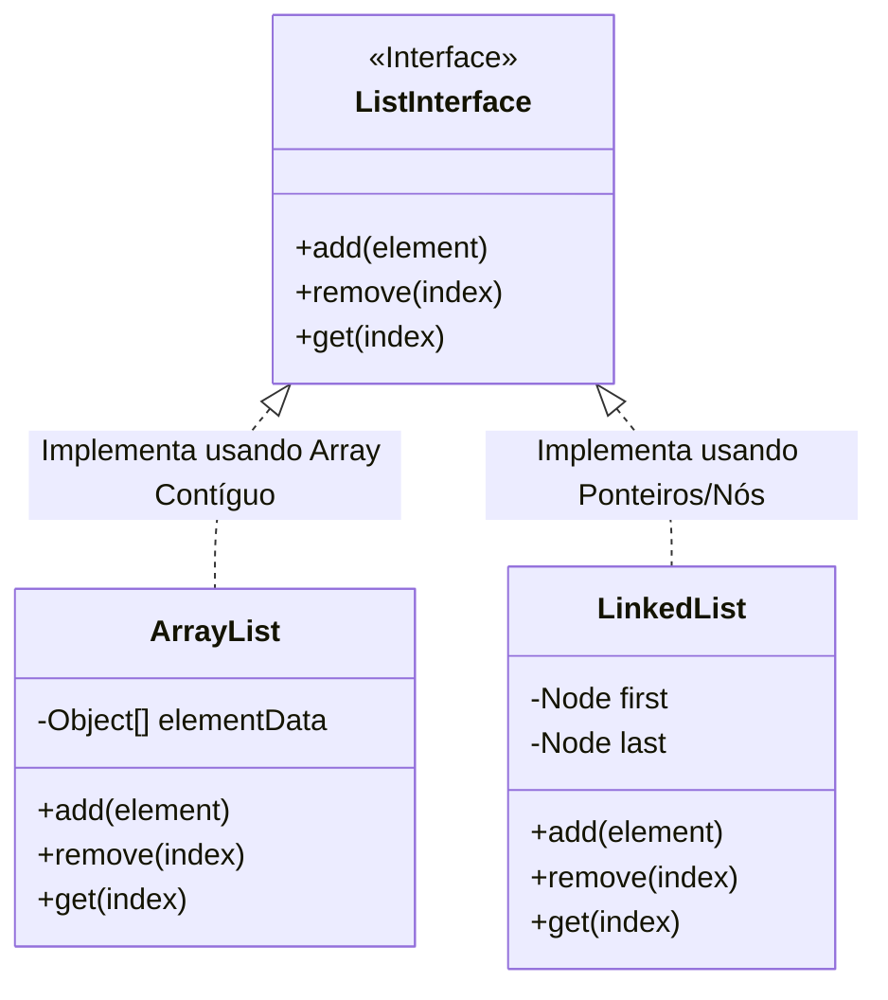
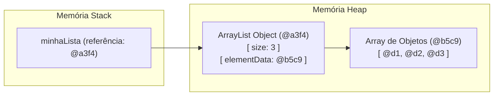

# Introdução a Estruturas de Dados e ADTs

## Objetivo
Ao final deste tópico, o estudante será capaz de diferenciar um Tipo Abstrato de Dados (ADT) de uma estrutura de dados concreta, explicar o papel da memória (Stack vs. Heap) no armazenamento de estruturas e descrever os trade-offs gerais que envolvem a escolha de representações de dados na memória.

## Pré-requisitos
- Conhecimento básico de programação em Java (classes, referências a objetos e métodos).

## Conceitos Fundamentais

### 1. O que é uma Estrutura de Dados?
Uma **Estrutura de Dados** é uma forma organizada e sistemática de armazenar, gerenciar e organizar dados em um computador para que possamos realizar operações de forma eficiente. Ela define as relações lógicas entre os dados e a representação física na memória.

### 2. ADT (Abstract Data Type / Tipo Abstrato de Dados)
Um **Tipo Abstrato de Dados (ADT)** é um modelo matemático ou uma especificação de comportamento de uma coleção de dados, definida pelas operações permitidas sobre ele e pelas regras que as regem, **sem definir como esses dados são de fato representados fisicamente** ou implementados na memória.

Em termos práticos de Java:
- Um **ADT** é semelhante a uma **Interface** (`interface`). Ele diz *o que* a estrutura faz (ex: `List`, `Map`, `Queue`).
- A **Estrutura de Dados** concreta é a classe que implementa essa interface. Ela diz *como* as operações são realizadas na memória física (ex: `ArrayList` implementa `List` usando um array; `LinkedList` implementa `List` usando nós conectados).



### 3. Gerenciamento de Memória no Java: Stack vs. Heap
Para entender as estruturas de dados, precisamos compreender como a JVM (Java Virtual Machine) organiza a memória:

- **Stack (Pilha)**: Armazena chamadas de métodos e variáveis locais (tipos primitivos como `int`, `double` e **referências/endereços de objetos**). Possui alocação rápida e escopo bem definido (ciclo de vida associado à execução do método).
- **Heap (Monte)**: Onde os objetos reais e seus dados associados são alocados dinamicamente via operador `new`. Qualquer estrutura de dados dinâmica (como uma lista encadeada ou árvore) vive na Heap. As variáveis na Stack apenas apontam (guardam a referência) para esses dados na Heap.



---

## Funcionamento Interno
Quando criamos qualquer estrutura de dados em Java, os dados brutos são empacotados em instâncias de classes (Objetos) e o acesso a esses objetos é feito via referências. Cada referência em arquiteturas modernas de 64 bits consome tipicamente 8 bytes (ou 4 bytes se a JVM usar *Compressed OOPs*). Esse "overhead" de ponteiros deve ser considerado quando calculamos a complexidade espacial de estruturas encadeadas.

---

## Vantagens e Desvantagens dos ADTs

### Vantagens
* **Encapsulamento**: O usuário da estrutura não precisa saber como os ponteiros e a memória são gerenciados internamente.
* **Flexibilidade**: É possível substituir uma implementação (ex: mudar de `ArrayList` para `LinkedList`) sem alterar o código cliente que interage com a interface.
* **Manutenibilidade**: Facilita a correção de bugs de performance em um único local da implementação concreta.

### Desvantagens
* **Abstração Custa Desempenho**: Em alguns casos extremos, a indireção gerada pelas chamadas de métodos de interfaces e referências a objetos pode introduzir overhead de desempenho e consumo extra de memória em relação a estruturas nativas primitivas.

---

## Erros Comuns
1. **Confundir a Interface com a Estrutura de Dados**: Declarar `ArrayList<Integer> list = new ArrayList<>()` em vez de `List<Integer> list = new ArrayList<>()`. O uso da interface (`List`) promove melhor desacoplamento.
2. **Ignorar o Overhead de Objetos (Java Boxing)**: Criar estruturas contendo tipos wrappers como `Integer` ou `Double` em massa. Cada `Integer` é um objeto na Heap com overhead de metadados de ~16 bytes, enquanto um `int` primitivo ocupa apenas 4 bytes diretamente na memória.

---

## Exemplos

O exemplo abaixo ilustra a definição de um ADT simples para uma coleção "Saco" (`Bag`) de elementos e sua respectiva implementação de estrutura de dados usando uma lista encadeada interna.

### Definindo o ADT (Interface)
```java
/**
 * Especificação do ADT Bag (Saco).
 * Um saco permite apenas inserção e consulta de tamanho/pertencimento,
 * sem ordem definida.
 */
public interface Bag<T> extends Iterable<T> {
    void add(T item);
    boolean isEmpty();
    int size();
}
```

### Implementação Concreta da Estrutura de Dados
```java
import java.util.Iterator;
import java.util.NoSuchElementException;

/**
 * Implementação do ADT Bag usando uma Lista Encadeada Simples interna.
 */
public class LinkedBag<T> implements Bag<T> {
    private Node<T> first; // início do saco
    private int size;      // quantidade de elementos

    // Classe privada interna que representa a estrutura física de memória
    private static class Node<T> {
        T item;
        Node<T> next;
    }

    public LinkedBag() {
        this.first = null;
        this.size = 0;
    }

    @Override
    public void add(T item) {
        Node<T> oldFirst = first;
        first = new Node<>();
        first.item = item;
        first.next = oldFirst;
        size++;
    }

    @Override
    public boolean isEmpty() {
        return first == null;
    }

    @Override
    public int size() {
        return size;
    }

    @Override
    public Iterator<T> iterator() {
        return new LinkedBagIterator();
    }

    private class LinkedBagIterator implements Iterator<T> {
        private Node<T> current = first;

        @Override
        public boolean hasNext() {
            return current != null;
        }

        @Override
        public T next() {
            if (!hasNext()) {
                throw new NoSuchElementException();
            }
            T item = current.item;
            current = current.next;
            return item;
        }
    }
}
```

---

## Exercícios

### Exercício 1: Teórico — Análise de Representação
Esboce um diagrama manual ou descreva como os objetos do código abaixo estão alocados na memória (Stack vs. Heap):
```java
Bag<String> bag = new LinkedBag<>();
bag.add("Java");
bag.add("Kotlin");
```
*Dica: Quantas instâncias de `Node` foram alocadas na Heap? A variável `bag` aponta para qual objeto?*

### Exercício 2: Prático — Adição de Operação ao ADT
1. Modifique a interface `Bag<T>` para incluir um novo método: `boolean contains(T item);`
2. Implemente o método `contains` na classe `LinkedBag<T>` percorrendo os nós da lista encadeada usando a referência `next`.

---

## Referências
* SEDGEWICK, Robert; WAYNE, Kevin. **Algorithms**. 4. ed. Boston: Addison-Wesley, 2011. Capítulo 1.3 (Bags, Queues, and Stacks).
* Documentação oficial da Interface Iterable do Java: [Oracle Java Docs - Iterable](https://docs.oracle.com/en/java/javase/17/docs/api/java.base/java/lang/Iterable.html).
* Oracle Java SE Virtual Machine Specification: [Memory Layout](https://docs.oracle.com/javase/specs/jvms/se17/html/index.html).
