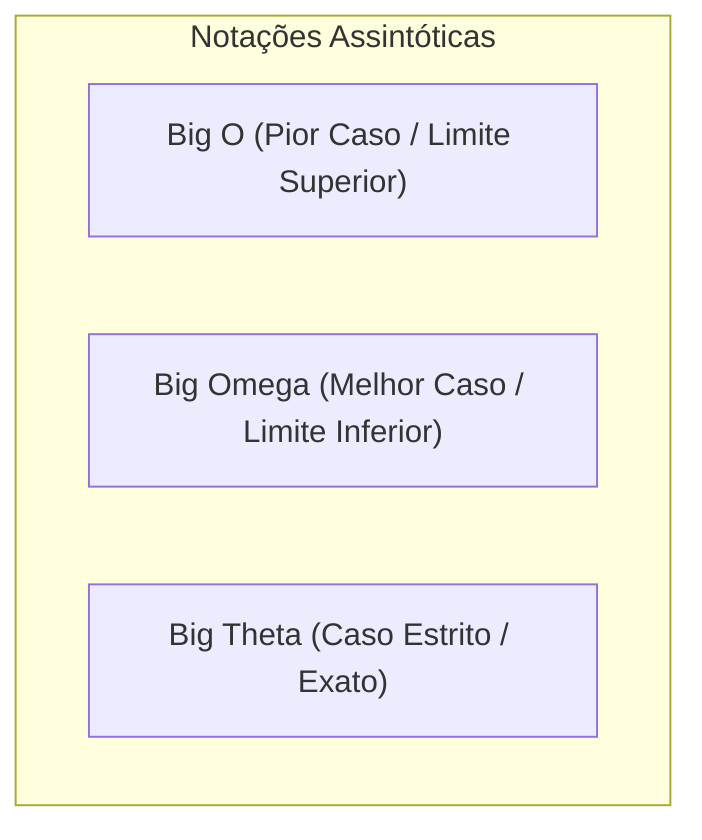
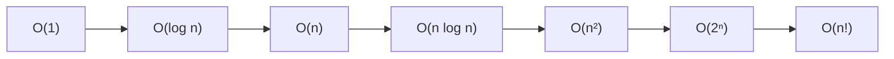

# Análise de Complexidade de Algoritmos e Notação Big O

## Objetivo
Ao final deste tópico, o estudante será capaz de formalizar a eficiência de tempo e espaço de um algoritmo usando as notações assintóticas ($\mathcal{O}$, $\Omega$, $\Theta$), calcular a complexidade de algoritmos iterativos e recursivos simples em Java, e identificar as diferentes classes de complexidade (constante, logarítmica, linear, quadrática, exponencial).

## Pré-requisitos
- [01. Introdução a Estruturas de Dados e ADTs](./01-introduction-to-data-structures.md)
- Álgebra básica (logaritmos, potências e progressões).

## Conceitos Fundamentais

### 1. Por que analisar algoritmos?
Diferentes algoritmos podem resolver o mesmo problema de formas distintas. Para compará-los sem depender do hardware (processador, memória, compilador) ou das condições de execução, analisamos o **crescimento do tempo de execução** e do **consumo de memória** à medida que o tamanho da entrada ($n$) cresce até o infinito. Esta análise é chamada de **análise assintótica**.

### 2. Notação Assintótica: $\mathcal{O}$, $\Omega$, e $\Theta$
*   **Notação Big O ($\mathcal{O}$)**: Define o **limite superior** (pior cenário) do tempo de execução de um algoritmo. Se um algoritmo é $\mathcal{O}(f(n))$, seu tempo de execução crescerá no máximo tão rápido quanto $f(n)$ para valores grandes de $n$.
    *   *Definição matemática*: $T(n) \le c \cdot f(n)$ para todo $n \ge n_0$, onde $c$ e $n_0$ são constantes positivas.
*   **Notação Big Omega ($\Omega$)**: Define o **limite inferior** (melhor cenário). Garante que o algoritmo consome no mínimo aquele tempo de execução.
    *   *Definição matemática*: $T(n) \ge c \cdot f(n)$ para todo $n \ge n_0$.
*   **Notação Big Theta ($\Theta$)**: Define o **limite estrito** (comportamento exato). Ocorre quando o limite superior e o inferior são iguais.
    *   *Definição matemática*: $c_1 \cdot f(n) \le T(n) \le c_2 \cdot f(n)$ para todo $n \ge n_0$.



### 3. Principais Classes de Complexidade
Organizadas da mais eficiente para a menos eficiente:

| Classe | Nome | Exemplo Prático |
|---|---|---|
| $\mathcal{O}(1)$ | Constante | Acessar um elemento de um array pelo índice. |
| $\mathcal{O}(\log n)$ | Logarítmica | Busca binária. |
| $\mathcal{O}(n)$ | Linear | Buscar elemento em array não-ordenado (busca linear). |
| $\mathcal{O}(n \log n)$ | Linear-Logarítmica | Ordenação eficiente (Merge Sort, Quick Sort no caso médio). |
| $\mathcal{O}(n^2)$ | Quadrática | Loops aninhados simples (Bubble Sort, Insertion Sort). |
| $\mathcal{O}(2^n)$ | Exponencial | Algoritmo recursivo ingênuo para achar o n-ésimo número de Fibonacci. |
| $\mathcal{O}(n!)$ | Fatorial | Gerar todas as permutações de uma lista. |



---

## Funcionamento Interno e Regras de Simplificação
Para calcular a complexidade de um trecho de código, aplicamos duas regras essenciais:
1.  **Descartar constantes multiplicativas**: $\mathcal{O}(2n) \rightarrow \mathcal{O}(n)$.
2.  **Manter apenas o termo de maior crescimento**: $\mathcal{O}(n^2 + n + 5) \rightarrow \mathcal{O}(n^2)$.

### Análise de Tempo vs. Espaço
- **Complexidade Temporal**: Quantidade de operações básicas (como somas, acessos à memória, comparações) executadas em função de $n$.
- **Complexidade Espacial**: Quantidade de memória adicional necessária para executar o algoritmo, sem contar o espaço ocupado pela própria entrada.

---

## Comparações: Classes de Complexidade no Crescimento de Entradas

| $n$ | $\mathcal{O}(1)$ | $\mathcal{O}(\log n)$ | $\mathcal{O}(n)$ | $\mathcal{O}(n \log n)$ | $\mathcal{O}(n^2)$ | $\mathcal{O}(2^n)$ |
|---|---|---|---|---|---|---|
| **10** | 1 op | ~3 ops | 10 ops | ~30 ops | 100 ops | 1.024 ops |
| **1.000** | 1 op | ~10 ops | 1.000 ops | ~10.000 ops | 1.000.000 ops | $>10^{300}$ ops (Impossível) |
| **1.000.000** | 1 op | ~20 ops | 1.000.000 ops | ~20.000.000 ops | $10^{12}$ ops (Horas de CPU) | Incalculável |

---

## Erros Comuns
1.  **Achar que mais linhas de código significam maior complexidade**: O número de linhas físicas não dita a complexidade assintótica. Um único laço de 3 linhas que roda $n$ vezes é $\mathcal{O}(n)$, enquanto 100 linhas sequenciais de atribuições simples de variáveis rodam em $\mathcal{O}(1)$.
2.  **Confundir recursão com complexidade logarítmica**: Nem toda recursão é eficiente. Uma chamada recursiva que divide a entrada pela metade é $\mathcal{O}(\log n)$, mas uma chamada que apenas subtrai 1 da entrada (ex: `f(n-1) + f(n-2)`) costuma resultar em complexidade exponencial $\mathcal{O}(2^n)$.
3.  **Esquecer da complexidade da pilha de recursão**: Toda chamada recursiva aloca um frame de ativação na Stack de memória. Um algoritmo recursivo com profundidade de recursão de $n$ chamadas consome $\mathcal{O}(n)$ de memória espacial, mesmo que não aloque coleções explícitas.

---

## Exemplos em Java

### Exemplo 1: Loops Sequenciais vs. Aninhados (Temporal)
```java
public class Complexidades {

    // Complexidade Temporal: O(n) - Linear
    // Complexidade Espacial: O(1) - Constante (apenas variáveis primitivas locais)
    public int findMax(int[] array) {
        int max = array[0]; // O(1)
        for (int num : array) { // Roda n vezes
            if (num > max) { // O(1)
                max = num;
            }
        }
        return max; // O(1)
    }

    // Complexidade Temporal: O(n^2) - Quadrática
    // Complexidade Espacial: O(1) - Constante
    public void printPairs(int[] array) {
        int n = array.length;
        for (int i = 0; i < n; i++) { // Roda n vezes
            for (int j = 0; j < n; j++) { // Roda n vezes para cada i
                System.out.println(array[i] + ", " + array[j]); // O(1)
            }
        }
    }
}
```

### Exemplo 2: Complexidade de Espaço Adicional $\mathcal{O}(n)$
```java
// Complexidade Temporal: O(n)
// Complexidade Espacial: O(n) (aloca um novo array do mesmo tamanho da entrada)
public int[] doubleElements(int[] array) {
    int[] result = new int[array.length]; // Espaço O(n)
    for (int i = 0; i < array.length; i++) {
        result[i] = array[i] * 2;
    }
    return result;
}
```

---

## Exercícios

### Exercício 1: Determinar a Complexidade Temporal
Diga qual a complexidade temporal das seguintes funções em Java simplificando a notação Big O:

*   **Função A:**
    ```java
    public void printFirstHalf(int[] array) {
        for (int i = 0; i < array.length / 2; i++) {
            System.out.println(array[i]);
        }
    }
    ```
*   **Função B:**
    ```java
    public void complexLoops(int n) {
        for (int i = 0; i < n; i++) {
            System.out.println(i);
        }
        for (int i = 0; i < n; i++) {
            for (int j = 0; j < n; j++) {
                System.out.println(i + j);
            }
        }
    }
    ```

### Exercício 2: Fibonacci Recursivo vs. Iterativo
Analise a complexidade temporal e espacial de ambas as implementações do cálculo do $n$-ésimo número de Fibonacci:

*   **Implementação A (Recursiva):**
    ```java
    public int fibonacciRecursive(int n) {
        if (n <= 1) return n;
        return fibonacciRecursive(n - 1) + fibonacciRecursive(n - 2);
    }
    ```
*   **Implementação B (Iterativa):**
    ```java
    public int fibonacciIterative(int n) {
        if (n <= 1) return n;
        int prev2 = 0, prev1 = 1;
        int current = 0;
        for (int i = 2; i <= n; i++) {
            current = prev1 + prev2;
            prev2 = prev1;
            prev1 = current;
        }
        return current;
    }
    ```

---

## Referências
*   CORMEN, Thomas H. et al. **Introduction to Algorithms**. 4. ed. MIT Press, 2022. Capítulo 3 (Growth of Functions).
*   Notação assintótica visualizada e detalhada: [Khan Academy - Asymptotic Notation](https://www.khanacademy.org/computing/computer-science/algorithms/asymptotic-notation/a/asymptotic-notation).
