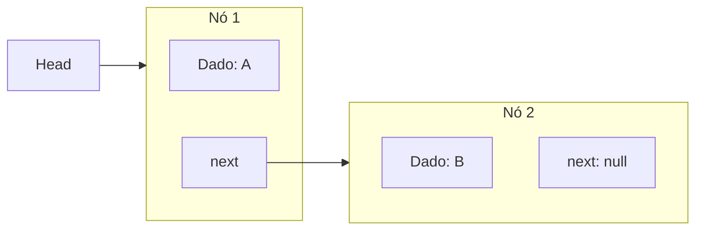

# Listas Encadeadas (Linked Lists)

## Objetivo
Ao final deste tópico, o estudante será capaz de descrever o funcionamento lógico e físico de listas encadeadas simples, duplas e circulares, comparar seus trade-offs com arrays estáticos e dinâmicos, e implementar uma lista duplamente encadeada genérica em Java, manipulando corretamente referências a nós.

## Pré-requisitos
- [01. Arrays e Vetores Dinâmicos](./01-arrays-and-dynamic-arrays.md)
- Compreensão do funcionamento de referências a objetos na memória Heap do Java.

## Conceitos Fundamentais

### 1. O que é uma Lista Encadeada?
Ao contrário de um array, uma **Lista Encadeada** não armazena seus elementos de forma contígua na memória física. Em vez disso, cada elemento é encapsulado em um objeto independente chamado **Nó** (`Node`). Os nós são conectados entre si por meio de referências na memória Heap.



### 2. Variações de Listas Encadeadas

*   **Lista Encadeada Simples (Singly Linked List)**: Cada nó contém seu dado e uma referência apenas para o *próximo* nó (`next`).
*   **Lista Duplamente Encadeada (Doubly Linked List)**: Cada nó contém seu dado, uma referência para o *próximo* nó (`next`) e outra para o nó *anterior* (`prev`). Facilita a remoção e inserção bidirecional.
*   **Lista Circular (Circular Linked List)**: O último nó da lista aponta de volta para o primeiro nó (`head`), formando um ciclo. Pode ser simples ou dupla.

```mermaid
flowchart LR
    subgraph Doubly [Lista Duplamente Encadeada]
        direction LR
        N1[prev | A | next] <=> N2[prev | B | next] <=> N3[prev | C | next]
    end
```

### 3. Comparações: Arrays vs. Listas Encadeadas

| Operação / Aspecto | Array Estático / Dinâmico | Lista Encadeada Simples/Dupla | Explicação |
|---|---|---|---|
| **Acesso por Índice** | $\mathcal{O}(1)$ | $\mathcal{O}(n)$ | Arrays usam cálculo matemático de endereço. Listas exigem travessia nó por nó desde a cabeça (`head`). |
| **Inserção/Remoção no Início** | $\mathcal{O}(n)$ | $\mathcal{O}(1)$ | Arrays exigem deslocar todos os itens. Listas apenas redirecionam ponteiros locais. |
| **Inserção/Remoção no Fim** | $\mathcal{O}(1)$ amortizado | $\mathcal{O}(1)$ se mantiver referência `tail` | Sem a referência de cauda (`tail`), listas encadeadas simples exigem percorrer tudo, custando $\mathcal{O}(n)$. |
| **Localidade de Cache** | **Alta** (Excelente) | **Baixa** (Ruim) | Elementos do array são contíguos. Nós na Heap podem estar espalhados, gerando *cache misses*. |
| **Overhead de Memória** | **Baixo** (Apenas o array bruto) | **Alto** (Cada nó armazena metadados de ponteiros: 8-16 bytes extras) | O overhead de memória pode ser significativo para tipos pequenos (ex: armazenar `char`). |

---

## Funcionamento Interno: Gerenciamento de Ponteiros
Durante inserções e deleções em listas encadeadas, a ordem em que as referências são alteradas é crucial. Inverter dois passos de reatribuição de ponteiros pode quebrar a lista inteira, isolando nós do Garbage Collector do Java e causando perda de dados (*memory leak* lógico).

*   *Regra de Ouro*: Ao inserir um novo nó $X$ entre $A$ e $B$, sempre aponte os ponteiros de $X$ para $A$ e $B$ **antes** de sobrescrever as referências que conectam $A$ e $B$.

---

## Erros Comuns
1.  **NullPointerException**: Esquecer de verificar se a lista está vazia (`head == null`) ou se atingiu o fim da lista (`current.next == null`) antes de acessar os campos do nó.
2.  **Perda da Cabeça da Lista**: Atualizar a referência de `head` acidentalmente durante uma travessia (ex: usar `head = head.next` para caminhar na lista, em vez de criar uma variável temporária `Node current = head`).
3.  **Esquecer de Atualizar os Dois Lados em Listas Duplas**: Em listas duplamente encadeadas, ao inserir ou remover, lembrar de ajustar tanto o ponteiro `next` do nó anterior quanto o `prev` do próximo nó.

---

## Exemplos em Java

Abaixo está a implementação robusta de uma **Lista Duplamente Encadeada** (`DoublyLinkedList`) genérica. Ela mantém referências para a cabeça (`head`) e cauda (`tail`), garantindo inserções e exclusões em ambas as pontas em tempo constante $\mathcal{O}(1)$.

```java
import java.util.Iterator;
import java.util.NoSuchElementException;

public class DoublyLinkedList<T> implements Iterable<T> {
    private Node<T> head;
    private Node<T> tail;
    private int size;

    private static class Node<T> {
        T data;
        Node<T> next;
        Node<T> prev;

        Node(T data) {
            this.data = data;
        }
    }

    public DoublyLinkedList() {
        this.head = null;
        this.tail = null;
        this.size = 0;
    }

    public int size() { return size; }
    public boolean isEmpty() { return size == 0; }

    // Inserção no início: O(1)
    public void addFirst(T data) {
        Node<T> newNode = new Node<>(data);
        if (isEmpty()) {
            head = newNode;
            tail = newNode;
        } else {
            newNode.next = head;
            head.prev = newNode;
            head = newNode;
        }
        size++;
    }

    // Inserção no fim: O(1)
    public void addLast(T data) {
        Node<T> newNode = new Node<>(data);
        if (isEmpty()) {
            head = newNode;
            tail = newNode;
        } else {
            newNode.prev = tail;
            tail.next = newNode;
            tail = newNode;
        }
        size++;
    }

    // Remoção no início: O(1)
    public T removeFirst() {
        if (isEmpty()) throw new NoSuchElementException("Lista vazia.");
        T data = head.data;
        if (head == tail) { // Apenas 1 elemento
            head = null;
            tail = null;
        } else {
            head = head.next;
            head.prev = null;
        }
        size--;
        return data;
    }

    // Remoção no fim: O(1)
    public T removeLast() {
        if (isEmpty()) throw new NoSuchElementException("Lista vazia.");
        T data = tail.data;
        if (head == tail) { // Apenas 1 elemento
            head = null;
            tail = null;
        } else {
            tail = tail.prev;
            tail.next = null;
        }
        size--;
        return data;
    }

    // Busca linear por valor: O(n)
    public boolean contains(T data) {
        Node<T> current = head;
        while (current != null) {
            if (current.data.equals(data)) {
                return true;
            }
            current = current.next;
        }
        return false;
    }

    @Override
    public Iterator<T> iterator() {
        return new Iterator<T>() {
            private Node<T> current = head;
            @Override
            public boolean hasNext() { return current != null; }
            @Override
            public T next() {
                if (!hasNext()) throw new NoSuchElementException();
                T val = current.data;
                current = current.next;
                return val;
            }
        };
    }
}
```

---

## Exercícios

### Exercício 1: Teórico — Análise de Ponteiros em Inversão
Dada uma lista encadeada simples, desenhe o estado dos nós e descreva um algoritmo em pseudocódigo (ou Java) para **inverter** o sentido da lista (o último nó vira a cabeça e o primeiro vira a cauda), utilizando espaço adicional de memória constante $\mathcal{O}(1)$ (sem criar novos nós).

### Exercício 2: Prático — Remoção de Nó Específico
Adicione o método `public T remove(T data)` à classe `DoublyLinkedList<T>`. O método deve:
1. Buscar o nó correspondente ao valor `data`.
2. Se encontrar, ajustar as referências do nó anterior e do nó seguinte para contornar o nó atual (removendo-o da corrente).
3. Atualizar as referências de `head` e `tail` se o elemento removido for das pontas.
4. Tratar devidamente o decremento de `size` e retornar o valor removido (ou `null` se não existir).

---

## Referências
*   SEDGEWICK, Robert. **Algorithms**. Capítulo 1.3.
*   Visualizações interativas de inserção e remoção em listas encadeadas: [VisuAlgo - Linked Lists](https://visualgo.net/en/list).
