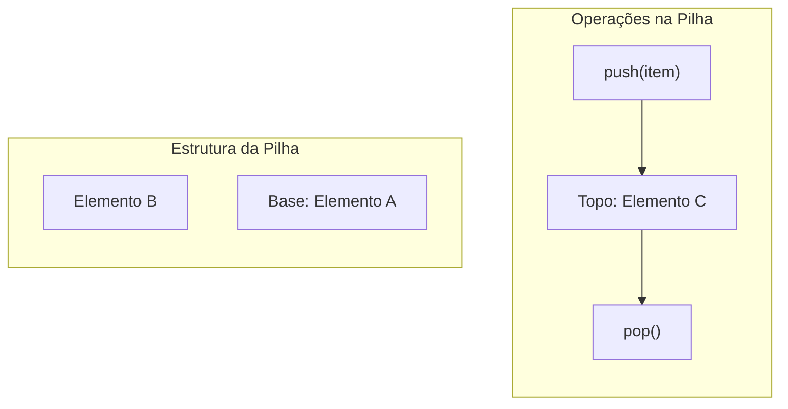

# Pilhas (Stacks)

## Objetivo
Ao final deste tópico, o estudante será capaz de explicar o conceito LIFO (Last In, First Out), comparar o desempenho de implementações de pilhas baseadas em arrays e listas encadeadas, e aplicar estruturas de pilha para resolver problemas clássicos como balanceamento de símbolos e avaliação de expressões aritméticas em Java.

## Pré-requisitos
- [02. Listas Encadeadas](./02-linked-lists.md)

## Conceitos Fundamentais

### 1. O que é uma Pilha?
Uma **Pilha** (Stack) é um Tipo Abstrato de Dados (ADT) linear baseado no princípio **LIFO (Last In, First Out)** — o último elemento a ser inserido é o primeiro a ser removido. 

Pense em uma pilha física de pratos: você só pode adicionar um prato no topo e só pode retirar o prato que está no topo.



### 2. Operações Fundamentais
Todas as operações básicas em uma pilha bem projetada devem executar em tempo constante **$\mathcal{O}(1)$**:

*   `push(item)`: Insere um elemento no topo da pilha.
*   `pop()`: Remove e retorna o elemento no topo da pilha. Lança erro se a pilha estiver vazia.
*   `peek()` (ou `top()`): Retorna o elemento no topo sem removê-lo.
*   `isEmpty()`: Retorna se a pilha contém elementos ou não.
*   `size()`: Retorna o número de elementos na pilha.

---

## Casos de Uso
As pilhas são fundamentais em diversas áreas do desenvolvimento e arquitetura de sistemas:

1.  **Call Stack (Pilha de Execução)**: A JVM gerencia as chamadas de métodos usando uma pilha. Quando o método `A` chama o método `B`, as informações de `A` (variáveis locais e endereço de retorno) são empilhadas. Quando `B` termina, os dados de `B` são desempilhados, retornando o fluxo para `A`.
2.  **Mecanismo de Desfazer/Refazer (Undo/Redo)**: Editores de texto mantêm duas pilhas: uma com as ações realizadas (para o *Undo*) e outra com as ações desfeitas (para o *Redo*).
3.  **Algoritmos de Backtracking**: Resolver labirintos, percursos de profundidade em grafos/árvores (DFS), onde você explora um caminho e recua quando atinge um beco sem saída.

---

## Erros Comuns
1.  **Stack Overflow (Estouro de Pilha de Execução)**: Ocorre quando recursões infinitas ou muito profundas preenchem toda a pilha física de execução (`Stack`) fornecida pelo sistema operacional/JVM.
2.  **Stack Underflow (Subfluxo)**: Tentar executar `pop()` ou `peek()` em uma pilha vazia sem realizar a validação prévia com `isEmpty()`.

---

## Implementações em Java

Apresentamos as duas formas clássicas de implementar o ADT `Stack`.

### Abordagem 1: Baseada em Array Encadeado (Vetor Dinâmico)
- **Vantagem**: Melhor aproveitamento de cache de CPU (contiguidade física) e menor overhead de memória.
- **Desvantagem**: A operação de `push` ocasionalmente sofre com o tempo de cópia durante o redimensionamento (embora continue sendo $\mathcal{O}(1)$ amortizado).

```java
import java.util.EmptyStackException;

public class ArrayStack<T> {
    private T[] items;
    private int size;
    private static final int DEFAULT_CAPACITY = 10;

    @SuppressWarnings("unchecked")
    public ArrayStack() {
        items = (T[]) new Object[DEFAULT_CAPACITY];
        size = 0;
    }

    public void push(T item) {
        if (size == items.length) {
            resize(2 * items.length);
        }
        items[size++] = item;
    }

    public T pop() {
        if (isEmpty()) throw new EmptyStackException();
        T item = items[--size];
        items[size] = null; // Evita memory leak (loitering)
        if (size > 0 && size == items.length / 4) {
            resize(items.length / 2);
        }
        return item;
    }

    public T peek() {
        if (isEmpty()) throw new EmptyStackException();
        return items[size - 1];
    }

    public boolean isEmpty() { return size == 0; }
    public int size() { return size; }

    @SuppressWarnings("unchecked")
    private void resize(int newCapacity) {
        T[] temp = (T[]) new Object[newCapacity];
        System.arraycopy(items, 0, temp, 0, size);
        items = temp;
    }
}
```

### Abordagem 2: Baseada em Lista Encadeada Simples
- **Vantagem**: Inserção e remoção no topo são estritamente $\mathcal{O}(1)$ em qualquer cenário (sem picos de redimensionamento).
- **Desvantagem**: Overhead de memória alto por causa da alocação de objetos `Node` adicionais.

```java
import java.util.EmptyStackException;

public class LinkedStack<T> {
    private Node<T> top = null;
    private int size = 0;

    private static class Node<T> {
        T item;
        Node<T> next;
        Node(T item, Node<T> next) {
            this.item = item;
            this.next = next;
        }
    }

    public void push(T item) {
        top = new Node<>(item, top); // O novo nó aponta para o antigo topo
        size++;
    }

    public T pop() {
        if (isEmpty()) throw new EmptyStackException();
        T item = top.item;
        top = top.next;
        size--;
        return item;
    }

    public T peek() {
        if (isEmpty()) throw new EmptyStackException();
        return top.item;
    }

    public boolean isEmpty() { return top == null; }
    public int size() { return size; }
}
```

---

## Exercícios

### Exercício 1: Prático — Balanceamento de Parênteses
Escreva um método estático em Java que utilize a classe `LinkedStack` criada para validar se uma string contendo expressões matemáticas possui parênteses, colchetes e chaves devidamente balanceados.
*   *Entrada*: `"{[a + b] * (c - d)}"` $\rightarrow$ *Retorno*: `true`
*   *Entrada*: `"{[a + b] * (c - d)}"` $\rightarrow$ *Retorno*: `true`
*   *Entrada*: `"{[a + b) * c}"` $\rightarrow$ *Retorno*: `false`

### Exercício 2: Teórico — Pilha com Mínimo em $\mathcal{O}(1)$
Desenhe a lógica (ou implemente) de uma pilha especial chamada `MinStack` que, além de `push`, `pop` e `peek`, possua o método `getMin()` que retorna o menor elemento presente na pilha em tempo **$\mathcal{O}(1)$**.
*   *Restrição*: A complexidade de espaço adicional deve ser no máximo linear $\mathcal{O}(n)$.
*   *Dica*: Você pode manter uma segunda pilha auxiliar interna que armazena os valores mínimos históricos associados a cada estado da pilha principal.

---

## Referências
*   CORMEN, Thomas H. et al. **Introduction to Algorithms**. Capítulo 10.1 (Stacks and queues).
*   Visualizador do comportamento de Pilhas: [USFCA Interactive Stack](https://www.cs.usfca.edu/~galles/visualization/StackArray.html).
