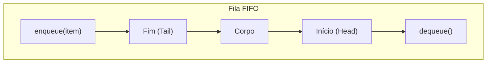
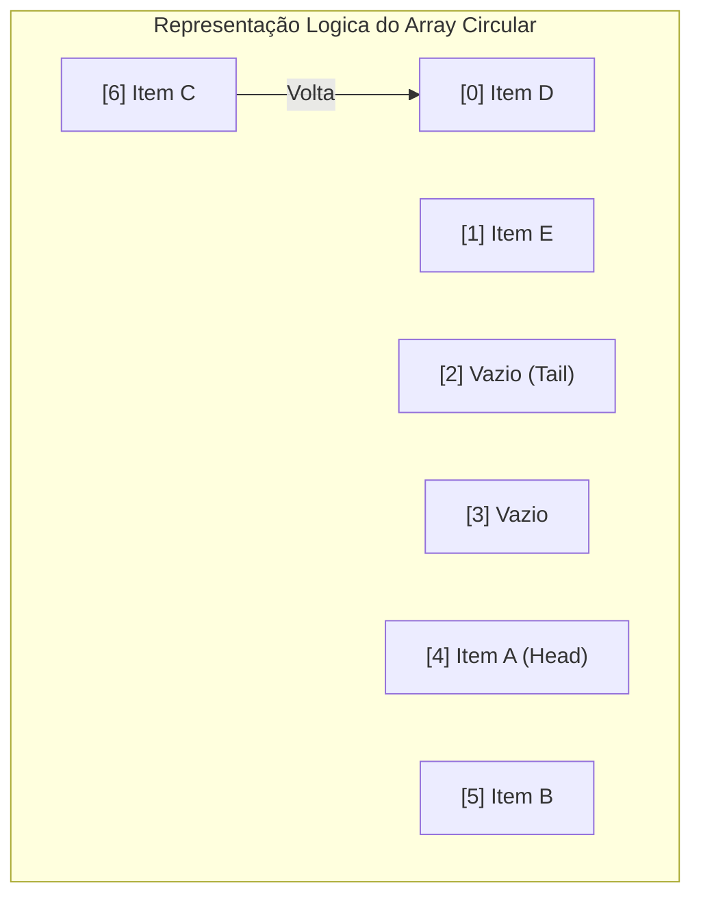

# Filas e Deques (Queues & Deques)

## Objetivo
Ao final deste tópico, o estudante será capaz de descrever o funcionamento das estruturas FIFO (First In, First Out), implementar uma fila circular baseada em array e uma fila encadeada em Java, diferenciar um Deque de uma Fila tradicional e aplicar essas estruturas em problemas de processamento de tarefas em lote.

## Pré-requisitos
- [02. Listas Encadeadas](./02-linked-lists.md)
- Operador aritmético modular (`%`).

## Conceitos Fundamentais

### 1. O que é uma Fila?
Uma **Fila** (Queue) é um Tipo Abstrato de Dados (ADT) baseado no princípio **FIFO (First In, First Out)** — o primeiro elemento a entrar é o primeiro a ser removido. 

Visualmente, comporta-se de forma idêntica a uma fila de banco tradicional: a inserção de novos elementos (clientes) é feita no **fim (rear/tail)** e a remoção dos elementos atendidos é feita no **início (front/head)**.



### 2. Operações Fundamentais da Fila
Todas as operações básicas devem rodar em tempo constante **$\mathcal{O}(1)$**:
*   `enqueue(item)`: Adiciona um elemento ao final da fila.
*   `dequeue()`: Remove e retorna o elemento no início da fila.
*   `peek()`: Retorna o elemento no início sem removê-lo.
*   `isEmpty()`: Retorna se a fila está vazia.
*   `size()`: Retorna a quantidade de elementos na fila.

### 3. Deques (Double-Ended Queues)
Um **Deque** é uma variação da fila tradicional que permite inserção e remoção em **ambas as extremidades** (início e fim) em tempo constante $\mathcal{O}(1)$. 
Ele funciona simultaneamente como uma fila e como uma pilha.

Operações do Deque:
*   `addFirst(item)`, `addLast(item)`
*   `removeFirst()`, `removeLast()`
*   `peekFirst()`, `peekLast()`

---

## Funcionamento Interno: Array Circular vs. Array Linear
Se tentarmos implementar uma Fila usando um array simples e linear de tamanho fixo:
1.  Ao fazer `dequeue()`, removemos o elemento da posição `0`.
2.  Para manter a consistência, precisaríamos empurrar todos os $n-1$ elementos restantes para trás para preencher o buraco, o que custa **$\mathcal{O}(n)$**.
3.  Alternativamente, se apenas movermos o ponteiro de início `front` para a direita (índice 1), criamos um espaço inutilizável no início do array, fazendo com que a fila "caminhe" até o final do vetor físico e declare-se "cheia" mesmo com posições vazias no início.

Para resolver isso de forma eficiente em tempo $\mathcal{O}(1)$, utilizamos um **Array Circular**. Quando os ponteiros `front` ou `rear` chegam ao final do array físico (`length - 1`), eles dão a volta para o índice `0` utilizando a aritmética modular:

$$\text{próximo\_indice} = (\text{indice} + 1) \pmod{\text{capacidade}}$$



---

## Casos de Uso
1.  **Agendadores de Processos (CPU/Threads)**: Sistemas operacionais gerenciam processos prontos para rodar em uma fila circular de prontos.
2.  **Mensageria e Buffer assíncrono**: Filas como RabbitMQ, Kafka e filas internas como `BlockingQueue` em Java sincronizam o fluxo de produtores e consumidores de tarefas.
3.  **Algoritmo BFS (Breadth-First Search)**: A busca em largura em grafos e árvores armazena nós descobertos em uma fila para garantir que todos os nós do nível atual sejam processados antes dos vizinhos do próximo nível.

---

## Erros Comuns
1.  **Subestimar o tamanho no Array Circular**: Se o array circular encher totalmente (`size == capacity`), a lógica modular fará com que novas inserções sobrescrevam elementos antigos se o vetor não for redimensionado primeiro.
2.  **Erro de "Off-by-One" na Aritmética Modular**: Erros de cálculo ao verificar se a fila circular está vazia ou cheia. A forma mais simples de controle é manter um contador de tamanho explícito `size`.

---

## Implementações em Java

### Implementação 1: Fila Circular Baseada em Array
Garante acesso estrito $\mathcal{O}(1)$ e reaproveitamento total da memória física.

```java
import java.util.NoSuchElementException;

public class CircularArrayQueue<T> {
    private T[] data;
    private int front;
    private int rear;
    private int size;
    private int capacity;

    @SuppressWarnings("unchecked")
    public CircularArrayQueue(int capacity) {
        this.capacity = capacity;
        this.data = (T[]) new Object[capacity];
        this.front = 0;
        this.rear = 0;
        this.size = 0;
    }

    public void enqueue(T item) {
        if (size == capacity) {
            throw new IllegalStateException("Fila cheia.");
        }
        data[rear] = item;
        rear = (rear + 1) % capacity; // Avanço modular
        size++;
    }

    public T dequeue() {
        if (isEmpty()) {
            throw new NoSuchElementException("Fila vazia.");
        }
        T item = data[front];
        data[front] = null; // Libera referência
        front = (front + 1) % capacity; // Avanço modular
        size--;
        return item;
    }

    public T peek() {
        if (isEmpty()) throw new NoSuchElementException("Fila vazia.");
        return data[front];
    }

    public boolean isEmpty() { return size == 0; }
    public int size() { return size; }
}
```

### Implementação 2: Fila Baseada em Lista Encadeada Simples
Excelente para tamanhos dinâmicos imprevisíveis, sem limites estáticos de capacidade.

```java
import java.util.NoSuchElementException;

public class LinkedQueue<T> {
    private Node<T> head = null;
    private Node<T> tail = null;
    private int size = 0;

    private static class Node<T> {
        T item;
        Node<T> next;
        Node(T item) { this.item = item; }
    }

    public void enqueue(T item) {
        Node<T> oldTail = tail;
        tail = new Node<>(item);
        if (isEmpty()) {
            head = tail;
        } else {
            oldTail.next = tail;
        }
        size++;
    }

    public T dequeue() {
        if (isEmpty()) throw new NoSuchElementException("Fila vazia.");
        T item = head.item;
        head = head.next;
        size--;
        if (isEmpty()) {
            tail = null; // Evita referências perdidas
        }
        return item;
    }

    public T peek() {
        if (isEmpty()) throw new NoSuchElementException("Fila vazia.");
        return head.item;
    }

    public boolean isEmpty() { return head == null; }
    public int size() { return size; }
}
```

---

## Exercícios

### Exercício 1: Prático — Fila Circular Dinâmica
Modifique o código de `CircularArrayQueue<T>` para remover o limite fixo de capacidade. Sempre que a fila estiver prestes a estourar (`size == capacity`), dobre a capacidade do array físico duplicando seu tamanho.
*   *Atenção*: Lembre-se de realinhar os elementos no novo array de forma que o novo `front` reinicie no índice `0` e o novo `rear` fique posicionado em `size`. A cópia simples por `System.arraycopy` não funciona diretamente por causa da circularidade.

### Exercício 2: Teórico — Fila Usando Duas Pilhas
Descreva como é possível implementar um ADT de Fila completo (`enqueue` e `dequeue`) utilizando apenas duas pilhas (`Stack`) auxiliares internas como mecanismo de armazenamento.
*   *Desafio*: Qual a complexidade temporal amortizada de cada operação nesta abordagem?

---

## Referências
*   CORMEN, Thomas H. et al. **Introduction to Algorithms**. Capítulo 10.1 (Stacks and queues).
*   Visualizador interativo de Fila Circular em Array: [USFCA Queue Visualization](https://www.cs.usfca.edu/~galles/visualization/QueueArray.html).
