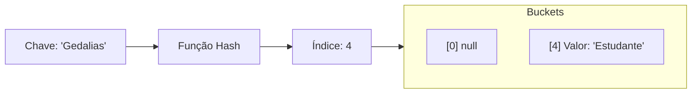

# Tabelas Hash (Hash Tables)

## Objetivo
Ao final deste tópico, o estudante será capaz de descrever o funcionamento interno de tabelas de dispersão (hash tables), projetar funções hash simples e seguras, explicar métodos de resolução de colisões (Chaining e Open Addressing), e implementar uma tabela hash genérica com encadeamento em Java, incluindo suporte a redimensionamento dinâmico (*rehashing*).

## Pré-requisitos
- [01. Arrays e Vetores Dinâmicos](../02-linear-structures/01-arrays-and-dynamic-arrays.md)
- [02. Listas Encadeadas](../02-linear-structures/02-linked-lists.md)

## Conceitos Fundamentais

### 1. O que é uma Tabela Hash?
Uma **Tabela Hash** (ou Tabela de Dispersão) é uma estrutura de dados que associa **Chaves (Keys)** a **Valores (Values)**. Ela é projetada para realizar buscas, inserções e remoções em tempo médio constante **$\mathcal{O}(1)$**.

Para atingir essa eficiência, a tabela converte a chave em um índice inteiro usando uma **Função Hash** (Função de Espalhamento). Esse índice aponta diretamente para uma posição no array interno (chamado de *bucket* ou *slot*).



### 2. Funções Hash
Uma boa função de espalhamento deve ser:
1.  **Determinística**: A mesma chave deve gerar sempre o mesmo índice.
2.  **Rápida**: O cálculo do hash deve custar $\mathcal{O}(1)$.
3.  **Uniforme**: Deve espalhar as chaves uniformemente pelos índices disponíveis do array para minimizar colisões.

Em Java, a classe base `Object` define o método `hashCode()`, que retorna um inteiro de 32 bits. Para mapear esse inteiro para o intervalo de índices do nosso array $[0, \text{capacidade} - 1]$, aplicamos a operação de módulo combinada com uma máscara de sinal para evitar índices negativos:

$$\text{indice} = (\text{key.hashCode()} \ \& \ \text{0x7fffffff}) \pmod{\text{capacidade}}$$

### 3. Colisões
Como o conjunto de chaves possíveis é muito maior que o tamanho do nosso array físico, inevitavelmente duas chaves diferentes gerarão o mesmo índice. Isso é chamado de **Colisão**.

#### Métodos de Resolução de Colisões:

*   **Encadeamento Externo (Separate Chaining)**: Cada posição do array armazena uma referência para uma lista encadeada (ou outra coleção). Se houver colisão, o novo par chave-valor é adicionado à lista desse bucket.
*   **Endereçamento Aberto (Open Addressing)**: Todos os elementos são armazenados no próprio array. Se ocorrer colisão, o algoritmo busca outro slot vago seguindo uma sequência de sondagem:
    *   *Linear Probing*: Procura sequencialmente no próximo slot livre ($idx + 1, idx + 2, \dots$). Gera o problema de agrupamento primário (*primary clustering*).
    *   *Quadratic Probing*: Procura usando incrementos quadráticos ($idx + 1^2, idx + 2^2, \dots$).
    *   *Double Hashing*: Usa uma segunda função hash para calcular o passo do salto.

```mermaid
flowchart LR
    subgraph Chaining [Separate Chaining (Encadeamento)]
        direction LR
        B0["Bucket 0"] --> N1[Key A | Val X] --> N2[Key B | Val Y]
    end
    subgraph OpenAddr [Open Addressing: Linear Probing]
        direction LR
        Slot0[Key A]
        Slot1[Colisão! Key B colocada no próximo livre]
    end
```

### 4. Fator de Carga ($\alpha$) e Rehashing
O **Fator de Carga (Load Factor)** representa o nível de preenchimento da tabela:

$$\alpha = \frac{N}{M}$$

Onde $N$ é o número de chaves inseridas e $M$ é a capacidade da tabela (tamanho do array).

*   Em **Separate Chaining**, se $\alpha > 0.75$, o tamanho médio das listas nos buckets começa a crescer, degradando a busca de $\mathcal{O}(1)$ para $\mathcal{O}(N)$ no pior caso.
*   Para evitar isso, realizamos o **Rehashing**: dobramos a capacidade do array interno e **reinserimos** todas as chaves existentes do zero, pois o novo valor de $M$ altera os índices calculados pela operação modular.

---

## Vantagens e Desvantagens

### Vantagens
*   Buscas, inserções e remoções extremamente eficientes: tempo médio $\mathcal{O}(1)$.
*   Ideal para construir dicionários, caches na memória e indexação rápida.

### Desvantagens
*   **Sem Ordem**: Os elementos não são armazenados em ordem sequencial ou classificada.
*   **Pior Caso Ruim**: Se todas as chaves colidirem no mesmo bucket, o tempo cai para $\mathcal{O}(N)$.
*   **Uso de Memória**: Pode desperdiçar espaço se a tabela estiver muito vazia ou se houver muitos buckets nulos.

---

## Erros Comuns
1.  **Mutação de Chaves**: Usar chaves que mudam de valor após serem inseridas. Se o estado interno de um objeto chave muda, seu `hashCode()` também muda, tornando o valor associado irrecuperável (pois será procurado no bucket errado). **Sempre use chaves imutáveis** (ex: `String`, `Integer`).
2.  **Ignorar a Sobrescrita de `equals`**: Ao criar chaves personalizadas, se você sobrescrever `hashCode()`, **obrigatoriamente** deve sobrescrever `equals(Object o)`. O Java usa `hashCode()` para achar o bucket e `equals()` para identificar a chave exata dentro da lista encadeada daquele bucket.

---

## Exemplo em Java

Abaixo está uma implementação completa de uma `HashTable` genérica `<K, V>` usando **Separate Chaining** com redimensionamento automático de capacidade quando o fator de carga ultrapassa $0.75$.

```java
import java.util.LinkedList;

public class HashTable<K, V> {
    private static class Entry<K, V> {
        K key;
        V value;

        Entry(K key, V value) {
            this.key = key;
            this.value = value;
        }
    }

    private LinkedList<Entry<K, V>>[] buckets;
    private int size;
    private int capacity;
    private static final int INITIAL_CAPACITY = 16;
    private static final double LOAD_FACTOR_THRESHOLD = 0.75;

    @SuppressWarnings("unchecked")
    public HashTable() {
        this.capacity = INITIAL_CAPACITY;
        this.buckets = (LinkedList[].class.cast(new LinkedList[capacity]));
        this.size = 0;
    }

    private int hash(K key) {
        return (key.hashCode() & 0x7fffffff) % capacity;
    }

    // Inserção: O(1) médio
    public void put(K key, V value) {
        if (key == null) throw new IllegalArgumentException("Chave não pode ser nula.");
        
        // Verifica fator de carga
        if ((double) size / capacity >= LOAD_FACTOR_THRESHOLD) {
            resize(capacity * 2);
        }

        int index = hash(key);
        if (buckets[index] == null) {
            buckets[index] = new LinkedList<>();
        }

        // Se a chave já existir, atualiza o valor
        for (Entry<K, V> entry : buckets[index]) {
            if (entry.key.equals(key)) {
                entry.value = value;
                return;
            }
        }

        buckets[index].add(new Entry<>(key, value));
        size++;
    }

    // Busca: O(1) médio
    public V get(K key) {
        if (key == null) return null;
        int index = hash(key);
        LinkedList<Entry<K, V>> bucket = buckets[index];
        if (bucket != null) {
            for (Entry<K, V> entry : bucket) {
                if (entry.key.equals(key)) {
                    return entry.value;
                }
            }
        }
        return null;
    }

    // Remoção: O(1) médio
    public V remove(K key) {
        if (key == null) return null;
        int index = hash(key);
        LinkedList<Entry<K, V>> bucket = buckets[index];
        if (bucket != null) {
            for (Entry<K, V> entry : bucket) {
                if (entry.key.equals(key)) {
                    V value = entry.value;
                    bucket.remove(entry);
                    size--;
                    return value;
                }
            }
        }
        return null;
    }

    public int size() { return size; }
    public boolean isEmpty() { return size == 0; }

    @SuppressWarnings("unchecked")
    private void resize(int newCapacity) {
        LinkedList<Entry<K, V>>[] oldBuckets = buckets;
        this.capacity = newCapacity;
        this.buckets = (LinkedList[].class.cast(new LinkedList[capacity]));
        this.size = 0; // Será incrementado novamente durante as inserções

        for (LinkedList<Entry<K, V>> bucket : oldBuckets) {
            if (bucket != null) {
                for (Entry<K, V> entry : bucket) {
                    put(entry.key, entry.value); // Reinserção com novo tamanho de capacidade
                }
            }
        }
    }
}
```

---

## Exercícios

### Exercício 1: Teórico — Análise de Colisão e Open Addressing
Suponha uma tabela hash com capacidade $M = 7$ usando a função hash $h(k) = k \pmod 7$.
Desenhe o estado da tabela após inserir sequencialmente as chaves **12, 5, 19, 2 e 26** usando:
1. Encadeamento Externo (Separate Chaining).
2. Endereçamento Aberto com Sondagem Linear (Linear Probing).

### Exercício 2: Prático — Prevenção de Tombstones no Linear Probing
Em tabelas com **Linear Probing**, quando removemos uma chave no meio de uma cadeia de colisões, se simplesmente limparmos o slot (`null`), quebramos a busca de elementos que colidiram após ele e foram alocados adiante.
*   **Tarefa**: Pesquise sobre o conceito de **Tombstone** (marca de deletado) e implemente um protótipo de tabela com Linear Probing que utilize essa técnica para garantir que buscas continuem mesmo após remoções.

---

## Referências
*   CORMEN, Thomas H. et al. **Introduction to Algorithms**. Capítulo 11 (Hash Tables).
*   Visualizações interativas de colisões e rehashing: [VisuAlgo - Hash Tables](https://visualgo.net/en/hashtable).
