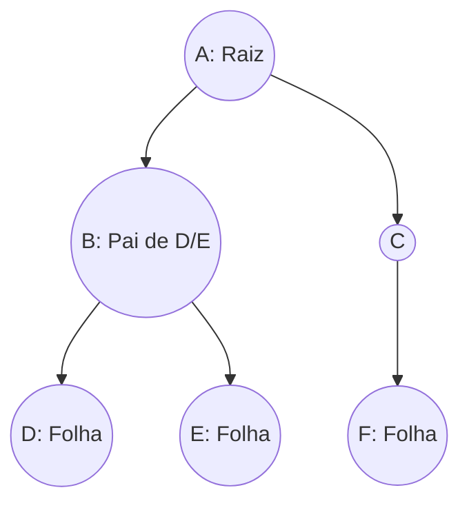

# Árvores e Árvores Binárias

## Objetivo
Ao final deste tópico, o estudante será capaz de descrever as propriedades de estruturas de dados hierárquicas não-lineares, aplicar a terminologia correta de árvores (raiz, altura, profundidade, folhas), e implementar os percursos clássicos de busca em profundidade (Pré-ordem, Em-ordem, Pós-ordem) e em largura (Level-order) em Java.

## Pré-requisitos
- [03. Pilhas (Stacks)](../02-linear-structures/03-stacks.md)
- [04. Filas e Deques (Queues and Deques)](../02-linear-structures/04-queues-and-deques.md)
- Conceito básico de recursão.

## Conceitos Fundamentais

### 1. Árvores Gerais: Terminologia
Uma **Árvore** (Tree) é uma estrutura não-linear composta por um conjunto de elementos chamados **Nós** (Nodes) conectados por **Arestas** (Edges) direcionadas, com as seguintes propriedades:
*   Há um nó inicial chamado **Raiz** (Root).
*   Cada nó (exceto a raiz) possui exatamente um nó **Pai** (Parent).
*   Não existem ciclos (caminhos fechados).



#### Termos Chave:
*   **Filho (Child)**: Nó apontado diretamente por outro.
*   **Folha (Leaf)**: Nós que não possuem filhos (grau zero).
*   **Grau (Degree)**: Número de filhos que um nó possui.
*   **Caminho (Path)**: Sequência de nós conectados por arestas de um nó a outro.
*   **Profundidade (Depth)**: Número de arestas da raiz até o nó.
*   **Altura (Height)**: Número de arestas no caminho mais longo de um nó até uma folha. A altura da árvore é a altura do nó raiz.

### 2. Árvores Binárias
Uma **Árvore Binária** é uma árvore onde cada nó possui **no máximo dois filhos**, chamados convencionalmente de **Filho Esquerdo** e **Filho Direito**.

#### Tipos de Árvores Binárias:
1.  **Cheia (Full Binary Tree)**: Todo nó possui 0 ou 2 filhos. Nenhum nó possui apenas 1 filho.
2.  **Completa (Complete Binary Tree)**: Todos os níveis estão totalmente preenchidos, exceto possivelmente o último, que deve ser preenchido da esquerda para a direita. Essencial para a implementação de Heaps.
3.  **Perfeita (Perfect Binary Tree)**: Todos os nós internos possuem 2 filhos e todas as folhas estão no mesmo nível de profundidade. Uma árvore perfeita de altura $h$ tem exatamente $2^{h+1} - 1$ nós.

---

## Funcionamento Interno: Métodos de Percurso (Travessia)
Visitar cada nó exatamente uma vez em uma árvore exige algoritmos sistemáticos, divididos em duas categorias principais:

### A. Busca em Profundidade (DFS - Depth-First Search)
Visita os nós ramificando-se ao máximo antes de retornar (backtracking). Depende da lógica de Pilha (recursão ou pilha explícita):
1.  **Pré-ordem (Pre-order)**: Visita o nó atual, depois a subárvore esquerda, depois a subárvore direita ($\text{Raiz} \rightarrow \text{Esquerda} \rightarrow \text{Direita}$). Usado para clonar árvores.
2.  **Em-ordem (In-order)**: Visita a subárvore esquerda, o nó atual, e a subárvore direita ($\text{Esquerda} \rightarrow \text{Raiz} \rightarrow \text{Direita}$). Em BSTs, esse percurso visita os nós em ordem crescente.
3.  **Pós-ordem (Post-order)**: Visita a subárvore esquerda, depois a subárvore direita, e por fim o nó atual ($\text{Esquerda} \rightarrow \text{Direita} \rightarrow \text{Raiz}$). Usado para apagar nós da árvore ou avaliar expressões matemáticas.

### B. Busca em Largura (BFS / Level-order)
Visita os nós nível por nível, de cima para baixo e da esquerda para a direita. Depende do uso de uma **Fila (Queue)** auxiliar.

---

## Erros Comuns
1.  **Estouro da Stack com Árvores Desbalanceadas**: Algoritmos recursivos de travessia têm complexidade espacial proporcional à altura da árvore. Se a árvore for uma linha reta (degenerada), a altura será $n$, fazendo com que a recursão atinja profundidade $n$ e cause `StackOverflowError`. Para produção, percursos iterativos ou árvores balanceadas são recomendados.
2.  **Confundir Altura com Profundidade**: Altura é calculada de baixo para cima (distância para a folha mais distante); Profundidade é calculada de cima para baixo (distância para a raiz).

---

## Exemplos em Java

Abaixo, fornecemos o código do nó de uma árvore binária (`BinaryTreeNode`) e algoritmos para percursos recursivos e um percurso em largura (BFS) iterativo.

```java
import java.util.LinkedList;
import java.util.Queue;

public class BinaryTreeTraversals<T> {

    public static class Node<T> {
        public T data;
        public Node<T> left;
        public Node<T> right;

        public Node(T data) {
            this.data = data;
            this.left = null;
            this.right = null;
        }
    }

    // --- Percursos Recursivos (DFS) ---

    // 1. Pré-Ordem: Raiz -> Esquerda -> Direita
    public void preOrder(Node<T> node) {
        if (node == null) return;
        System.out.print(node.data + " ");
        preOrder(node.left);
        preOrder(node.right);
    }

    // 2. Em-Ordem: Esquerda -> Raiz -> Direita
    public void inOrder(Node<T> node) {
        if (node == null) return;
        inOrder(node.left);
        System.out.print(node.data + " ");
        inOrder(node.right);
    }

    // 3. Pós-Ordem: Esquerda -> Direita -> Raiz
    public void postOrder(Node<T> node) {
        if (node == null) return;
        postOrder(node.left);
        postOrder(node.right);
        System.out.print(node.data + " ");
    }

    // --- Percurso Iterativo em Largura (BFS / Level-order) ---
    // Complexidade Temporal: O(n)
    // Complexidade Espacial: O(w) - w é a largura máxima da árvore (no pior caso n/2)
    public void levelOrder(Node<T> root) {
        if (root == null) return;

        Queue<Node<T>> queue = new LinkedList<>();
        queue.add(root);

        while (!queue.isEmpty()) {
            Node<T> current = queue.poll();
            System.out.print(current.data + " ");

            if (current.left != null) {
                queue.add(current.left);
            }
            if (current.right != null) {
                queue.add(current.right);
            }
        }
    }
}
```

---

## Exercícios

### Exercício 1: Teórico — Rastreamento de Percursos
Dada a árvore binária desenhada abaixo:
```
       F
     /   \
    B     G
   / \     \
  A   D     I
     / \   /
    C   E H
```
Escreva a sequência exata de nós impressa pelos seguintes percursos:
1. Pré-ordem.
2. Em-ordem.
3. Pós-ordem.
4. Level-order (Largura).

### Exercício 2: Prático — Percurso Em-Ordem Iterativo
Implementar o percurso **Em-ordem de forma iterativa** utilizando a classe `java.util.Stack` explícita, sem usar recursão.
*   *Objetivo*: Simular a recursão manualmente para economizar frames de chamada do sistema.

---

## Referências
*   CORMEN, Thomas H. et al. **Introduction to Algorithms**. Capítulo 12.1 (What is a binary search tree?).
*   Visualizações de percursos de árvores: [USFCA Tree Traversals](https://www.cs.usfca.edu/~galles/visualization/BST.html).
