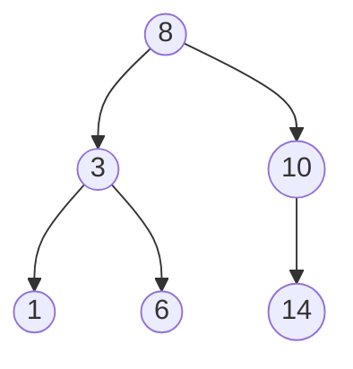
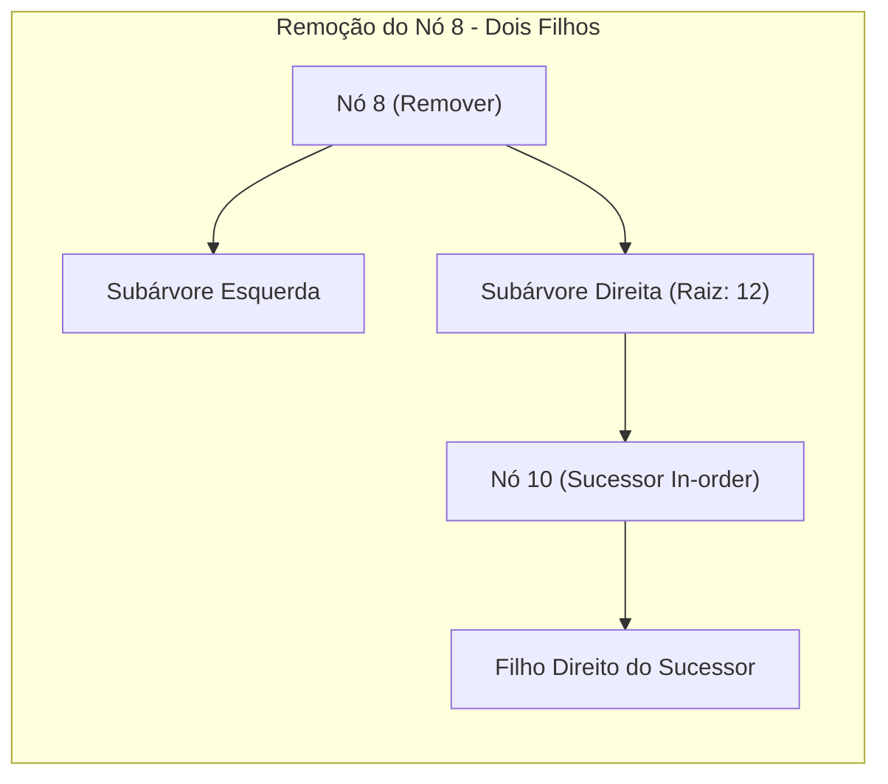

# Árvores Binárias de Busca (Binary Search Trees - BST)

## Objetivo
Ao final deste tópico, o estudante será capaz de explicar a propriedade fundamental das Árvores Binárias de Busca, analisar o impacto do balanceamento na complexidade assintótica das operações, e implementar uma BST em Java com suporte a busca, inserção e deleção recursiva de nós (usando o método de substituição por sucessor in-order).

## Pré-requisitos
- [01. Árvores Gerais e Árvores Binárias](./01-trees-and-binary-trees.md)
- Interface `Comparable` do Java.

## Conceitos Fundamentais

### 1. Propriedade Fundamental da BST
Uma **Árvore Binária de Busca (BST)** é uma árvore binária organizada de forma a otimizar a pesquisa de chaves. Para qualquer nó $X$ na árvore:
*   Todas as chaves na **subárvore esquerda** de $X$ são estritamente **menores** que a chave de $X$.
*   Todas as chaves na **subárvore direita** de $X$ são estritamente **maiores** que a chave de $X$.



Esta propriedade permite realizar buscas binárias diretamente na estrutura da árvore. A cada passo da busca, podemos descartar metade das subárvores restantes, assim como na busca binária em arrays ordenados.

### 2. Análise de Complexidade das Operações
A complexidade das operações fundamentais (busca, inserção e remoção) depende diretamente da **altura ($h$)** da árvore:

| Caso | Complexidade | Altura ($h$) | Explicação |
|---|---|---|---|
| **Caso Médio** | $\mathcal{O}(\log n)$ | $\approx \log n$ | Ocorre quando as chaves são inseridas de forma aleatória, gerando uma árvore balanceada. |
| **Pior Caso** | $\mathcal{O}(n)$ | $\approx n$ | Ocorre quando inserimos chaves ordenadas (ex: 1, 2, 3, 4, 5). A árvore degenera em uma lista encadeada. |

```mermaid
graph TD
    subgraph Degenerate [Árvore Degenerada O(N)]
        d1((1)) --> d2((2)) --> d3((3)) --> d4((4))
    end
```

---

## Funcionamento Interno: Remoção de Nós (Algoritmo de Hibbard)
A inserção e a busca em uma BST são simples, mas a **remoção** exige reorganizar a estrutura para manter a propriedade fundamental da BST. Existem três casos de remoção:

*   **Caso 1: O nó a ser removido é uma folha (sem filhos)**: Apenas ajustamos o ponteiro do pai para `null`. O nó é coletado pelo Garbage Collector.
*   **Caso 2: O nó possui apenas um filho**: Contornamos o nó. Apontamos a referência do pai diretamente para o único filho do nó removido.
*   **Caso 3: O nó possui dois filhos**:
    1. Localizamos o **Sucessor In-order** do nó (o menor elemento da subárvore direita). Alternativamente, podemos usar o *Predecessor In-order* (o maior elemento da subárvore esquerda).
    2. Substituímos o valor do nó a ser removido pelo valor do sucessor.
    3. Removemos recursivamente o sucessor de sua posição original na subárvore direita (que cairá obrigatoriamente no Caso 1 ou 2, já que o menor elemento não pode ter filho esquerdo).



---

## Erros Comuns
1.  **Esquecer de Atualizar Retornos Recursivos**: Em implementações recursivas, métodos de inserção e remoção devem retornar a nova raiz da subárvore atualizada, permitindo reatribuir referências como `node.left = delete(node.left, key)`. Esquecer isso faz com que a árvore não seja alterada.
2.  **NullPointerException ao Buscar Sucessor**: Tentar acessar `current.left` ao buscar o menor valor na subárvore direita sem garantir que a subárvore direita não seja nula.

---

## Exemplo em Java

Abaixo está a implementação genérica completa de uma `BinarySearchTree` onde as chaves implementam `Comparable<K>`.

```java
public class BinarySearchTree<K extends Comparable<K>, V> {

    private static class Node<K, V> {
        K key;
        V val;
        Node<K, V> left;
        Node<K, V> right;

        Node(K key, V val) {
            this.key = key;
            this.val = val;
        }
    }

    private Node<K, V> root;

    public void put(K key, V val) {
        root = put(root, key, val);
    }

    // Inserção recursiva: O(log n) médio
    private Node<K, V> put(Node<K, V> x, K key, V val) {
        if (x == null) return new Node<>(key, val);
        int cmp = key.compareTo(x.key);
        if (cmp < 0) {
            x.left = put(x.left, key, val);
        } else if (cmp > 0) {
            x.right = put(x.right, key, val);
        } else {
            x.val = val; // Atualiza o valor se a chave já existir
        }
        return x;
    }

    public V get(K key) {
        return get(root, key);
    }

    // Busca recursiva: O(log n) médio
    private V get(Node<K, V> x, K key) {
        if (x == null) return null;
        int cmp = key.compareTo(x.key);
        if (cmp < 0) return get(x.left, key);
        else if (cmp > 0) return get(x.right, key);
        else return x.val;
    }

    public void delete(K key) {
        root = delete(root, key);
    }

    // Deleção recursiva: O(log n) médio
    private Node<K, V> delete(Node<K, V> x, K key) {
        if (x == null) return null;
        int cmp = key.compareTo(x.key);
        if (cmp < 0) {
            x.left = delete(x.left, key);
        } else if (cmp > 0) {
            x.right = delete(x.right, key);
        } else {
            // Encontrou o nó a ser removido (x)

            // Caso 1 & 2: Sem filho esquerdo ou sem filho direito
            if (x.right == null) return x.left;
            if (x.left == null) return x.right;

            // Caso 3: Dois filhos
            Node<K, V> t = x;
            x = min(t.right); // x recebe o sucessor in-order (menor da direita)
            x.right = deleteMin(t.right); // Remove o sucessor da direita e reconecta
            x.left = t.left; // Mantém a subárvore esquerda original
        }
        return x;
    }

    private Node<K, V> min(Node<K, V> x) {
        if (x.left == null) return x;
        return min(x.left);
    }

    private Node<K, V> deleteMin(Node<K, V> x) {
        if (x.left == null) return x.right;
        x.left = deleteMin(x.left);
        return x;
    }
}
```

---

## Exercícios

### Exercício 1: Desenho de Remoção de Nós
Considere a árvore BST do exemplo fundamental:
```
       8
     /   \
    3     10
   / \      \
  1   6      14
```
1. Desenhe a árvore resultante após a exclusão do nó **3** (que possui dois filhos). Mostre quem foi o sucessor in-order escolhido e como ficaram as conexões de ponteiros.
2. A partir da árvore resultante, faça a exclusão do nó **8** (raiz) e desenhe a árvore final.

### Exercício 2: Prático — Busca de Limites e Estatísticas
Adicione os seguintes métodos à classe `BinarySearchTree`:
1. `public K minKey()`: Retorna a menor chave armazenada na árvore.
2. `public K maxKey()`: Retorna a maior chave armazenada na árvore.
3. `public int height()`: Retorna a altura total da árvore.
*   *Dica*: As buscas de mínimo e máximo tiram proveito da ordenação natural da BST (caminhar sempre para a esquerda para o mínimo, e sempre para a direita para o máximo).

---

## Referências
*   SEDGEWICK, Robert; WAYNE, Kevin. **Algorithms**. Capítulo 3.2 (Binary Search Trees).
*   Visualização e Depuração interativa de BSTs: [USFCA BST Visualization](https://www.cs.usfca.edu/~galles/visualization/BST.html).
