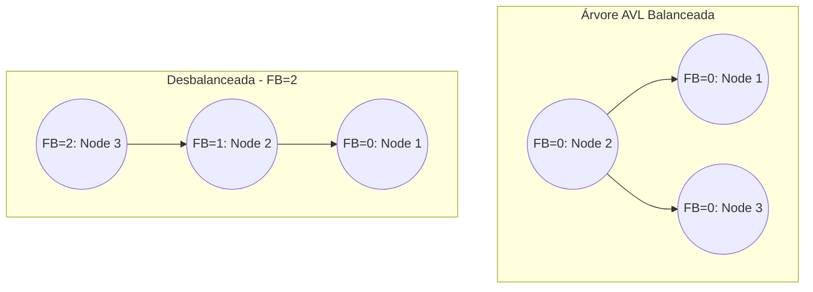
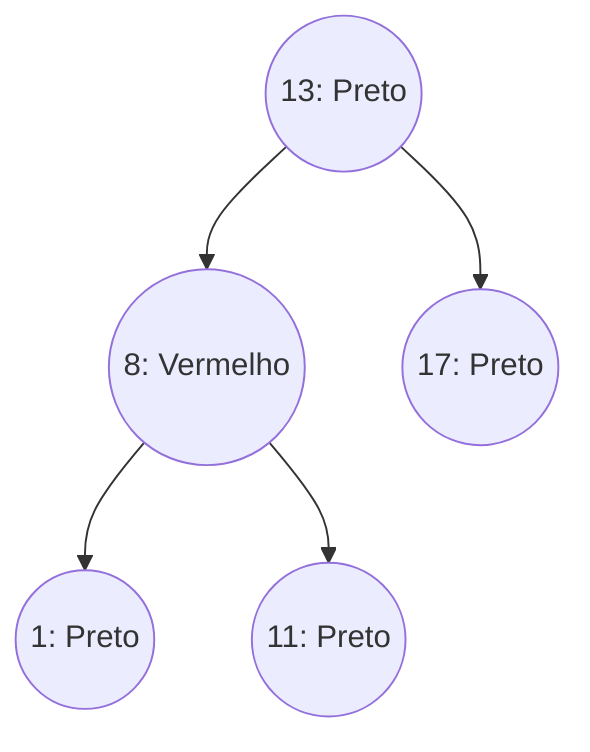

# Árvores Balanceadas (AVL e Red-Black)

## Objetivo
Ao final deste tópico, o estudante será capaz de explicar as limitações de pior caso da BST, descrever os critérios de balanceamento das árvores AVL e Rubro-Negras (Red-Black), realizar rotações simples e duplas de forma conceitual e algorítmica, e implementar o mecanismo de inserção e auto-balanceamento de uma árvore AVL em Java.

## Pré-requisitos
- [02. Árvores Binárias de Busca (BST)](./02-binary-search-trees.md)

## Conceitos Fundamentais

### 1. Por que balancear?
Como vimos, uma BST pode degenerar em uma linha reta se os dados forem inseridos em ordem ordenada. Isso faz com que as operações de busca, inserção e deleção decaiam para tempo linear $\mathcal{O}(n)$.
Para garantir que a árvore mantenha sua altura no limite logarítmico **$h \approx \log n$** mesmo no pior caso de inserções, utilizamos mecanismos de auto-balanceamento por meio de **Rotações**.

---

## Árvores AVL (Adelson-Velsky e Landis)
Uma **Árvore AVL** é uma BST estritamente balanceada pela altura de suas subárvores.

### Fator de Balanceamento (FB)
Para cada nó $X$ da árvore, calculamos o Fator de Balanceamento:

$$FB(X) = \text{Altura}(\text{Subárvore Esquerda}) - \text{Altura}(\text{Subárvore Direita})$$

*   **Propriedade AVL**: Para qualquer nó $X$, o fator de balanceamento deve ser:
    
    $$FB(X) \in \{-1, 0, 1\}$$

Se o $|FB(X)| \ge 2$ após uma inserção ou remoção, a subárvore está desbalanceada e exige correções imediatas através de rotações.



### Operações de Rotação

Existem quatro cenários de desbalanceamento que exigem rotações:

#### Caso 1: Rotação Simples à Direita (Caso Esquerda-Esquerda)
Ocorre quando o filho esquerdo está desbalanceado para a esquerda.
```
       z (FB = 2)               y
      /                       /   \
     y (FB = 1)      ==>     x     z
    /
   x
```

#### Caso 2: Rotação Simples à Esquerda (Caso Direita-Direita)
Ocorre quando o filho direito está desbalanceado para a direita.
```
     z (FB = -2)                y
      \                       /   \
       y (FB = -1)   ==>     z     x
        \
         x
```

#### Caso 3: Rotação Dupla Esquerda-Direita
Ocorre quando o filho esquerdo está desbalanceado para a direita. Primeiro rotacionamos o filho à esquerda, depois o pai à direita.
```
     z (FB = 2)             z (FB = 2)            x
    /                      /                    /   \
   y (FB = -1)    ==>     x (FB = 1)    ==>    y     z
    \                    /
     x                  y
```

#### Caso 4: Rotação Dupla Direita-Esquerda
Ocorre quando o filho direito está desbalanceado para a esquerda. Primeiro rotacionamos o filho à direita, depois o pai à esquerda.

---

## Árvores Rubro-Negras (Red-Black Trees)
Uma **Árvore Rubro-Negra** é uma BST auto-compensadora que usa um bit de cor adicional (Vermelho ou Preto) em cada nó para garantir um balanceamento aproximado. Ela é mais flexível que a AVL (exige menos rotações durante a inserção, mas possui uma altura ligeiramente maior no pior caso).

### Regras Fundamentais (Invariantes)
1.  Todo nó é **Vermelho** ou **Preto**.
2.  A **Raiz** é sempre **Preta**.
3.  Todas as folhas nulas (`NULL` / sentinelas) são **Pretas**.
4.  Se um nó é **Vermelho**, seus filhos devem ser **Pretos** (não pode haver dois nós vermelhos consecutivos em um caminho vertical).
5.  Para cada nó, todos os caminhos simples dele até qualquer uma de suas folhas descendentes contêm o mesmo número de nós pretos (propriedade da *Black Height* constante).



*Nota: Em Java, a implementação padrão de `java.util.TreeMap` e `java.util.HashMap` (para buckets muito grandes) é baseada em Árvores Rubro-Negras devido à eficiência superior no mundo real em inserções e remoções consecutivas.*

---

## Comparação: AVL vs. Red-Black

| Propriedade | Árvore AVL | Árvore Rubro-Negra |
|---|---|---|
| **Balanceamento** | Estrito ($FB \le 1$) | Flexível (Caminho mais longo $\le 2 \times$ caminho mais curto) |
| **Altura Pior Caso** | $\approx 1.44 \log n$ | $\approx 2 \log n$ |
| **Velocidade de Busca** | **Mais Rápida** (árvore é mais rasa e compacta) | **Mais Lenta** (árvore ligeiramente mais alta) |
| **Velocidade de Inserção** | **Mais Lenta** (pode exigir rotações frequentes até a raiz) | **Mais Rápida** (exige poucas rotações e ajustes locais de cor) |

---

## Erros Comuns
1.  **Esquecer de Atualizar a Altura após as Rotações**: A altura de um nó depende das alturas de seus filhos. Após rotacionar, as referências mudam, e as alturas do nó rotacionado e de seu novo pai precisam ser recalculadas explicitamente.
2.  **Ignorar a complexidade de implementação da Rubro-Negra**: A árvore rubro-negra clássica possui muitos casos especiais de rotação e recolorização para remoção, sendo extremamente propensa a bugs. Em avaliações e entrevistas, foca-se mais nas propriedades lógicas do que no código de remoção da RB.

---

## Exemplo em Java (Inserção e Rotações AVL)

Abaixo está a implementação completa e genérica da inserção balanceada em uma **Árvore AVL**.

```java
public class AVLTree<K extends Comparable<K>, V> {

    private static class Node<K, V> {
        K key;
        V val;
        Node<K, V> left, right;
        int height; // Necessário para calcular o FB de forma O(1)

        Node(K key, V val) {
            this.key = key;
            this.val = val;
            this.height = 1; // Nó folha inicializado com altura 1
        }
    }

    private Node<K, V> root;

    private int height(Node<K, V> N) {
        return N == null ? 0 : N.height;
    }

    private int getBalance(Node<K, V> N) {
        return N == null ? 0 : height(N.left) - height(N.right);
    }

    // Rotação simples à direita
    private Node<K, V> rightRotate(Node<K, V> y) {
        Node<K, V> x = y.left;
        Node<K, V> T2 = x.right;

        // Executa a rotação
        x.right = y;
        y.left = T2;

        // Atualiza as alturas
        y.height = Math.max(height(y.left), height(y.right)) + 1;
        x.height = Math.max(height(x.left), height(x.right)) + 1;

        return x; // Retorna a nova raiz da subárvore
    }

    // Rotação simples à esquerda
    private Node<K, V> leftRotate(Node<K, V> x) {
        Node<K, V> y = x.right;
        Node<K, V> T2 = y.left;

        // Executa a rotação
        y.left = x;
        x.right = T2;

        // Atualiza as alturas
        x.height = Math.max(height(x.left), height(x.right)) + 1;
        y.height = Math.max(height(y.left), height(y.right)) + 1;

        return y; // Retorna a nova raiz da subárvore
    }

    public void put(K key, V val) {
        root = put(root, key, val);
    }

    private Node<K, V> put(Node<K, V> node, K key, V val) {
        // 1. Inserção normal de BST
        if (node == null) return new Node<>(key, val);

        int cmp = key.compareTo(node.key);
        if (cmp < 0) {
            node.left = put(node.left, key, val);
        } else if (cmp > 0) {
            node.right = put(node.right, key, val);
        } else {
            node.val = val;
            return node;
        }

        // 2. Atualiza a altura do nó pai
        node.height = 1 + Math.max(height(node.left), height(node.right));

        // 3. Obtém o fator de balanceamento
        int balance = getBalance(node);

        // Se estiver desbalanceado, aplica um dos 4 casos:

        // Caso Esquerda-Esquerda
        if (balance > 1 && key.compareTo(node.left.key) < 0) {
            return rightRotate(node);
        }

        // Caso Direita-Direita
        if (balance < -1 && key.compareTo(node.right.key) > 0) {
            return leftRotate(node);
        }

        // Caso Esquerda-Direita
        if (balance > 1 && key.compareTo(node.left.key) > 0) {
            node.left = leftRotate(node.left);
            return rightRotate(node);
        }

        // Caso Direita-Esquerda
        if (balance < -1 && key.compareTo(node.right.key) < 0) {
            node.right = rightRotate(node.right);
            return leftRotate(node);
        }

        return node; // Retorna o nó (inalterado)
    }

    public V get(K key) {
        Node<K, V> current = root;
        while (current != null) {
            int cmp = key.compareTo(current.key);
            if (cmp < 0) current = current.left;
            else if (cmp > 0) current = current.right;
            else return current.val;
        }
        return null;
    }
}
```

---

## Exercícios

### Exercício 1: Rotações Manuais (Simulação AVL)
Desenhe a árvore AVL inserindo sequencialmente os seguintes números de forma manual e mostre os passos das rotações sempre que a regra do fator de balanceamento for violada:
*   **Dados de Entrada**: 10, 20, 30, 40, 50, 25

### Exercício 2: Teórico — Análise de Altura Máxima da Red-Black
Demonstre matematicamente por que uma Árvore Rubro-Negra com $N$ nós internos tem altura máxima garantida de $2 \log_2 (N + 1)$.
*   *Dica*: Use indução matemática baseada na propriedade da *Black Height* mínima de cada caminho de busca.

---

## Referências
*   CORMEN, Thomas H. et al. **Introduction to Algorithms**. Capítulo 13 (Red-Black Trees).
*   Vídeo explicativo do canal do MIT sobre Árvores AVL: [MIT 6.006 - AVL Trees](https://www.youtube.com/watch?v=FNeL18Ks1Cg).
