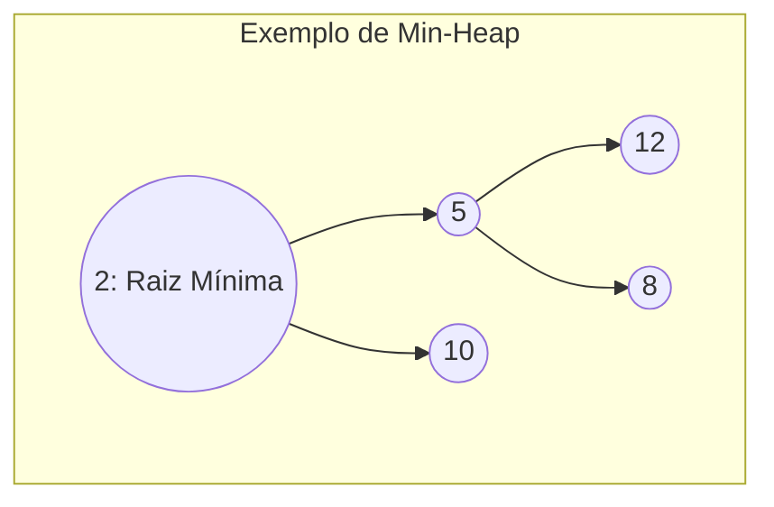

# Heaps e Filas de Prioridade (Heaps & Priority Queues)

## Objetivo
Ao final deste tópico, o estudante será capaz de descrever o funcionamento lógico e físico de um Heap (Min-Heap e Max-Heap), realizar mapeamento aritmético de índices de árvores binárias completas para arrays contíguos, implementar um Min-Heap completo com operações de subida/descida em Java, e explicar a eficiência linear $\mathcal{O}(n)$ do algoritmo de construção do Heap (`buildHeap`).

## Pré-requisitos
- [01. Arrays e Vetores Dinâmicos](../02-linear-structures/01-arrays-and-dynamic-arrays.md)
- [01. Árvores Gerais e Árvores Binárias](./01-trees-and-binary-trees.md)

## Conceitos Fundamentais

### 1. O que é um Heap?
Um **Heap** é uma árvore binária quase completa que satisfaz a **Propriedade do Heap**:
*   **Max-Heap**: O valor de cada nó é menor ou igual ao valor de seu pai. O maior elemento da estrutura estará sempre na raiz.
*   **Min-Heap**: O valor de cada nó é maior ou igual ao valor de seu pai. O menor elemento da estrutura estará sempre na raiz.



### 2. Representação Física de Árvores em Arrays
Como o Heap é uma árvore binária quase completa preenchida de forma compacta nível por nível, de cima para baixo e da esquerda para a direita, podemos representá-lo de forma otimizada usando um **Array simples**, sem o uso de ponteiros ou referências explícitas.

Para qualquer nó armazenado no índice $i$ do array:
*   O índice do seu **Pai** é:
    
    $$\text{pai}(i) = \frac{i - 1}{2} \quad (\text{divisão inteira})$$

*   O índice do seu **Filho Esquerdo** é:
    
    $$\text{esquerdo}(i) = 2i + 1$$

*   O índice do seu **Filho Direito** é:
    
    $$\text{direito}(i) = 2i + 2$$

```
Árvore Lógica:             Array Físico:
      2                    Índice:  0  1  2  3  4
    /   \                  Valor:  [2, 5, 10, 12, 8]
   5     10
  / \
 12  8
```

---

## Funcionamento Interno das Operações do Heap

Todas as operações abaixo mantêm a integridade da árvore usando dois movimentos básicos:

### A. Inserção (`insert`) — O(log n)
1.  Adicionamos o novo elemento no final do array (última folha livre da árvore).
2.  Como esse elemento pode quebrar a regra do Heap (ex: ser menor que o pai em um Min-Heap), executamos a **Subida (Heapify Up / Swim)**: comparamos o elemento com seu pai e realizamos a troca se a ordem estiver incorreta. Repetimos o processo subindo a árvore até achar o local correto ou alcançar a raiz.

### B. Remoção do Topo (`extractMin` / `extractMax`) — O(log n)
1.  O valor do topo (índice 0) é removido e guardado para retorno.
2.  Pegamos o último elemento do array (última folha) e o movemos para o índice 0.
3.  Executamos a **Descida (Heapify Down / Sink)**: comparamos o elemento com seus dois filhos, trocando-o pelo menor (em Min-Heaps) ou maior (em Max-Heaps) dos dois. Repetimos a descida pelos níveis até que a propriedade do Heap seja restabelecida.

### C. Construção do Heap (`buildHeap`) em tempo $\mathcal{O}(n)$
Para transformar um array totalmente desordenado em um Heap válido:
*   *Abordagem ingênua*: Inserir um por um usando `insert` $\rightarrow \mathcal{O}(n \log n)$.
*   *Abordagem linear*: Começar do primeiro nó que não é uma folha $(\text{size}/2 - 1)$ e descer até o índice 0, executando a operação `heapifyDown` para cada um. 
    *   **Prova matemática de O(N)**: A maioria dos nós de uma árvore binária está localizada nas camadas inferiores (folhas), onde a altura do caminho de descida é curta ($h=0$ nas folhas, $h=1$ no nível acima). Como o trabalho feito por `heapifyDown` é proporcional à altura do nó e não à profundidade, a soma de todo o trabalho é dada por uma série geométrica convergente que limita o custo total a exatamente **$\mathcal{O}(n)$**.

---

## Fila de Prioridade (Priority Queue)
A **Fila de Prioridade** é o ADT que implementa uma fila cujos elementos possuem prioridades associadas. O elemento com maior prioridade (ou menor valor, no caso de prioridades numéricas mínimas) é sempre o primeiro a ser atendido. Heaps são a estrutura ideal para implementar filas de prioridade por oferecerem excelente equilíbrio: $\mathcal{O}(\log n)$ para inserções e remoções.

---

## Erros Comuns
1.  **Índices Fora dos Limites (Array Bounds)**: Ao calcular os índices dos filhos (`2i + 1` e `2i + 2`) ou do pai, esquecer de verificar se esses índices ultrapassam o tamanho atual da estrutura (`size - 1`) antes de tentar acessar o array físico.
2.  **Troca incorreta na Descida**: Durante a descida, esquecer de comparar os dois filhos entre si primeiro para escolher o menor/maior deles antes de realizar a troca com o nó pai. Trocar pelo filho errado violará a propriedade do heap no outro ramo da subárvore.

---

## Exemplo em Java (Implementação de Min-Heap)

```java
import java.util.Arrays;
import java.util.NoSuchElementException;

public class MinHeap<T extends Comparable<T>> {
    private T[] heap;
    private int size;
    private int capacity;

    @SuppressWarnings("unchecked")
    public MinHeap(int capacity) {
        this.capacity = capacity;
        this.size = 0;
        this.heap = (T[]) new Comparable[capacity];
    }

    private int parent(int i) { return (i - 1) / 2; }
    private int leftChild(int i) { return 2 * i + 1; }
    private int rightChild(int i) { return 2 * i + 2; }

    private void swap(int i, int j) {
        T temp = heap[i];
        heap[i] = heap[j];
        heap[j] = temp;
    }

    public void insert(T element) {
        if (size == capacity) {
            resize();
        }
        heap[size] = element;
        size++;
        heapifyUp(size - 1);
    }

    // Retorna e remove o menor elemento: O(log n)
    public T extractMin() {
        if (size == 0) throw new NoSuchElementException("Heap vazio.");
        T min = heap[0];
        heap[0] = heap[size - 1];
        heap[size - 1] = null; // Evita memory leak
        size--;
        heapifyDown(0);
        return min;
    }

    public T peek() {
        if (size == 0) throw new NoSuchElementException("Heap vazio.");
        return heap[0];
    }

    private void heapifyUp(int i) {
        while (i > 0 && heap[i].compareTo(heap[parent(i)]) < 0) {
            swap(i, parent(i));
            i = parent(i);
        }
    }

    private void heapifyDown(int i) {
        int smallest = i;
        int left = leftChild(i);
        int right = rightChild(i);

        if (left < size && heap[left].compareTo(heap[smallest]) < 0) {
            smallest = left;
        }
        if (right < size && heap[right].compareTo(heap[smallest]) < 0) {
            smallest = right;
        }
        if (smallest != i) {
            swap(i, smallest);
            heapifyDown(smallest); // Continua descendo recursivamente
        }
    }

    @SuppressWarnings("unchecked")
    private void resize() {
        capacity = capacity * 2;
        heap = Arrays.copyOf(heap, capacity);
    }

    public int size() { return size; }
    public boolean isEmpty() { return size == 0; }
}
```

---

## Exercícios

### Exercício 1: Simulação Manual de Operações
Dado o array desordenado inicial: **[15, 8, 10, 3, 2, 9, 20]**
1. Simule e desenhe o estado final do array após aplicar o método linear **`buildHeap`** para construir um **Min-Heap**.
2. A partir do Min-Heap construído, insira o número **1** e desenhe o estado do Heap mostrando as trocas de subida.
3. Extraia o menor valor (topo) e desenhe a árvore final resultante da descida.

### Exercício 2: Prático — Algoritmo Heap Sort
Aproveitando a classe `MinHeap` ou a própria lógica de descida (`heapifyDown`), implemente um algoritmo estático de ordenação chamado **`HeapSort`** que ordena um array genérico de elementos na ordem crescente em tempo assintótico $\mathcal{O}(n \log n)$ com complexidade espacial adicional constante $\mathcal{O}(1)$ (in-place).

---

## Referências
*   CORMEN, Thomas H. et al. **Introduction to Algorithms**. Capítulo 6 (Heapsort).
*   Visualizações interativas e controle de Heaps: [USFCA Heap Visualization](https://www.cs.usfca.edu/~galles/visualization/Heap.html).
