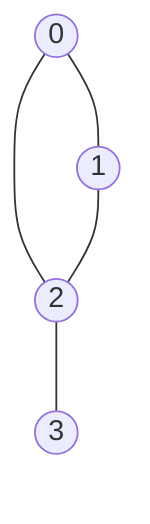

# Representações de Grafos

## Objetivo
Ao final deste tópico, o estudante será capaz de descrever o modelo matemático de um grafo $G=(V, E)$, comparar os trade-offs de tempo e espaço entre representações por Matriz de Adjacência e Lista de Adjacência, e implementar ambas as representações em Java para grafos direcionados e não-direcionados.

## Pré-requisitos
- [01. Arrays e Vetores Dinâmicos](../02-linear-structures/01-arrays-and-dynamic-arrays.md)
- [02. Listas Encadeadas](../02-linear-structures/02-linked-lists.md)

## Conceitos Fundamentais

### 1. O que é um Grafo?
Um **Grafo** $G = (V, E)$ é uma estrutura de dados não-linear composta por um conjunto $V$ de **Vértices (ou Nós)** e um conjunto $E$ de **Arestas (ou Links)** que conectam pares de vértices.



#### Classificações de Grafos:
*   **Direcionado (Digrafo)**: As arestas possuem uma direção definida (arcos unidirecionais de $u \rightarrow v$).
*   **Não-Direcionado**: As arestas são bidirecionais ($u \leftrightarrow v$).
*   **Ponderado**: Cada aresta possui um peso ou custo associado (útil para modelar distâncias ou custos de tráfego).
*   **Não-Ponderado**: Todas as arestas têm peso unitário ou igual.

---

## Métodos de Representação na Memória

A escolha da representação impacta diretamente o consumo de memória e a performance dos algoritmos. As duas principais abordagens são:

### A. Matriz de Adjacência
Uma matriz bidimensional de booleanos ou inteiros de tamanho $|V| \times |V|$, onde o valor na linha $u$ e coluna $v$ indica se existe uma aresta conectando $u$ a $v$.

```
Grafo Não-Direcionado (4 Vértices):
      0 1 2 3
   0 [0, 1, 1, 0]
   1 [1, 0, 1, 0]
   2 [1, 1, 0, 1]
   3 [0, 0, 1, 0]
```

### B. Lista de Adjacência
Um array ou lista de tamanho $|V|$, onde cada posição $i$ contém uma lista encadeada (ou vetor dinâmico) com os vértices vizinhos ao vértice $i$.

```
Representação em Lista:
   [0] -> 1 -> 2
   [1] -> 0 -> 2
   [2] -> 0 -> 1 -> 3
   [3] -> 2
```

---

## Comparações e Trade-offs

| Operação / Aspecto | Matriz de Adjacência | Lista de Adjacência |
|---|---|---|
| **Complexidade de Espaço** | $\mathcal{O}(|V|^2)$ | $\mathcal{O}(|V| + |E|)$ |
| **Verificar se aresta $(u, v)$ existe** | $\mathcal{O}(1)$ (Acesso direto na matriz) | $\mathcal{O}(\text{grau}(u))$ (Busca linear na lista) |
| **Listar todos os vizinhos de $u$** | $\mathcal{O}(|V|)$ (Varre a linha inteira da matriz) | $\mathcal{O}(\text{grau}(u))$ (Acessa a lista diretamente) |
| **Ideal para quais Grafos?** | **Grafos Densos** ($|E| \approx |V|^2$, muitas conexões) | **Grafos Esparsos** ($|E| \ll |V|^2$, poucas conexões) |

---

## Erros Comuns
1.  **Esquecer a Dupla Conexão em Grafos Não-Direcionados**: Ao inserir uma aresta entre $u$ e $v$ em um grafo não-direcionado, é preciso atualizar tanto a ligação de $u \rightarrow v$ quanto a de $v \rightarrow u$. Esquecer isso transforma o grafo em direcionado.
2.  **Desperdício massivo de memória com Matrizes**: Usar matriz de adjacência para grafos com milhões de vértices e poucas arestas (ex: rede de estradas). Uma matriz de $10^6 \times 10^6$ exigiria cerca de 1 Terabyte de memória, enquanto a lista de adjacência ocuparia apenas alguns Megabytes.

---

## Implementações em Java

Abaixo estão as implementações para ambas as abordagens usando vértices representados por índices inteiros ($0$ a $V-1$).

### Implementação 1: Matriz de Adjacência
```java
public class MatrixGraph {
    private final boolean[][] adjMatrix;
    private final int numVertices;
    private final boolean directed;

    public MatrixGraph(int numVertices, boolean directed) {
        this.numVertices = numVertices;
        this.directed = directed;
        this.adjMatrix = new boolean[numVertices][numVertices];
    }

    // Inserção de Aresta: O(1)
    public void addEdge(int u, int v) {
        adjMatrix[u][v] = true;
        if (!directed) {
            adjMatrix[v][u] = true;
        }
    }

    // Remoção de Aresta: O(1)
    public void removeEdge(int u, int v) {
        adjMatrix[u][v] = false;
        if (!directed) {
            adjMatrix[v][u] = false;
        }
    }

    // Consulta de aresta: O(1)
    public boolean hasEdge(int u, int v) {
        return adjMatrix[u][v];
    }

    public int getNumVertices() { return numVertices; }
}
```

### Implementação 2: Lista de Adjacência
```java
import java.util.ArrayList;
import java.util.LinkedList;
import java.util.List;

public class ListGraph {
    private final List<List<Integer>> adjList;
    private final int numVertices;
    private final boolean directed;

    public ListGraph(int numVertices, boolean directed) {
        this.numVertices = numVertices;
        this.directed = directed;
        this.adjList = new ArrayList<>(numVertices);
        
        for (int i = 0; i < numVertices; i++) {
            adjList.add(new LinkedList<>());
        }
    }

    // Inserção de aresta: O(1)
    public void addEdge(int u, int v) {
        adjList.get(u).add(v);
        if (!directed) {
            adjList.get(v).add(u);
        }
    }

    // Remoção de aresta: O(grau(u))
    public void removeEdge(int u, int v) {
        adjList.get(u).remove(Integer.valueOf(v));
        if (!directed) {
            adjList.get(v).remove(Integer.valueOf(u));
        }
    }

    // Consulta de vizinhos: O(1)
    public List<Integer> getNeighbors(int u) {
        return adjList.get(u);
    }

    // Consulta de aresta: O(grau(u))
    public boolean hasEdge(int u, int v) {
        return adjList.get(u).contains(v);
    }

    public int getNumVertices() { return numVertices; }
}
```

---

## Exercícios

### Exercício 1: Teórico — Modelagem e Conversão
Desenhe um grafo direcionado com 5 vértices e 7 arestas. Em seguida, represente-o em papel na forma de:
1. Matriz de Adjacência.
2. Lista de Adjacência.

### Exercício 2: Prático — Grafo Ponderado
Modifique a classe `ListGraph` para que ela suporte **pesos (weights)** do tipo double nas arestas.
*   *Dica*: Em vez de armazenar apenas `List<Integer>` (lista de IDs dos vizinhos), crie uma classe auxiliar privada chamada `Edge` contendo `int to` e `double weight` e mude a estrutura da adjacência para `List<List<Edge>>`.

---

## Referências
*   CORMEN, Thomas H. et al. **Introduction to Algorithms**. Capítulo 20.1 (Representations of graphs).
*   Visualizações interativas de grafos: [VisuAlgo - Graph Data Structures](https://visualgo.net/en/graphds).
